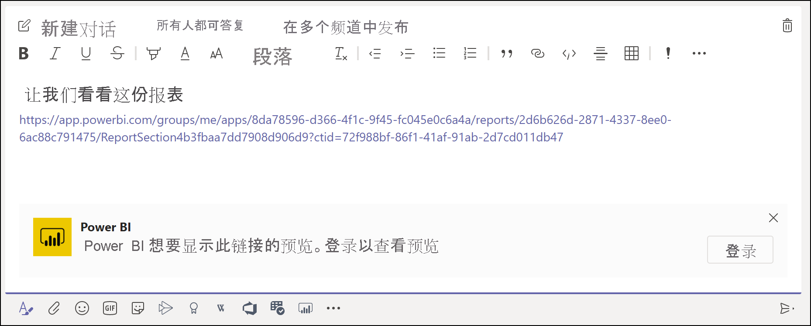
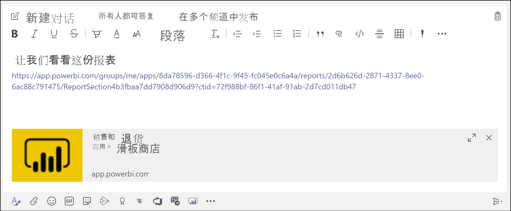
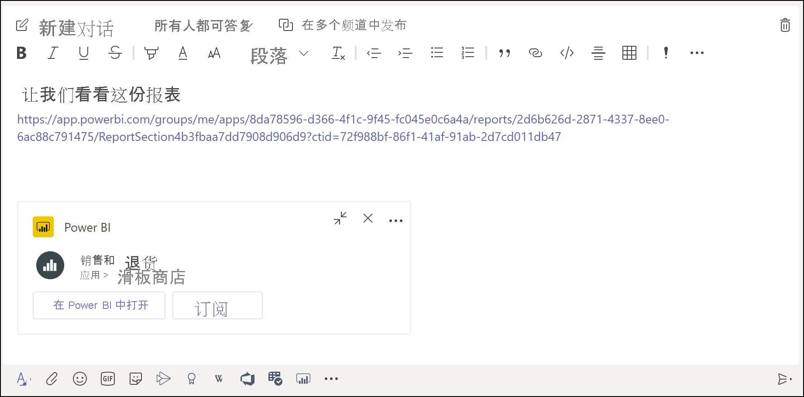

# 在 Microsoft Teams 中获取 Power BI 链接预览

将报表、仪表板和应用的链接粘贴到 Microsoft Teams 消息框中时，链接预览会显示有关该链接的信息。 为 Power BI 中的以下各项提供了链接预览：

- 报表
- 仪表板
- 应用

链接预览服务需要用户登录。 若要注销，请选择消息框底部的“Power BI”图标。 然后选择“注销”。

请参阅[使用 Power BI 在 Microsoft Teams 中开展协作](service-collaborate-microsoft-teams.md)，其中介绍了 Power BI 和 Microsoft Teams 协同工作的背景，包括需要满足的要求。

## 获取链接预览

按照以下步骤获取 Power BI 服务中内容的链接预览。

1. 复制指向 Power BI 服务中的报表、仪表板或应用的链接。 例如，从浏览器地址栏中复制链接。

1. 在 Microsoft Teams 消息框中粘贴链接。 如果出现提示，请登录链接预览服务。 可能需要等待几秒钟才能加载链接预览。

    

1. 成功登录之后，将显示基本链接预览。

    

1. 选择“展开”图标以显示丰富预览卡。

    

1. 丰富链接预览卡显示链接和相关操作按钮。

    

1. 发送消息。

## 已知问题和限制

- 链接预览服务不支持单一登录。
- 链接预览在会议聊天或私人频道中不起作用。
- 请参阅“在 Microsoft Teams 中开展协作”一文中的[已知问题和限制](service-collaborate-microsoft-teams.md#known-issues-and-limitations)部分以了解其他问题。

## 后续步骤

- [使用 Power BI 在 Microsoft Teams 中开展协作](service-collaborate-microsoft-teams.md)

更多问题？ [尝试咨询 Power BI 社区](https://community.powerbi.com/)。
