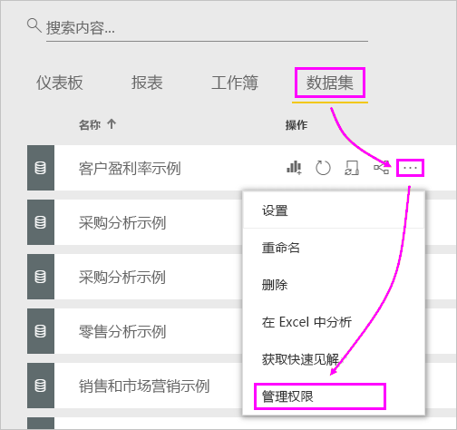
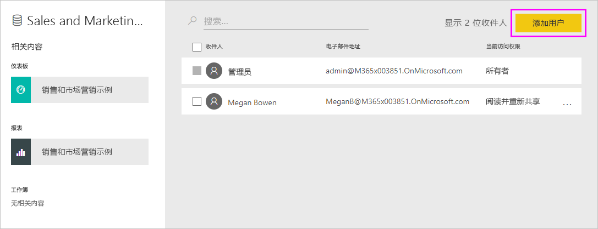
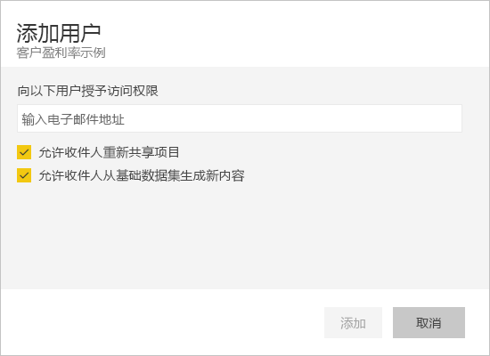
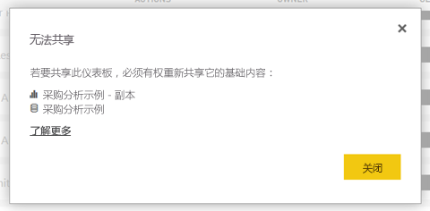

# 排查共享仪表板和报表时遇到的问题

下面是在共享仪表板或报表时或其他人与你共享时可能会遇到的一些常见问题。 

## 仪表板收件人在磁贴中看到锁定图标

与其共享的人员尝试查看报表时，可能会在仪表板中看到锁定的磁贴或“需要权限”消息。

如果是这样，则需要向他们授予对基础数据集的权限。

1. 转到内容列表中的“数据集”选项卡。

1. 选择数据集旁边的省略号 (...)，然后选择“管理权限” 。

    

1. 选择“添加用户”。

    

1. 输入个人、通讯组或安全组的完整电子邮件地址。 不能与动态通讯组列表共享。

    

1. 选择“添加”。

## 我无法共享仪表板或报表

要共享仪表板或报表，你需要具有重新共享基础内容（任何相关的报表和数据集）的权限。 如果你看到一条消息，指示无法共享，请要求报表作者给予你重新共享这些报表和数据集的权限。

## 我无权访问仪表板或报表

如果你在选择指向报表或仪表板的链接时看到“请求访问”消息，则表示无权查看它。 你需要[请求访问它](service-request-access.md)。

## 后续步骤

- [与同事和他人共享 Power BI 仪表板和报表](service-share-dashboards.md)
- [应如何针对仪表板及报表开展协作并进行共享？](service-how-to-collaborate-distribute-dashboards-reports.md)
-  [共享筛选的 Power BI 报表](service-share-reports.md)
- 是否有任何问题? [尝试参与 Power BI 社区](https://community.powerbi.com/)
