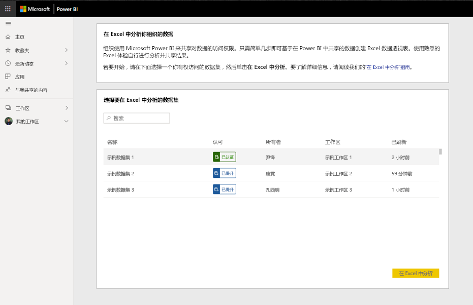

# 教程：从 Excel 开始，使用 Excel 中的 Power BI 分析

组织使用 Power BI 来共享对数据的访问权限。 从 Excel 启动“在 Excel 中进行 Power BI 分析”功能，以便在 Excel 中创建数据透视表和数据透视图。 它们可将其他上下文引入分析，或者缩短查找和导入相关数据集的时间。

若要开始使用 Power BI 数据集，请在 Excel 中选择“在 Excel 中分析”。 指导你创建使用该数据的数据透视表。  

可以通过返回到“数据集”页找到组织共享的其他数据集。

如果在任何时候都遇到问题，请在以下流的相应步骤中选择“否”，并在链接的表单中提供反馈  。  

在本教程中，了解如何：

> [!div class="checklist"]
> * 从“Power BI 数据集”页下载 ODC 文件。
> * 启用从 Excel 访问数据集。
> * 开始使用数据集创建数据透视表、图表和工作表

## 先决条件

要完成本教程，需要：

* 一个 Power BI 帐户。 如果未注册 Power BI，请[免费注册](https://app.powerbi.com/signupredirect?pbi_source=web)后再进行操作。

* 请确保熟悉 [Power BI 服务入门](https://docs.microsoft.com/power-bi/service-get-started)教程中列出的所有步骤。

* 你需要 Power BI Premium 数据集和 Power BI Pro 许可证，请访问[什么是 Power BI Premium？](https://docs.microsoft.com/power-bi/service-premium-what-is)了解更多信息。

* 完整的先决条件列表可在[在 Excel 中分析](https://docs.microsoft.com/power-bi/service-analyze-in-excel#requirements)的综合性文档中找到。

* 有效的 [Microsoft Office E5 订阅](https://www.microsoft.com/microsoft-365/business/office-365-enterprise-e5-business-software?activetab=pivot%3aoverviewtab)

## 开始使用

从 Excel 开始，选择选项以创建具有 Power BI 共享数据的数据透视表，然后导航到“Power BI 数据集”页。

使用“在 Excel 中分析”工作流时，你将看到几个指导提示；指示是否已完成每个进程步骤。 如果在任何步骤中遇到问题，请选择“否”  并提供有关相应表单的反馈。

## 下载并打开 ODC 文件

从相应列表和关联的工作区中选择数据集，然后单击“在 Excel 中分析”。 Power BI 将创建一个 ODC 文件并将其从浏览器下载到你的计算机。

在 Excel 中打开该文件后，将显示空的数据透视表和字段列表以及来自 Power BI 数据集的表、字段和度量值。 你可以创建数据透视表和图表，并分析该数据集，就像在 Excel 中处理本地数据集一样。

## 启用数据连接

为了在 Excel 中分析 Power BI 数据，系统可能会提示你信任连接。 管理员可以通过 Power BI 管理门户的 Analysis Services 数据库上的本地数据集禁用“在 Excel 中分析”。

## 安装更新和身份验证

首次打开新的 ODC 文件时，可能还需要使用 Power BI 帐户进行身份验证。  如果遇到问题，请访问[在 Excel 中分析](https://docs.microsoft.com/power-bi/service-analyze-in-excel#sign-in-to-power-bi )综合性文档以获取详细信息，或在工作流过程中单击“否”。

## 开始分析

类似于其他本地工作簿，使用“在 Excel 中分析”，你可以创建数据透视表、图表、添加数据以及创建具有数据视图的不同工作表。 “在 Excel 中分析”会向具有数据集访问权限的任何用户公开所有详细信息级别的数据。 可以保存此工作簿，但不能将其发布或导入回 Power BI 或与组织中的其他用户共享。 有关详细信息和其他用例，请访问[在 Excel 中分析](https://docs.microsoft.com/power-bi/service-analyze-in-excel#analyze-away)。

## 清理资源

与“Power BI 服务”和“数据集”页的交互应仅限于下载 ODC 文件和单击工作流。 如果在执行这些步骤时遇到问题，请在相应步骤中指示“否”  ，并在链接的表单中提供反馈。 该表单包含一个指向有关此问题的详细信息的链接。 请重新访问“数据集”页重试该过程，或选择其他数据集。

## 后续步骤

你可能还会对以下文章感兴趣：

* [在 Power BI Desktop 中使用跨报表钻取](https://docs.microsoft.com/power-bi/desktop-cross-report-drill-through)

* [在 Power BI Desktop 中使用切片器](https://docs.microsoft.com/power-bi/visuals/power-bi-visualization-slicers)
