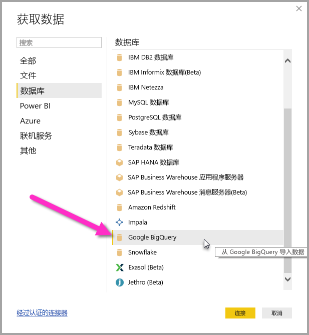
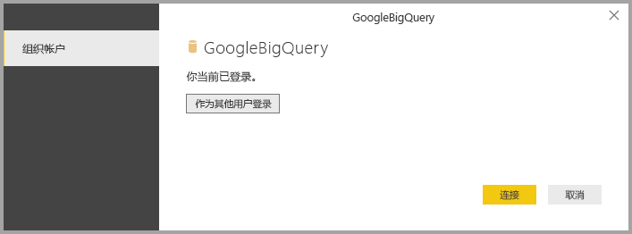

# <a name="connect-to-a-google-bigquery-database-in-power-bi-desktop"></a>在 Power BI Desktop 中连接到 Google BigQuery 数据库
在 Power BI Desktop 中，你可以连接到 Google BigQuery  数据库，并以 Power BI Desktop 中使用其他所有数据源相同的方式使用基础数据。

## <a name="connect-to-google-bigquery"></a>连接到 Google BigQuery
若要连接到 Google BigQuery  数据库，请从 Power BI Desktop 中的“主页”  功能区选择“获取数据”  。 选择左侧类别中的“数据库”  ，然后便会看到“Google BigQuery”  。



在显示的 Google BigQuery  窗口中，登录到 Google BigQuery 帐户并选择“连接”  。


登录后，将看到以下窗口指示已经过身份验证。 



连接成功后，将会出现“导航器”  窗口，并显示服务器上可用的数据。你可以从这些数据中选择要在 **Power BI Desktop** 中导入和使用的一个或多个元素。


## <a name="considerations-and-limitations"></a>注意事项和限制
对于 Google BigQuery  连接器，需要牢记以下限制和注意事项：

* Power BI Desktop 和 Power BI 服务中提供了 Google BigQuery 连接器。 在 Power BI 服务中，可以使用从 Power BI 到 Google BigQuery 的云到云连接访问连接器。

* 可以将 Power BI 与 Google BigQuery 计费项目  结合使用。 默认情况下，Power BI 使用从列表中为用户返回的第一个项目。 

  若要在将计费项目与 Power BI 一起使用时对其行为进行自定义，请在“源”步骤的基础 M 中指定以下选项，这可以通过使用 Power BI Desktop 中的 Power Query 编辑器进行自定义：

  ```
  Source = GoogleBigQuery.Database([BillingProject="Include-Billing-Project-Id-Here"])
  ```

  从 2020 年 9 月版开始，我们启用了对 [Google BigQuery 存储 API](https://cloud.google.com/bigquery/docs/reference/storage) 的支持。 默认情况下启用此功能，并由名为“UseStorageApi”的可选布尔参数控制。 如果某些客户使用粒度权限，则可能会遇到此功能的问题。 如果是这种情况，你可能会看到以下错误消息：

  `ERROR [HY000] [Microsoft][BigQuery] (131) Unable to authenticate with Google BigQuery Storage API. Check your account permissions`

  可以通过调整存储 API 的用户权限来解决此问题。 分配以下存储 API 权限：

  - `bigquery.readsessions.create` - 通过 BigQuery 存储 API 创建新的读取会话。
  - `bigquery.readsessions.getData` - 通过 BigQuery 存储 API 从读取会话读取数据。
  - `bigquery.readsessions.update` - 通过 BigQuery 存储 API 更新读取会话。

  这些权限通常在 BigQuery.User 角色中提供。 有关详细信息，请参阅 [Google BigQuery 预定义角色和权限](https://cloud.google.com/bigquery/docs/access-control)。
  
  如果上述步骤不能解决问题，或者如果想要禁用对存储 API 的支持，请将查询更改为以下内容：
  ```
  Source = GoogleBigQuery.Database([UseStorageApi=false])
  ```
  或者，如果你已经在使用计费项目，请将查询更改为以下内容：
  ```
  Source = GoogleBigQuery.Database([BillingProject="Include-Billing-Project-Id-Here", UseStorageApi=false])
  ```

## <a name="next-steps"></a>后续步骤
你可以使用 Power BI Desktop 连接到各种数据。 有关数据源的详细信息，请参阅下列资源：

* [什么是 Power BI Desktop？](../fundamentals/desktop-what-is-desktop.md)
* [Power BI Desktop 中的数据源](desktop-data-sources.md)
* [使用 Power BI Desktop 调整和合并数据](desktop-shape-and-combine-data.md)
* [通过 Power BI Desktop 连接到 Excel 工作簿](desktop-connect-excel.md)   
* [直接将数据输入到 Power BI Desktop 中](desktop-enter-data-directly-into-desktop.md)   
