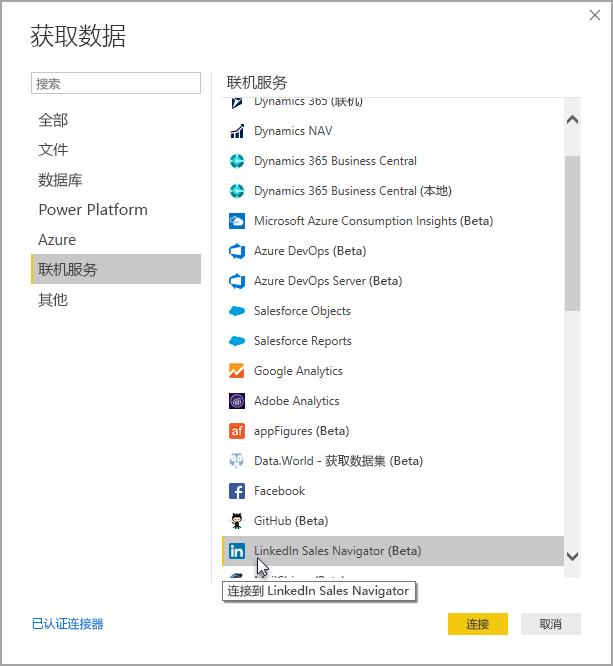
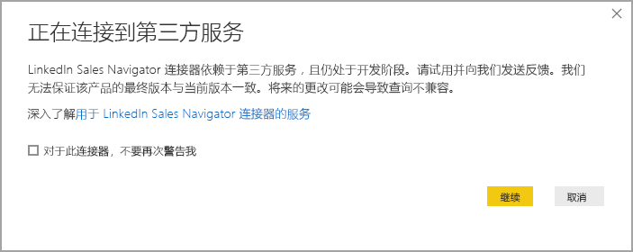
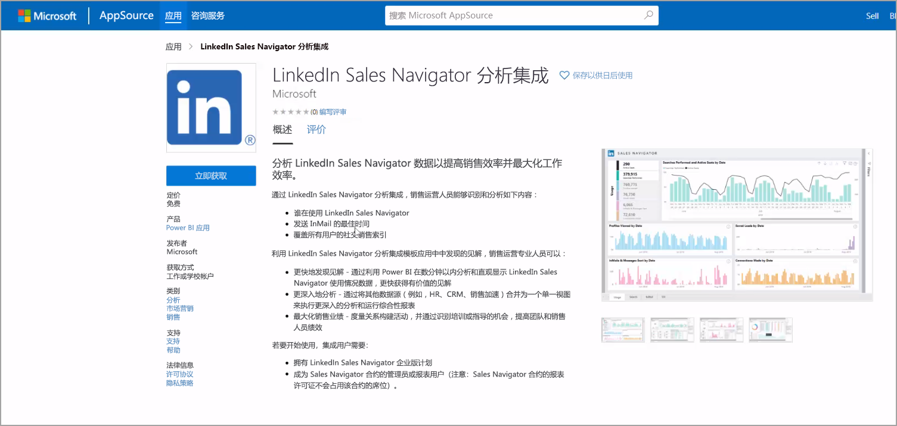
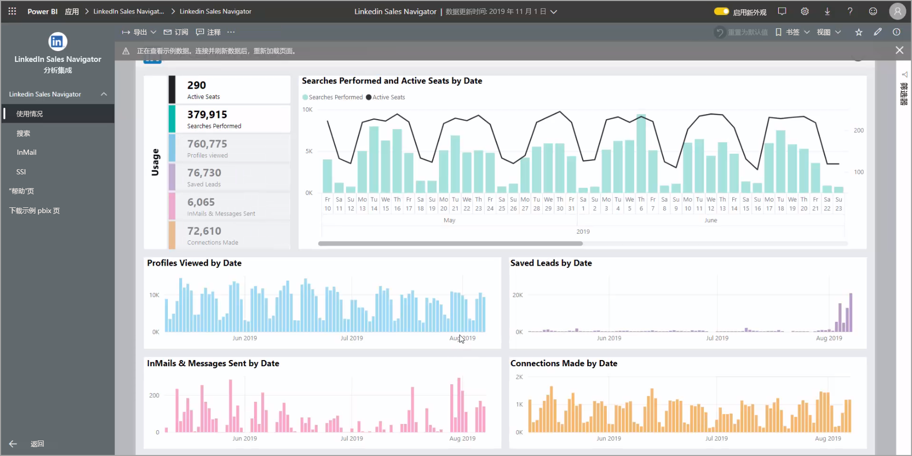
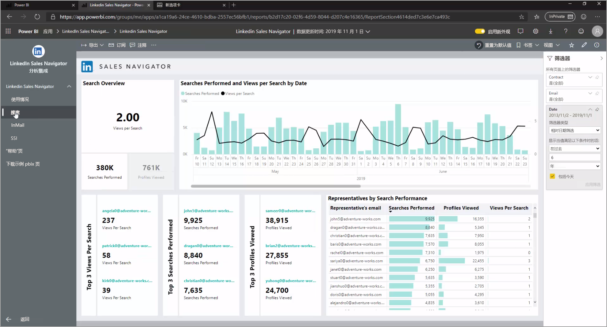
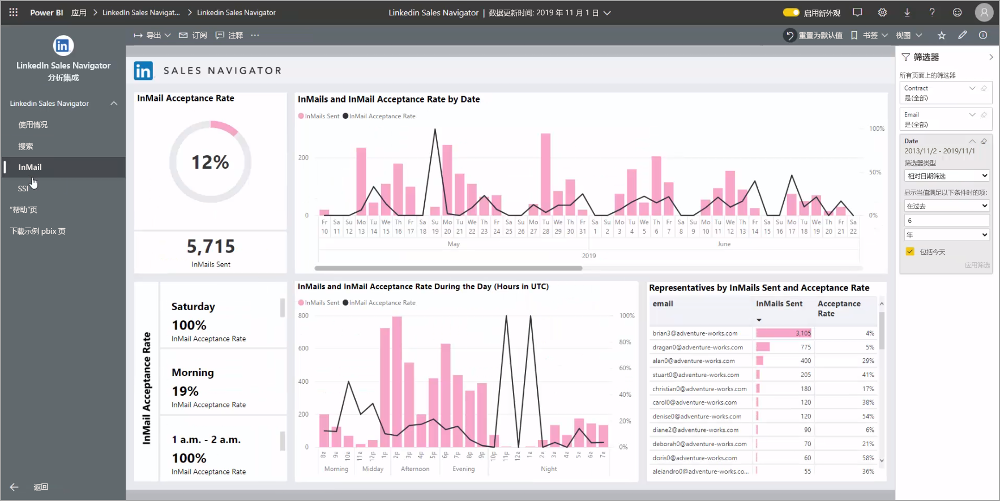
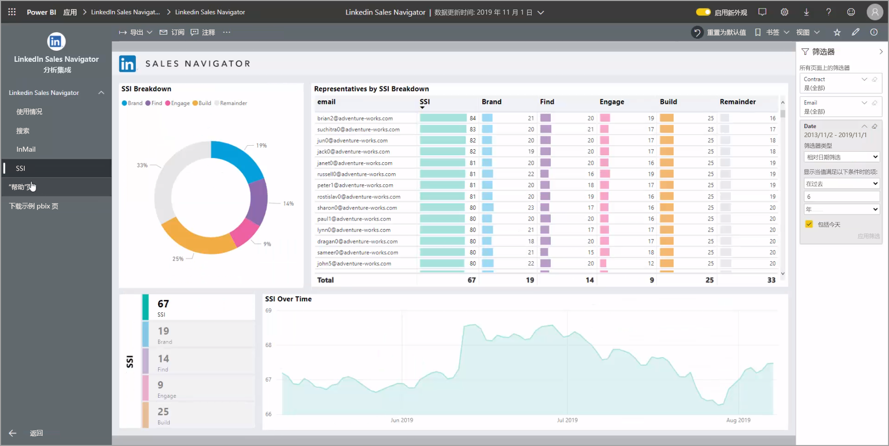
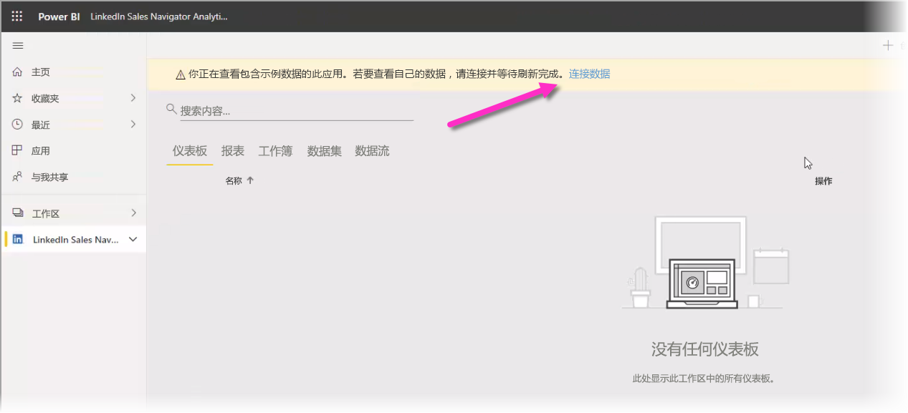

# 在 Power BI Desktop 中连接到 LinkedIn Sales Navigator

在 Power BI Desktop 中，可以连接到 LinkedIn Sales Navigator，以帮助找到并建立人脉关系，然后生成现成的进度报表，就如同使用 Power BI Desktop 中的任何其他数据源一样。  

若要使用 LinkedIn Sales Navigator 连接 LinkedIn 数据，必须具有 LinkedIn Sales Navigator Enterprise 计划，并且是 Sales Navigator 合同的管理员或报告用户。 

下面的视频提供了关于如何使用 LinkedIn Sales Navigator 模板应用的简略介绍和教程，[本文的后续部分](#using-the-linkedin-sales-navigator-template-app)提供了详细说明。  

> [!VIDEO https://www.youtube.com/embed/ZqhmaiORLw0]

## 连接到 LinkedIn Sales Navigator

若要连接到 LinkedIn Sales Navigator 数据，请在 Power BI Desktop 中的“主页”功能区选择“获取数据”    。 从左侧的类别中选择“联机服务”，然后进行滚动，直至看到“LinkedIn Sales Navigator (Beta)”。  

将提示你：你将连接到仍处于开发状态的第三方连接器。 

选择“继续  ”后，将提示你指定需要的数据。

在显示的“LinkedIn Sales Navigator”窗口中，从第一个下拉选择器中选择你希望返回的数据（“所有联系人”或“选定的联系人”）。    然后可以指定开始和结束日期，以便将收到的数据限制在特定时段。

在你提供信息后，Power BI Desktop 会连接到与 LinkedIn Sales Navigator 合同关联的数据。 使用同一个电子邮件地址通过网站登录到 LinkedIn Sales Navigator。 

连接成功时，将提示你从“导航器”窗口选择 LinkedIn Sales Navigator 合同中的哪些数据。 

可以使用 LinkedIn Sales Navigator 数据生成任何所需的报表。 为便于使用，还提供了一个可供下载的 LinkedIn Sales Navigator .PBIX 文件，其中包含已提供的示例数据，这样你就可以熟悉数据和报表，而无需从头开始。

可从以下位置下载此 PBIX 文件：
* [LinkedIn Sales Navigator 的 PBIX](service-template-apps-samples.md)

除此 PBIX 文件以外，LinkedIn Sales Navigator 还有一个也可供下载和使用的模板应用。 下一部分详细介绍了此模板应用。

## 使用 LinkedIn Sales Navigator 模板应用

若要尽可能轻松地使用 LinkedIn Sales Navigator，可以使用此  [模板应用](service-template-apps-overview.md)，它会自动通过 LinkedIn Sales Navigator 数据生成现成的报表。

下载此应用时，可以选择连接到你的数据还是使用示例数据浏览应用。 浏览示例数据后，随时可以返回并连接到自己的 LinkedIn Sales Navigator 数据。 

可以从以下链接获取 LinkedIn Sales Navigator 模板应用： 
* [LinkedIn Sales Navigator 模板应用](https://appsource.microsoft.com/en-us/product/power-bi/pbi-contentpacks.linkedin_navigator)

此模板应用提供了四个选项卡，用于帮助分析和共享信息：

* 使用情况
* 搜索
* InMail
* SSI

“使用情况”选项卡显示你的全部 LinkedIn Sales Navigator 数据。 

借助“搜索”选项卡，你可以深入钻取搜索结果： 

“InMail”提供了关于 InMail 使用情况的见解，包括已发送的 InMail 数、接受率以及其他有用信息： 

“SSI”选项卡提供了关于社交销售指数 (SSI) 的其他详细信息： 

若要从示例数据转换到自己的数据，请在右上角选择“编辑应用”（铅笔图标），然后从出现的屏幕中选择“连接你的数据”。  

可以从该位置连接自己的数据，选择要加载多少天的数据。 最多可以加载 365 天的数据。 需要进行登录，并且是再次使用同一个电子邮件地址通过网站登录到 LinkedIn Sales Navigator。 

随后此模板应用会使用你的数据刷新应用中的数据。 你也可以设置计划刷新，这样应用中的数据将按照刷新频率指定的值更新。 

数据更新后，可以看到使用你自己的数据填充了此应用。

## 获取帮助

如果在连接到数据时遇到问题，请前往 https://www.linkedin.com/help/sales-navigator 与 LinkedIn Sales Navigator 支持联系。 

## 后续步骤
你可以使用 Power BI Desktop 连接到各种数据。 有关数据源的详细信息，请参阅下列资源：

* [什么是 Power BI Desktop？](../fundamentals/desktop-what-is-desktop.md)
* [Power BI Desktop 中的数据源](desktop-data-sources.md)
* [使用 Power BI Desktop 调整和合并数据](desktop-shape-and-combine-data.md)
* [通过 Power BI Desktop 连接到 Excel 工作簿](desktop-connect-excel.md)   
* [直接将数据输入到 Power BI Desktop 中](desktop-enter-data-directly-into-desktop.md)   
