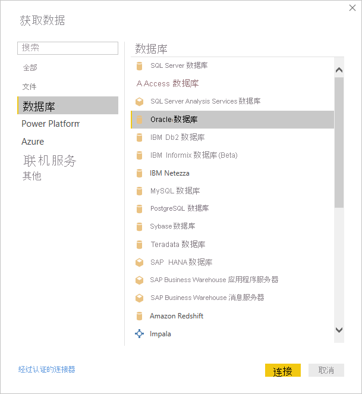

# 使用 Power BI Desktop 连接到 Oracle 数据库
要使用 Power BI Desktop 连接到 Oracle 数据库，必须在运行 Power BI Desktop 的计算机上安装正确的 Oracle 客户端软件。 使用的 Oracle 客户端软件取决于已安装的 Power BI Desktop 版本：32 位或 64 位。 它还取决于 Oracle 服务器的版本。

支持的 Oracle 版本： 
- Oracle Server 9 及更高版本
- Oracle Data Access Client (ODAC) 软件 11.2 及更高版本

> [!NOTE]
> 如果要为 Power BI Desktop、本地数据网关或 Power BI 报表服务器配置 Oracle 数据库，请参阅 [Oracle 连接类型](https://docs.microsoft.com/sql/reporting-services/report-data/oracle-connection-type-ssrs?view=sql-server-ver15)一文中的信息。 

## 确定安装了哪个版本的 Power BI Desktop
要确定所安装的 Power BI Desktop 版本，请选择“文件” > “帮助” > “关于”，然后查看“版本”行   。 下图中安装的是 64 位版本的 Power BI Desktop：

## 安装 Oracle 客户端
- 对于 32 位版本的 Power BI Desktop，请[下载并安装 32 位 Oracle 客户端](https://www.oracle.com/technetwork/topics/dotnet/utilsoft-086879.html)。

- 对于 64 位版本的 Power BI Desktop，请[下载并安装 64 位 Oracle 客户端](https://www.oracle.com/database/technologies/odac-downloads.html)。

> [!NOTE]
> 选择与 Oracle Server 兼容的 Oracle Data Access Client (ODAC) 版本。 例如，ODAC 12.x 并非始终支持 Oracle Server 版本 9。
> 选择 Oracle 客户端的 Windows 安装程序。
> 在 Oracle 客户端的安装过程中，请在安装向导中选择相应的复选框，确保启用“在计算机范围级别配置 ODP.NET 和/或 Oracle Providers for ASP.NET”。 某些版本的 Oracle 客户端向导默认选中此复选框，其他版本则不选中。 请确保选中此复选框，以便 Power BI 可以连接到 Oracle 数据库。

## 连接到 Oracle 数据库
安装了匹配的 Oracle 客户端驱动程序后，就可以连接到 Oracle 数据库。 请执行以下步骤来建立连接：

1. 从“开始”选项卡中，选择“获取数据” 。 

2. 从显示的“获取数据”窗口中，选择“更多”（如有必要），再选择“数据库” > “Oracle 数据库”，然后选择“连接”    。
   
   
2. 在出现的“Oracle 数据库”对话框中，提供服务器的名称，并选择“确定”  。 如果需要 SID，请使用以下格式进行指定：ServerName/SID，其中 SID 是数据库的唯一名称 。 如果 ServerName/SID 格式无效，则使用 ServerName/ServiceName，其中 ServiceName 是用于连接的别名  。

   

      
3. 要通过使用本机数据库查询导入数据，请将查询放在“SQL 语句”框中，可通过展开“Oracle 数据库”对话框的“高级选项”部分找到该框  。
   
   
4. 在“Oracle 数据库”对话框中输入 Oracle 数据库信息（包括任何可选信息，如 SID 或本机数据库查询）后，请选择“确定”以进行连接 。
5. 如果 Oracle 数据库需要数据库用户凭据，请在出现提示时，输入这些凭据。

## 故障排除

命名语法不正确或未正确配置时，可能会遇到来自 Oracle 的以下任一错误：

* ORA-12154：TNS：无法解析指定的连接标识符。
* ORA-12514：TNS：侦听器当前不知道连接描述符中请求的服务。
* ORA-12541：TNS：无侦听器。
* ORA-12170：TNS：连接超时。
* ORA-12504：TNS：侦听器未在 CONNECT_DATA 中获得 SERVICE_NAME。

如果 Oracle 客户端未安装或未正确配置，则可能出现这些错误。 如果已安装，请验证是否已对 tnsnames.ora 文件进行了正确配置、你使用的是不是正确的 net_service_name。 还需确保使用 Power BI Desktop 的计算机和运行网关的计算机具有相同的 net_service_name。 有关详细信息，请参阅[安装 Oracle 客户端](#install-the-oracle-client)。

可能还会遇到 Oracle 服务器版本与 Oracle Data Access Client 版本之间的兼容性问题。 通常，最好使二者的版本匹配，因为某些组合不兼容。 例如，ODAC 12.x 不支持 Oracle Server 版本 9。

如果已从 Microsoft Store 下载 Power BI Desktop，则 Oracle 驱动程序问题可能导致你无法连接到 Oracle 数据库。 如果遇到此问题，则返回的错误消息为：未设置对象引用。 要解决此问题，请执行以下步骤之一：

* 从[下载中心](https://www.microsoft.com/download/details.aspx?id=58494)而不是 Microsoft Store 下载 Power BI Desktop。

* 要使用 Microsoft Store 中的版本，请在本地计算机上将 12.X.X\client_X 中的 oraons.dll 复制到 12.X.X\client_X\bin，其中 X 表示版本和目录号  。

如果在连接到 Oracle Database 时 Power BI Gateway 中出现“未设置对象引用”错误消息，请按照[管理数据源 - Oracle](service-gateway-onprem-manage-oracle.md) 中的说明进行操作。

如果使用 Power BI 报表服务器，请参阅 [Oracle 连接类型](https://docs.microsoft.com/sql/reporting-services/report-data/oracle-connection-type-ssrs?view=sql-server-ver15)一文中的指导。
