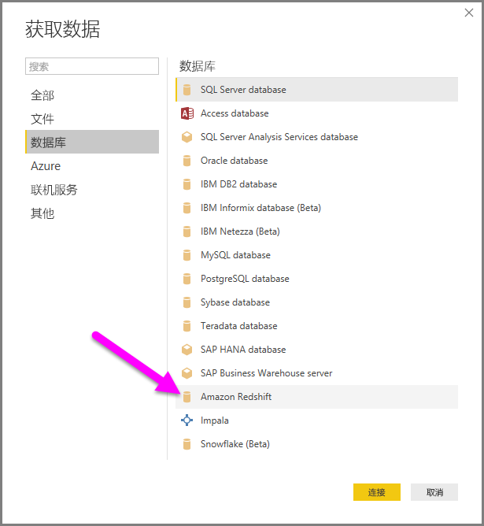
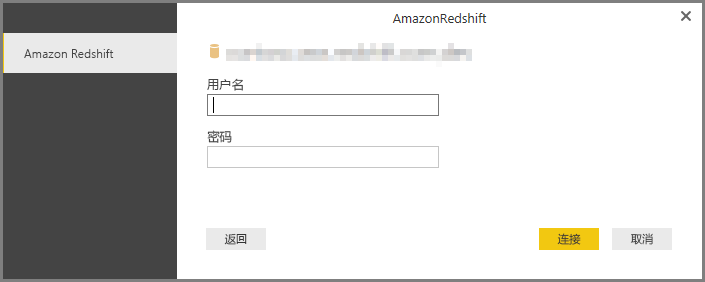

# 在 Power BI Desktop 中连接到 Amazon Redshift 数据库
在 **Power BI Desktop** 中，你可以连接到 **Amazon Redshift** 数据库，并以 Power BI Desktop 中使用其他所有数据源相同的方式使用基础数据。

## 连接 Amazon Redshift 数据库
要连接到 Amazon Redshift 数据库，请从 Power BI Desktop 中的“主页”功能区选择“获取数据”  。 在左侧的类别中选择“数据库”，然后将看到 Amazon Redshift。

在出现的 **Amazon Redshift** 窗口中，将你的 **Amazon Redshift** 服务器和数据库名称键入或粘贴到框中。 “服务器”字段中的用户可用以下格式指定端口：ServerURL:Port

出现提示时，输入你的用户名和密码。 应使用与 SSL 证书精确匹配的服务器名称，以避免错误。 

连接成功后，将会出现“导航器”窗口，并显示服务器上可用的数据。你可以从这些数据中选择要在 **Power BI Desktop** 中导入和使用的一个或多个元素。

在“导航器”窗口中选择后，就可以“加载”或“编辑”数据。

* 如果选择“加载”数据，系统将提示你使用“导入”或“DirectQuery”模式来加载数据 。 有关详细信息，请参阅 [DirectQuery 说明文章](desktop-use-directquery.md)。
* 如果选择“编辑”数据，“查询编辑器”将出现在可对数据应用各种转换和筛选器的位置，其中很多应用于基础 **Amazon Redshift** 数据库本身（如果支持）。

## 后续步骤
你可以使用 Power BI Desktop 连接到各种数据。 有关数据源的详细信息，请参阅下列资源：

* [什么是 Power BI Desktop？](../fundamentals/desktop-what-is-desktop.md)
* [Power BI Desktop 中的数据源](desktop-data-sources.md)
* [使用 Power BI Desktop 调整和合并数据](desktop-shape-and-combine-data.md)
* [通过 Power BI Desktop 连接到 Excel 工作簿](desktop-connect-excel.md)   
* [直接将数据输入到 Power BI Desktop 中](desktop-enter-data-directly-into-desktop.md)   
