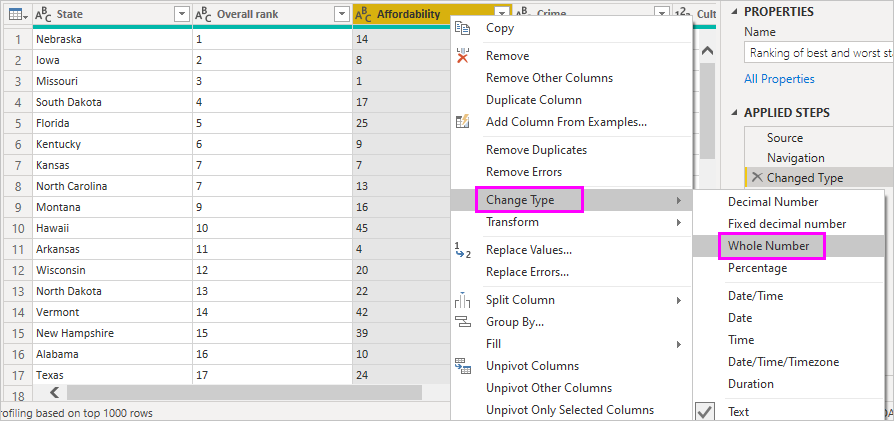
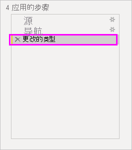

# 连接到 Power BI Desktop 中的数据源

通过 Power BI Desktop，可以轻松连接到持续扩展的数据世界。 如果没有 Power BI Desktop，你可以[下载](https://go.microsoft.com/fwlink/?LinkID=521662)并进行安装。

Power BI Desktop 中有各种可用数据源。  下图显示了如何通过依次选择“获取数据” **“其他”** “Web”来连接到数据 >    >   。

## 连接到数据的示例

在此示例中，我们将连接到 **Web** 数据源。

假设你即将退休。 你希望在一个阳光充沛、税制合理且医疗保健良好的地方居住。 或者... 也许你是一位数据分析人员，并且你需要该信息来帮助你的客户，例如，帮助你的雨衣制造客户将目标市场定位在经常下雨的地方  。

无论如何，你都可以在下列 Web 资源中找到这些主题的相关有趣数据和详细信息：

[https://www.bankrate.com/finance/retirement/best-places-retire-how-state-ranks.aspx](https://www.bankrate.com/finance/retirement/best-places-retire-how-state-ranks.aspx)

选择“获取数据” **“其他”** “Web” >    >   。 在“从 Web”中，输入地址  。

选择**确定**后，Power BI Desktop 的*查询*功能就会开始运行。 Power BI Desktop 会连接到 Web 资源，“导航器”窗口将返回它在该网页上找到的结果。  在本例中，它找到一个表和整份文档。 我们对该表有兴趣，因此我们从列表中选择它。 导“导航器”窗口会显示预览信息。 

此时你可以通过从窗口底部选择“转换数据”，先编辑查询再加载表，或者只加载表  。

选择“转换数据”，加载表并启动 Power Query 编辑器  。 此时显示“查询设置”窗格  。 如果没有显示，请从功能区中选择“查看”，然后选择“查询设置”，即可显示“查询设置”窗格    。 以下是其外观。

所有得分都是文本而非数字，而我们需要使用数字。 没问题。 只需右键单击列标题，然后选择“更改类型” **“整数”对其加以更改** >   。 若要选择多列，请先选择一列然后按住 Shift，再选择其他相邻列，然后右键单击列标题以更改所有选中的列。 使用 Ctrl 选择不相邻的列。

在“查询设置”中，“所应用步骤”会反映任何已做的更改   。 对数据进行其他更改时，Power Query 编辑器将在“所应用步骤”部分记录更改内容，你可以根据需要进行调整、重新访问、重新排列或删除  。

加载表后，仍可对其进行其他更改，但是目前这样就够了。 完成后，从“开始”功能区选择“关闭并应用”，Power BI Desktop 则会应用更改并关闭 Power Query 编辑器   。

加载数据模型后，即可在 Power BI Desktop 的**报表**视图中通过将字段拖动到画布上开始创建可视化效果。

当然，此模型很简单，只有一个数据连接。 大多数 Power BI Desktop 报表会连接到不同的数据源并根据需要调整各种关系以产生丰富的数据模型。

## 后续步骤
Power BI Desktop 可用于执行多种操作。 有关其功能的详细信息，请参阅下列资源：

* [什么是 Power BI Desktop？](../fundamentals/desktop-what-is-desktop.md)
* [使用 Power BI Desktop 中的查询编辑器简介](../transform-model/desktop-query-overview.md)
* [Power BI Desktop 中的数据源](desktop-data-sources.md)
* [在 Power BI Desktop 中调整和合并数据](desktop-shape-and-combine-data.md)
* [在 Power BI Desktop 中执行常见查询任务](../transform-model/desktop-common-query-tasks.md)   

要向我们提供反馈？ 很棒！ 请使用 Power BI Desktop 中的“提交想法”  菜单项或访问[社区反馈](https://community.powerbi.com/t5/Community-Feedback/bd-p/community-feedback)。 我们期待收到你的留言！

