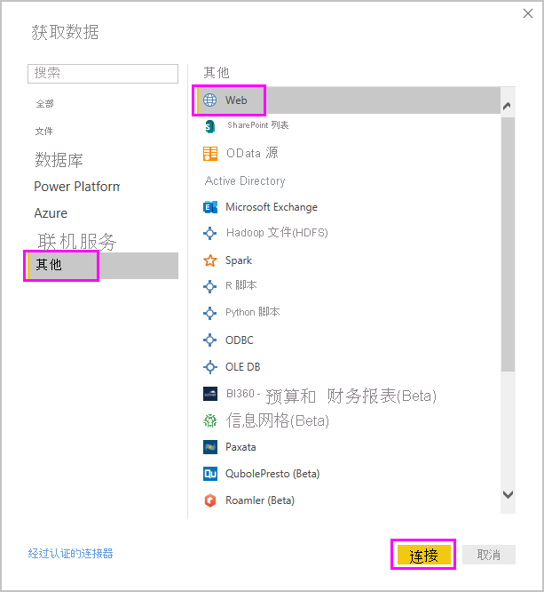
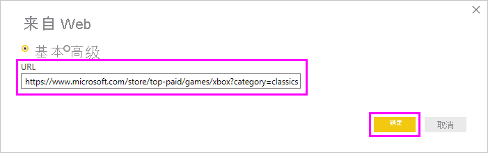
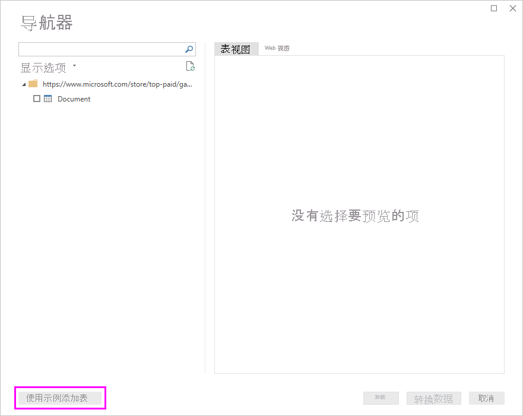
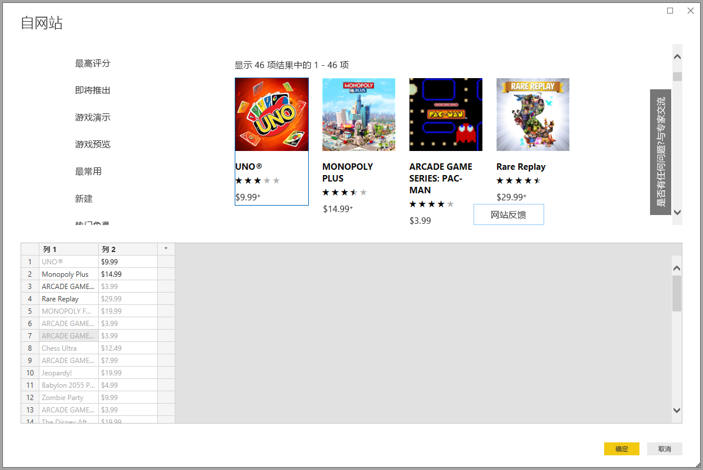
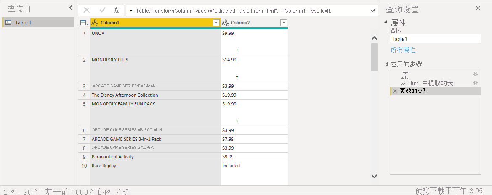

# 通过提供示例获取网页数据

从网页获取数据使用户可以轻松地从网页中提取数据并将该数据导入 Power BI Desktop  。 通常情况下，提取有序表比较容易，但网页上的数据并不在有序表中。 即使数据是结构化数据且一致，从此类页面获取数据也可能会很困难。

有一种解决方案。 使用“通过示例从 Web 获取数据”  功能，你可以通过在连接器对话框中提供一个或多个示例，实质显示你要从中提取数据的 Power BI Desktop。 Power BI Desktop 收集页面上与示例匹配的其他数据。 使用此解决方案，可以从网页提取所有类型的数据，包括在表中找到的数据和  其他非表数据。

图形中的价格仅作示例用。

## 使用通过示例从 Web 获取数据

从“开始”功能区菜单选择“获取数据”   。 在显示的对话框中，从左窗格中的类别中选择“其他”  ，然后选择“Web”  。 选择“连接”  以继续。

在“从 Web”中，输入想要从中提取数据的网页的 URL  。 在本文中，我们将使用 Microsoft Store 网页，并演示此连接器的工作原理。

如果想要按照说明操作，可以使用本文中所用的 [Microsoft Store URL](https://www.microsoft.com/store/top-paid/games/xbox?category=classics)：

    https://www.microsoft.com/store/top-paid/games/xbox?category=classics

选择“确定”  时，将转到“导航器”对话框  ，其中显示了任何来自网页的自动检测的表。 在下图所示的情况下，找不到任何表。 选择“使用示例添加表”提供示例  。

“使用示例添加表”提供一个交互式窗口，你可以在该窗口中预览网页内容  。 输入要提取的数据的示例值。

在此示例中，我们将提取页面上每个游戏的“名称”  和“价格”  。 我们可以通过从每个列的页面指定几个示例来执行该操作。 输入示例时，Power Query 使用智能数据提取算法提取符合示例条目模式的数据  。

> [!NOTE]
> 建议的值仅含长度小于或等于 128 个字符的值。

如果你对从网页中提取的数据满意，请选择“确定”以进入 Power Query 编辑器  。 你可以应用更多转换或调整数据的形状，例如将此数据与源的其他数据合并。

在这里，可以在创建 Power BI Desktop 报表时创建视觉对象或者使用网页数据。

## 后续步骤

你可以使用 Power BI Desktop 连接到各种数据。 有关数据源的详细信息，请参阅下列资源：

* [在 Power BI Desktop 中通过示例添加列](../create-reports/desktop-add-column-from-example.md)
* [通过 Power BI Desktop 连接到网页](desktop-connect-to-web.md)
* [Power BI Desktop 中的数据源](desktop-data-sources.md)
* [在 Power BI Desktop 中调整和合并数据](desktop-shape-and-combine-data.md)
* [通过 Power BI Desktop 连接到 Excel 工作簿](desktop-connect-excel.md)
* [通过 Power BI Desktop 连接到 CSV 文件](desktop-connect-csv.md)
* [直接将数据输入到 Power BI Desktop 中](desktop-enter-data-directly-into-desktop.md)
