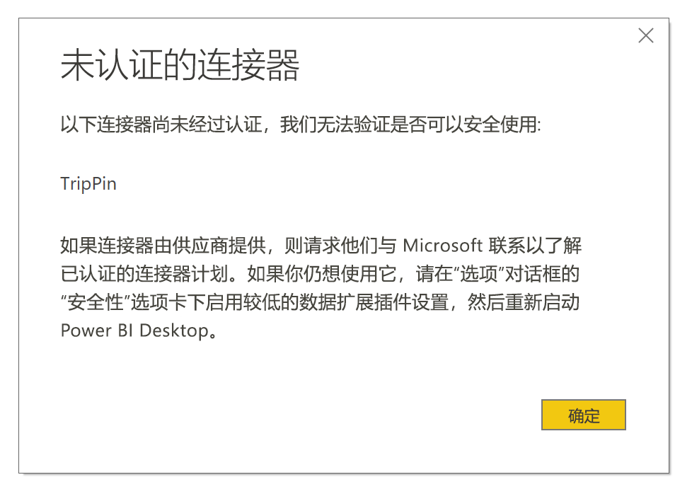

# Power BI 中的连接器扩展性

Power BI 可以通过使用现有连接器和通用数据源（例如 ODBC、OData、OLE DB、Web、CSV、XML 和 JSON）连接到数据。 或者，开发者可以使用自定义数据扩展插件（称为“自定义连接器”）来启用新数据源  。 某些自定义连接作为“经认证的连接器”由 Microsoft 认证和分发  。

若要使用你或第三方开发的未经认证的自定义连接器，必须调整 Power BI Desktop 安全设置以便在不进行验证或警告的情况下加载扩展。 因为此代码可以处理凭据，包括通过 HTTP 发送的凭据，并忽略隐私级别，所以除非绝对信任自定义连接器，否则不建议使用安全设置。

另一种选择是让开发者使用证书对连接器进行签名，并提供无需更改安全设置便可使用该证书的信息。 有关详细信息，请参阅[关于受信任的第三方连接器](desktop-trusted-third-party-connectors.md)。

## 自定义连接器

非认证自定义连接器可以容纳很多可能性，包括对业务至关重要的小型 API，以及 Microsoft 尚未发布连接器的大型行业特色服务。 许多连接器由供应商进行分发。 如果需要特定数据连接器，请联系供应商。 

若要使用非认证自定义连接，请将连接器 .pq、.pqx、.m 或 .mez 文件放入 *Documents]* Power BI Desktop *Custom Connectors 文件夹中*   *\[\\\\* 。 如果此文件夹不存在，请创建它。

按如下所示调整数据扩展安全设置：

在 Power BI Desktop 中，选择“文件” **“选项和设置”** “选项” > “安全”   >    >   。

在“数据扩展”下，选择“(不推荐)允许加载任何扩展而不经过验证或发出警告”   。 选择“确定”，然后重启 Power BI Desktop  。 

默认 Power BI Desktop 数据扩展安全设置为“(推荐)仅允许加载 Microsoft 认证和其他受信任的第三方扩展”  。 通过此设置，如果系统上有非认证的自定义连接器，则 Power BI Desktop 启动时会显示“未认证连接器”对话框，并列出无法安全加载的连接器  。

若要解决此错误，请更改“数据扩展”安全设置，或从“自定义连接器”文件夹中删除未认证的连接器   。

## 经过认证的连接器

数据扩展插件的有限子集被视为已认证  。 虽然 Microsoft 会分发连接器，但不对其性能或持续正常工作负责。 创建连接器的第三方开发者负责维护和支持。 

在 Power BI Desktop 中，已认证的第三方连接器及常规和通用连接器显示在“获取数据”对话框中的列表里  。 无需调整安全设置即可使用“经认证的连接器”。

如果想要认证自定义连接器，请让供应商联系 dataconnectors@microsoft.com。
