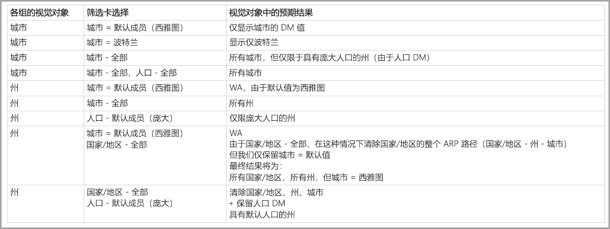

# 在 Power BI 中使用多维模型

在 Power BI 中，可以连接到多维模型，并创建报表来将模型内的各种数据可视化。 处理多维模型时，Power BI 基于定义为默认成员的列来应用数据处理规则。  

处理多维模型时，Power BI 基于使用包含 DefaultMember 的列的位置来处理模型中的数据。  使用 CSDL（概念架构定义语言）为多维模型中的特定列设置 DefaultMember 特性。  有关默认成员的详细信息，请参阅其[特性属性文章](/sql/analysis-services/multidimensional-models/attribute-properties-define-a-default-member?view=sql-server-2017)。 执行 DAX 查询时，将自动应用模型中指定的默认成员。

本文介绍了 Power BI 在各种情况下基于默认成员的位置处理多维模型时执行的行为。  

## 处理筛选器卡

基于包含默认成员的字段创建筛选器卡时，自动在筛选器卡中选择默认成员字段值。 结果是，受筛选器卡影响的所有视觉对象在数据库中保留其默认模型。 这些筛选器卡中的值反映默认成员。

若删除默认成员，取消选择此值会清除筛选器卡应用到的所有视觉对象的默认成员，并且显示的值不反映默认成员。

例如，假设存在“币种”列，并且其默认成员已设置为“美元”：  

* 在此示例下，若存在显示“总销售额”的卡片，值将应用默认成员，并且会显示“美元”对应的销售额。 
* 若将“币种”拖到筛选器卡窗格，“美元”会作为默认值被选中。   “总销售额”的值不变，因为应用了默认成员。 
* 但是，如果从筛选器卡中取消选择“美元”值，会清除“币种”的默认成员，并且现在“总销售额”将反映所有币种。   
* 因此，如果在筛选器卡中选择其他值（假设是“欧元”）及默认成员时，“总销售额”会反映筛选器“币种 {USD, EURO}”。   

## 分组行为

在 Power BI 中，基于包含默认成员的列为视觉对象分组时，Power BI 会清除该列的默认成员及其属性关系路径。   这将确保视觉对象显示所有值，而非仅显示默认值。

## 属性关系路径 (ARP)

属性关系路径 (ARP) 不仅为默认成员提供了强大的功能，还引入了一定的复杂性。  遇到 ARP 时，Power BI 根据 ARP 的路径清除其他列的默认成员，来以精准一致的方式处理视觉对象的数据。

下面的示例阐释了此行为。 假设 ARP 配置如下所示：

现在假设为下面的列设置了以下默认成员： 

* 城市 > 西雅图
* 州 > 华盛顿州
* 国家/地区 > 美国
* 人口 > 较多

现在我们来观察，在 Power BI 中使用各个列时会发生什么。 当视觉对象基于以下列分组时，结果如下：

* **城市** - Power BI 清除“城市”、“州”、“国家/地区”的所有默认成员来显示所有城市，但保留了“人口”的默认成员；Power BI 清除了“城市”的整个 ARP。       
    > [!NOTE]
    > “人口”未在“城市”的 ARP 路径中，它只与“州”相关联，因此 Power BI 未清除它。   
* **州** - Power BI 清除“城市”、“州”、“国家/地区”和“人口”的所有默认成员，来显示所有州。      
* **国家/地区** - Power BI 清除“城市”、“州”和“国家/地区”的所有默认成员，来显示所有国家/地区，但保留了“人口”的默认成员。      
* “城市和州” - Power BI 清除了所有列的所有默认成员。  

视觉对象中显示的组清除了其整个 ARP 路径。 

若某个组未在视觉对象中显示，但它属于其他分组基础列的 ARP 路径的一部分，将执行以下规则：

* 不会自动清除 ARP 路径的所有分支。
* 仍通过未清除的默认成员筛选该组。 

### 切片器和筛选器卡

处理切片器或筛选器卡时，会发生下面的行为：

* 切片器或筛选器卡载有数据时，Power BI 在视觉对象中基于相应列分组，以便显示行为与前文所述行为相同。

由于切片器和筛选器卡通常用于与其他视觉对象交互，将执行清除受影响的视觉对象的默认成员这一逻辑，如下表中所述。  

我们将前文所用的相同示例数据用于此表：

在下列情况下，Power BI 将应用下面相应的行为规则。

在以下情况下，Power BI 清除给定列的默认成员： 

* Power BI 基于该列分组
* Power BI 基于与该列相关的某个列（处于 ARP 中的任意位置，上面或下面）分组
* Power BI 基于属于 ARP 的列（上面或下面）进行筛选
* 该列的筛选器卡为“全部”状态 
* 该列的筛选器卡选择了任意值（Power BI 收到该列的筛选器）

在以下情况下，Power BI 不会清除给定列的默认成员： 

* 列的筛选器卡为默认状态，并且 Power BI 基于属于 ARP 的列分组。
* 在 ARP 中此列高于其他列，并且 Power BI 针对相应的其他列的筛选器卡处于默认状态。

## 后续步骤

本文介绍了 Power BI 在处理多维模型中的默认成员时的行为。 你可能还会对以下文章感兴趣： 

* [显示 Power BI 中不含数据的项目](../create-reports/desktop-show-items-no-data.md)
* [Power BI Desktop 中的数据源](desktop-data-sources.md)