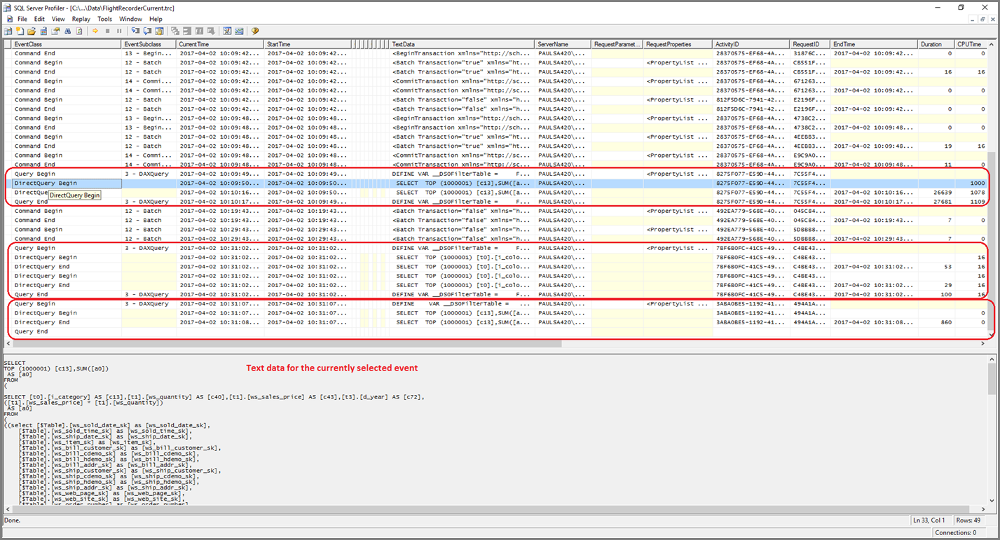

# <a name="about-using-directquery-in-power-bi"></a>关于在 Power BI 中使用 DirectQuery

使用 Power BI Desktop 或 Power BI 服务时，可以连接各种不同类型的数据源，并且可以通过不同的方式连接这些数据 。 可以将数据导入 Power BI，也可以在原始源存储库中直接连接数据，前者是获取数据最常见的方法，后者称为 DirectQuery 。 本文介绍 DirectQuery 功能：

* DirectQuery 的各种连接选项
* 何时应考虑使用 DirectQuery 而非导入的相关指导
* 使用 DirectQuery 时带来的弊端
* 使用 DirectQuery 的最佳做法

遵循使用导入与 DirectQuery 的最佳做法：

* 应尽可能将数据导入 Power BI。 导入可以充分利用 Power BI 的高性能查询引擎，并提供高度交互和功能完善的体验。
* 如果通过导入数据无法实现目标，则可以考虑使用 DirectQuery。 例如，如果数据被频繁更改并且报表必须反映最新数据，DirectQuery 可能是最佳选择。 但是，仅当基础数据源可以提供交互式查询（对于典型聚合查询，时长少于 5 秒）并且能够处理生成的查询负载时，使用 DirectQuery 才是可行的。 此外，应仔细斟酌 DirectQuery 的使用限制列表。

Power BI 为导入和 DirectQuery 提供的功能集随时间的推移不断改进。 这些更改包括在使用导入数据时提供更强的灵活性，以便可以在更多情况下使用导入模式，以及消除使用 DirectQuery 时带来的的一些弊端。 无论如何改进，使用 DirectQuery 时都会始终将基础数据源的性能作为主要考虑因素。 如果该基础数据源速度缓慢，对该数据源使用 DirectQuery 将仍然不可行。

本文介绍 Power BI（而不是 SQL Server Analysis Services）中的 DirectQuery。 DirectQuery 也是 SQL Server Analysis Services 的一项功能。 本文中所述的许多详细信息都适用于该功能。 二者之间也存在重要的差异。 若要了解如何使用 SQL Server Analysis Services 的 DirectQuery，请参阅 [SQL Server 2016 Analysis Services 中的 DirectQuery](https://download.microsoft.com/download/F/6/F/F6FBC1FC-F956-49A1-80CD-2941C3B6E417/DirectQuery%20in%20Analysis%20Services%20-%20Whitepaper.pdf)。

本文重点介绍 DirectQuery 的建议工作流、在 Power BI Desktop 中创建报表的位置，以及如何在 Power BI 服务中直接连接数据。

## <a name="power-bi-connectivity-modes"></a>Power BI 连接模式

Power BI 连接大量不同类型的数据源，包括：

* 联机服务（Salesforce、Dynamics 365 等）
* 数据库（SQL Server、Access、Amazon Redshift 等）
* 简单文件（Excel、JSON 等）
* 其他数据源（Spark、网站、Microsoft Exchange 等）

对于这些数据源，可以使用导入方法将数据导入到 Power BI。 其中某些数据源还可以使用 DirectQuery 进行连接。 有关支持 DirectQuery 的源摘要，请参阅 [DirectQuery 支持的数据源](power-bi-data-sources.md)。 将来会有更多数据源支持 DirectQuery，我们会主要关注可以提供良好的交互式查询性能的数据源。

SQL Server Analysis Services 是一个特例。 连接到 SQL Server Analysis Services 时，你可以选择导入数据，或使用实时连接。 使用实时连接类似于 DirectQuery。 不导入数据，始终查询基础数据源以刷新视觉对象。 但实时连接在许多其他方面有所不同，因此使用了不同的术语，即“实时连接”而非“DirectQuery” 。

用于连接到数据的三个选项：导入、DirectQuery 和实时连接  。

### <a name="import-connections"></a>导入连接

对于导入，如果在 Power BI Desktop 中使用“获取数据”以连接数据源（如 SQL Server），则该连接行为如下所示：

* 在最初的“获取数据”体验期间，每个选定的表集定义一个将返回一组数据的查询。 这些查询可在加载数据之前进行编辑，例如应用筛选器、聚合数据或联接不同的表。
* 加载时，这些查询定义的所有数据都将被导入 Power BI 高速缓存。
* 在 Power BI Desktop 中生成视觉对象时，将查询导入的数据。 Power BI 存储可确保查询速度迅速。 对视觉对象的所有更改将立即反映出来。
* 但对基础数据的任何更改都不会反映在任何视觉对象中。 需要刷新才能重新导入数据。
* 将报表作为 .pbix 文件发布到 Power BI 服务时，创建一个数据集并将其上传到 Power BI 服务。 该数据集包含导入的数据。 然后可以按计划刷新该数据，例如每天重新导入数据。 可能必须配置本地数据网关，具体取决于原始数据源的位置。
* 在 Power BI 服务中打开现有报表或创作新报表时，将再次查询导入的数据，确保交互性。
* 可以将视觉对象或整个报表页固定为仪表板磁贴。 当基础数据集刷新时，磁贴自动刷新。

### <a name="directquery-connections"></a>DirectQuery 连接

对于 DirectQuery，如果在 Power BI Desktop 中使用“获取数据”连接数据源，则该连接行为如下所示：

* 在最初的“获取数据”体验期间，选择该源。 对于关系数据源，选择一组表，每个表仍定义一个查询，该查询在逻辑上返回一组数据。 对于多维数据源（如 SAP BW），将仅选择数据源。
* 但在加载时，不会将数据导入 Power BI 存储。 相反，在 Power BI Desktop 中生成视觉对象时，向基础数据源发送查询以检索所需数据。 刷新视觉对象所花费的时间取决于基础数据源的性能。
* 对基础数据的任何更改都不会立即反映在任何现有视觉对象中。 仍然需要刷新。 为每个视觉对象重新发送必要的查询，并在必要时更新视觉对象。
* 将报表发布到 Power BI 服务时，将再次在 Power BI 服务中生成数据集（和导入模式相同）。 但是，该数据集不包含任何数据。
* 在 Power BI 服务中打开现有报表或创作新报表时，将再次查询基础数据源以检索所需数据。 可能必须配置本地数据网关，具体取决于原始数据源的位置（和导入模式中刷新数据所需步骤相同）。
* 可以将视觉对象或整个报表页固定为仪表板磁贴。 为了确保迅速打开仪表板，磁贴会按计划（例如每小时）自动刷新。 可以控制此刷新频率，以反映数据更改频率和查看最新数据的重要性。 打开仪表板时，磁贴将反映上次刷新时的数据，而不一定反映对基础源所做的最新更改。 可刷新打开的仪表板，确保它保持最新。

### <a name="live-connections"></a>实时连接

如果连接到 SQL Server Analysis Services，可选择从所选数据模型导入数据，或实时连接到所选数据模型。 如果使用导入，则需要针对外部 SQL Server Analysis Services 数据源定义查询，以便正常导入数据。 如果使用实时连接，则不需要定义查询，字段列表中会显示整个外部模型。

上段中所述的情况也适用于连接以下数据源（没有导入数据选项的情况除外）：

* Power BI 数据集。例如，连接到以前已创建并发布到服务的 Power BI 数据集以创作新报表将其覆盖。
* Microsoft Dataverse。

SQL Server Analysis Services 报表发布到 Power BI 服务时，其行为在以下方面与 DirectQuery 报表类似：

* 在 Power BI 服务中打开现有报表或创作新报表时，查询基础 SQL Server Analysis Services 源（可能需要一个本地数据网关）。
* 仪表板磁贴按计划（例如每小时）自动刷新。

二者之间也存在重要的差异。 例如，对于实时连接，打开报表的用户的标识始终传递到基础 SQL Server Analysis Services 源。

介绍这些比较后，本文剩余部分将着重介绍 DirectQuery。

## <a name="when-is-directquery-useful"></a>DirectQuery 在什么情况下有用？

下表描述了与 DirectQuery 连接可能特别有用的场景。 其中包括这样的情况：将数据保留在原始源中被认为是有益的。 该描述内容包括对特定场景是否适用于 Power BI 的讨论。

| 限制 | 说明 |
| --- | --- |
| 数据频繁变化，需要几乎实时的报表 |具有导入数据的模型最多每小时刷新一次（使用 Power BI Pro 或 Power BI Premium 订阅可以更频繁地刷新）。 如果数据不断改变且报表必须显示最新数据，使用按计划刷新的导入可能无法满足需求。 可以将数据直接流式传输到 Power BI 中（尽管这种情况下支持的数据量有限制）。 <br/> <br/> 相比之下，使用 DirectQuery 意味着打开或刷新报表或仪表板始终显示源中最新的数据。 此外，可以更频繁地（每 15 分钟）更新仪表板磁贴。 |
| 数据量非常大 |如果数据量非常大，将其全部导入是不可行的。 相比之下，DirectQuery 不需要大量数据传输，因为它可以进行就地查询。 <br/> <br/> 但是，大量数据可能也意味着对该基础源查询的速度很慢，如[使用 DirectQuery 的影响](#implications-of-using-directquery)中所述。 你不必始终导入完整的详细数据。 相反，数据可在导入过程中预先进行聚合。 查询编辑器使得在导入期间预聚合变得容易。 在极端情况下，可以只导入每个视觉对象所需的聚合数据。 虽然 DirectQuery 是处理大量数据的最简单方法，但如果基础数据源太慢，导入聚合数据也许是一个解决方案。 |
| 基础数据源中定义的安全规则 |导入数据时，Power BI 使用 Power BI Desktop 中当前用户的凭据连接到数据源，或使用 Power BI 服务中作为配置计划刷新的一部分定义的凭据连接到数据源。 在“导入”模式下发布和共享此类包含数据的报表时，请注意只与允许查看相同数据的用户共享，或将行级别安全性定义为数据集的一部分。 <br/> <br/> DirectQuery 允许将报表查看器的凭据传递到要在这里应用的基础源和安全规则。 支持单一登录到 SQL Azure 数据源，并通过数据网关连接到本地 SQL Server。 有关详细信息，请参阅 [Power BI 中网关的单一登录 (SSO) 概述](service-gateway-sso-overview.md)。 |
| 数据主权限制应用 |某些组织对数据主权制定有相应策略，这意味着数据不能离开组织规定的前提。 基于导入的解决方案很显然会存在问题。 相比之下，如果使用 DirectQuery，数据将保留在基础数据源中。 <br/> <br/> 但是，由于磁贴按计划刷新，即使使用 DirectQuery，某些视觉对象级别的数据缓存也会保留在 Power BI 服务中。 |
| 基础数据源是包含度量值的 OLAP 数据源 |如果基础数据源包含度量值（如 SAP HANA 或 SAP Business Warehouse），则导入数据将引发其他问题。 这意味着导入的数据处于由查询定义的特定聚合级别。 例如，按类别、年份和城市衡量总销售额   。 如果构建的视觉对象要求较高级别的聚合数据（如按年聚合的总销售额），它会进一步聚合总值 。 此聚合对于附加式度量值（如 Sum 和 Min）没有问题，但对非附加式度量值（如 Average、DistinctCount）会产生问题   。 <br/> <br/> 为了轻松从源中直接获取特定视觉对象所需的正确聚合数据，有必要像 DirectQuery 一样按视觉对象发送查询。 <br/> <br/> 连接到 SAP Business Warehouse (BW) 时，可以选择 DirectQuery 进行这种度量。 有关 SAP BW 的信息，请参阅[DirectQuery 和 SAP BW](desktop-directquery-sap-bw.md)。 <br/> <br/> 但是，当前 SAP HANA 上的 DirectQuery 将其视为关系数据源对待，并提供与导入类似的行为。 此方法在 [DirectQuery 和 SAP HANA](desktop-directquery-sap-hana.md) 中有进一步介绍。 |

综上所述，鉴于 Power BI 中 DirectQuery 的当前功能，其优势体现在以下方面：

* 数据频繁变化，需要准实时报表。
* 处理非常大的数据量，而无需预先聚合。
* 数据主权限制应用。
* 源是包含度量值（如 SAP BW）的多维度源。

上一列表中的详细信息仅涉及 Power BI 的使用。 你可以转而使用外部 SQL Server Analysis Services 或 Azure Analysis Services 模型导入数据。 然后使用 Power BI 连接到该模型。 虽然这种方法需要其他配置，但它可以提供更大的灵活性。 更多的数据可以导入。 对于数据刷新频率没有限制。

## <a name="implications-of-using-directquery"></a>使用 DirectQuery 的影响

如本节内容所述，使用 DirectQuery 确实存在潜在的负面影响。 其中一些限制因使用的具体数据源不同而略有不同。 我们会在适当情况下解决限制，差异显著的数据源将由单独的文章介绍。

### <a name="performance-and-load-on-the-underlying-source"></a>基础源的性能和负载

使用 DirectQuery 时，整体体验很大程度取决于基础数据源的性能。 例如，在更改切片器值后，如果刷新每个视觉对象需要几秒钟的时间（通常少于 5 秒），则体验是合理的。 与将数据导入 Power BI 时的即时响应相比，这种体验可能会比较缓慢。 如果源速度慢而导致各个视觉对象所花的时间超过数十秒，则体验就会变得非常糟糕。 查询甚至可能会超时。

除了基础源的性能，还要注意源上的负载。 负载会影响性能。 每个打开共享报表的用户和每个刷新的仪表板磁贴，都会针对每个可视对象向基础源发送至少一个查询。 这种情况需要源能够处理此类查询负载，同时仍保持良好的性能。

### <a name="security-implications-when-combining-data-sources"></a>合并数据源时的安全隐患

使用[复合模型](../transform-model/desktop-composite-models.md)功能，可以在 DirectQuery 模型中使用多个数据源，就像导入数据时一样。 当你使用多个数据源时，很重要的一点是，要了解数据如何在基础数据源之间来回移动以及由此带来的[安全隐患](../transform-model/desktop-composite-models.md#security-implications)。

### <a name="limited-data-transformations"></a>数据转换限制

同样，在“查询编辑器”中应用数据转换也存在限制。 如果使用导入数据，可以轻松地应用一组复杂转换来清理及重新整理数据，然后再使用数据创建视觉对象，例如解析 JSON 文档或将数据从列形式转换为行形式。 这些转换在 DirectQuery 中受到更多限制。

首先，连接到 SAP Business Warehouse 等 OLAP 数据源时，不能定义任何转换，整个外部模型都来自该数据源。 对于类似 SQL Server 的关系数据源，每个查询仍可以定义一组转换，但是出于性能原因，这些转换将受到限制。

任何此类转换需要应用于基础数据源的每个查询，而不是在数据刷新时应用一次，因此它们仅限于可以合理地转换为单个本机查询的转换。 如果你使用的转换过于复杂，则会收到错误警报，必须删除该转换或将模型切换到导入。

此外，“获取数据”对话框或“查询编辑器”产生的查询将用于生成和发送的查询的子选项中，以检索视觉对象所需的数据。 在“查询编辑器”中定义的查询必须在此上下文中有效。 具体而言，不能使用包含“公用表表达式”或调用“存储过程”的查询。

### <a name="modeling-limitations"></a>建模限制

术语“建模”在此上下文中表示完善和丰富原始数据（作为创建使用它的报表的一部分）。 示例包括：

* 定义表之间的关系
* 添加新计算（计算列和度量值）
* 重命名和隐藏列和度量值
* 定义层次结构
* 定义列的格式设置、默认汇总以及排序顺序
* 分组或聚类值

如果使用 DirectQuery，仍然可以丰富大多数这些模型，当然还有正被丰富的原始数据的原则，以便改进后续使用。 但是，使用 DirectQuery 时，有些建模功能将不可用或受到限制。 通常，应用限制的目的是避免性能问题。 此处列出了所有 DirectQuery 源通用的限制。 其他限制可能适用于单个源，如[后续步骤](#next-steps)中所述。

* **无内置日期层次结构：** 导入数据时，默认情况下，每个日期/日期时间列都将具有默认的内置日期层次结构。 例如，如果导入的销售订单表包含“OrderDate”列，则在视觉对象中使用 “OrderDate”时，可以选择要使用的适当级别（年、月、日） 。 使用 DirectQuery 时，此内置日期层次结构不可用。 如果基础数据源中存在“日期”表（如许多数据仓库中常见的那样），则可以照常使用 DAX 时间智能函数。
* **日期/时间仅支持秒级准确度：** 在数据集中使用时间列时，Power BI 仅以秒级详细程度向基础数据源发出查询。 查询不会在数毫秒内发送到 DirectQuery 源。 从源列中删除此部分时间。
* **计算列中的限制：** 计算列仅限于行内，因为它们只能引用同一表中其他列的值，不能使用任何聚合函数。 此外，允许使用的 DAX 标量函数（如 `LEFT()`）仅限于那些可推送到基础源的函数。 函数因源的确切功能而异。 创建计算列的 DAX 时，不支持的功能不会在自动完成中列出，如果使用则会导致错误。
* **不支持父-子 DAX 函数：** 在 DirectQuery 模式下，不能使用 `DAX PATH()` 系列函数，这类函数通常处理父子结构，如帐户图表或员工层次结构图表。
* **不支持计算表：** DirectQuery 模式不支持使用 DAX 表达式定义计算表。
* **关系筛选：** 有关双向筛选的信息，请参阅 [双向交叉筛选](https://download.microsoft.com/download/2/7/8/2782DF95-3E0D-40CD-BFC8-749A2882E109/Bidirectional%20cross-filtering%20in%20Analysis%20Services%202016%20and%20Power%20BI.docx)。 本白皮书在 SQL Server Analysis Services 的上下文中提供了一些示例。 基本要点同样适用于 Power BI。
* **无聚类分析：** 使用 DirectQuery 时，不能使用聚类分析功能自动查找组。

### <a name="reporting-limitations"></a>报表限制

几乎所有的报表功能都支持 DirectQuery 模型。 在这种情况下，只要基础数据源提供了合适的性能水平，就可以使用相同的可视化组件集。 在发布报表后，Power BI 服务中提供的一些其他功能会受到一些重要限制：

* **不支持快速见解：** Power BI 快速见解功能可快速搜索数据集的不同子集，同时应用一组复杂的算法来发现潜在相关的见解。 此功能对查询的性能要求非常高，因此在使用 DirectQuery 的数据集上不可用。
* **不支持问答：** 使用 Power BI 中的“问答”可利用直观、自然的语言功能浏览数据并接收图表和图形形式的答案。 但是，当前使用 DirectQuery 的数据集不支持此功能。
* **使用“在 Excel 中浏览”可能会导致性能不佳：** 可以在数据集上使用“在 Excel 中浏览”功能浏览数据。 此方法允许在 Excel 中创建数据透视表和数据透视图。 尽管使用 DirectQuery 的数据集支持此功能，但性能通常比在 Power BI 中创建视觉对象的性能更慢，因此如果使用 Excel 对你的方案非常重要，则决定使用 DirectQuery 时请考虑这一事实。
* **文本列的最大长度：** 对于使用 DirectQuery 的数据集，文本列中数据的最大长度为 32,764 个字符。 报告较长的文本会导致错误。

### <a name="security"></a>安全性

如本文前面所述，DirectQuery 中的报表在发布到 Power BI 服务后，将始终使用相同的固定凭据连接到基础数据源。 此行为适用于 DirectQuery，而不是 SQL Server Analysis Services 的实时连接，两者在这方面不同。 发布 DirectQuery 报表后，必须立即配置用户要使用的凭据。 在配置凭据之前，打开 Power BI 服务报表将导致错误。

提供用户凭据后，所有打开报表的用户都可使用这些凭据。 这样就像导入的数据一样。 除非已将行级安全性定义为报表的一部分，否则每个用户都会看到相同的数据。 如果在基础数据源中定义了任何安全规则，共享报表时也必须注意这一点。

此外，将 DirectQuery 从 Power BI Desktop 连接到 SQL Server 时，不支持使用备用凭据。 可使用当前的 Windows 凭据或数据库凭据。

### <a name="behavior-in-the-power-bi-service"></a>Power BI 服务中的行为

本部分介绍 Power BI 服务中 DirectQuery 报表的行为，用于说明将置于后端数据源的负载程度、需要考虑的共享报表和仪表板的用户数、报表的复杂性以及行级别安全性是否已在报表中定义。

#### <a name="reports--opening-interacting-with-editing"></a>报表 – 打开、与之交互、编辑

打开报表时，将刷新当前可见页面上的所有视觉对象。 每个视觉对象通常需要至少一个查询以对基础数据源进行查询。 某些视觉对象可能需要多个查询。 例如，视觉对象可能会显示来自两个不同事实数据表的聚合值、包含更复杂的度量值或包含非附加式度量值的总和（如 Count Distinct）。 移动到新页面会刷新这些视觉对象。 刷新将向基础源发送一组新查询。

报表上的所有用户交互都可能导致刷新视觉对象。 例如，选择切片器上的不同值需要发送一组新查询以刷新所有受影响的视觉对象。 单击视觉对象以交叉突出显示其他视觉对象或更改筛选器也是如此。

类似情况还包括编辑新报表，此过程需要为每个步骤发送查询，以产生最终视觉对象。

存在一些包含结果的缓存。 如果获得完全相同的最新结果，将即时刷新视觉对象。 如果定义了行级别安全性，则不会跨用户共享此类缓存。

#### <a name="dashboard-refresh"></a>仪表板刷新

单个视觉对象或整个页面可以作为磁贴固定到仪表板。 基于 DirectQuery 数据集的磁贴根据计划自动刷新。 磁贴将查询发送到后端数据源。 默认情况下，数据集每小时刷新一次，但作为数据集设置的一部分，可以将其配置为每周和每 15 分钟刷新一次。

如果模型中未定义行级别安全性，每个磁贴将刷新一次，并在所有用户之间共享结果。 否则，可能会产生巨大的乘数效应。 每个磁贴都需要将每个用户的单独查询发送到基础源。

如果某个仪表板有 10 个磁贴、与 100 个用户共享、是在使用具有行级别安全性的 DirectQuery 数据集创建的，并且配置为每 15 分钟刷新一次，则将导致每 15 分钟向后端数据源发送至少 1000 个查询。

请慎重考虑使用行级别安全性和计划刷新配置。

#### <a name="time-outs"></a>超时

四分钟的超时时间适用于 Power BI 服务中的单个查询。 超过此时间的查询会失败。 如前所述，我们建议你将 DirectQuery 用于提供接近交互式查询性能的源。 此限制旨在防止执行时间过长产生的问题。

### <a name="other-implications"></a>其他影响

使用 DirectQuery 的其他一般性影响如下：

* **如果数据发生更改，则必须刷新以确保显示最新数据：** 由于给定使用缓存，无法确保视觉对象始终显示最新数据。 例如，视觉对象可能显示最后一天的事务。 由于切片器被更改，它可能会刷新以显示过去两天的事务。 这些事务可能包括最近新到达的事务。 将切片器返回到其原始值将导致再次显示之前获得的缓存值。

  选择“刷新”会清除所有缓存，并刷新页面上的所有视觉对象以显示最新数据。

* **如果数据发生更改，不能保证视觉对象之间的一致性：** 不同的视觉对象（无论是在相同页面还是在不同页面上），可能会在不同的时间刷新。 如果基础源中的数据已更改，则不能保证每个视觉对象都在完全相同的时间点显示数据。 事实上，鉴于有时单个视觉对象需要多个查询（例如，获取详细信息和总计），因此，即使在单个视觉对象中也不能保证一致性。 若要确保此一致性，每当刷新任何视觉对象时，都需要刷新所有视觉对象的开销，同时使用昂贵的功能，如基础数据源中的“快照隔离”。

  再次选择“刷新”（刷新页面中所有视觉对象）可以很大程度上缓解此问题。 即便使用导入模式，从多个表中导入数据时也存在类似的保证一致性的问题。

* **需要在 Power BI Desktop 中刷新以反映元数据的任何更改：** 报表发布后，使用“刷新”将刷新报表中的视觉对象。 如果基础源的架构已更改，这些更改将不会自动应用于更改字段列表中可用的字段。 如果已从基础源中删除表或列，则可能导致刷新时查询失败。 在 Power BI Desktop 中打开报表，然后选择“刷新”更新模型中的字段以反映更改。

* **对任何查询可以返回的行数限制为一百万行：** 对于基础源的任何单个查询，可以返回的行数限制为固定的一百万行。 此限制通常没有实际意义，视觉对象本身不会显示那么多行。 但如果 Power BI 未完全优化发送的查询，并且有一些中间请求结果超出此限制，则可能会受此限制。 在生成达到更合理最终状态的视觉对象的过程中，也可能会受此限制。 例如，如果有超过一百万的客户，则在应用某些筛选器之前，包括“客户”和“TotalSalesQuantity”将达到此限制 。

  返回的错误为：“外部数据源的查询结果集超过了允许的最大行数 ‘1000000’ 行。”

* **无法将导入模式更改为 DirectQuery 模式：** 尽管可以将模型从 DirectQuery 模式切换到导入模式，但必须导入所有需要的数据。 它无法切换回来，主要是因为 DirectQuery 模式下不支持此功能集。 由于外部度量值的处理方式不同，多维数据源（如 SAP BW）的 DirectQuery 模型也不能从 DirectQuery 切换到导入。

## <a name="directquery-in-the-power-bi-service"></a>Power BI 服务中的 DirectQuery

Power BI Desktop 支持所有数据源。 某些数据源还可直接在 Power BI 服务中使用。 例如，企业用户可以使用 Power BI 连接其 Salesforce 中的数据并立即获得仪表板，而无需使用 Power BI Desktop。

启用了 DirectQuery 的数据源中，只有两个数据源可以直接在服务中使用：

* Spark
* Azure SQL 数据仓库

但是，我们建议在 Power BI Desktop 中对这两个数据源使用 DirectQuery。 原因在于，在 Power BI 服务中最初建立连接时，许多关键限制将适用。 虽然起点很简单，即在 Power BI 服务中开始，但是在进一步增强结果报告方面存在限制。 例如，无法创建任何计算，也不能使用许多分析功能，甚至不可以刷新元数据以反映对基础架构所做的任何更改。

## <a name="guidance-for-using-directquery-successfully"></a>成功使用 DirectQuery 的指南

如果你要使用 DirectQuery，此节提供一些有关如何确保使用成功的高级指导。 此部分中的指导源自本文所述的使用 DirectQuery 的影响。

### <a name="back-end-data-source-performance"></a>后端数据源性能

验证简单视觉对象是否在合理的时间刷新。 要提供合理的交互体验，刷新时间应在 5 秒内。 如果视觉对象刷新时间超过 30 秒，发布报表后很可能会出现进一步的问题。 这些问题可能会使解决方案无效。

如果查询速度慢，请检查发送到基础源的查询以及查询性能不佳的原因。 本文不涉及各种在完整的一组潜在基础源中优化数据库的最佳做法。 本文介绍适用于大多数情况的标准数据库做法：

* 基于整数列的关系通常比其他数据类型的列的联接更好。
* 应创建适当的索引。 创建索引通常意味着在支持列存储索引的数据源（如 SQL Server）中使用它们。
* 应更新数据源中的任何必要的统计信息。

### <a name="model-design-guidance"></a>模型设计指南

定义模型时，请考虑遵循以下指南：

* 避免在查询编辑器中定义复杂的查询。 查询编辑器将复杂的查询转换为单个 SQL 查询。 此查询显示在发送到该表的每个查询的子选项中。 如果查询很复杂，则可能导致所发送的每个查询出现性能问题。 可以通过选择查询编辑器中的最后一步，并从上下文菜单中选择“查看本地查询”来获取一组步骤的实际 SQL 查询。
* 简化度量值。 至少在开始时，我们建议将度量值限制为简单聚合。 如果这些度量值的运作令人满意，可以定义更复杂的度量值，但要注意每个度量值的性能。
* 避免定义计算列上的关系。 本指南与需要执行多列联接的数据库有关。 Power BI 目前不允许基于多列作为 FK/PK 的关系。 常见的解决方法是使用计算列来连接列，然后基于该列进行联接。 虽然此解决方法对于导入的数据是合理的，但对于 DirectQuery，这会导致表达式上出现联接。 这种结果通常会阻止使用任何索引，并导致性能不佳。 唯一的解决方法是，在基础数据库中将多列具体化为单列。
* 避免定义 uniqueidentifier 列上的关系。 Power BI 在本机上不支持 `uniqueidentifier` 数据类型。 定义 `uniqueidentifier` 列之间的关系将导致涉及强制转换的联接的查询。 同样，此方法通常会导致性能不佳。 在进行特别优化之前，唯一的解决方法是在基础数据库中具体化替代类型的列。
* **隐藏关系中的 to 列。** 关系中的 to 列的通常是 to 表的主键 。 该列应隐藏。 如果隐藏，则它不会显示在字段列表中，也不能用于视觉对象。 通常，关系所在的列实际上是系统列（例如数据仓库中的代理键）。 无论如何，隐藏此类列是一种很好的做法。 如果该列确实有意义，则引入一个可见并且具有等于主键的简单表达式的计算列，如以下示例所示：

  ```sql  
      ProductKey_PK   (Destination of a relationship, hidden)
      ProductKey (= [ProductKey_PK],   visible)
      ProductName
      ...
  ```

* 检查所有计算列和数据类型更改的使用。 使用这些功能不一定有害。 它们确实会导致发送到基础源的查询包含表达式，而非对列的简单引用。 这也可能会导致无法使用索引。
* 避免对关系使用双向交叉筛选。 使用双向交叉筛选可能导致查询语句应用效果不佳。
* 设置“假设引用完整性”实验。 关系的“假设引用完整性”设置使查询能够使用 `INNER JOIN` 语句，而不是 `OUTER JOIN` 语句。 本指南通常可以提高查询性能，但具体取决于数据源的详细情况。
* **请勿在查询编辑器中使用相对数据筛选。** 在查询编辑器中可以定义相对日期筛选。 例如，假设筛选日期是过去 14 天内的行。
  
  
  
  但是，在编写查询时，此筛选器将被转换为基于固定日期的筛选器。 可以通过查看本机查询来查看此结果。
  
  
  
  此结果可能不是你想要的结果。 要确保根据报表运行时的日期应用筛选器，请将报表中的筛选器应用为报表筛选器。 目前，此方法通过创建计算天数的计算列实现（使用 `DAX DATE()` 函数），然后在筛选器中使用该计算列。

### <a name="report-design-guidance"></a>报表设计指南

创建使用 DirectQuery 连接的报表时，请遵循以下指南：

* **考虑使用“查询缩减”选项：** Power BI 提供报表中的选项以发送更少的查询，并在生成的查询需要较长的运行时间时禁用可能导致体验不佳的某些交互。 若要访问 Power BI Desktop 中的这些选项，请转到“文件” > “选项和设置” > “选项”，然后选择“查询缩减”   。

   

    选中“查询缩减”上的复选框选项后，可以在整个报表中禁用交叉突出显示。 你也可以向切片器或筛选器选项显示“应用”按钮。 通过此方法，你可以在应用切片器和筛选器之前进行多次选择。 在你选择切片器上的“应用”按钮之前，不会发送任何查询。 然后，可使用所选选项筛选数据。

    当你在 Power BI Desktop 中与报表交互时，这些选项将应用于该报表。 当你的用户在 Power BI 服务中使用该报表时，这些选项也适用。

* **先应用筛选器：** 始终在开始生成视觉对象时应用任何适用的筛选器。 例如，与其在“TotalSalesAmount”和“ProductName”拖动，然后筛选到特定年份，不如一开始就应用“年份”筛选器  。 生成视觉对象的每个步骤都会发送查询。 虽然在第一个查询完成之前可能会进行其他更改，但此方法仍然会对基础源造成不必要的负担。 尽早应用筛选器通常会降低中间查询成本。 此外，如果未能尽早应用筛选器，可能导致达到一百万行的限制。
* **限制页面上的视觉对象的数目：** 打开页面或更改页面级切片器或筛选器时，将刷新页面上的所有视觉对象。 并行发送的查询数也有限制。 随着视觉对象数量的增加，一些视觉对象将以串行方式刷新，从而增加刷新整个页面所需的时间。 出于此原因，我们建议你限制单个页面中的视觉对象数量，改为包含更多更简单的页面。
* **考虑关闭视觉对象之间的交互：** 默认情况下，报表页上的可视化组件可用于交叉筛选和交叉突出显示页面上的其他可视化组件。 例如，选择了饼图上的“1999”之后，柱形图交叉突出显示“1999”类别的销售额 。
  
  
  
  DirectQuery 中的交叉筛选和交叉突出显示要求向基础源提交查询。 如果响应用户选择所用的时间太长，应将交互关闭。 你可以关闭此交互。 可以为整个报表（如前文有关查询缩减选项所述）关闭交互，或者按具体情况关闭这些交互。 有关详细信息，请参阅[视觉对象如何在 Power BI 报表中彼此交叉筛选](../consumer/end-user-interactions.md)。

除了上述建议，以下每一种报表功能都可能导致性能问题：

* **度量值筛选器：** 包含度量值或列聚合的视觉对象可以在这些度量中包含筛选器。 例如，下图按“类别”显示“SalesAmount”，但仅包括销量超过两千万的类别  。
  
  
  
  此方法导致两个查询被发送到基础源：
  
  * 第一个查询检索符合条件的类别（SalesAmount 大于两千万）。
  * 然后，第二个查询检索视觉对象所需的数据，包括满足 `WHERE` 子句中的条件的类别。
  
  如果有数百或数千个类别，此方法通常很有效，如本例所示。 如果类别数太大，性能可能会降低。 若符合条件的类别超过一百万个，则查询会失败。 此一百万行的限制之前已探讨过。

* **TopN 筛选器：** 你可定义高级筛选器，仅筛选按某些度量值排名的前（后）N 个值。 例如，筛选器可以在前面的视觉对象中包含前 10 个类别。 此方法同样会导致两个查询被发送到基础源。 但是，第一个查询会从基础数据源返回所有类别，然后 TopN 基于返回的结果进行筛选。 根据涉及的列的基数，此方法可能会导致性能问题或查询失败，因为行限制为一百万。

* **中值**：通常情况下，任何聚合（例如 `Sum` 或 `Count Distinct`）都会被推送到基础源。 但这一事实并不适用于中值，因为基础源通常不支持此聚合。 在这种情况下，会先从基础源中检索详细数据，然后从返回的结果中计算中值。 当要针对相对较少的结果计算中值时，此方法是合理的。 如果基数太大，则会出现性能问题或导致查询失败，因为行限制为一百万。 例如，“国家/地区人口的中值”可能是合理的，但“销售价格的中值”可能不合理 。

* **高级文本筛选器（“包含”和类似筛选器）：** 当你对文本列进行筛选时，高级筛选功能允许使用“包含”、“开头为”等筛选器。 对于某些数据源，这些筛选器肯定会导致性能下降。 特别是在需要完全匹配的情况下，不应使用默认的 contains 筛选器。 尽管结果可能相同（具体取决于实际数据），但由于使用索引不同，性能可能也会完全不同。

* **多选切片器：** 默认情况下，切片器仅允许单选。 允许在筛选器中进行多重选择可能会导致一些性能问题，因为用户在切片器中选择了一组项。 例如，如果用户选择了所需的 10 种产品，每个新选择都会导致将查询发送到源。 尽管用户可以在查询完成之前选择下一项，但此方法会对基础源产生的额外负载。

* **考虑关闭视觉对象的总计信息：** 表格和矩阵默认显示总计和小计。 在许多情况下，必须将单独的查询发送到基础源以获取此类总计值。 无论何时使用 DistinctCount 聚合，或在任何对 SAP BW 或 SAP HANA 上使用 DirectQuery 的情况下，这一事实都适用。 此类总计应使用“格式”窗格进行关闭。

### <a name="maximum-number-of-connections-option-for-directquery"></a>DirectQuery 的最大连接数选项

你可以设置 DirectQuery 为每个基础数据源打开的最大连接数，这会控制同时发送到每个数据源的查询数。

默认情况下，DirectQuery 可打开最多 10 个并发连接。 可以在 Power BI Desktop 中更改当前文件的最大数量。 转到“文件” > “选项和设置” > 选项”  。 在左侧窗格的“当前文件”部分，选择“DirectQuery” 。


此设置仅在当前报表中至少有一个 DirectQuery 源时启用。 该值适用于所有 DirectQuery 源，以及添加到同一报表中的任何新的 DirectQuery 源。

增加“每个数据源的最大连接数”，确保可以将更多查询（以指定的最大数量为限）发送到基础数据源。 当多个视觉对象位于一个页面上，或者许多用户同时访问报表时，此方法非常有用。 达到最大连接数后，超出的查询就会排队，直到连接可用。 增加此限制确实会导致底层源上的负载增加，因此该设置不保证提高总体性能。

报表发布后，发送到基础数据源的并发查询的最大数目也取决于固定限制。 该限制取决于报表所发布到的目标环境。 不同环境（如 Power BI、Power BI Premium 或 Power BI 报表服务器）可以施加不同限制。

> [!NOTE]
> 启用[增强元数据](desktop-enhanced-dataset-metadata.md)后，DirectQuery 连接设置的最大大小会应用于所有 DirectQuery 源；“增强元数据”是自 2020 年 10 月开始在 Power BI Desktop 中创建的所有模型的默认设置。 

### <a name="diagnosing-performance-issues"></a>诊断性能问题

本部分介绍如何诊断性能问题，或如何获取更详细的信息以优化报表。

我们建议你在 Power BI Desktop 而不是 Power BI 服务中开始诊断性能问题。 性能问题通常基于基础源的性能。 在隔离性更佳的 Power BI Desktop 环境中，你可以更轻松地识别和诊断问题。 此方法一开始便可排除某些组件，如 Power BI 网关。 如果 Power BI Desktop 不存在性能问题，请调查 Power BI 服务中报表的具体内容。 [性能分析器](../create-reports/desktop-performance-analyzer.md)是一个有用工具，可在整个过程中识别问题。

同样，我们建议先尝试隔离单个视觉对象的任何问题，而不是调查页面上多个视觉对象的问题。

假设本部分前几个段落中的步骤已执行。 现在，Power BI Desktop 中的某页面上只有一个视觉对象，但它仍显迟缓。 使用[性能分析器](../create-reports/desktop-performance-analyzer.md)确定 Power BI Desktop 发送到基础源的查询。 还可以查看基础数据源可能发出的跟踪和诊断信息。 跟踪还可能包含关于如何执行查询以及如何改进的有用细节。

此外，即使源中没有这类跟踪，也可以查看 Power BI 发送的查询及其执行时间，如下一部分所述。

#### <a name="determining-the-queries-sent-by-power-bi-desktop"></a>确定通过 Power BI Desktop 发送的查询

默认情况下，Power BI Desktop 会在给定会话期间将事件记录到名为 FlightRecorderCurrent.trc 的跟踪文件中。

对于某些 DirectQuery 源，此日志包括发送到基础数据源的所有查询。 将来，其余的 DirectQuery 源也将包括在内。 以下源将查询发送到日志：

* SQL Server
* Azure SQL 数据库
* Azure SQL 数据仓库
* Oracle
* Teradata
* SAP HANA

当前用户的 AppData 文件夹中可以找到的跟踪文件：

\<User>\AppData\Local\Microsoft\Power BI Desktop\AnalysisServicesWorkspaces

若要转到此文件夹，请在 Power BI Desktop 中，选择“文件” > “选项和设置” > “选项”，然后选择“诊断”   。 以下对话框随即出现：


在“诊断选项”下，选择“打开故障转储/跟踪文件夹”，此时会打开以下文件夹：\<User>\AppData\Local\Microsoft\Power BI Desktop\Traces。

导航到该文件夹的父文件夹将显示包含 AnalysisServicesWorkspaces 的文件夹，该文件包含每个打开的 Power BI Desktop 实例的工作区文件夹。 这些文件夹名称中带有整数后缀，例如 AnalysisServicesWorkspace2058279583。

该文件夹内是一个 \\Data 文件夹。 它包含当前 Power BI 会话的跟踪文件 FlightRecorderCurrent.trc。 相关联的 Power BI Desktop 会话结束时，将删除相应的工作区文件夹。

该跟踪文件可通过 SQL Server Profiler 工具进行读取。 该工具可随免费下载的 [SQL Server Management Studio](/sql/ssms/download-sql-server-management-studio-ssms) 获取。

下载并安装 SQL Server Management Studio 后，运行 SQL Server Profiler。


若要打开跟踪文件，请执行以下步骤：

1. 在 SQL Server Profiler 中，选择“文件” > “打开” > “跟踪文件”  。

1. 输入当前打开的 Power BI 会话的跟踪文件路径，如：C:\Users\<user>\AppData\Local\Microsoft\Power BI Desktop\AnalysisServicesWorkspaces\AnalysisServicesWorkspace2058279583\Data。

1. 打开 FlightRecorderCurrent.trc。

将显示当前会话的所有事件。 此处显示了注释示例，其中突出显示了事件组。 每个组具有以下事件：

* `Query Begin` 和 `Query End` 事件，分别表示 UI（例如，从视觉对象或从在筛选器 UI 中填充值列表）生成的 DAX 查询的开始和结束。
* 一对或多对 `DirectQuery Begin` 和 `DirectQuery End` 事件，表示在评估 DAX 查询的过程中发送到基础数据源的查询。

多个 DAX 查询可以并行运行，因此来自不同组的事件可能互相交错。 `ActivityID` 的值可以用于确定属于同一个组的事件。



其他较重要的列如下所示：

* **TextData：** 事件的文本详细信息。 对于 `Query Begin/End` 事件，详细信息为 DAX 查询。 对于 `DirectQuery Begin/End` 事件，详细信息是发送到基础源的 SQL 查询。 当前选中事件的“TextData”也显示在底部区域中。
* **EndTime：** 事件完成的时间。
* **Duration：** 执行 DAX 或 SQL 查询的持续时间，以毫秒为单位。
* **Error：** 指示是否发生了错误（发生错误时，该事件显示为红色）。

在上图中，缩小了部分重要性较低的列，以便更容易看到其他列。

我们建议使用以下方法捕获跟踪以帮助诊断潜在性能问题：

* 打开单个 Power BI Desktop 会话，以避免多个工作区的文件夹产生混淆。
* 在 Power BI Desktop 执行一组意向操作。 再执行一些额外的操作，确保将意向操作事件刷新到跟踪文件中。
* 如前所述，打开 SQL Server Profiler 并检查跟踪。 请记住，关闭 Power BI Desktop 会删除跟踪文件。 此外，Power BI Desktop 中的其他操作不会立即显示。 关闭并重新打开该跟踪文件后才可查看新事件。
* 使各个会话保持在合理的范围内（可能是 10 秒而非数百秒的操作）。 此方法可以更轻松地解释跟踪文件。 跟踪文件的大小也有限制。 对于长会话，可能会删除早期事件。

#### <a name="understanding-the-form-of-query-sent-by-power-bi-desktop"></a>了解 Power BI Desktop 发送的查询的形式

Power BI Desktop 创建和发送的查询的一般格式会对每个引用的表使用子选项。 查询编辑器查询定义子选项。 例如，假设 SQL Server 中有以下 TPC-DS 表：


请考虑运行以下查询：


该查询将生成下面的视觉对象：


刷新该视觉对象将生成此处所示的 SQL 查询。 可以看出，`Web Sales`、`Item` 和 `Date_dim` 有三个子选项，即使视觉对象实际只引用了四列，每个子选择也会返回各自表上的所有列。 阴影部分的子选项中的这些查询完全是“查询编辑器”中定义的查询的结果。 对于目前 DirectQuery 支持的数据源，尚未发现以这种方式使用子选项会影响性能。 SQL Server 等数据源优化了对其他列的引用。

Power BI 使用此模式的原因是所使用的 SQL 查询可以由分析人员直接提供。 “按提供时的原样”使用它，而不会试图重写它。


## <a name="next-steps"></a>后续步骤

本文介绍了所有数据源中常见的 DirectQuery 的各个方面。 某些细节特定于某些数据源。 请参阅以下涵盖特定数据源的文章：

* [DirectQuery 和 SAP HANA](desktop-directquery-sap-hana.md)
* [DirectQuery 和 SAP BW](desktop-directquery-sap-bw.md)

有关 DirectQuery 的详细信息，请参阅以下资源：

* [DirectQuery 支持的数据源](power-bi-data-sources.md)
