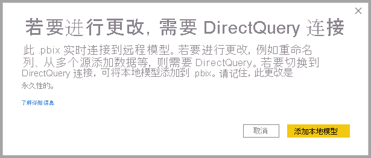
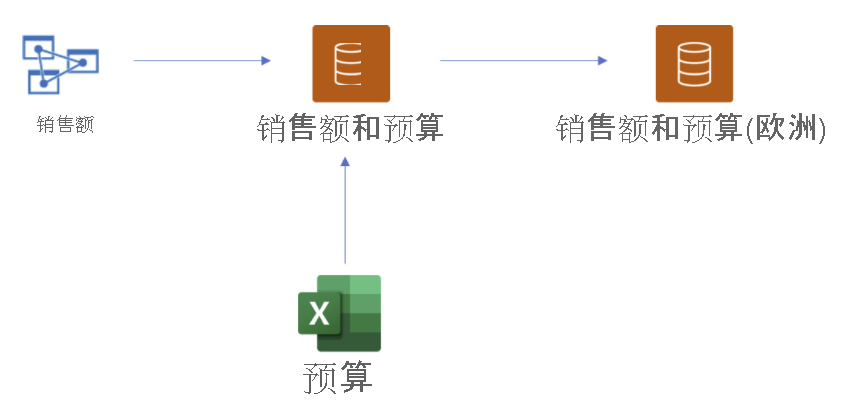
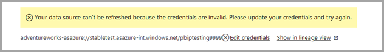
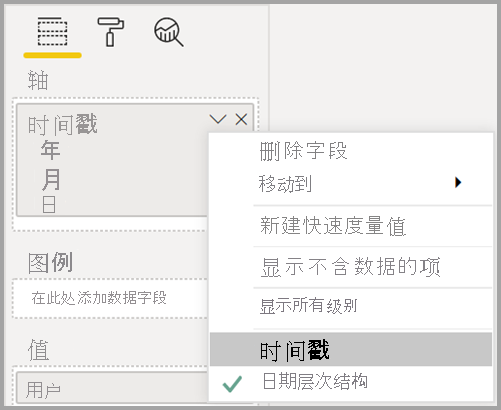

# 使用适用于 Power BI 数据集和 Azure Analysis Services 的 DirectQuery（预览版）

通过适用于 Power BI 数据集和 Azure Analysis Services (AAS) 的 DirectQuery，你可以使用 DirectQuery 连接到 AAS 或 Power BI 数据集，并根据需要将其与其他 DirectQuery 和导入的数据合并。 如果报表作者想要将其企业语义模型中的数据与他们所拥有的其他数据（如 Excel 电子表格）组合在一起，或者要从其企业语义模型中个性化或丰富元数据，将会发现此功能特别有用。

## 启用预览功能

由于此功能目前处于预览阶段，因此你必须首先启用它。 为此，请在 Power BI Desktop 中转到“文件”>“选项和设置”>“选项”，然后在“预览功能”部分，选中“适用于 Power BI 数据集和 Analysis Services 的 DirectQuery”复选框来启用此预览功能。 可能需要重新启动 Power BI Desktop 以使更改生效。

## 使用 DirectQuery 进行实时连接

使用适用于 Power BI 数据集和 Azure Analysis Services 的 DirectQuery 要求报表具有本地模型。 可以从实时连接开始，添加或升级到本地模型，或从 DirectQuery 连接或导入数据开始，这将自动在报表中创建本地模型。

若要查看模型中正在使用哪些连接，请查看 Power BI Desktop 右下角的状态栏。 如果你只连接到 Azure Analysis Services 源，则会看到如下所示的消息：

如果连接到 Power BI 数据集，则会看到一条消息，告诉你连接到哪些 Power BI 数据集：

如果要自定义实时连接数据集中的字段元数据，请在状态栏中选择“对此模型进行更改”。 或者，也可以单击功能区中的“对此模型进行更改”按钮，如下图所示。 在“报表视图”中，“对此模型进行更改”按钮在“建模”选项卡中。在“模型视图”中，此按钮位于“主页”选项卡中。

选择该按钮会显示一个对话框，用于确认是否添加了本地模型。 选择“添加本地模型”，以便为 Power BI 数据集或 Azure Analysis Services 中的字段创建新列或修改元数据。 下图显示了出现的对话框。 

当你实时连接到 Analysis Services 源时，没有本地模型。 若要将 DirectQuery 用于实时连接的源（如 Power BI 数据集和 Azure Analysis Services），则必须将本地模型添加到报表。 将具有本地模型的报表发布到 Power BI 服务时，还会发布该本地模型的数据集。

## 链接

数据集，以及它们所基于的数据集和模型构成一个链。 此过程称为“链接”，使你可以基于其他 Power BI 数据集发布报表和数据集（以前无法实现该功能）。

例如，假设你的同事发布了一个名为“销售和预算”的 Power BI 数据集，该数据集基于名为“销售”的 Azure Analysis Services 模型，并将其与名为“预算”的 Excel 工作表结合起来。

在你基于同事发布的“销售和预算”Power BI 数据集发布名为“销售和预算(欧洲)”的新报表（和数据集）时，在此过程中进行进一步的修改或扩展，可以将报表和数据集有效地添加到长度为 3 的链，该链从“销售”Azure Analysis Services 模型开始，并以“销售和预算(欧洲)” Power BI 数据集结束。 下图显示了此链接过程。

上图中的链长度为 3，这是此预览期间的最大长度。 不支持超出 3 的链长度，这会导致错误。

## 安全警告

使用“适用于 Power BI 数据集和 Azure Analysis Services (AAS) 的 DirectQuery”功能将显示一个安全警告对话框，如下图所示。

数据可以从一个数据源推送到另一个数据源，这是在数据模型中组合 DirectQuery 和导入源的相同安全警告。 若要了解有关此行为的详细信息，请参阅[使用 Power BI Desktop 中的复合模型](../transform-model/desktop-composite-models.md)。

## 要尝试的功能和方案

以下列表提供了有关如何自行探索“适用于 Power BI 数据集和 Azure Analysis Services (AAS) 的 DirectQuery”的建议：

- 连接到不同源中的数据：导入（如文件）、Power BI 数据集、Azure Analysis Services
- 创建不同数据源之间的关系
- 编写使用不同数据源中的字段的度量值
- 为 Azure Analysis Services 的 Power BI 数据集中的表创建新列
- 创建使用不同数据源中的列的视觉对象

## 注意事项和限制

在使用“适用于 Power BI 数据集和 Azure Analysis Services (AAS) 的 DirectQuery”时，需要注意几个注意事项：

- 如果在刷新数据源时出现字段或表名冲突的错误，Power BI 将为你解决这些错误。

- 若要在 Power BI 服务中基于另一个数据集的复合模型上生成报表，必须设置所有凭据。 在刷新凭据设置页上，即使已设置凭据，对于 Azure Analysis Services 源，也将显示以下错误：
    
    
- 因为这令人困惑且不正确，我们很快会处理这个问题。

- RLS 规则将应用于定义它们的源，但不会应用于模型中的任何其他数据集。 报表中定义的 RLS 不会应用于远程源，远程源上设置的 RLS 不会应用于其他数据源。

- 在此预览版本中，不会从源导入显示文件夹、KPI、日期表、行级别安全性和翻译。 你仍可以在本地模型中创建显示文件夹。

- 使用日期层次结构时，可能会出现一些意外行为。 若要解决此问题，请改用日期列。 将日期层次结构添加到视觉对象后，可以通过单击字段名称中的向下箭头，然后单击该字段的名称来切换到日期列，而不是使用日期层次结构：

    

    有关使用日期列与日期层次结构的详细信息，请参阅此文。

- 将 AI 功能与具有到 Azure Analysis Services 的 DirectQuery 连接的模型一起使用时，可能会看到无用的错误消息。 

- 将 ALLSELECTED 与 DirectQuery 源结合使用将导致结果不完整。

- 筛选器和关系：
    - 只能对单个列设置从数据源应用于其他 DirectQuery 源的表的筛选器

    - 不建议使用源外部的表来筛选 DirectQuery 源中的两个表从而实现交叉筛选，也不支持这种设计。

    - 筛选器只能一次接触一个表。 不支持通过 DirectQuery 源外的其中一个表对某表应用相同筛选器两次。

- 在预览期间，模型链的最大长度为 3。 不支持超出 3 的链长度，这会导致错误。 

- 使用第三方工具，可以在模型上设置“阻止链接”标志，以防止创建或扩展链。 若要设置该标志，请在模型上查找“DiscourageCompositeModels”属性。 

还需要注意几个限制：

- 当前禁用了数据库和服务器名称的参数。 

- 不支持从远程源定义表中的 RLS。

- 当前不支持使用 SQL Server Analysis Services (SSAS) 作为 DirectQuery 源。 

- 当前不支持在“我的工作区”中对数据集使用 DirectQuery。 

- 当前不支持删除到使用 DirectQuery 的远程源的连接。

- 当前不支持将 Power BI Embedded 和包含与 Power BI 数据集或 Azure Analysis Services 模型的 DirectQuery 连接的数据集配合使用。

- 远程源中列和度量值的格式字符串不会导入到复合模型中。

- 不支持远程源上的计算组，其中包含未定义的查询结果。

- 如果计算表和远程源中的表之间存在关系，则某些查询可能会返回错误结果。 不支持通过远程数据集创建计算表，虽然当前未在接口中阻止。

- 目前不支持按列排序。

- 只有某些情况下才支持自动页面刷新 (APR)，具体取决于数据源类型。 有关详细信息，请参阅 [Power BI 中的自动页面刷新](../create-reports/desktop-automatic-page-refresh.md)。

## 后续步骤

有关 DirectQuery 的详细信息，请查看以下资源：

- [在 Power BI Desktop 中使用 DirectQuery](desktop-use-directquery.md)
- [Power BI Desktop 中的 DirectQuery 模型](desktop-directquery-about.md)
- [Power BI Desktop 中的 DirectQuery 模型指导](../guidance/directquery-model-guidance.md)
- 是否有任何问题? [尝试咨询 Power BI 社区](https://community.powerbi.com/)
