# <a name="dynamic-m-query-parameters-in-power-bi-desktop-preview"></a>Power BI Desktop 中的动态 M 查询参数（预览）

利用动态 M 查询参数，模型作者可以让报表查看器使用筛选器或切片器来设置 [M 查询参数](/power-query/power-query-query-parameters)的值，这对于查询性能优化特别有用。 利用动态 M 查询参数，模型作者可以更进一步地控制筛选器选项合并到 DirectQuery 源查询的方式。 

当模型作者理解其筛选器的预期语义时，他们通常知道如何针对其数据源编写高效的查询，以此确保筛选器选项在适当的位置合并到源查询中，以获得预期结果并提高性能。

## <a name="enabling-dynamic-m-query-parameters"></a>启用动态 M 查询参数

动态 M 查询参数当前为预览版，并且必须启用才能使用。 转到“文件”>“选项和设置”>“选项”，然后选择左侧窗格中的“预览功能”。 在此处，请确保“动态 M 查询参数”复选框已选中。 需要重新启动 Power BI Desktop 以启用更改。

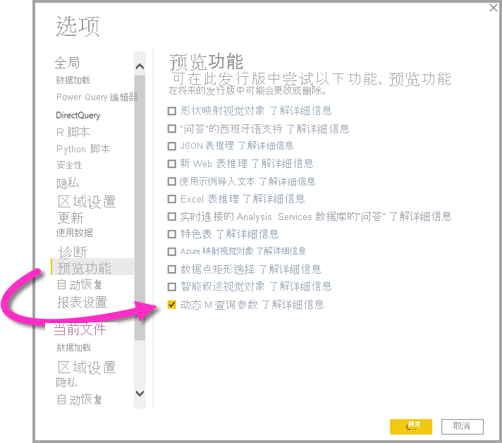

作为此功能的先决条件，必须在一个或多个“直接查询”表中创建并引用一个有效的 [M 查询参数](/power-query/power-query-query-parameters)。 

> [!NOTE]
> 请务必查看本文的[注意事项和限制](#considerations-and-limitations)部分，因为并非所有 DirectQuery 源都受此功能支持。

让我们通过一个示例来逐步了解如何将单个值动态传递给参数：

1. 在 Power BI Desktop 中，在“数据”选项卡中启动“Power Query”，然后在功能区中的“管理参数”按钮下选择“新参数”。

    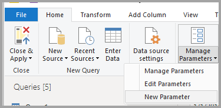

2. 然后填写有关参数的以下信息。

    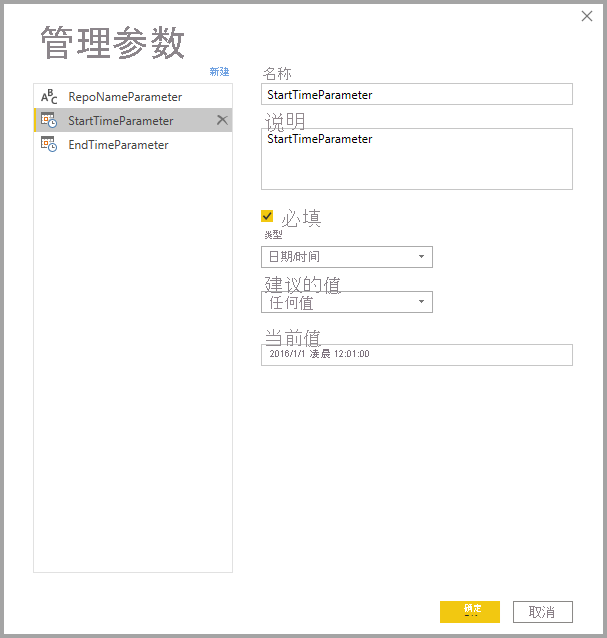

3. 如果要添加更多参数，请再次单击“新建”。

    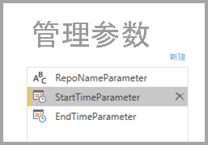

4. 创建参数后，便可以在 M 查询中引用它们。 若要修改 M 查询，请在选择要修改的查询的同时打开高级编辑器：

    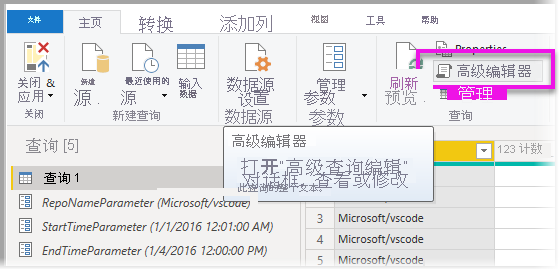

5. 接下来，引用 M 查询中的参数，在下图中以黄色突出显示。 

    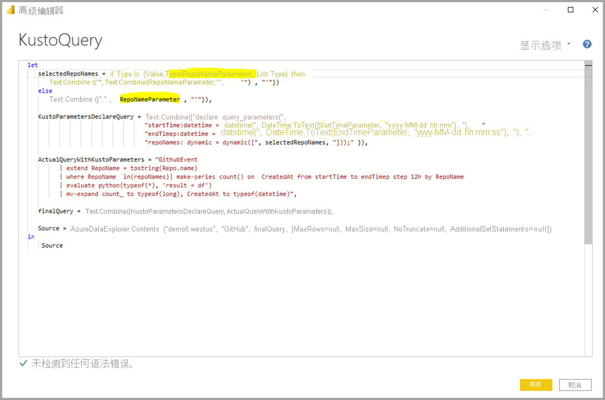

6. 现在，你已创建了参数并在 M 查询中引用了它们，接下来，你需要创建一个表，其中的列提供可用于该参数的可能值。 这将允许根据筛选器选项动态设置参数。 在此示例中，我们希望 StartTime 参数和 EndTime 参数是动态的。 由于这些参数需要日期/时间参数，因此我想要生成可用于设置参数日期的日期输入。 首先，我们创建一个新表：

    

7. 下面是我为 StartTime 参数的值创建的第一个表：

    ```StartDateTable = CALENDAR (DATE(2016,1,1), DATE(2016,12,31))```

    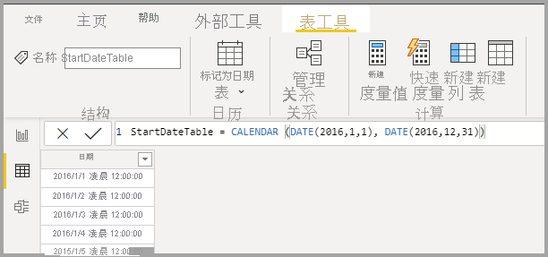

8. 下面是我为 EndTime 参数的值创建的第二个表：

    ```EndDateTable = CALENDAR (DATE(2016,1,1), DATE(2016,12,31))```

    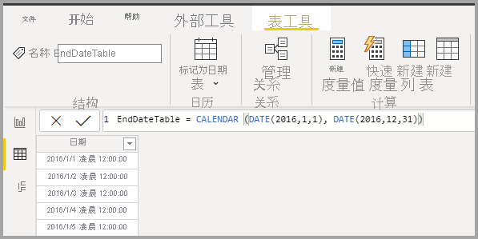

    > [!NOTE]
    > 我们建议使用不在实际表中的其他列名称。 如果它们的名称相同，则所选值将作为筛选器应用于实际查询。

9. 现在，已创建包含日期字段的表，接下来可以将每个字段绑定到一个参数。 将字段绑定到参数实质上意味着，当选定的字段值发生更改时，该值将传递给参数，并更新引用该参数的查询。 因此，若要绑定字段，请转至“建模”选项卡，选择新创建的字段，然后转至“高级”属性：

    > [!NOTE]
    > 列数据类型应与 M 参数类型匹配。

    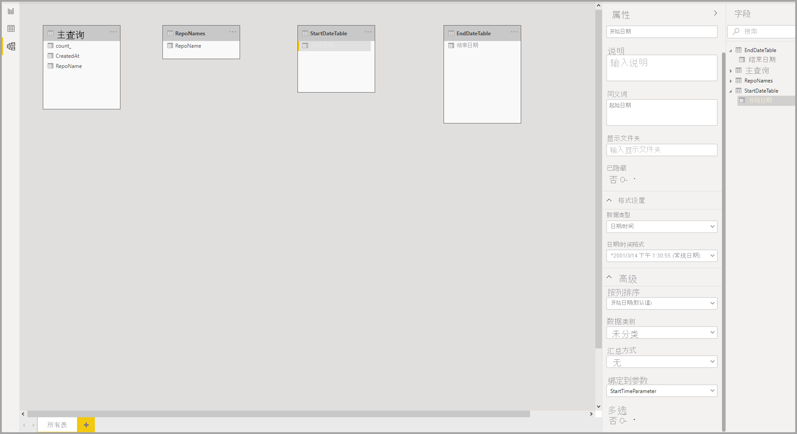

10. 选择“绑定到参数”下的下拉列表，然后选择要绑定到字段的参数：

    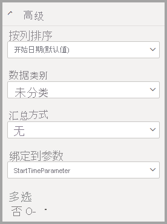

    由于本示例适用于单选值（将参数设置为单个值），因此需要将“多选”设置为“否”，这是默认值：

    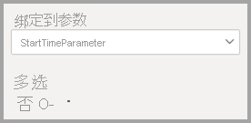

    如果用例需要多重选择（向单个参数传递多个值），则必须将开关切换到“是”，并确保 M 查询正确设置为接受 M 查询中的多个值。 下面是 RepoNameParameter 的一个示例，它允许多个值：

    

11. 如果有要绑定到其他参数的其他字段，可以重复这些步骤：

    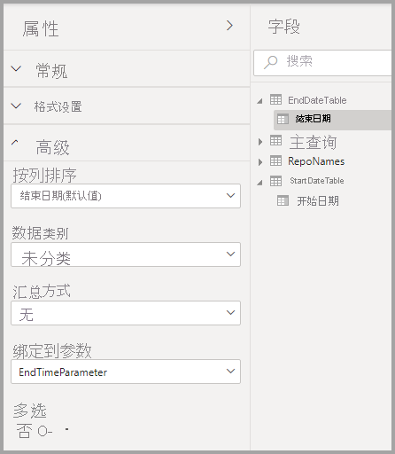

12. 最后，可以在切片器中引用此字段或将其用作筛选器：

    

如果已映射的列针对多选设置为“否”，则必须在切片器中使用单选模式，或需要在筛选器卡中进行单项选择。

## <a name="potential-security-risk"></a>潜在安全风险

如果允许报表读取者动态设置 M 查询参数的值，则他们可能利用注入攻击访问其他数据或触发对源系统的修改，具体取决于参数在 M 查询中的引用方式，以及传递给该参数的值。

例如，假设你有一个参数化的 Kusto 查询，其构造如下：

```
Products
| where Category == [Parameter inserted here] & HasReleased == 'True'
 | project ReleaseDate, Name, Category, Region```
```

对于为参数传递适当值的正常用户，可能没有任何问题，例如，Games：

```
| where Category == 'Games' & HasReleased == 'True'
```

但是，攻击者可能会传递一个值，用于修改查询以获取对更多数据的访问权限，例如，'Games' //：

```
Products
| where Category == 'Games'// & HasReleased == 'True'
| project ReleaseDate, Name, Category, Region
```

在此示例中，攻击者可以通过将部分查询更改为注释来访问尚未发布的游戏的信息。

**如何缓解风险**

为了缓解安全风险，最好避免在查询中 M 参数值的字符串串联。  相反，在 M 操作中使用这些参数值，并折叠到源查询，以便 M 引擎和连接器构造最终查询。 或者，使用内置于源查询语言和连接器的参数传递机制（如果可用）。 例如，[Azure 数据资源管理器](/azure/data-explorer/kusto/query/queryparametersstatement?pivots=azuredataexplorer)具有用于防御注入攻击的内置查询参数功能。

下面是一些示例：

* 使用 M 查询的筛选操作的示例：
    ```
    Table.SelectRows(Source, (r) =\&gt; r[Columns] = Parameter)
    ```

* 声明源查询中的参数的示例（或将参数值作为输入传递到源查询函数）：
    ```
    declare query\_parameters (Name of Parameter : Type of Parameter);
    ```

## <a name="considerations-and-limitations"></a>注意事项和限制

使用动态 M 查询参数时，需要考虑以下注意事项和限制：

* 单个参数不能绑定到多个字段，反之亦然。
* 仅基于 M 的数据源支持此功能。 不支持以下 DirectQuery 源：
    * 基于 T-SQL 的数据源：SQL Server、Azure SQL 数据库、Synapse SQL 池（也称为 Azure SQL 数据仓库）和 Synapse SQL OnDemand 池
    * Live Connect 数据源：Azure Analysis Services、SQL Server Analysis Services 和 Power BI 数据集
    * 其他不受支持的数据源：Oracle、Teradata 和关系 SAP Hana
    * 通过 XMLA/TOM 终结点可编程性得到部分支持：SAP BW 和 SAP Hana 


* 以下是不受支持的现成参数类型：
  * 任意
  * Duration
  * True/False
  * 二进制

* 不受支持的筛选器：
  * 相对时间切片器或筛选器
  * 相对日期
  * 层次结构切片器
  * 多字段包含筛选器
  * 排除筛选器/非筛选器
  * 交叉突出显示
  * 向下钻取筛选器
  * 交叉钻取筛选器
  * 前 N 个筛选器
* 不支持的操作：
  * 且
  * 包含
  * 小于
  * 大于
  * 开头为
  * 开头不为
  * 不是
  * 不包含
  * 全选
  * 为空白
  * 不为空白


## <a name="next-steps"></a>后续步骤

可以使用 Power BI Desktop 执行各种操作。 有关其功能的详细信息，请参阅下列资源：

* [关于在 Power BI 中使用 DirectQuery](desktop-directquery-about.md)
* [什么是 Power BI Desktop？](../fundamentals/desktop-what-is-desktop.md)
* [Power BI Desktop 的查询概述](../transform-model/desktop-query-overview.md)
* [Power BI Desktop 中的数据类型](desktop-data-types.md)
* [使用 Power BI Desktop 成型和合并数据](desktop-shape-and-combine-data.md)
* [Power BI Desktop 中的常见查询任务](../transform-model/desktop-common-query-tasks.md)