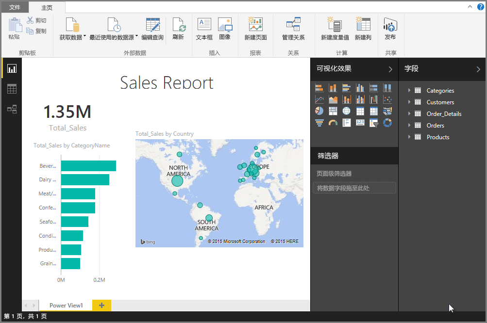

# 将 Excel 工作簿导入 Power BI Desktop
通过 Power BI Desktop，你可以轻松地将包含 Power Query 查询、Power Pivot 模型和 Power View 工作表的 Excel 工作簿导入到 Power BI Desktop。 Power BI Desktop 可基于 Excel 工作簿自动创建报表和可视化效果。 导入后，可以使用 Power BI Desktop 的现有功能及其每月更新的新功能继续改进和优化这些报表。

## 如何导入 Excel 工作簿？
1. 若要将 Excel 工作簿导入到 Power BI Desktop，请选择“文件” > “导入” > “Power Query、Power Pivot 和 Power View”  。

   

2. 从“打开”窗口中，选择要导入的 Excel 工作簿。 

   目前对于工作簿中对象的数量和大小没有限制，但在 Power BI Desktop 中分析和导入较大的工作簿会花费更长的时间。

   > [!NOTE]
   > 若要从共享 OneDrive for Business 文件夹或 Microsoft 365 组文件夹加载或导入 Excel 文件，请使用 Excel 文件的 URL，并将其输入到 Power BI Desktop 中的 Web 数据源。 需要遵循几个步骤来正确为 OneDrive for Business URL 设置格式；有关信息和正确的一系列步骤，请参阅[在 Power BI Desktop 中使用 OneDrive for Business 链接](desktop-use-onedrive-business-links.md)。
   > 
   > 

3. 从出现的“导入”对话框中，选择“启动”。

   

   Power BI Desktop 将分析该工作簿并将其转换为 Power BI Desktop 文件 (.pbix)。 该操作只执行一次；通过这些步骤创建 Power BI Desktop 文件之后，Power BI Desktop 文件将独立于原始 Excel 工作簿，且可在不影响原始工作簿的情况下修改、保存和共享 Power BI Desktop 文件。

   导入完成后，将出现“摘要”页，其中描述了已转换项目且还列出了不能导入的所有项目。

   

4. 选择“关闭”。 

   Power BI Desktop 会导入 Excel 工作簿并加载基于工作簿内容的报表。

   

导入工作簿后，可以继续处理报表。 你可以通过使用 Power BI Desktop 中包含的任何特性和功能来创建新的可视化效果、添加数据或创建新的报表页。

## 导入了工作簿中的哪些元素？
Power BI Desktop 可导入以下元素，在 Excel 中通常称为 *对象*。

| Excel 工作簿中的对象 | Power BI Desktop 文件中的最终结果 |
| --- | --- |
| Power Query 查询 |Excel 中的所有 Power Query 查询都会转换为 Power BI Desktop 中的查询。 如果 Excel 工作簿中已定义查询组，则将在 Power BI Desktop 中复制相同组织。 除非在“导入数据”Excel 对话框中将所有查询设置为“仅创建连接”，否则将加载所有查询 。 从 Power BI Desktop 中的 Power Query Editor“主页”选项卡中选择“属性”，可自定义加载行为 。 |
| Power Pivot 外部数据连接 |所有 Power Pivot 外部数据连接都转换为 Power BI Desktop 中的查询。 |
| 链接表或当前工作簿表 |如果 Excel 中有工作表数据表链接到数据模型或链接到查询（通过使用“从表格”或 M 中的“Excel.CurrentWorkbook()”函数），将显示下列选项 ： <ol><li><b>将表导入到 Power BI Desktop 文件</b>。 该表是数据的一次性快照，此后数据在 Power BI Desktop 中的表中为只读。 使用此选项创建的表有大小限制，字数上限为 100 万个字符（总数，包括所有列标题和单元格）。</li><li><b>保持与原始工作簿的连接</b>。 你还可以保留与原始 Excel 工作簿的连接，Power BI Desktop 每次刷新时都会检索表中的最新内容，就像在 Power BI Desktop 中针对 Excel 工作簿创建的其他查询一样。</li></ul> |
| 数据模型计算列、度量值、KPI、数据类别和数据关系 |这些数据模型对象将转换为 Power BI Desktop 中的等效对象。 注意：某些数据类别在 Power BI Desktop 中不可用，例如图像。 在这些情况下，将对有问题的相关列重置数据类别信息。 |
| Power View 工作表 |为每个 Power View Excel 工作表创建新报表页。 报表的名称和报表页面顺序与原始 Excel 工作簿匹配。 |

## 导入工作簿是否有任何限制？
将工作簿导入到 Power BI Desktop 存在下面一些限制：

* **与 SQL Server Analysis Services 表格模型的外部连接：** 在 Excel 2013 中，无需导入数据就可创建与 SQL Server Analysis Services 表格模型的连接，并在这些模型之上创建 Power View 报表。 目前不支持使用这种连接类型将 Excel 工作簿导入到 Power BI Desktop。 解决方法是，必须在 Power BI Desktop 中重新建立这些外部连接。
* **层次结构：** Power BI Desktop 目前不支持这种数据模型对象类型。 因此，将 Excel 工作簿导入到 Power BI Desktop 时会略过层次结构。
* **二进制数据列：** Power BI Desktop 目前不支持这种数据模型列类型。 已从 Power BI Desktop 中的结果表中删除二进制数据列。
* **不支持的 Power View 元素：** Power BI Desktop 目前尚未提供 Power View 中的一些功能，例如布景主题或特定可视化效果类型（具有播放轴的散点图、向下钻取行为等）。 这些不支持的可视化效果会导致在 Power BI Desktop 报表中的对应位置出现 *可视化效果不受支持* 的消息，你可以根据需要删除或重新配置。
* 使用 Power Query 中的“从表”或使用 M 中的“Excel.CurrentWorkbook”的命名范围： ***_ _*** ***_ _*** 目前不支持将此名称范围数据导入到 Power BI Desktop，但已计划此更新。 目前，这些名称范围会当做外部 Excel 工作簿的连接，加载到 Power BI Desktop。
* **PowerPivot 至 SSRS：** 由于 Power BI Desktop 目前不提供该数据源，因此目前不支持到 SQL Server Reporting Services (SSRS) 的 PowerPivot 外部连接。

