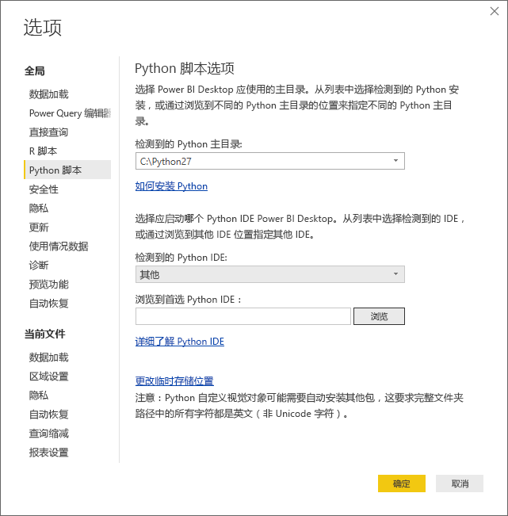
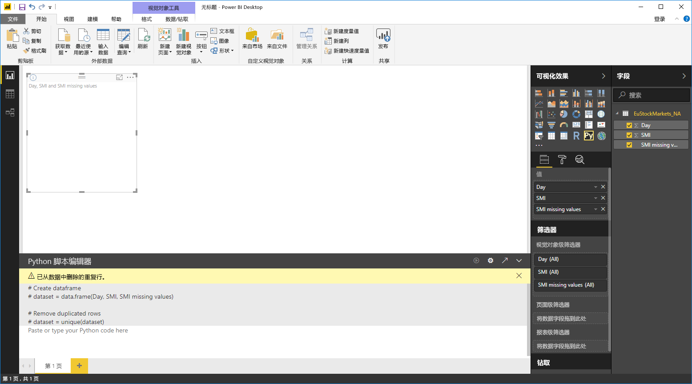

# 将外部 Python IDE 与 Power BI 一起使用
借助 Power BI Desktop，可以使用外部的 Python IDE（集成开发环境）创建并优化 Python 脚本，然后将这些脚本用于 Power BI 中。

## 启用外部 Python IDE
可以从 Power BI Desktop 启动外部 Python IDE，然后自动导入数据并显示在 Python IDE 中。 之后，可以修改此外部 Python IDE 中的脚本，然后将其重新粘贴至 Power BI Desktop 中来创建 Power BI 视觉对象和报表。

可以指定要使用哪个 Python IDE，并从 Power BI Desktop 自动启动该 Python IDE。

### 要求
要使用此功能，需要在本地计算机上安装 Python IDE。 Power BI Desktop 不包含 Python 引擎，也不部署和安装该引擎，因此必须在本地计算机上单独安装 Python。 通过以下选项，你可以选择使用哪个 Python IDE：

* 你可以安装最喜欢的 Python IDE，其中大部分都是免费的，例如 [Visual Studio Code 下载页](https://code.visualstudio.com/download/)。
* Power BI Desktop 还支持 Visual Studio。
* 此外，还可以安装不同的 Python IDE，并通过执行以下任一操作，使 Power BI Desktop 启动相应 Python IDE：
  
  * 可以将 .PY 文件与 Power BI Desktop 要启动的外部 IDE 相关联。
  * 通过从“选项”对话框的“Python 脚本选项”部分中选择“其他”，你可以指定 Power BI Desktop 应启动的 .exe。 通过转到 **“文件”>“选项和设置”>“选项”** ，你可以打开“**选项**”对话框。
    
    

如果安装了多个 Python IDE，则通过在“选项”对话框的“检测到的 Python IDE”下拉列表中进行选择就可以指定要启动哪个 Python IDE。

默认情况下，Power BI Desktop 将启动 Visual Studio Code 作为外部 Python IDE（如果它已安装在本地计算机上）；如果未安装 Visual Studio Code，而是安装了 Visual Studio，则将启动 Visual Studio。 如果这些 Python IDE 均未安装，则将启动与 .PY 文件关联的应用程序。

如果 .PY 文件不存在任何关联，则可以在“选项”对话框的“浏览到你的首选 Python IDE”部分中指定自定义 IDE 的路径。 通过选择 Power BI Desktop 中“启动 Python IDE”箭头图标旁边的“设置”齿轮图标，你还可以启动不同的 Python IDE。

## 通过 Power BI Desktop 启动 Python IDE
要通过 Power BI Desktop 启动 Python IDE，请执行以下步骤：

1. 将数据加载至 **Power BI Desktop**。
2. 从“**字段**”窗格选择要使用的字段。 如果尚未启用脚本视觉对象，则会提示你完成此操作。
   
   
3. 启用脚本视觉对象后，可以从“可视化效果”窗格中选择 Python 视觉对象，此操作将创建空白的 Python 视觉对象来显示脚本结果。 同时也会显示“Python 脚本编辑器”窗格。
   
   
4. 现在你可以选择要用于 Python 脚本的字段。 选择字段后，“Python 脚本编辑器”字段会基于所选的一个或多个字段自动创建脚本代码。 可在“Python 脚本编辑器”窗格中直接创建（或粘贴）Python 脚本，也可将其留空。
   
   
   
   > [!NOTE]
   > Python 视觉对象的默认聚合类型是“不汇总”。
   > 
   > 
5. 现在可以直接从 Power BI Desktop 中启动 Python IDE。 如下图所示，从“Python 脚本编辑器”标题栏的右侧找到并选中“启动 Python IDE”按钮。
   
   
6. 如下图所示，Power BI Desktop 将启动特定的 Python IDE（在该图中，Visual Studio Code 是默认 Python IDE）。
   
   
   
   > [!NOTE]
   > Power BI Desktop 会添加脚本的前三行，这样一旦运行该脚本，就可以从 Power BI Desktop 中导入数据。
   > 
   > 
7. 在 Power BI Desktop 的“Python 脚本编辑器”窗格中创建的任何脚本都会从 Python IDE 的第 4 行开始显示。 此时，可在 Python IDE 中自行创建 Python 脚本。 在 Python IDE 中完成 Python 脚本后，必须将其复制并重新粘贴至 Power BI Desktop 的“Python 脚本编辑器”窗格中，注意不包括 Power BI Desktop 自动生成的前三行脚本。 请勿将脚本的前三行复制到 Power BI Desktop，这三行仅用于将数据从 Power BI Desktop 导入到 Python IDE。

### 已知限制
直接从 Power BI Desktop 中启动 Python IDE 具有部分限制：

* 不支持自动将脚本从 Python IDE 中导出到 Power BI Desktop。

## 后续步骤
查看以下更多信息，了解有关 Power BI 中的 Python。

* [在 Power BI Desktop 中运行 Python 脚本](desktop-python-scripts.md)
* [使用 Python 创建 Power BI 视觉对象](desktop-python-visuals.md)

