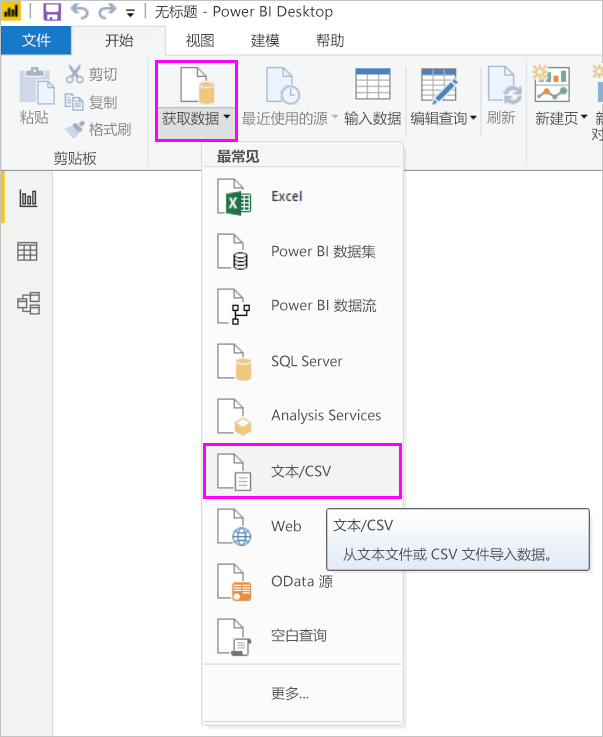
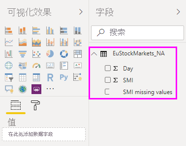
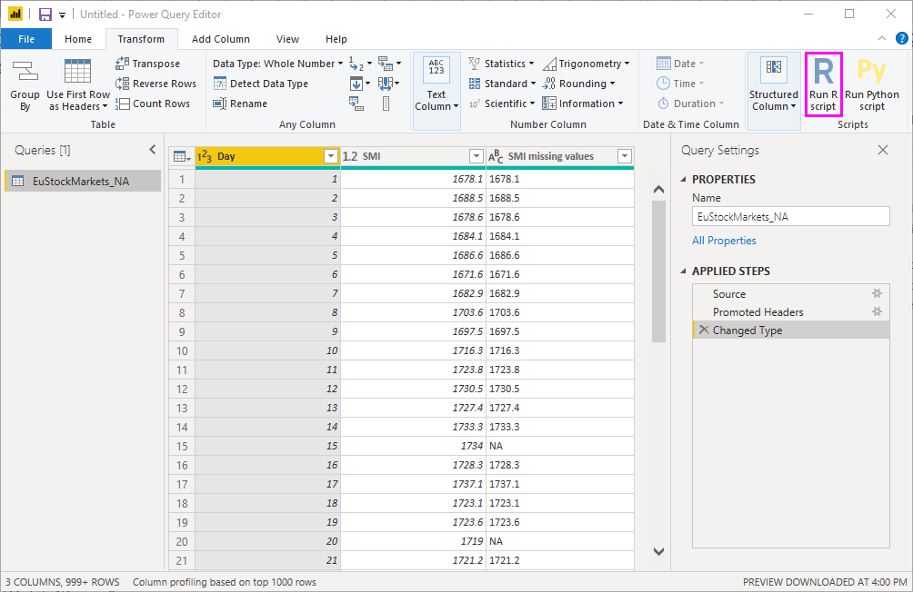
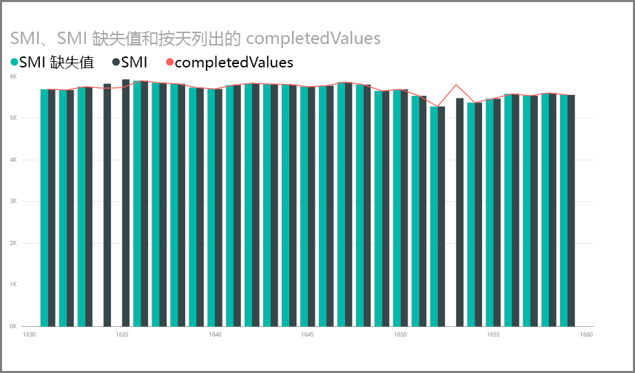
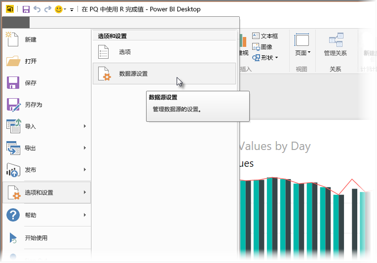
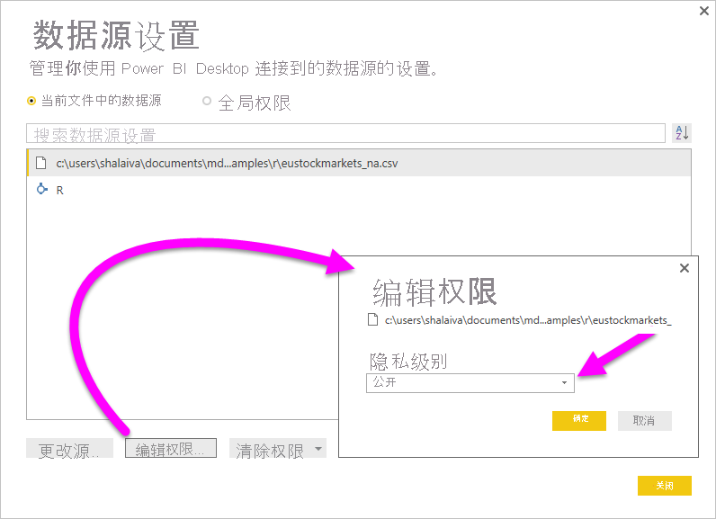

# <a name="use-r-in-power-query-editor"></a>在 Power Query 编辑器中使用 R

[R 语言](https://mran.microsoft.com/documents/what-is-r)是一种功能强大的编程语言，许多统计学家、数据科学家和数据分析师都在使用。 可以在 Power BI Desktop 的 Power Query 编辑器中使用 R 来执行以下操作：

* 准备数据模型。

* 创建报表。

* 进行数据清理、高级数据定形和数据集分析，包括缺失数据补全、预测、聚类分析等。  

## <a name="install-r"></a>安装 R

可以从 [Revolution R Open 下载页](https://mran.revolutionanalytics.com/download/)以及 [CRAN 存储库](https://cran.r-project.org/bin/windows/base/)免费下载 R。

## <a name="install-mice"></a>安装 mice

作为先决条件，必须在 R 环境中安装 [mice 库](https://www.rdocumentation.org/packages/mice/versions/3.5.0/topics/mice)。 没有 mice，示例脚本代码无法正常运行。 mice 包实现了一种处理缺失数据的方法。

若要安装 mice 库，请执行以下操作：

1. 启动 R.exe 程序（例如 C:\Program Files\Microsoft\R Open\R-3.5.3\bin\R.exe）。  

2. 从 R 提示符运行安装命令：

   ``` 
   install.packages('mice') 
   ```

## <a name="use-r-in-power-query-editor"></a>在 Power Query 编辑器中使用 R

为演示在 Power Query 编辑器中使用 R，我们将使用 .csv 文件中包含的示例股票市场数据集，并完成以下步骤：

1. [下载 EuStockMarkets_NA.csv 文件](https://download.microsoft.com/download/F/8/A/F8AA9DC9-8545-4AAE-9305-27AD1D01DC03/EuStockMarkets_NA.csv)。 记下此文件的保存位置。

1. 将文件加载至 Power BI Desktop。 从“开始”选项卡中，选择“获取数据” > “文本/CSV”    。

   

1. 选择 EuStockMarkets_NA.csv 文件，然后选择“打开”  。 CSV 数据显示在“文本/CSV 文件”对话框中  。

   

1. 选择“加载”以从文件加载数据  。 Power BI 加载数据后，新表将显示在“字段”窗格中  。

   

1. 若要打开 Power Query 编辑器，请在“主页”功能区中选择“编辑查询”   。

   

1. 在“转换”选项卡中，选择“运行 R 脚本”   。 随即显示“运行 R 脚本”编辑器  。 第 15 行和第 20 行包含缺失的数据，图像中没有显示的其他行也是。 以下步骤介绍 R 如何为你补全这些行。

   

1. 对于本示例，请在“运行 R 脚本”窗口的“脚本”框中输入以下脚本代码   。 将&lt;你的文件路径&gt;替换为本地文件系统上的 EuStockMarkets_NA.csv 路径，例如 C:/Users/John Doe/Documents/Microsoft/EuStockMarkets_NA.csv  。

    ```r
       dataset <- read.csv(file="<Your File Path>/EuStockMarkets_NA.csv", header=TRUE, sep=",")
       library(mice)
       tempData <- mice(dataset,m=1,maxit=50,meth='pmm',seed=100)
       completedData <- complete(tempData,1)
       output <- dataset
       output$completedValues <- completedData$"SMI missing values"
    ```

    > [!NOTE]
    > 可能需要覆盖名为“输出”的变量才能正确地创建应用了筛选器的新数据集  。

7. 选择“确定”。  Power Query 编辑器将显示与数据隐私相关的警告。

   
8. 在警告消息中，选择“继续”  。 在出现的“隐私级别”对话框中，将“所有数据源”设置为“公共”，以便 R 脚本在 Power BI 服务中正常工作   。 

   

   有关隐私设置及其含义的详细信息，请参阅 [Power BI Desktop 隐私级别](../admin/desktop-privacy-levels.md)。

 9. 选择“保存”以运行脚本  。 

   请注意“字段”  窗格中的名为 completedValues  的新列。 此列缺失一些数据元素，如第 15 行和第 18 行。 下一节中将介绍 R 如何处理该问题。

   仅用 5 行 R 脚本，Power Query 编辑器便可通过预测模型填充缺失的值。

## <a name="create-visuals-from-r-script-data"></a>根据 R 脚本数据创建视觉对象

现在，我们可以创建一个视觉对象，查看带有 mice 库的 R 脚本代码如何补全缺失的值。



可以将所有已完成的视觉对象保存在一个 Power BI Desktop .pbix 文件中，并在 Power BI 服务中使用数据模型及其 R 脚本。

> [!NOTE]
> 完成所有步骤后，可以[下载一个 .pbix 文件](https://download.microsoft.com/download/F/8/A/F8AA9DC9-8545-4AAE-9305-27AD1D01DC03/Complete%20Values%20with%20R%20in%20PQ.pbix)。

将 .pbix 文件上传到 Power BI 服务后，需要采取其他步骤来启用服务数据刷新和更新后的视觉对象：  

* **为数据集启用计划的刷新**：若要为包含数据集和 R 脚本的工作簿启用计划的刷新，请参阅[配置计划的刷新](refresh-scheduled-refresh.md)。 本文还包含有关个人网关的信息。

* **安装个人网关**：需要在文件和 R 所在的计算机上安装个人网关。 Power BI 服务访问该工作簿并重新呈现所有更新后的视觉对象。 有关详细信息，请参阅[在 Power BI 中使用个人网关](service-gateway-personal-mode.md)。

## <a name="limitations"></a>限制

对包括 R 脚本，在 Power Query 编辑器中创建的查询有一些限制：

* 所有 R 数据源设置都必须设置为“公开”  。 Power Query 编辑器查询中的其他所有步骤也必须是公开的。 

   若要获取数据源设置，请在 Power BI Desktop 中选择“文件” > “选项和设置” > “数据源设置”    。

   

   在“数据源设置”对话框中，选择一个或多个数据源，然后选择“编辑权限”   。 将“隐私级别”设置为“公开”   。

     
  
* 若要计划 R 视觉对象或数据集的刷新，需要启用“计划刷新”，并且在包含工作簿和 R 的计算机上安装个人网关。 

可以使用 R 和自定义查询执行各种操作。 以希望的方式显示数据以浏览和调整。

## <a name="next-steps"></a>后续步骤

* [R 简介](https://mran.microsoft.com/documents/what-is-r) 

* [在 Power BI Desktop 中运行 R 脚本](desktop-r-scripts.md) 

* [将外部 R IDE 与 Power BI 一起使用](desktop-r-ide.md) 

* [在 Power BI 服务中使用 R 包创建视觉对象](service-r-packages-support.md)
