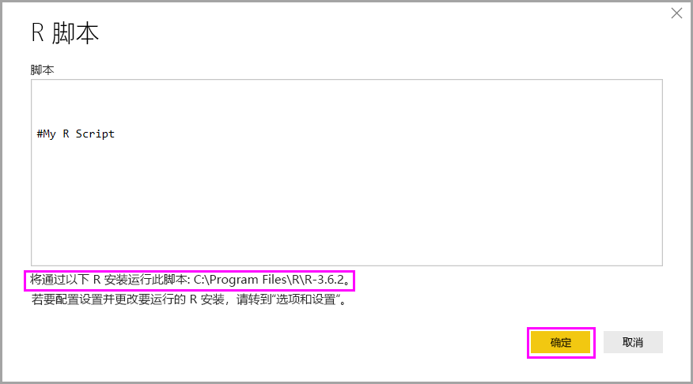
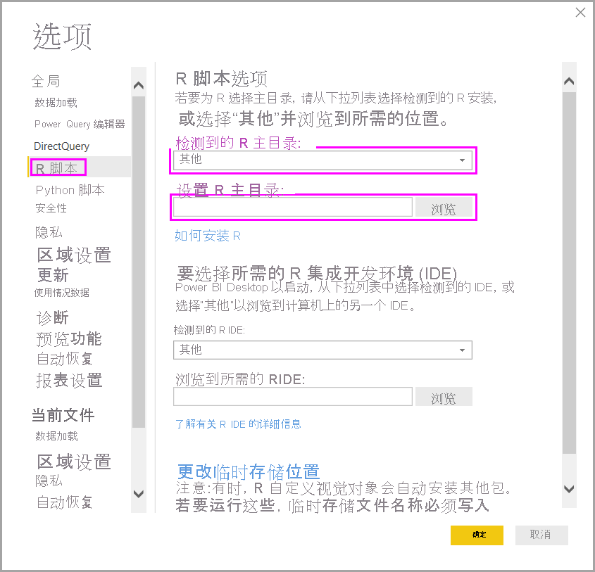

# 在 Power BI Desktop 中运行 R 脚本

可以直接在 Power BI Desktop 中运行 R 脚本并将所得数据集导入 Power BI Desktop 数据模型。

## 安装 R

若要在 Power BI Desktop 中运行 R 脚本，需要在本地计算机上安装 R。 可以从很多位置免费下载并安装 R，其中包括 [Microsoft R 应用程序网络](https://mran.revolutionanalytics.com/download/)和 [CRAN 存储库](https://cran.r-project.org/bin/windows/base/)。 当前版本支持在安装路径中包含 Unicode 字符和空格（空字符）。

## 运行 R 脚本

在 Power BI Desktop 中只需几个步骤，即可运行 R 脚本并创建数据模型。 通过此数据模型，可以创建报表并在 Power BI 服务上共享它们。 Power BI Desktop 中的 R 脚本现在支持包含小数点 (.) 和逗号 (,) 的数字格式。

### 准备 R 脚本

若要在 Power BI Desktop 中运行 R 脚本，请在本地 R 开发环境中创建脚本并确保其已成功运行。

若要在 Power BI Desktop 中运行脚本，请确保该脚本可在未修改的新工作区中成功运行。 此先决条件意味着必须以显式方式加载和运行所有包和依赖项。 可以使用 `source()` 运行依赖脚本。

在 Power BI Desktop 中准备和运行 R 脚本时，会有一些限制：

* 因为只会导入数据帧，因此请确保要导入到 Power BI 的数据都位于数据帧中。
* 不导入类型为“复杂”和“向量”的列，且在创建的表中将其替代为错误值。
* `N/A` 值将被转换为 Power BI Desktop 中的 `NULL` 值。
* 如果 R 脚本运行时间超过 30 分钟，则会超时。
* R 脚本中的交互式调用（例如等待用户输入）会终止脚本运行。
* 在 R 脚本中设置工作目录时，必须  定义工作目录的完整路径，而非相对路径。

### 运行 R 脚本并导入数据

现在，可以运行 R 脚本，将数据导入 Power BI Desktop：

1. 在 Power BI Desktop 中，选择“获取数据”  ，选择“其他”   > “R 脚本”  ，然后选择“连接”  ：

    

2. 如果本地计算机上安装了 R，则只需将脚本复制到脚本窗口中，然后选择“确定”  。 最新安装的版本显示为 R 引擎。

    

3. 选择**确定**运行 R 脚本。 脚本成功运行后，即可选择要将其添加到 Power BI 模型的所得数据帧。

可以控制使用哪个 R 安装来运行脚本。 要指定 R 安装设置，请选择“文件”   > “选项和设置”   > “选项”  ，然后选择“R 脚本”  。 在“R 脚本选项”  下，“检测到的 R 主目录”  下拉列表会显示当前的 R 安装选择。 如果未列出所需的 R 安装，请选择“其他”  ，然后浏览到首选 R 安装文件夹或在“设置 R 主目录”  中输入首选 R 安装文件夹。

### 全部

你可以在 Power BI Desktop 中刷新 R 脚本。 刷新 R 脚本时，Power BI Desktop 会再次在 Power BI Desktop 环境中运行 R 脚本。

## 后续步骤

查看以下更多信息，了解有关 Power BI 中的 R。

* [使用 R 创建 Power BI 视觉对象](../create-reports/desktop-r-visuals.md)
* [将外部 R IDE 与 Power BI 一起使用](desktop-r-ide.md)
