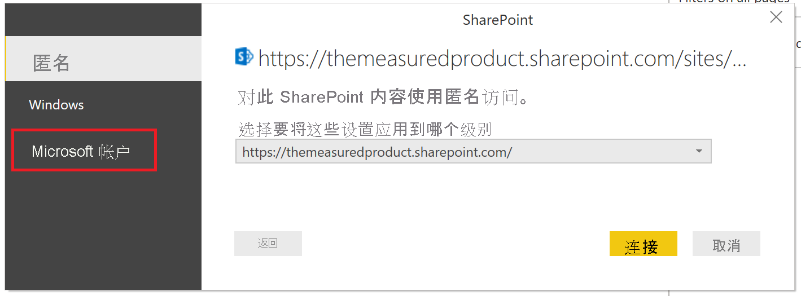
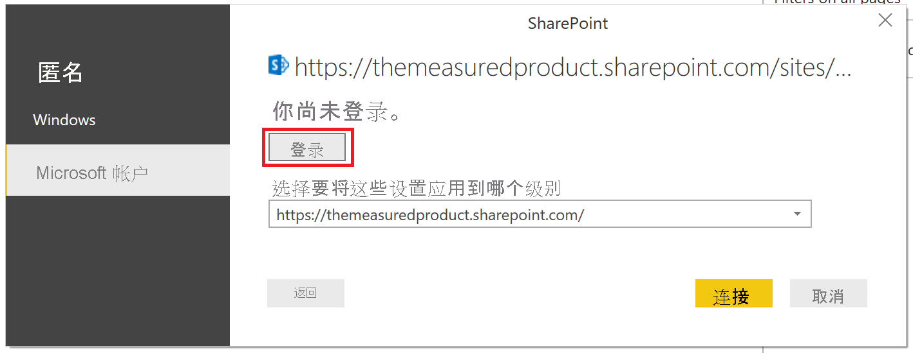

# 在 SharePoint 列表中创建报表

许多团队和组织使用 SharePoint Online 中的列表来存储数据，因为它便于设置，也便于用户进行更新。  有时，相比查看列表本身，图表是用户快速理解数据的一种更简单的方法。 在本教程中，我们将演示如何将 SharePoint 列表数据转换为 Power BI 报表。

观看这段五分钟的教程视频，或向下滚动查看分步说明。

<iframe width="400" height="450" src="https://www.youtube.com/embed/OZO3x2NF8Ak" frameborder="0" allowfullscreen></iframe>

## 第 1 部分：连接 SharePoint 列表

1. 如果没有 [Power BI Desktop](https://powerbi.microsoft.com/desktop/)，请下载并安装该应用。
2. 打开 Power BI Desktop，并在功能区的“主页”选项卡中，选择“获取数据” > “更多” 。
3. 选择“联机服务”，然后选择“SharePoint Online 列表” 。  

    

4. 选择“连接”。
4. 查找包含列表的 SharePoint Online 站点的地址（也称为 URL）。  在 SharePoint Online 的页面中，通常可以通过选择导航窗格中“主页”或顶部的站点图标来获取站点地址，然后从 Web 浏览器的地址栏复制地址。

   观看此步骤的视频：
   <iframe width="400" height="300" src="https://www.youtube.com/embed/OZO3x2NF8Ak?start=48&end=90" frameborder="0" allowfullscreen></iframe>

5. 在 Power BI Desktop 中，将地址粘贴到打开的对话框中的“站点 URL”字段。

6. 你可能会看到或看不到如下图所示的 SharePoint 访问屏幕。  如果没有看到，请跳到步骤 10。  如果看到了该屏幕，请在页面左侧选择“Microsoft 帐户”。

    

7. 选择“登录”并输入用于登录 Microsoft 365 的用户名和密码。

    

8. 完成登录后，选择“连接”。

9. 在导航器左侧，选择要连接到的 SharePoint 列表旁边的复选框。

    

10. 选择“加载”。  Power BI 将列表数据加载到新报表中。

## 第 2 部分：创建报表

1. 在左侧，选择“数据”图标以查看是否已加载 SharePoint 列表数据。

2. 请确保列表中包含数字的列在右侧的“字段”窗格中显示 Sum 或 Sigma 图标。  如果没有显示，请在表视图中选择列标题，选择“建模”选项卡，然后将“数据类型”更改为“小数”或“整数”，具体取决于数据   。  如果系统提示确认更改，请选择“确认”。  如果数字为特殊格式（如货币），则也可以通过设置“格式”来进行选择。

   观看此步骤的视频：
   <iframe width="400" height="300" src="https://www.youtube.com/embed/OZO3x2NF8Ak?start=147&end=204" frameborder="0" allowfullscreen></iframe>

3. 在左侧，选择“报表”图标。
4. 选择要可视化的列，方法是在右侧的“字段”窗格中选择它们旁边的复选框。

   观看此步骤的视频：
   <iframe width="400" height="300" src="https://www.youtube.com/embed/OZO3x2NF8Ak?start=215&end=252" frameborder="0" allowfullscreen></iframe>

5. 如果需要，请更改视觉对象类型。
6. 可以通过取消选择现有视觉对象，然后在“字段”窗格中选择其他列的复选框，在同一报表中创建多个可视化效果。
7. 选择“保存”以保存报表。
