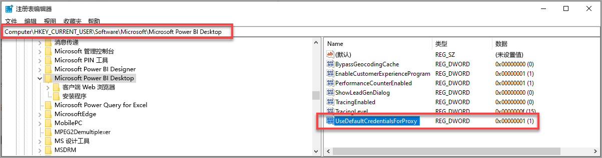

# Power BI Desktop 登录问题疑难解答
在尝试登录 Power BI Desktop 时，可能有时会遇到错误。 登录时遇到问题的两个主要原因有：代理身份验证错误和非 HTTPS URL 重定向错误。 

若要确定哪些问题导致登录问题，第一步是与管理员联系并提供诊断信息，以便他们可以确定问题的原因。 通过跟踪与登录问题相关的问题，管理员可以确定以下哪种错误符合你的情况。 

让我们依次来看看这些问题。 本文末尾讨论了有关如何在 Power BI Desktop 中捕获跟踪，以便帮助跟踪问题排查情况。

## “需要代理身份验证”错误

下面的屏幕显示了“需要代理身份验证”错误的示例。

Power BI Desktop 跟踪文件中的以下异常与此错误相关联：

* Microsoft.PowerBI.Client.Windows.Services.PowerBIWebException
* *HttpStatusCode：ProxyAuthenticationRequired*

出现此错误时，最可能的原因是网络上的代理身份验证服务器阻止 Power BI Desktop 发出 Web 请求。 

如果网络使用代理身份验证服务器，则管理员可以通过将以下域添加到代理身份验证服务器上的允许列表来修复此问题：

* app.powerbi.com
* api.powerbi.com
* *.analysis.windows.net 命名空间中的域

对于作为政府云一部分的客户，可以通过将以下域添加到代理身份验证服务器上的允许列表来修复此问题：

* app.powerbigov.us
* api.powerbigov.us
* *.analysis.usgovcloudapi.net 命名空间中的域

## 非 HTTPS URL 重定向不受支持错误

当前版本的 Power BI Desktop 使用当前版本的 Active Directory 身份验证库 (ADAL)，后者不允许重定向到非安全（非 HTTPS）URL。 

Power BI Desktop 跟踪文件中的以下异常与此错误相关联：

* Microsoft.IdentityModel.Clients.ActiveDirectory.AdalServiceException：非 HTTPS url 重定向在 webview 中不受支持
* ErrorCode: non_https_redirect_failed

如果发生 ErrorCode: non_https_redirect_failed，则表明一个或多个重定向页或重定向链中的提供程序不是受保护的 HTTPS 端点，或者一个或多个重定向的证书颁发者不在设备的受信任的根中。 任何登录重定向链中的所有提供程序都必须使用 HTTPS URL。 若要解决此问题，请与管理员联系并请求将受保护的 URL 用于其身份验证网站。 

## 如何在 Power BI Desktop 中收集跟踪

若要在 Power BI Desktop 中收集跟踪，请按照下列步骤操作：

1. 从左窗格的选项中，通过转到“文件”>“选项和设置”>“选项”，然后选择“诊断”来启用 Power BI Desktop 中的跟踪。 在显示的窗格中，勾选“启用跟踪”旁的复选框，如下图所示。 可能需要重新启动 Power BI Desktop。
   
   

2. 然后按照再现错误的步骤。 当发生这种情况时，Power BI Desktop 会向跟踪日志添加事件，跟踪日志保留在本地计算机上。

3. 导航到本地计算机上的“跟踪”文件夹。 可以通过选择在其中启用跟踪的“诊断”中的链接找到该文件夹，显示为“打开故障转储/跟踪文件夹”，如上图所示。 通常会在本地计算机的以下位置中找到：

    `C:\Users/<user name>/AppData/Local/Microsoft/Power BI Desktop/Traces`

在该文件夹中可能有多个跟踪文件。 请确保仅将新文件发送给管理员，以帮助快速发现错误。 

## 使用 Web 代理的默认系统凭据

Power BI Desktop 发出的 Web 请求不使用 Web 代理凭据。 在使用代理服务器的网络中，Power BI Desktop 可能无法成功发出 Web 请求。 

从 Power BI Desktop 2020 年 3 月版本开始，系统或网络管理员可允许使用默认系统凭据进行 Web 代理身份验证。 管理员可以创建名为 UseDefaultCredentialsForProxy 的注册表项，并将值设置为一 (1)，以允许使用默认系统凭据进行 Web 代理身份验证。

注册表项可以放在以下任一位置：

`[HKEY_LOCAL_MACHINE\SOFTWARE\WOW6432Node\Microsoft\Microsoft Power BI Desktop]`
`[HKEY_LOCAL_MACHINE\SOFTWARE\Microsoft\Microsoft Power BI Desktop]`

无需同时在两个位置放置该注册表项。

创建该注册表项后（可能需要重启），Power BI Desktop 发出 Web 请求时，将使用 Internet Explorer 中定义的代理设置。 

与对代理或凭据设置所做的任何更改一样，创建此注册表项也会带来安全隐患，因此管理员必须确保先正确配置 Internet Explorer 代理，然后再启用此功能。         

### 使用默认系统凭据的限制和注意事项

在启用此功能之前，管理员应考虑一系列安全隐患。 

为客户端启用此功能时，应遵循以下建议：

* 仅将“协商”用作代理服务器上的身份验证方案，以确保客户端仅使用加入 Active Directory 网络的代理服务器。 
* 请勿在使用此功能的客户端上使用“NTLM 回退”。
* 按照本节的建议启用和配置此功能后，如果用户未在使用代理的网络上，则不使用尝试联系代理服务器和使用默认系统凭据的过程。

[使用 Web 代理的默认系统凭据](#using-default-system-credentials-for-web-proxy)

