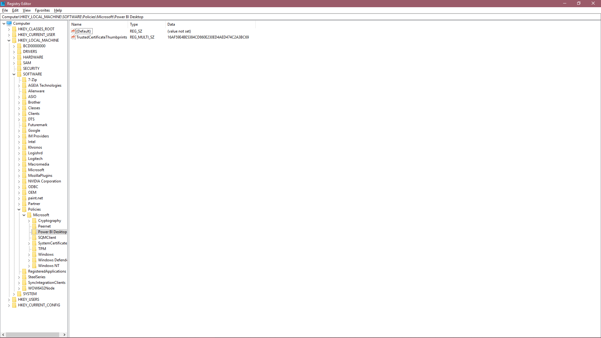

# 受信任的第三方连接器

## 为什么需要受信任的第三方连接器？

在 Power BI 中，通常建议将“数据扩展安全性”级别设置为较高的级别，而这会阻止加载未经 Microsoft 验证的代码。 但在很多情况下，可能需要加载特定连接器，例如自己编写的连接器，或者未经 Microsoft 认证的顾问或供应商所提供的连接器。

特定连接器的开发人员可以使用证书对其进行签名，并提供不削弱安全设置而进行安全加载所需的信息。

如果想要详细了解安全设置，可在[此处](https://docs.microsoft.com/power-bi/desktop-connector-extensibility)了解详细信息。

## 使用注册表信任第三方连接器

以指定注册表值列出要信任的证书指纹，即可信任 Power BI 中的第三方连接器。 如果此指纹与要加载的连接器上的证书指纹相匹配，则可以在 Power BI 的“建议”安全级别进行加载。 

注册表路径为 HKEY_LOCAL_MACHINE\Software\Policies\Microsoft\Power BI Desktop。 确保路径存在，若不存在则新建。 由于此位置主要由 IT 策略控制，且需要本地计算机管理访问权限才能进行编辑，因此我们选择了该位置。 

在上文指定的路径下方添加新值。 类型应为“多字符串值”(REG_MULTI_SZ)，名称应为“TrustedCertificateThumbprints” 

添加要信任的证书指纹。 可以使用“\0”作为分隔符添加多个证书，也可以在注册表编辑器中右键单击并选择“修改”，将每个指纹放置到新行。 示例指纹取自自签名证书。 

 

如果正确地按说明操作，并从开发人员处获得了正确的指纹，则现在应该能够安全地信任使用关联证书签名的连接器。

## 如何对连接器进行签名

如果有需要你或开发人员签名的连接器，可以在[这些](https://docs.microsoft.com/power-query/handlingconnectorsigning) Power Query 文档中了解相关信息。
