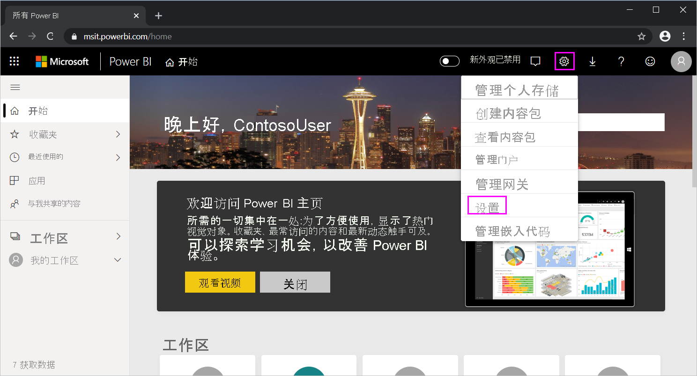

# <a name="use-directquery-in-power-bi-desktop"></a>在 Power BI Desktop 中使用 DirectQuery
使用 Power BI Desktop 时，若已连接数据源，始终可以将数据副本导入 Power BI Desktop。 对于某些数据源，还可使用另一种方法：使用 DirectQuery 直接连接到数据源。

## <a name="supported-data-sources"></a>支持的数据源
有关支持 DirectQuery 的数据源的完整列表，请参阅 [DirectQuery 支持的数据源](power-bi-data-sources.md)。

## <a name="how-to-connect-using-directquery"></a>如何使用 DirectQuery 建立连接
使用“获取数据”连接到受 DirectQuery 支持的数据源时，可在连接对话框中选择连接方式。 例如，在 Power BI Desktop 中的“主页”功能区下，选择“获取数据” > “SQL Server”  。 在“SQL Server 数据库”对话框中，“数据连接模式”显示“导入”和“DirectQuery”的选项   ：


选择导入和 DirectQuery 的区别如下 ：

- **导入**：将选定的表和列导入到 Power BI Desktop 中。 在你创建或与可视化效果进行交互时，Power BI Desktop 会使用已导入的数据。 若要查看自初始导入或最近一次刷新以来基础数据所发生的更改，必须刷新数据（这将再次导入完整的数据集）。

- **DirectQuery**：未将数据导入或复制到 Power BI Desktop 中。 对于关系源，选定的表和列显示在“字段”列表中。 对于 SAP Business Warehouse 等多维源，所选多维数据集的维度和度量值会显示在“字段”列中。 在你创建可视化效果或与之进行交互时，Power BI Desktop 会查询基础数据源，就是说，你查看的始终都是最新数据。

在使用 DirectQuery 时许多数据建模和数据转换功能可用，但存在一些限制。 创建可视化效果或与之交互时，必须查询基础源。 需要刷新可视化效果花费的时间取决于基础数据源的性能。 当最近已请求为处理请求而必需的数据时，Power BI Desktop 将使用最近数据来减少显示可视化效果时所需的时间。 通过从“主页”功能区中选择“刷新”，当前数据刷新所有可视化效果 。

[Power BI 和 DirectQuery](desktop-directquery-about.md) 一文详细介绍了 DirectQuery。 有关使用 DirectQuery 的好处、限制条件和重要注意事项的详细信息，请参阅以下各节。

## <a name="benefits-of-using-directquery"></a>通过使用 DirectQuery 带来的好处
使用 DirectQuery 带来的几个好处是：

- DirectQuery 可使你在超大型数据集上生成可视化效果，除此之外将无法使用预聚合首先导入所有数据。
- 基础数据更改可能需要刷新数据。 对于一些报表，可能需要执行大型数据传输，才能显示当前数据，这就导致重新导入数据变得不可行。 与此相反，DirectQuery 报表始终会使用当前数据。
- 1 GB 的数据集限制不适用于 DirectQuery。

## <a name="limitations-of-directquery"></a>DirectQuery 的限制
目前，在使用 DirectQuery 时存在一些限制：

- 如果“查询编辑器”查询过于复杂，将会出错。 要更正错误，请在“查询编辑器”中删除有问题的步骤，或者导入数据，而不是使用 DirectQuery。 对于 SAP Business Warehouse 等多维度源而言，没有查询编辑器。

- DirectQuery 不提供时间智能功能。 例如，DirectQuery 模式不支持日期列（如年、季度、月、日）的特殊处理方式。

- Power BI Service 不支持使用单一登录 (SSO) 身份验证从数据源引用 DirectQuery 表的计算表和计算列。

- 为确保发送到基础数据源的查询具有可接受的性能，对度量值中的可用 DAX 表达式进行了限制。

- 云源限制 100 万行，本地源限制每行的已定义负载约 4 MB（具体取决于专用压缩算法）或整个视觉对象的数据大小为 16MB。 使用高级容量时某些限制可能会提高。 此限制不影响用于创建使用 DirectQuery 返回的数据集的聚合或计算。 它仅影响返回的行。 高级容量可以设置最大行限制，如[本文](https://powerbi.microsoft.com/blog/five-new-power-bi-premium-capacity-settings-is-available-on-the-portal-preloaded-with-default-values-admin-can-review-and-override-the-defaults-with-their-preference-to-better-fence-their-capacity/)所述。 

    例如，可以通过在数据源上运行的查询聚合 1000 万行。 如果返回的 Power BI 数据小于 100 万行，查询将使用 DirectQuery 准确地将该聚合的结果返回到 Power BI。 如果从 DirectQuery 返回超过 100 万行，Power BI 将返回一个错误（除非在高级容量中，且行计数低于管理员设置的限制）。


## <a name="important-considerations-when-using-directquery"></a>使用 DirectQuery 的重要注意事项
使用 DirectQuery 时，应考虑以下三点：

- **性能和负载**：所有 DirectQuery 请求都会发送到源数据库，因此刷新视觉对象所需的时间取决于后端源响应查询结果所需的时间。 使用 DirectQuery 的视觉对象的建议响应时间（包括返回请求数据）应为 5 秒或更短，建议的最长结果响应时间为 30 秒。 超过此时间会使报表的用户体验变得令人无法接受的差。 报表发布到 Power BI 服务后，超过几分钟时间的任何查询将会超时，且用户将收到错误。
  
    还应当根据使用发布报表的 Power BI 用户数量，考虑源数据库的负载。 使用“行级别安全性”(RLS) 也可以产生重大影响。 多个用户共享一个非 RLS 仪表板磁贴会导致对数据库进行单个查询。 但是，在仪表板磁贴上使用 RLS 通常意味着，需要每个用户查询一次才能刷新磁贴，这会大幅增加源数据库的负载，并可能影响性能。
  
    Power BI 将创建尽可能高效的查询。 但是在某些情况下，生成的查询可能不够高效，无法避免刷新失败。 其中一个示例是生成的查询将从后端数据源检索大量行。 在这种情况下，将发生以下错误：

    ```output
    The resultset of a query to external data source has exceeded
    ```
  
    生成包含非常高的基数列的简单图表，聚合选项设置为 **不汇总**。 视觉对象应只具有基数低于 100 万的列，或必须应用适当的筛选器。

- 安全性：默认使用发布报表的所有用户都使用发布到 Power BI 服务后输入的凭据连接到后端数据源。 此过程与导入数据的情况相同：所有用户会看到相同的数据，而不考虑后端源中定义的任何安全规则。

    希望使用 DirectQuery 源实现按用户安全性的客户应使用 RLS 或配置针对源的 Kerberos 约束身份验证。 Kerberos 并不适用于部分源。 [详细了解 RLS](../admin/service-admin-rls.md)。 [详细了解 DirectQuery 中的 Kerberos](service-gateway-sso-kerberos.md)。

- **支持的功能**：DirectQuery 模式不支持 Power BI Desktop 的某些功能，或这些功能有限制。 此外，Power BI 服务中的某些功能（如“快速见解”）对使用 DirectQuery 的数据集不可用。 确定是否使用 DirectQuery 时，应该考虑到这些功能限制。

> [!NOTE]
> 对 Azure SQL 数据库和专用 IP 地址使用 DirectQuery 时，本地网关是必需的。 

## <a name="publish-to-the-power-bi-service"></a>发布到 Power BI 服务
通过 DirectQuery 创建的报表可发布到 Power BI 服务。

如果使用的数据源不需要本地数据网关（Azure SQL 数据库、Azure SQL 数据仓库或 Redshift）则必须提供凭据，然后所发布的报表才能在 Power BI 服务中显示   。 按照以下说明提供凭据：

1. 登录到 [Power BI](https://www.powerbi.com/)。
2. 在 Power BI 服务中，选择“设置”齿轮图标，然后选择“设置”菜单项 。

    

3. 在 Power BI 服务的“设置”页，选择“数据集”选项卡，然后选择将使用 DirectQuery 的数据集，再选择“编辑凭据”  。

4. 添加凭据。 否则，打开已发布的报表或浏览使用 DirectQuery 连接创建的数据集时，将发生错误。

对于除“Azure SQL 数据库”、“Azure SQL 数据仓库”、“Redshift”或“Snowflake 数据库”外使用 DirectQuery 的数据源，必须安装“本地数据网关”，并且必须注册数据源才能建立数据连接    。 有关详细信息，请参阅[什么是本地数据网关？](service-gateway-onprem.md)

## <a name="next-steps"></a>后续步骤
有关 DirectQuery 的详细信息，请查看以下资源：

- [在 Power BI 中使用 DirectQuery](desktop-directquery-about.md)
- [DirectQuery 支持的数据源](power-bi-data-sources.md)
- [DirectQuery 和 SAP Business Warehouse (BW)](desktop-directquery-sap-bw.md)
- [DirectQuery 和 SAP HANA](desktop-directquery-sap-hana.md)
- [本地数据网关是什么？](service-gateway-onprem.md)
