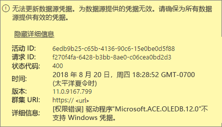
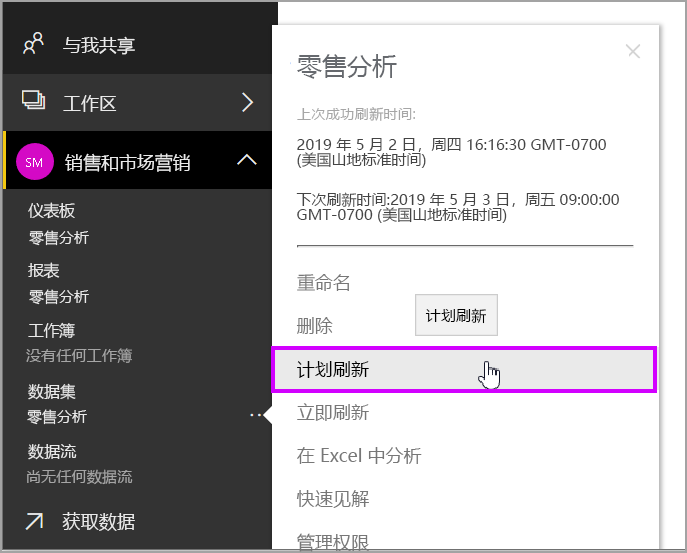
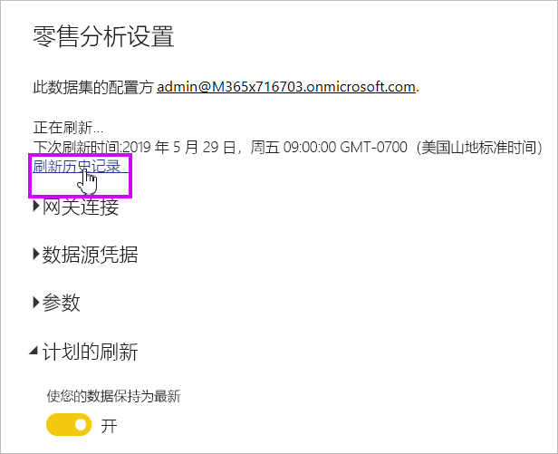

# Power BI 网关（个人模式）故障排除

[!INCLUDE [gateway-rewrite](../includes/gateway-rewrite.md)]

以下各节介绍了使用 Power BI 本地数据网关（个人模式）时可能遇到的一些常见问题。

## 更新到最新版本

最新版本的个人用网关为本地数据网关（个人模式）。 请更新安装以使用该版本。

如果网关版本过期，则会浮现出许多问题。 好的常规做法是确保所使用的是最新版本。 如果你已经一个月或更长时间没有升级网关，可能需要考虑安装网关的最新版本。 然后看看是否仍然存在该问题。

## 安装
**网关（个人模式）在 64 位版本上运行：** 如果你的计算机是 32 位版本，则无法安装网关（个人模式）。 你的操作系统必须是 64 位版本。 请安装 64 位版本的 Windows，或者在 64 位计算机上安装网关（个人模式）。

**即使你是计算机的本地管理员，网关（个人模式）也无法作为服务安装：** 如果用户位于计算机的本地管理员组中，安装可能会失败，但组策略不允许该用户名作为服务登录。 请确保组策略允许用户作为服务登录。 我们正在努力修复此问题。 有关详细信息，请参阅 [Add the Log on as a service right to an account](/previous-versions/windows/it-pro/windows-server-2003/cc739424(v=ws.10))（将登录作为服务权限添加到帐户）。

**操作超时：** 如果要安装网关（个人模式）的计算机（物理计算机或 VM）采用单核处理器，则此问题很常见。 请关闭所有应用程序和任何不必要的进程，然后再次尝试安装。

**数据管理网关或 Analysis Services 连接器无法与网关（个人模式）安装在同一台计算机上：** 如果已安装 Analysis Services 连接器或数据管理网关，则必须先卸载连接器或数据管理网关。 然后尝试安装网关（个人模式）。

> [!NOTE]
> 如果在安装期间遇到问题，安装程序日志会提供相关信息帮助你解决此问题。 有关详细信息，请参阅[安装日志](#SetupLogs)。
> 
> 

 **代理配置：** 如果你的环境需要使用代理，可能会遇到配置网关（个人模式）的问题。 要了解有关如何配置代理的详细信息，请参阅[配置本地数据网关的代理设置](/data-integration/gateway/service-gateway-proxy)。

## 计划刷新
**错误:云中存储的凭据丢失。**

如果你已计划刷新，然后卸载并重新安装网关（个人模式），则在 \<dataset\> 的设置中可能会出现此错误。 当卸载网关（个人模式）时，将从 Power BI 服务中删除配置了刷新的数据集的数据源凭据。

解决方案：在 Power BI 中，转到数据集的刷新设置。 在“管理数据源”中，对于出现错误的任何数据源，请选择“编辑凭据” 。 然后再次登录数据源。

**错误:为数据集提供的凭据无效。请通过刷新更新凭据或在“数据源设置”对话框中更新凭据以继续执行操作。**

解决方案：如果收到凭据消息，这可能意味着：

* 用于登录数据源的用户名和密码不是最新的。 在 Power BI 中，转到数据集的刷新设置。 在“管理数据源”中，选择“编辑凭据”，更新数据源的凭据 。
* 如果其中一个源使用 OAuth 进行身份验证，则在单个查询中，云源和本地源的糅合无法在网关（个人模式）中刷新。 此问题的一个示例是 CRM Online 与本地 SQL Server 实例的糅合。 糅合将刷新失败，因为 CRM Online 需要 OAuth。
  
  此错误是一个已知问题，当前正在调查。 若要解决此问题，请为云源和本地源配备单独的查询。 然后使用合并或追加查询将它们合并起来。

**错误:数据源不受支持。**

解决方案：如果在“计划刷新”设置中收到数据源不受支持的消息，则可能表示： 

* Power BI 中当前不支持刷新该数据源。 
* Excel 工作簿不包含数据模型，仅包含工作表数据。 如果已上载的 Excel 工作簿包含数据模型，Power BI 当前只支持刷新。 在 Excel 中使用 Power Query 导入数据时，请选择“加载”选项将数据加载到数据模型。 这样做可确保将数据导入到数据模型。 

**错误：[无法合并数据] &lt;查询部分&gt;/&lt;…&gt;/&lt;…&gt; 正在访问的数据源具有无法一起使用的隐私级别。请重新生成此数据组合。**

解决方案：此错误是由于隐私级别限制和正在使用的数据源类型造成的。

**错误:数据源错误:无法将值“\[Table\]”转换为 Table 类型。**

解决方案：此错误是由于隐私级别限制和正在使用的数据源类型造成的。

**错误:对于此行没有足够的空间。**

解决方案：如果单行大于 4 MB，则会出现此错误。 从数据源中找到该行，并尝试对该行进行筛选或缩减。

## 数据源
**缺少数据提供程序：** 网关（个人模式）仅在 64 位版本上运行。 它需要将 64 位版本的数据提供程序安装在安装了网关（个人模式）的同一台计算机上。 例如，如果数据集中的数据源是 Microsoft Access，则必须在已安装网关（个人模式）的同一台计算机上安装 64 位 ACE 提供程序。 

>[!NOTE]
>如果已有 32 位版本的 Excel，则无法在同一台计算机上安装 64 位版本的 ACE 提供程序。

**Access 数据库不支持 Windows 身份验证：** Power BI 当前仅支持 Access 数据库的匿名身份验证。

**错误:输入数据源凭据时出现登录错误：** 如果在输入数据源的 Windows 凭据时收到类似以下的错误： 

  

此错误指示，你可能仍然使用较旧版本的网关（个人模式）。 

解决方案：有关详细信息，请参阅[安装最新版本的 Power BI 网关（个人模式）](https://powerbi.microsoft.com/gateway/)。

**错误:使用 ACE OLEDB 为数据源选择 Windows 身份验证时出现登录错误：** 如果使用 ACE OLEDB 提供程序输入数据源的数据源凭据时出现以下错误：

此错误指示，Power BI 当前不支持使用 ACE OLEDB 提供程序对数据源进行 Windows 身份验证。

解决方案：要解决此错误，请选择“匿名身份验证”。 对于旧版 ACE OLEDB 提供程序，匿名凭据等效于 Windows 凭据。

## 磁贴刷新
如果仪表板磁贴刷新时收到错误，请参阅[磁贴错误故障排除](refresh-troubleshooting-tile-errors.md)。

## 用于故障排除的工具
### 刷新历史记录
使用“刷新历史记录”，可以查看发生了哪些错误，并在需要创建支持请求时查找有用的数据。 既可查看计划刷新，也可查看按需刷新。 下面介绍如何访问“刷新历史记录”。

1. 在 Power BI 导航窗格的“数据集”中，选择一个数据集。 打开菜单，然后选择“计划刷新”。

   
1. 在“设置...”中，选择“刷新历史记录” 。 

   
   
   

### 事件日志
有多个事件日志可以提供信息。 如果你是计算机管理员，则显示前两个，即“数据管理网关”和“PowerBIGateway” 。 如果你不是管理员，并且使用的数据网关（个人模式），将在“应用程序”日志中看到日志条目。

**数据管理网关** 和 **PowerBIGateway** 日志显示在 **应用程序和服务日志** 下方。

### Fiddler 跟踪
[Fiddler](https://www.telerik.com/fiddler) 是 Telerik 提供的一个免费工具，可以监视 HTTP 流量。 可以看到从客户端计算机与 Power BI 服务的通信。 此通信可能会显示错误和其他相关信息。

### 安装日志
如果无法安装网关（个人模式），将看到一个显示安装日志的链接。 该安装程序日志可以显示有关故障的详细信息。 这些日志是 Windows 安装日志，也称作 MSI 日志。 它们可能非常复杂且难以阅读。 通常在底部显示引发的错误，但确定错误原因并非易事。 它可能是其他日志中错误的结果。 它也可能是日志中错误率较高的结果。

或者，可以转到 Temp 文件夹 (%temp%)，并查找以 Power\_BI\_ 开头的文件。

> [!NOTE]
> 转到 %temp% 可能会将你带到 Temp 的子文件夹。Power\_BI\_ 文件位于 Temp 目录的根目录中。 你可能需要转到上一级或上两级。
> 
> 

## 后续步骤
- [为本地数据网关配置代理设置](/data-integration/gateway/service-gateway-proxy)- [数据刷新](refresh-data.md)  
- [Power BI 网关 - 个人](service-gateway-personal-mode.md)  
- [磁贴错误故障排除](refresh-troubleshooting-tile-errors.md)  
- [本地数据网关疑难解答](service-gateway-onprem-tshoot.md) 
 
更多问题？ 请尝试在 [Power BI 社区](https://community.powerbi.com/)中提问