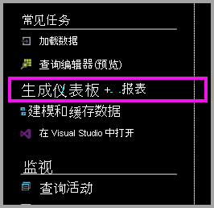
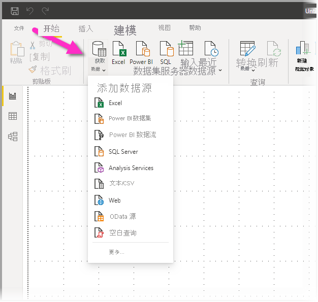
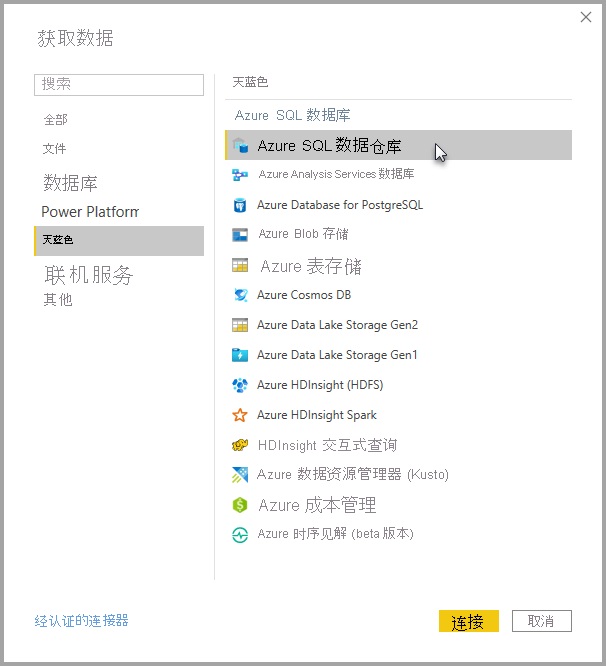
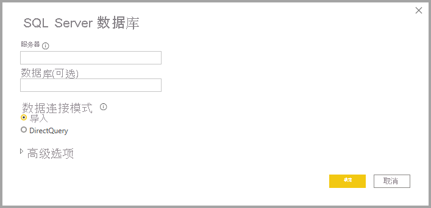
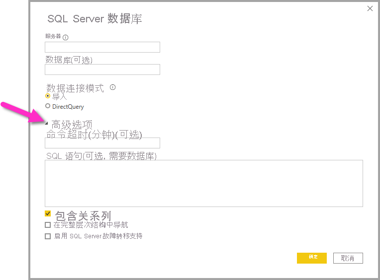

# 具有 DirectQuery 的 Azure SQL 数据仓库

通过具有 DirectQuery 的 Azure SQL 数据仓库可以基于在 Azure SQL 数据仓库中已具有的数据和指标来创建动态报表。 借助 DirectQuery，查询会在你浏览数据时实时发送回 Azure SQL 数据仓库。 实时查询与 SQL 数据仓库的规模相结合，使用户可以在数分钟内针对以 TB 计的数据创建动态报表。 此外，“生成仪表板 + 报表”链接允许用户使用其 SQL 数据仓库创建 Power BI 报表。

何时使用 SQL 数据仓库连接器：

* 在连接时指定完全限定的服务器名称（请参阅下文以了解详细信息）
* 确保服务器的防火墙规则配置为“允许访问 Azure 服务”
* 每个操作（例如选择列或添加筛选器）都会直接查询数据仓库
* 磁贴设置为大约每 15 分钟刷新一次，刷新不需要进行计划。  连接时可以在“高级设置”中对刷新进行调整。
* 问答不可用于 DirectQuery 数据集
* 不会自动选取架构更改

随着我们继续改进体验，这些限制和说明可能会发生变化。 下面详细介绍了用于连接的步骤。

## 在 Power BI 中生成仪表板和报表

> [!Important]
> 我们在不断改进与 Azure SQL 数据仓库的连接。 若要获取连接到 Azure SQL 数据仓库数据源的最佳体验，请使用 Power BI Desktop。 生成模型和报表后，即可将其发布到 Power BI 服务中。 Power BI 服务中的 Azure SQL 数据仓库现已弃用先前可用的直接连接器。

在 SQL 数据仓库和 Power BI 之间进行移动最简单的方法是在 Power BI Desktop 中创建报表。 可以使用 Azure 门户中的“生成仪表板 + 报表”按钮。

1. 首先，请下载并安装 Power BI Desktop。 请参阅[获取 Power BI Desktop](../fundamentals/desktop-get-the-desktop.md) 一文，了解有关下载和安装的信息，或直接转到下一步。

2. 还可以单击“生成仪表板 + 报表”链接下载 Power BI Desktop。

    

## 通过 Power BI Desktop 连接

可以使用 Power BI Desktop 中的“获取数据”按钮连接到 SQL 数据仓库。 

1. 在“开始”菜单中，选择“获取数据”按钮 。  

    

2. 选择“更多…”以查看所有可用的数据源。 在出现的窗口中，选择左侧窗格中的 Azure，然后在右侧窗格的可用连接器列表中选择“Azure SQL 数据仓库” 。

    

3. 在出现的窗口中，输入你的服务器，并选择性地声明你想要连接到的数据库。 你还可以选择数据连接模式：导入或 DirectQuery。 要对 Azure SQL 数据仓库中的信息进行实时访问，请使用 DirectQuery。

    

4. 对于 Azure SQL 数据仓库连接的高级选项，请选择“高级选项”旁边的向下箭头，以显示连接的其他选项。

    

下一部分将介绍如何查找连接的参数值。 

## 查找参数值

可以在 Azure 门户中找到你的完全限定的服务器名称和数据库名称。 请注意，SQL 数据仓库当前只在 Azure 门户中存在。

> [!NOTE]
> 如果 Power BI 租户与 Azure SQL 数据仓库位于相同区域，则不会产生流出费用。 可按照[这些说明](../admin/service-admin-where-is-my-tenant-located.md)查找 Power BI 租户的所在位置。

[!INCLUDE [direct-query-sso](../includes/direct-query-sso.md)]

## 后续步骤

* [关于在 Power BI 中使用 DirectQuery](desktop-directquery-about.md)
* [什么是 Power BI？](../fundamentals/power-bi-overview.md)  
* [获取 Power BI 的数据](service-get-data.md)  
* [Azure SQL 数据仓库](/azure/sql-data-warehouse/sql-data-warehouse-overview-what-is/)

更多问题？ [尝试参与 Power BI 社区](https://community.powerbi.com/)