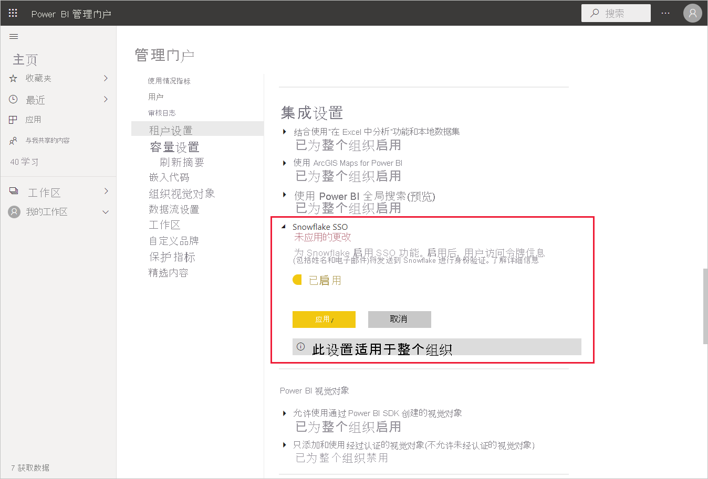
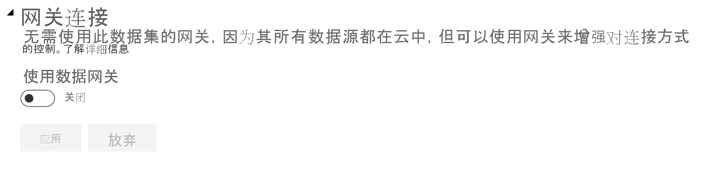
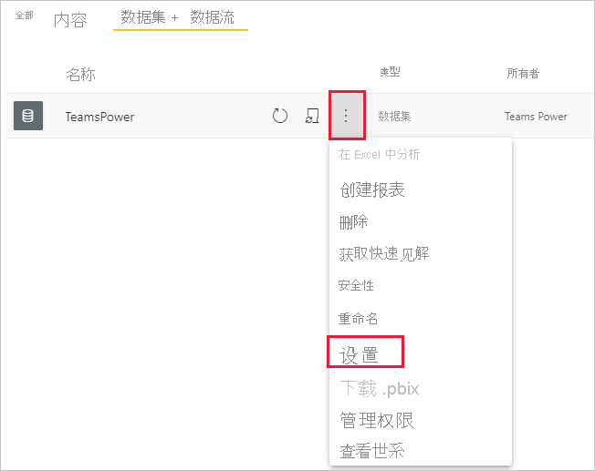
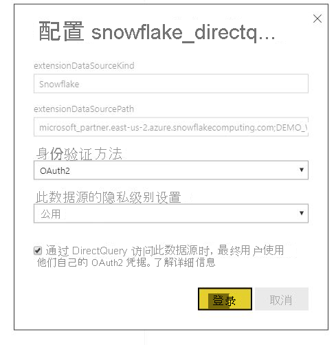

# 在 Power BI 服务中连接到 Snowflake

## 简介

在 Power BI 服务中连接到 Snowflake 仅在一个方面与其他连接器存在区别。 Snowflake 为 Azure Active Directory (AAD) 提供了额外功能，其中包含 SSO 选项。 集成的各个部分需要 Snowflake、Power BI 和 Azure 中不同的管理角色。 还可以选择在不使用 SSO 的情况下启用 AAD 身份验证。 基本身份验证的方式类似于服务中的其他连接器。

若要配置 AAD 集成并根据需要启用 SSO，请按照本文中的步骤操作：

* 如果你是 Snowflake 管理员，请参阅 Snowflake 文档中的 [Power BI SSO 到 Snowflake - 入门](https://docs.snowflake.com/en/user-guide/oauth-powerbi.html)文章。
* 如果你是 Power BI 管理员，请参阅 [Power BI 服务配置 - 管理门户](service-connect-snowflake.md#admin-portal)以了解如何启用 SSO。
* 如果你是 Power BI 数据集创建者，则引用 [Power BI 服务配置 - 使用 AAD 配置数据集](service-connect-snowflake.md#configuring-a-dataset-with-aad)以了解如何启用 SSO。

## Power BI 服务配置

### 管理门户

若要启用 SSO，全局管理员必须在 Power BI 管理门户中打开该设置。 此设置批准向 Snowflake 发送 AAD 凭据，以便对整个组织进行身份验证。 若要启用 SSO，请执行下列步骤：

1. 使用全局管理员凭据[登录到 Power BI](https://app.powerbi.com)。
1. 从页面页眉菜单中选择“设置”，然后选择“管理门户”。
1. 选择“租户设置”，然后滚动查找“集成设置”。

   

4. 展开“Snowflake SSO”，将设置切换到“启用”，然后选择”应用”。

此步骤需要你同意将 AAD 令牌发送到 Snowflake 服务器。 启用此设置后，可能需要一小时才能生效。

启用 SSO 后，可以将报表与 SSO 结合使用。

### 使用 AAD 配置数据集

将基于 Snowflake 连接器的报表发布到 Power BI 服务后，数据集创建者必须更新相应工作区的设置，以便使用 SSO。

由于 Power BI 的工作方式，仅当没有数据源通过本地数据网关运行时，SSO 才有效。 下面列出了一些限制：

* 如果在数据模型中仅使用 Snowflake 源，选择不使用本地数据网关即可使用 SSO。
* 如果你使用的是 Snowflake 源和其他源，则如果没有源使用本地数据网关，便可以使用 SSO。
* 如果通过本地数据网关使用 Snowflake 源，则当前不支持 AAD 凭据。 如果尝试从安装了网关的单个 IP（而不是从整个 Power BI IP 范围）访问 VNet，此考量可能相关。
* 如果要将 Snowflake 源与需要网关的另一个源一起使用，则还需要通过本地数据网关使用 Snowflake。 在这种情况下，你将无法使用 SSO。

要详细了解如何使用本地数据网关，请参阅[什么是本地数据网关？](service-gateway-onprem.md)

如果不使用网关，则至此已设置完毕。 如果已在本地数据网关上配置 Snowflake 凭据，但仅在模型中使用该数据源，则可以单击“数据集设置”页上的开关以关闭该数据模型的网关。

若要为数据集启用 SSO，请执行以下步骤：

1. 使用数据集创建者凭据[登录到 Power BI](https://app.powerbi.com)。
1. 选择适当的工作区，然后从数据集名称旁的“更多选项”菜单中选择“设置”。
  
1. 选择”数据源凭据”并登录。 数据集可通过基本凭据或 OAuth2 (AAD) 凭据登录到 Snowflake。 如果使用 AAD，则可在下一步中启用 SSO。
1. 选择选项“通过 DirectQuery 访问此数据源时，最终用户使用他们自己的 OAuth2 凭据”。 此设置将启用 AAD SSO。 无论第一个用户是通过基本身份验证还是 OAuth2 (AAD) 登录，都将发送 AAD 凭据以使用 SSO。

    

完成这些步骤后，用户应自动使用其 AAD 身份验证连接到该 Snowflake 数据集中的数据。

如果选择不启用 SSO，刷新报表的用户将使用登录用户的凭据，与大多数其他 Power BI 报表相同。

### 故障排除

如果遇到与集成有关的任何问题，请参阅 Snowflake [故障排除指南](https://docs.snowflake.com/en/user-guide/oauth-powerbi.html#troubleshooting)。

## 后续步骤

* [Power BI 服务数据源](service-get-data.md)
* [通过 Power BI Desktop 连接 Power BI 服务中的数据集](desktop-report-lifecycle-datasets.md)
* [连接到 Snowflake 计算仓库](desktop-connect-snowflake.md)