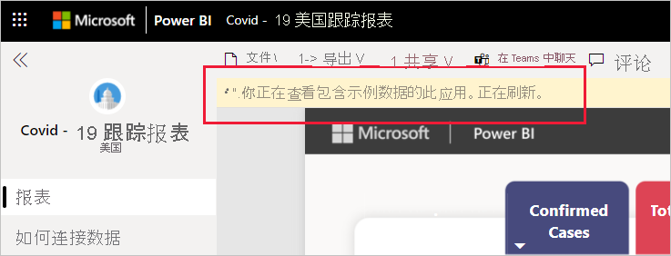

# 连接到 COVID-19 美国跟踪报表
本文介绍如何安装 COVID-19 跟踪报告的模板应用，以及如何连接到数据源。

有关报表本身的详细信息（包括免责声明和数据信息），请参阅[美国州和地方政府的 COVID-19 跟踪示例](../create-reports/sample-covid-19-us.md)。

安装模板应用并连接到数据源后，可以根据需要对报表进行自定义。 然后可以将其作为应用分发给组织中的同事。

## 安装应用

1. 单击以下链接可转到该应用：[COVID-19 美国跟踪报表模板应用](https://appsource.microsoft.com/en-us/product/power-bi/pbi-contentpacks.covid19ms)

1. 在应用的 Appsource 页面上，单击“[立即获取](https://appsource.microsoft.com/en-us/product/power-bi/pbi-contentpacks.covid19ms)”  。

    

1. 出现提示时，单击“安装”  。 应用安装后，应用页面上会显示。

   

## 连接到数据源

1. 单击应用页面上的图标以打开应用。

1. 在出现的初始屏幕上，选择“连接”  。

   

1. 将逐个显示两个登录对话框。 在这两个对话框上，将隐私级别设置为公开。

   

   报表将连接到数据源，并用最新的数据进行填充。 在此期间，活动监视器将转动。

   

## 计划报表刷新

数据刷新完成后，你将位于与应用关联的工作区中。 [设置刷新计划](../connect-data/refresh-scheduled-refresh.md)以保持报表数据为最新状态。

## 自定义和共享

有关详细信息，请参阅[自定义和共享应用](../connect-data/service-template-apps-install-distribute.md#customize-and-share-the-app)。 在发布或分发应用之前，请务必查看[报告免责声明](../create-reports/sample-covid-19-us.md#disclaimers)。

## 后续步骤
* [适用于美国各州和地方政府的 COVID-19 跟踪示例](../create-reports/sample-covid-19-us.md)
* 是否有任何问题? [尝试咨询 Power BI 社区](https://community.powerbi.com/)
* [什么是 Power BI 模板应用？](../connect-data/service-template-apps-overview.md)
* [在组织中安装和分发模板应用](../connect-data/service-template-apps-install-distribute.md)
