# 连接到危机通信状态报表

此 Power BI 应用是 Microsoft Power Platform 危机通信解决方案中的报表/仪表板项目。 它跟踪危机通信应用用户的工作位置。 该解决方案结合了 Power Apps、Power Automate、Teams、SharePoint 和 Power BI 的功能。 它可以在 Web 上、以移动方式或在 Teams 中使用。

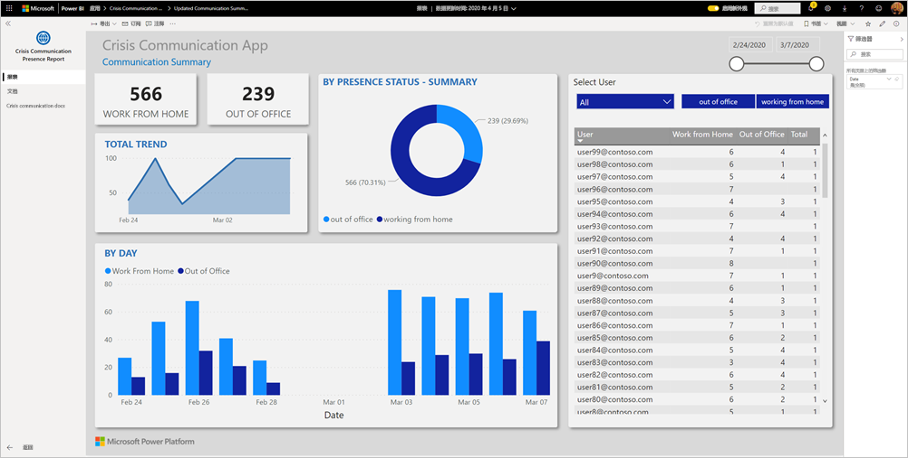

仪表板显示整个健康状况系统中紧急管理器的聚合数据，可帮助他们及时做出正确的决策。

本文介绍如何安装应用以及如何连接到数据源。 有关危机通信应用的详细信息，请参阅[设置和了解 Power Apps 中的危机通信示例模板](https://docs.microsoft.com/powerapps/maker/canvas-apps/sample-crisis-communication-app)

安装模板应用并连接到数据源后，可以根据需要对报表进行自定义。 然后可以将其作为应用分发给组织中的同事。

## 先决条件

安装此模板应用之前，需要先安装并设置[危机通信示例](https://docs.microsoft.com/powerapps/maker/canvas-apps/sample-crisis-communication-app)。 安装此解决方案将创建使用数据填充应用时所需的数据源引用。

安装危机通信示例时，请记下[“CI_Employee Status”的 SharePoint 列表文件夹路径和列表 ID](https://docs.microsoft.com/powerapps/maker/canvas-apps/sample-crisis-communication-app#monitor-office-absences-with-power-bi)。

## 安装应用

1. 单击以下链接可转到该应用：[危机通信状态报表示例应用](https://appsource.microsoft.com/en-us/product/power-bi/pbi-contentpacks.crisiscomms)

1. 在应用的 AppSource 页面，选择“[立即获取](https://appsource.microsoft.com/en-us/product/power-bi/pbi-contentpacks.crisiscomms)”  。

    [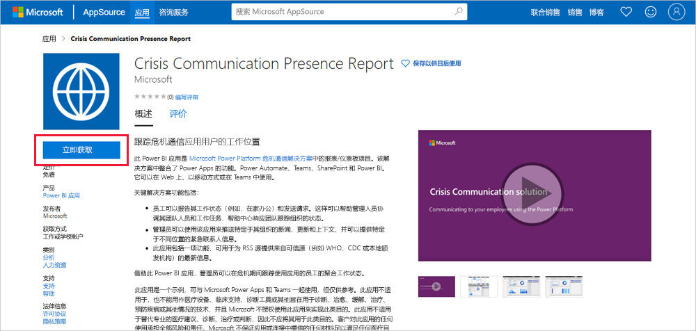](https://appsource.microsoft.com/en-us/product/power-bi/pbi-contentpacks.crisiscomms)

1. 阅读“另一件事”中的信息，然后选择“继续”   。

    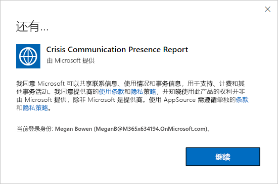

1. 选择“安装”  。 

    

    安装应用后，你将在应用页面上看到它。

   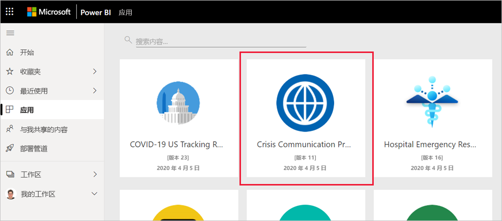

## 连接到数据源

1. 选择应用页面上的图标以打开应用。

1. 在初始屏幕上，选择“浏览”  。

   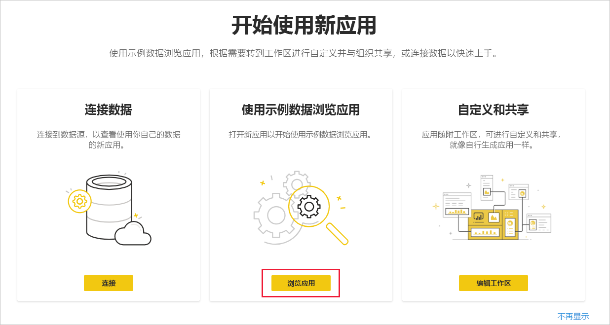

   应用将打开，显示示例数据。

1. 选择页面顶部的横幅上的“连接数据”链接  。

   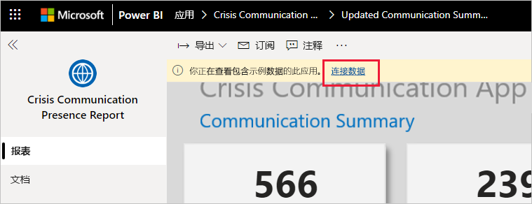

1. 在对话框中：
   1. 在 SharePoint_Folder 字段中，输入[“CI_Employee Status”SharePoint 列表路径](https://docs.microsoft.com/powerapps/maker/canvas-apps/sample-crisis-communication-app#monitor-office-absences-with-power-bi)。
   1. 在 List_ID 字段，输入从列表设置中获取的列表 ID。 完成后单击“下一步”  。

   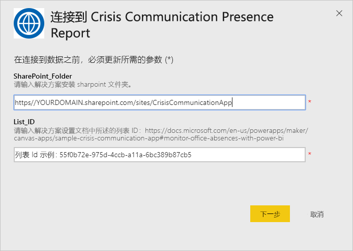

1. 在出现的下一个对话框中，将身份验证方法设置为 OAuth2  。 不必对隐私级别设置执行任何操作。

   选择“登录”  。

   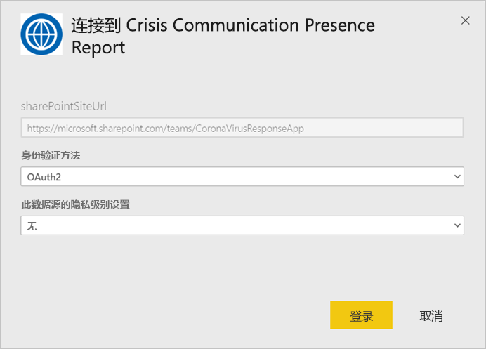

1. 在 Microsoft 登录屏幕，登录到 Power BI。

   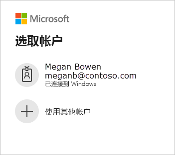

   登录后，报表将连接到数据源，并填充了最新的数据。 在此期间，活动监视器将转动。

   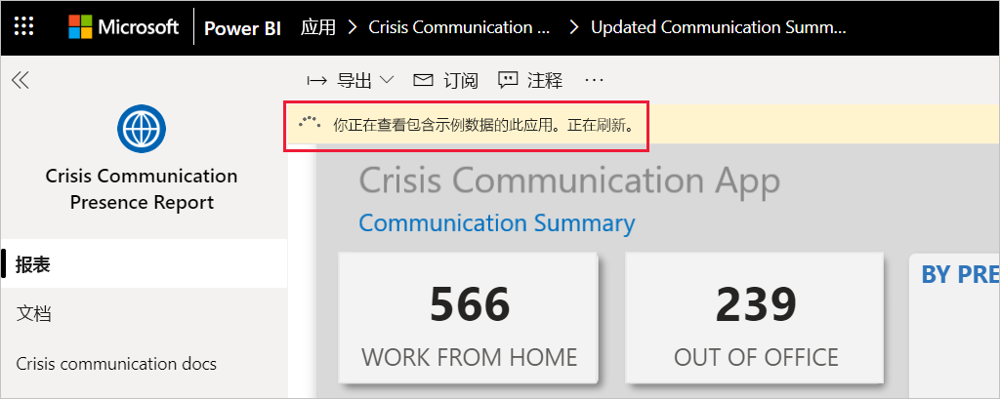

## 计划报表刷新

完成数据刷新后，[设置刷新计划](../refresh-scheduled-refresh.md)以保持报表数据为最新状态。

1. 在顶部标题栏中，选择“Power BI”  。

   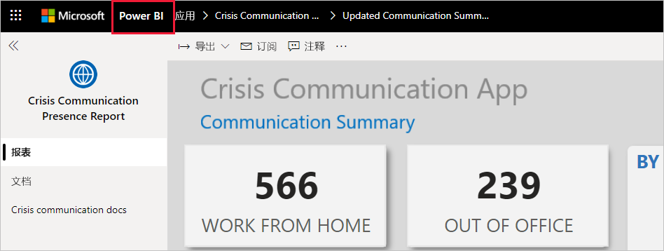

1. 在左侧导航窗格中，查找“工作区”下的医院紧急响应决策支持仪表板工作区，然后按照[配置计划刷新](../refresh-scheduled-refresh.md)一文中所述的说明进行操作  。

## 自定义和共享

有关详细信息，请参阅[自定义和共享应用](../service-template-apps-install-distribute.md#customize-and-share-the-app)。 在发布或分发应用之前，请务必查看[报告免责声明](../create-reports/sample-covid-19-us.md#disclaimers)。

## 后续步骤
* [在 Power Apps 中设置并了解危机通信示例模板](https://docs.microsoft.com/powerapps/maker/canvas-apps/sample-crisis-communication-app)
* 是否有任何问题? [尝试咨询 Power BI 社区](https://community.powerbi.com/)
* [什么是 Power BI 模板应用？](../service-template-apps-overview.md)
* [在组织中安装和分发模板应用](../service-template-apps-install-distribute.md)
