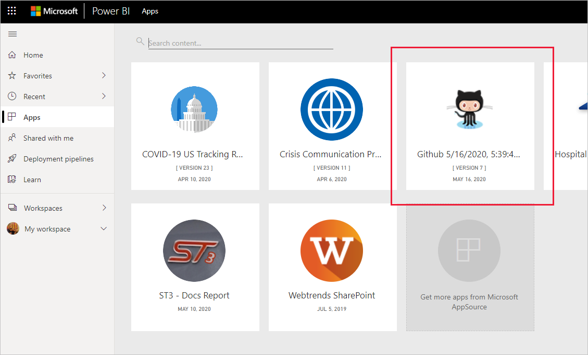

# <a name="connect-to-github-with-power-bi"></a>使用 Power BI 连接到 GitHub
本文介绍如何使用 Power BI 模板应用从 GitHub 帐户拉取数据。 模板应用生成一个带有仪表板、一组报表和数据集的工作区，以便你可以浏览 GitHub 数据。 适用于 Power BI 的 GitHub 应用使你通过参与、问题、拉取请求和活动用户的相关数据，深入了解 GitHub 存储机制（也称为存储库）。


安装模板应用后，可以更改仪表板和报表。 然后可以将其作为应用分发给组织中的同事。

连接到 [GitHub 模板应用](https://app.powerbi.com/groups/me/getapps/services/pbi-contentpacks.pbiapps-github)或进一步了解 Power BI 与 [GitHub 集成](https://powerbi.microsoft.com/integrations/github)。

还可以尝试 [GitHub 教程](service-tutorial-connect-to-github.md)。 它为 Power BI 文档安装有关公共存储库的实际 GitHub 数据。

>[!NOTE]
>此模板应用要求 GitHub 帐户具有存储库的访问权限。 以下是有关要求的详细信息。
>
>此模板应用不支持 GitHub Enterprise。

## <a name="install-the-app"></a>安装应用

1. 单击以下链接可转到该应用：[GitHub 模板应用](https://app.powerbi.com/groups/me/getapps/services/pbi-contentpacks.pbiapps-github)

1. 在应用的 AppSource 页面，选择“[立即获取](https://app.powerbi.com/groups/me/getapps/services/pbi-contentpacks.pbiapps-github)”。

    [](https://app.powerbi.com/groups/me/getapps/services/pbi-contentpacks.pbiapps-github)

1. 选择“安装”。 

    

    安装应用后，你将在应用页面上看到它。

   

## <a name="connect-to-data-sources"></a>连接到数据源

1. 选择应用页面上的图标以打开应用。

1. 在初始屏幕上，选择“浏览应用”。

   

   应用将打开，显示示例数据。

1. 选择页面顶部横幅上的“连接数据”链接。

   

1. 在出现的对话框中输入该存储库的存储库名称和存储库所有者。 请参阅下面有关[查找这些参数](#FindingParams)的详细信息。 完成后单击“下一步”。

   

1. 在出现的下一个对话框中，请确保将身份验证方法设置为 OAuth2。 不必对隐私设置执行任何操作。 准备就绪后，单击“登录”。

   

1. 输入 GitHub 凭据并遵循 GitHub 身份验证过程（如果你已通过浏览器登录，可跳过此步骤）。

   


登录后，报表将连接到数据源，并填充了最新的数据。 在此期间，活动监视器将转动。


除非在登录过程中禁用了此功能，否则报表数据将每天自动刷新一次。 也可以[设置自己的刷新计划](./refresh-scheduled-refresh.md)，根据需要使报表数据保持最新状态。

## <a name="customize-and-share"></a>自定义和共享

若要自定义并共享你的应用，请选择页面右上角的铅笔图标。


有关在工作区中编辑项目的信息，请参阅
* [Power BI 中的报表编辑器导览](../create-reports/service-the-report-editor-take-a-tour.md)
* [Power BI 服务中设计器的基本概念](../fundamentals/service-basic-concepts.md)

在工作区中完成对项目的所有更改后，即可发布和共享应用。 请参阅[发布应用](../collaborate-share/service-create-distribute-apps.md#publish-your-app)，了解如何执行此操作。

## <a name="whats-included-in-the-app"></a>应用中包含的内容
在 Power BI 中 GitHub 提供以下数据：     

| 表名 | 说明 |
| --- | --- |
| 参与 |参与者表提供每周汇总的参与者所执行的总新增、删除和提交操作。 包括前 100 个参与者。 |
| 问题 |列出所选存储库的所有问题，其中包含计算，如：解决问题的总时间和平均时间、未解决问题总数和已解决问题总数。 存储库中没有任何问题时，此表为空。 |
| 拉取请求 |此表包含此存储库和拉取请求者的所有拉取请求。 它也包含相关计算，如：有多少未解决、已解决和总的拉取请求、拉取这些请求花了多少时间，以及拉取请求所耗用的平均时间。 存储库中没有任何拉取请求时，此表为空。 |
| 用户 |下表提供了 GitHub 使用者或参与者的列表，他们针对所选的存储库进行参与、提出问题或解决拉取请求。 |
| 里程碑 |它具有所选存储库的所有里程碑。 |
| DateTable |此表包含从今天开始推算的和过去多年的日期，可让你按日期分析 GitHub 数据。 |
| ContributionPunchCard |此表可用作所选存储库的参与穿孔卡。 它会按一周中各天和一天中各小时来显示提交。 此表未连接到模型中的其他表。 |
| RepoDetails |此表提供所选存储库的详细信息。 |

## <a name="system-requirements"></a>系统要求
* 具有存储库访问权限的 GitHub。  
* 第一次登录期间授予给适用于 GitHub 的 Power BI 应用的权限。 有关撤消访问权限的详细信息，请参阅下文。  
* 具有足够可用的 API 调用以拉取和刷新数据。
>[!NOTE]
>此模板应用不支持 GitHub Enterprise。

### <a name="de-authorize-power-bi"></a>取消授权 Power BI
若要取消将 Power BI 连接到 GitHub 存储库的授权，可以撤销 GitHub 中的访问权限。 有关详细信息，请参阅 [GitHub 帮助](https://help.github.com/articles/keeping-your-ssh-keys-and-application-access-tokens-safe/#reviewing-your-authorized-applications-oauth)主题。

<a name="FindingParams"></a>
## <a name="finding-parameters"></a>查找参数
你可以通过查看 GuiHub 本身的存储库来确定所有者和存储库：


第一部分“Azure”是所有者，第二部分“azure-sdk-for-pho”是存储库本身。  将在存储库的 URL 中看到这两个相同的项目：

```console
<https://github.com/Azure/azure-sdk-for-php> .
```

## <a name="troubleshooting"></a>故障排除
如有必要，可以验证你的 GitHub 凭据。  

1. 在另一个浏览器窗口中，转到 GitHub 网站并登录到 GitHub。 将在 GitHub 网站的右上角看到你已登录。    
2. 在 GitHub 中，导航到你计划要在 Power BI 中访问的存储库的 URL。 例如： https://github.com/dotnet/corefx 。  
3. 返回到 Power BI，尝试连接到 GitHub。 在“配置 GitHub”对话框中，使用相同存储库的存储库名称和存储库所有者。  

## <a name="next-steps"></a>后续步骤

* [教程：使用 Power BI 连接到 GitHub 存储库](service-tutorial-connect-to-github.md)
* [在 Power BI 中创建新工作区](../collaborate-share/service-create-the-new-workspaces.md)
* [在 Power BI 中安装并使用应用](../consumer/end-user-apps.md)
* [连接到适用于外部服务的 Power BI 应用](service-connect-to-services.md)
* 是否有任何问题? [尝试咨询 Power BI 社区](https://community.powerbi.com/)
