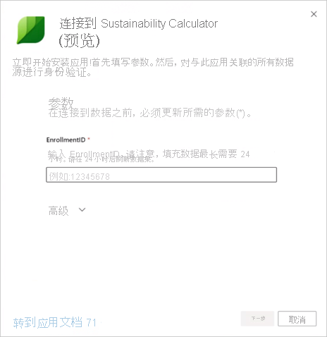
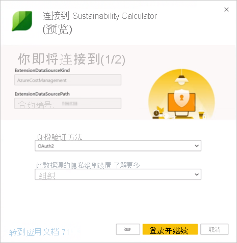

# Microsoft Sustainability Calculator 支持页

Microsoft Sustainability Calculator 提供有关与 Azure 服务关联的碳排放量数据的新见解。 负责在组织内进行报告和推动可持续发展的人员现在可以量化每个 Azure 订阅的碳排放量，还可以查看在 Azure 与本地数据中心中运行这些工作负荷所带来的估计碳减量。 此数据可用于范围 3 排放量的温室气体报告。

> [!NOTE]
> 此版本的连接器仅支持从 [Azure Enterprise 门户](https://ea.azure.com)进行注册。 目前尚不支持中国合约。

## 先决条件

若要访问 Microsoft Sustainability Calculator，你需要从组织的 Azure 管理员那里获得以下信息：

- 租户 ID
- 访问密钥
- 注册编号
- 只有 Azure 管理员角色才能进行身份验证并将计算器连接到公司数据。 （仅适用于 2020 年 12 月预览版）

若要查找公司注册编号：

1. 以管理员身份登录 [Azure Enterprise 门户](https://ea.azure.com)。
2. 选择左侧导航栏上的“Active Directory”或“管理”。 将显示公司注册编号。

   

若要查找公司的访问密钥：

1. 以管理员身份登录 [Azure Enterprise 门户](https://ea.azure.com)。
2. 选择“报表”，然后选择“API 访问密钥”以获取主注册帐户密钥。

## Sustainability Calculator 版本 2020 年 1 月

### 连接方式

[!INCLUDE [powerbi-service-apps-get-more-apps](../includes/powerbi-service-apps-get-more-apps.md)]

3. 选择“Microsoft Sustainability Calculator”，然后选择“立即获取”。

4. 在“安装此 Power BI 应用?”中，选择“安装” 。

5. 在“应用”窗格中，选择“Microsoft Sustainability Calculator”磁贴 。

6. 在“开始使用新应用”中，选择“连接” 。

   

7. 输入“公司名称”、“用户注册编号”和“月数”。 有关获取注册编号的信息，请参阅[先决条件](#prerequisites)。 选择“**下一页**”。

   

8. 输入以下信息：

   | 字段 | 值 |
   | --- | --- |
   | **身份验证方法** | 选择“密钥”。 |
   | **帐户密钥** | 输入访问密钥。 |
   | **此数据源的隐私级别设置** | 选择“组织”。 |

   

9. 选择“登录”。

10. 导入过程会自动开始。 导入完成后，在导航窗格中将会出现新的仪表板、报表和模型。 选择报表，查看已导入的数据。

### 使用应用

若要更新参数：

1. 导航到“数据集”设置，并访问与应用工作区关联的设置。
2. 根据需要更新“公司名称”、“用户注册编号”和“月数”。
3. 选择“刷新”，重新加载应用了新参数的数据。

## Sustainability Calculator 版本（预览）2020 年 12 月

立即通过 Microsoft Sustainability Calculator 计算基于云的碳排放量。

精准的碳排放核算需要来自合作伙伴、供应商和供应商的准确信息。 Microsoft Sustainability Calculator 为你提供了使用 Azure 和 Microsoft Dynamics 所生成的碳排放的透明度。

Microsoft 的碳核算涵盖了所有三个排放领域，其核算方法在 2018 年得到了斯坦福大学的验证。 它使用一致且准确的碳核算来量化 Microsoft 云服务对客户环境占用情况的影响。 Microsoft 是唯一的云提供商，可为客户提供这一级别的透明度，同时出于自愿或法定报告要求编译报告。

### 准备工作

Microsoft Sustainability Calculator 在 Power BI Pro 上运行。 如果没有 Power BI Pro，[立即获取免费试用版](https://powerbi.microsoft.com/power-bi-pro)。

需要 Azure 注册编号。 如果没有，请向贵组织的 Azure 管理员寻求帮助。 有关详细信息，请参阅[先决条件](#prerequisites)。

### 连接计算器：碳核算的五个简单步骤

1. 从 [AppSource](https://go.microsoft.com/fwlink/?linkid=2151690) 下载应用。

   

   还可以在 Power BI 中搜索应用。

   

2. 打开应用。

3. 输入注册编号。 选择“连接数据”，然后输入注册编号。 有关获取注册编号的详细信息，请参阅[先决条件](#prerequisites)。

   

4. 连接你的帐户：
   - 在“要连接的帐户(二选一)”的“身份验证方法”下，选择“OAuth2”，然后在“此数据源的隐私级别设置”下，选择“组织”。

      
 
   - 选择用户帐户。

      
       
   - 在“要连接的帐户(二选二)”的“身份验证方法”下，选择“匿名”，然后在“此数据源的隐私级别设置”下，选择“组织”。

     
    
5. 等待视图生成，可能需要 24 小时。

### 其他资源

- [操作说明视频](https://go.microsoft.com/fwlink/?linkid=2151608)
- [云计算的碳优势：与 WSP 的合作关系中的 Microsoft 云研究](https://download.microsoft.com/download/7/3/9/739BC4AD-A855-436E-961D-9C95EB51DAF9/Microsoft_Cloud_Carbon_Study_2018.pdf)

### 常见问题解答

#### 应用设置

在将数据与计算器连接时，我收到了一个错误。我该做什么？

首先，请在 Azure 成本管理中查看是否有 IT 管理员权限。 如果没有，请从管理员那里请求此访问权限。 接下来，请确保使用正确的注册编号。

我输入了注册编号，但未加载公司数据。问题是什么？

Sustainability Calculator 公共预览版可能需要 24 小时来加载数据。 24 小时后返回，选择 Power BI 中的“刷新”按钮。

Microsoft 是否尝试将排放的责任转移给我？

不是。 来自 Azure 服务的碳排放报告为 Microsoft 范围 1 和 2 排放，与行业标准[温室气体 (GHG) 协议](https://ghgprotocol.org/)一致。 GHG 协议将范围 3 排放定义为另一个实体代表你排放的排放量，这实际上是重复计算的。 Microsoft Sustainability Calculator 为与 Azure 服务使用相关联的范围 3 排放量提供了新的透明度，特别是范围 3 类别 1“购买的商品和服务”。

为什么使用 Microsoft 云的排放量要远远低于使用本地解决方案时的排放量？

Microsoft [在 2018 年发布了一项研究](https://blogs.microsoft.com/on-the-issues/2018/05/17/microsoft-cloud-delivers-when-it-comes-to-energy-efficiency-and-carbon-emission-reductions-study-finds/)，以评估 Microsoft 云和本地或传统数据中心之间的差异。 结果显示，与传统企业数据中心相比，Azure 计算和存储在节能方面相对前者高出了 52% 和 79%。根据具体的比较结果（过低效能、中等或高效能），给出了本地替代方案。 考虑到我们可再生能源的购买情况时，Azure 的碳效能要高出 79% 到 98%。 这些碳减量的原因是 Microsoft 云的四个关键功能：IT 运营效率、IT 设备效率、数据中心基础结构效率和再生电力。

如果 Microsoft 的运营是碳中和的，而且是由可再生能源驱动的，那么 Azure 服务的客户排放量为什么不是零呢？

Microsoft 的客户排放量不是零主要有两个原因。 第一个原因与 GHG 核算实践相关，第二个原因与此分析的边界相关。 为了实现碳中和操作，Microsoft 使用碳补偿来减少某些排放源，如备用发电机、制冷剂和车队的现场燃料燃烧。 这会将 Microsoft 的净排放量降至零。 在应用这些补偿之前，计算器会报告总 GHG 排放量，但为了进一步提高透明度，会在“GHG 报告”选项卡中报告已应用的补偿量和净排放量。 第二个原因是，除了与 Microsoft 数据中心运营相关的能源和排放量外，排放足迹还包括 Microsoft 运营范围之外的 Internet 服务提供商在 Microsoft 数据中心和 Azure 客户之间传输数据所使用的能源。

我应该如何使用此数据，以及在何处报告它？

你的排放量可以作为贵公司范围 3 间接碳排放量的一部分报告。 范围 3 排放量通常在可持续发展报告、CDP 气候变化和其他报告渠道中披露。 除了排放总量之外，减少的排放量还提供了一个明确的示例，说明贵公司使用 Microsoft Azure 服务的决定如何有助于全球减排。 在情景化环境中，根据 EPA 2020 年 1 月的等效计算器因数，该应用显示了与 GHG 减排相对应的已避免的对等车辆行驶里程数。

如何进一步减少排放量？

在 Azure 中，提高资源利用率和节约成本将降低 Azure 的使用对环境的影响。 例如，未使用的虚拟机无论是在云中还是在本地都是一种浪费。 调整虚拟机大小以提高计算利用率 (CUF)，就像使用物理服务器一样，可以减少每一个有用输出的能耗。 [Azure 成本管理](https://docs.microsoft.com/azure/cost-management-billing/costs/cost-mgt-best-practices)为你提供了计划、分析和减少支出的工具，以最大化你的云投资。

#### 方法

此工具背后的方法是什么？

Microsoft Sustainability Calculator 反映了特定云服务的使用和相关能源要求、提供这些服务的数据中心的效率、数据中心运营地区的电力燃料混合，以及 Microsoft 购买的可再生能源。 作为应用开发的一部分，该方法及其实施经过了第三方验证，以确保它符合世界资源研究所 (WRI)/世界可持续发展商业理事会 (WBCSD) 温室气体 (GHG) 协议公司核算和报告标准。 依照“ISO 14064-3：温室气体--第 3 部分：规范”对温室气体声明的确认和验证指导实施验证的范围，包括对 Azure 服务排放量的估计，但由于估算的反事实性质，排除了对本地排放量的估计。 在工具的“计算方法”选项卡中介绍了碳计算的更详细说明。

计算 Azure 碳足迹需要哪些数据？你是否访问了我所在公司的数据？

估计的碳计算是基于使用 Azure 已使用收入访问的 Azure 服务的用量来执行的。 计算器不会访问任何存储的客户数据。 使用数据与 Microsoft 的能源和碳跟踪数据相结合，根据提供 Azure 服务的数据中心计算与这些服务用量相关的估计排放量。

此计算是否包括所有 Azure 服务和所有 Azure 区域？

此估算包括所有 Azure 区域中与设置期间提供的租户 ID 相关联的所有 Azure 服务。

#### 描述本地排放

Microsoft Sustainability Calculator 在何处获取有关本地排放和运营的数据？

除了你提供的内容外，Microsoft Sustainability Calculator 不会获得任何关于本地数据中心的具体信息。 如后续常见问题解答中所述，Microsoft Sustainability Calculator 依赖于与本地备选方案的效率和能源组合有关的行业研究和用户输入，以形成对本地排放的估计。

有关本地评估的假设是什么？节能是否仅通过提高电源使用效率 (PUE) 来实现？

与 Microsoft 云服务关联的效率远不止 PUE 改进。 Microsoft 数据中心致力于优化 PUE，但主要效率改进是通过 IT 运营效率（动态预配、多租户、服务器利用率）和 IT 设备效率（根据服务调整硬件，确保更多能源用于有用的输出）以及数据中心基础结构效率（PUE 改进）。 我们于 [2018 年开展的研究工作](https://blogs.microsoft.com/on-the-issues/2018/05/17/microsoft-cloud-delivers-when-it-comes-to-energy-efficiency-and-carbon-emission-reductions-study-finds/)根据一系列的本地备选方案（从低效率到高效率数据中心）来量化这些节省量。 这些发现用于估计相应的本地数据中心为提供每个客户在 Microsoft 云上使用的相同服务所需的能源使用情况。

本地基础结构的假设能源组合是什么？

默认情况下，Microsoft Sustainability Calculator 基于电网中可再生能源和非可再生能源的组合来估算本地排放量。 假设本地数据中心与 Microsoft 数据中心位于同一电网。 然而，对于那些购买电网以外的可再生电力的客户（例如，通过电力购买协议），用户可以选择可再生电力的百分比，Microsoft Sustainability Calculator 将相应地调整本地排放。

应在何时选择“低”、“中”或“高”作为本地基础结构的效率？

用户应根据此处提供的设备和数据中心特征，选择最能代表本地部署的效率进行比较：

- 低：小型本地化数据中心的物理服务器和直接附加存储（500-1,999 平方英尺）
- 中：中间层内部数据中心的物理/虚拟化服务器和附加/专用存储组合（2,000-19,999 平方英尺）
- 高：高端内部数据中心的虚拟化服务器和专用存储（>20,000 平方英尺）
