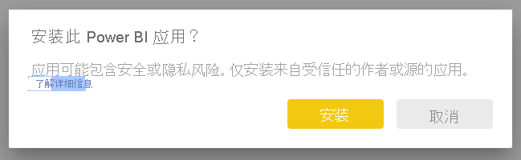
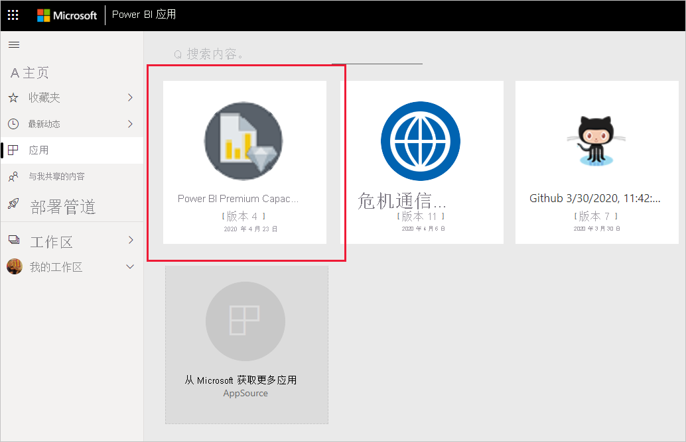
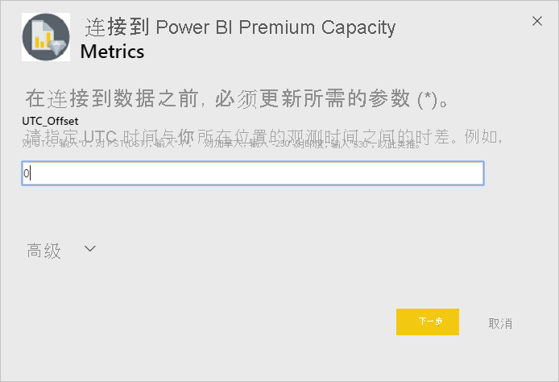
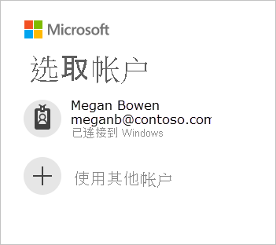
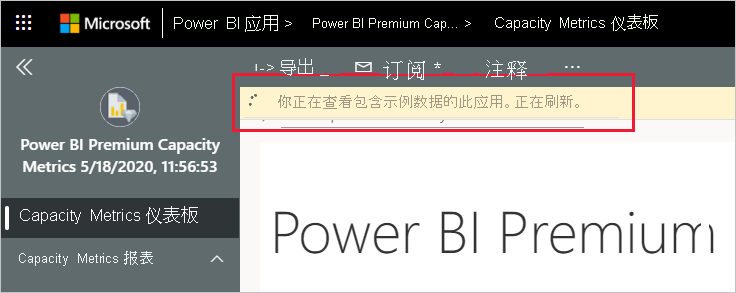
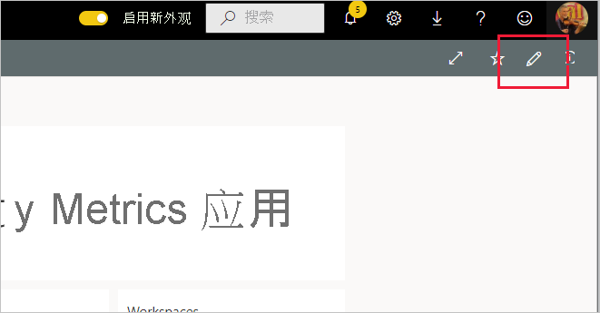

# 连接到 Power BI Premium Capacity Metrics

监视容量对于正确决定如何充分利用高级容量资源至关重要。 Power BI Premium Capacity Metrics 应用提供有关容量表现的深度信息。

本文介绍如何安装应用以及如何连接到数据源。 有关报表内容及其使用方式，请参阅[使用应用监视 Premium 容量](../admin/service-admin-premium-monitor-capacity.md)和 [Premium Capacity Metrics 应用博客文章](https://powerbi.microsoft.com/blog/premium-capacity-metrics-app-new-health-center-with-kpis-to-explore-relevant-metrics-and-steps-to-mitigate-issues/)。

安装该应用并连接到数据源后，可以根据需要对报表进行自定义。 然后可以将其分发给组织中的同事。

> [!NOTE]
> 安装模板应用需要[权限](./service-template-apps-install-distribute.md#prerequisites)。 如果发现自己没有足够的权限，请与 Power BI 管理员联系。

## 安装应用

1. 单击以下链接可转到该应用：[Power BI Premium Capacity Metrics 模板应用](https://app.powerbi.com/groups/me/getapps/services/pbi_pcmm.capacity-metrics-dxt)

1. 在应用的 AppSource 页面，选择“[立即获取](https://app.powerbi.com/groups/me/getapps/services/pbi_pcmm.capacity-metrics-dxt)”。

    

1. 选择“安装”。 

    

    > [!NOTE]
    > 如果以前安装过该应用，系统将询问你是否[覆盖该安装](./service-template-apps-install-distribute.md#update-a-template-app)或是否安装到新的工作区。

    安装应用后，你将在应用页面上看到它。

   

## 连接到数据源

1. 选择应用页面上的图标以打开应用。

1. 在初始屏幕上，选择“浏览”。

   

   应用将打开，显示示例数据。

1. 选择页面顶部横幅上的“连接数据”链接。

   

1. 在出现的对话框中，设置 UTC 时差，即协调世界时与你所在位置的时间之间的小时差。 然后，单击“**下一步**”。
  
   
   注意：半小时的格式应是十进制（例如，5.5、2.5等）。

1. 在出现的下一个对话框中，无需执行任何操作。 只需选择“登录”。

   

1. 在 Microsoft 登录屏幕，登录到 Power BI。

   

   登录后，报表将连接到数据源，并填充了最新的数据。 在此期间，活动监视器将转动。

   

   除非在登录过程中禁用了此功能，否则报表数据将每天自动刷新一次。 也可以[设置自己的刷新计划](./refresh-scheduled-refresh.md)，根据需要使报表数据保持最新状态。

## 自定义和共享

要开始自定义应用程序，请单击右上角的铅笔图标。

 

有关详细信息，请参阅[自定义和共享应用](./service-template-apps-install-distribute.md#customize-and-share-the-app)。

## 后续步骤
* [使用应用监视 Premium 容量](../admin/service-admin-premium-monitor-capacity.md)
* [Premium Capacity Metrics 应用博客文章](https://powerbi.microsoft.com/blog/premium-capacity-metrics-app-new-health-center-with-kpis-to-explore-relevant-metrics-and-steps-to-mitigate-issues/)
* [什么是 Power BI 模板应用？](./service-template-apps-overview.md)
* [在组织中安装和分发模板应用](./service-template-apps-install-distribute.md)
* 是否有任何问题? [尝试咨询 Power BI 社区](https://community.powerbi.com/)