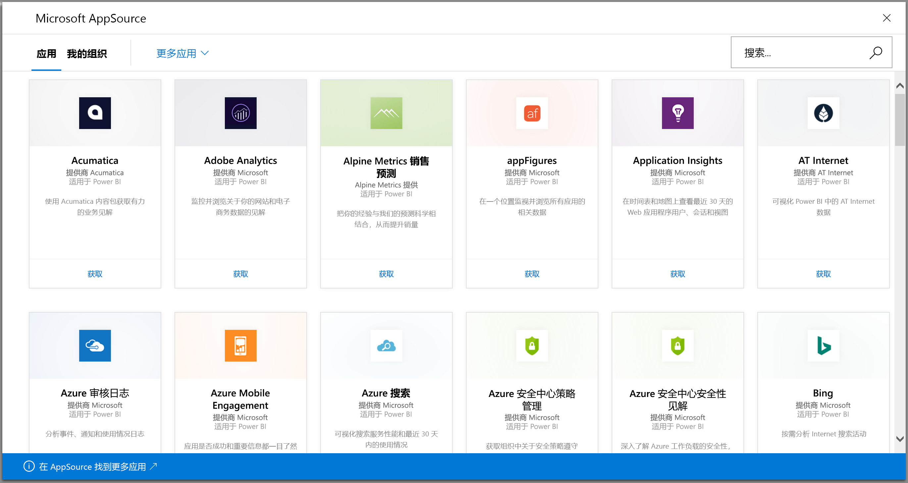

# 使用 Power BI 连接到要使用的服务
使用 Power BI，可连接到多个用于运行业务的服务，例如 Salesforce、Microsoft Dynamics 和 Google Analytics。 Power BI 首先使用凭据连接到服务。 然后创建包含一个仪表板和一组 Power BI 报表的 Power BI 工作区，这些报表可自动显示数据并提供业务视觉对象见解  。

>[!IMPORTANT]
>正在将服务内容包替换为[模板应用](./service-template-apps-overview.md)。 自 2019 年 9 月 25 日起，大量内容包已遭弃用。 你已安装但已被弃用的任何内容包将保留在你的帐户中，但不会对其提供任何文档或支持，也无法再安装它们。

登录到 Power BI，查看可以[连接的所有服务](https://app.powerbi.com/getdata/services)。 

安装应用后，可在应用中查看仪表板和报表，并在 Power BI 服务 ([https://app.powerbi.com](https://app.powerbi.com)) 中查看工作区。 也可在 Power BI 移动应用中查看它们。 在工作区中，可以修改仪表板和报表来满足组织的需要，然后将其作为应用分发给同事  。 

## 入门
[!INCLUDE [powerbi-service-apps-get-more-apps](../includes/powerbi-service-apps-get-more-apps.md)]

## 编辑仪表板和报表
导入完成后，新的应用将显示在“应用”页上。

1. 选择导航窗格中的“应用”，然后选择应用  。
   
     
2. 可以通过在问答框中键入来提出问题，或单击磁贴打开基础报表。 
   
    
   
    更改仪表板和报表以满足组织的需求。 然后[将应用分发到给同事](../collaborate-share/service-create-distribute-apps.md)

## 包含的内容
连接到服务后，将看到一个新创建的应用和工作区，其中包含一个仪表板、报表和数据集。 服务的数据侧重于特定方案，可能不包括来自服务的所有信息。 计划每天自动刷新一次数据。 可以通过选择数据集来控制计划。

还可[使用 Power BI Desktop 连接到许多服务](desktop-data-sources.md)，例如 Google Analytics，并创建你自己的自定义仪表板和报表。  

有关连接到特定服务的详细信息，请参阅个人帮助页面。

## 故障排除
**空磁贴**  
Power BI 首次连接到服务时，你可能会在仪表板上看到一组空磁贴。 如果 2 小时后，仪表板仍然为空，很有可能是连接失败造成的。 如果没有看到包含可修复此问题相关信息的错误消息，请提交支持票证。

* 选择右上角的问号图标 (“?”  )，然后选择“获取帮助”  。
  
    

**缺少信息**  
仪表板和报表包括侧重于特定方案的服务中的内容。 如果要在应用中查找某个特定指标但看不到该指标，请在[Power BI 支持](https://support.powerbi.com/forums/265200-power-bi)页上提交问题。

## 服务建议
你是否使用某种服务并希望获得该服务的 Power BI 应用？ 请转到 [Power BI 支持](https://support.powerbi.com/forums/265200-power-bi)页面告诉我们。

如果你有兴趣创建自己分发的模板应用，请参阅[在 Power BI 中创建模板应用](service-template-apps-create.md)。 Power BI 合作伙伴几乎无需编码，即可构建 Power BI 应用，并将其部署到 Power BI 客户。 

## 后续步骤
* [将应用分发到给同事](../collaborate-share/service-create-distribute-apps.md)
* [在 Power BI 中创建新工作区](../collaborate-share/service-create-the-new-workspaces.md)
* 是否有任何问题？ [尝试咨询 Power BI 社区](https://community.powerbi.com/)