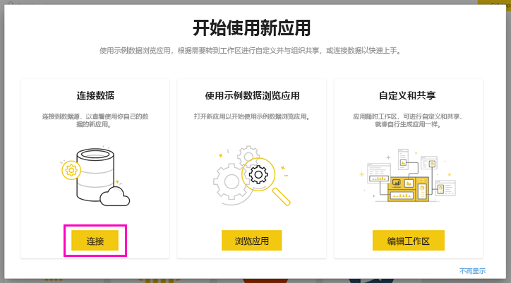
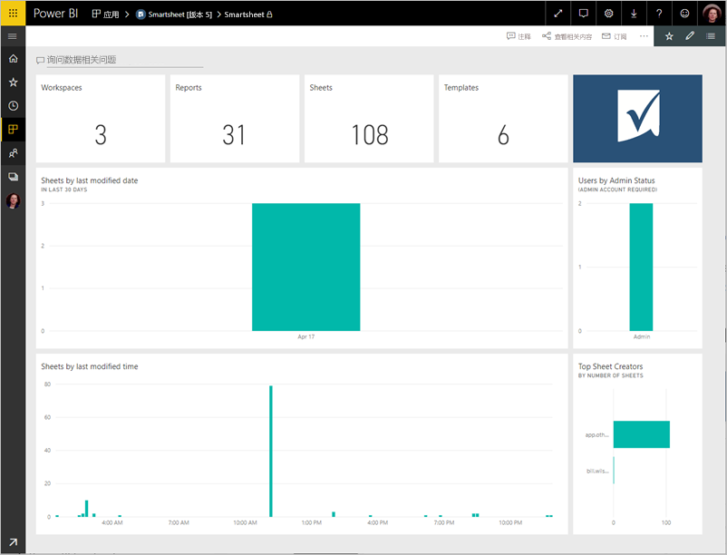
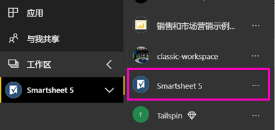
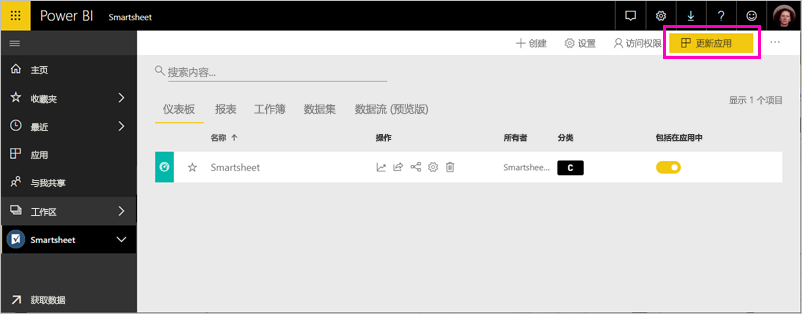

# 使用 Power BI 连接到 Smartsheet
本文将引导你通过 Power BI 模板应用从 Smartsheet 帐户提取数据。 Smartsheet 提供了协作和文件共享的简单平台。 Power BI 的 Smartsheet 模板应用包提供显示了你的 Smartsheet 帐户概述的仪表板、报表和数据集。 还可以使用 [Power BI Desktop](desktop-connect-to-data.md) 直接连接到你帐户中的单独工作表。 

安装模板应用后，可以更改仪表板和报表。 然后可以将其作为应用分发给组织中的同事。

连接到 Power BI 的 [Smartsheet 模板应用](https://app.powerbi.com/groups/me/getapps/services/pbi-contentpacks.pbiapps-smartsheet)。

>[!NOTE]
>最好使用 Smartsheet 管理员帐户连接和加载 Power BI 模板应用，因为该帐户具有额外的访问权限。

## 如何连接

[!INCLUDE [powerbi-service-apps-get-more-apps](../includes/powerbi-service-apps-get-more-apps.md)]

3. 选择“Smartsheet”\>“立即获取”。
4. 在“安装此 Power BI 应用?”中，选择“安装” 。
4. 在“应用”窗格中，选择“Smartsheet”磁贴 。

    

6. 在“开始使用新应用”中，选择“连接” 。

    

4. 对于身份验证方法，选择 **oAuth2 \> 登录**。
   
   出现提示时，输入 Smartsheet 凭据，然后按照身份验证过程进行操作。
   
   
   
   

5. Power BI 导入数据后，将打开 Smartsheet 仪表板。
   
   

## 修改和分发应用

现已安装 Smartsheet 模板应用。 这意味着同时创建了 Smartsheet 工作区。 在工作区中，可以更改报表和仪表板，然后将其作为应用分发给组织中的同事。 

1. 若要查看新 Smartsheet 工作区的所有内容，请在导航窗格中选择“工作区” > “Smartsheet”。 

    

    此视图是工作区的内容列表。 在右上角，可以看到“更新应用”。 准备好将应用分发给同事后，就可以开始了。 

    

2. 选择“报表”和“数据集”可查看工作区中的其他元素 。

    阅读并了解如何向同事[分发应用](../collaborate-share/service-create-distribute-apps.md)。

## 包含的内容
Power BI 的 Smartsheet 模板应用包含你的 Smartsheet 帐户的概述，例如你拥有的工作区、报表和工作表的数量及其修改时间等。管理员用户还将在看到有关系统中用户的一些信息，如顶层工作表创建者。  

若要直接连接到你帐户中的单独工作表，可以使用 [Power BI Desktop](desktop-connect-to-data.md) 中的 Smartsheet 连接器。  

## 后续步骤

* [在 Power BI 中创建新工作区](../collaborate-share/service-create-the-new-workspaces.md)
* [在 Power BI 中安装并使用应用](../consumer/end-user-apps.md)
* [连接到适用于外部服务的 Power BI 应用](service-connect-to-services.md)
* 是否有任何问题? [尝试咨询 Power BI 社区](https://community.powerbi.com/)