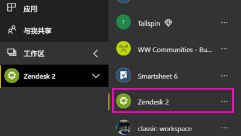
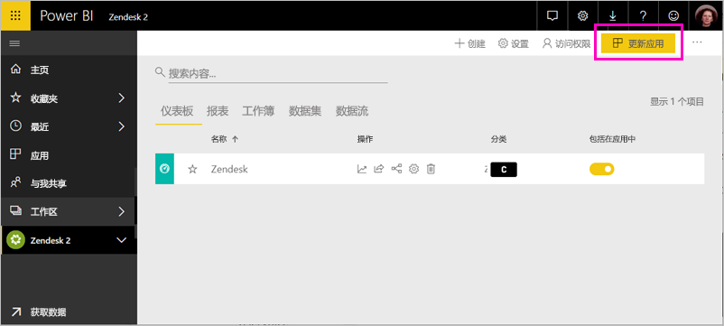

# 使用 Power BI 连接到 Zendesk

本文介绍如何使用 Power BI 模板应用从 Zendesk 帐户拉取数据。 Zendesk 应用提供 Power BI 仪表板和一组 Power BI 报表，这些报表提供有关你的票证量和代理性能的深入分析。 此数据每天自动刷新一次。 

安装模板应用后，可以自定义仪表板和报表，以突出显示你最关注的信息。 然后可以将其作为应用分发给组织中的同事。

连接到 [Zendesk 模板应用](https://app.powerbi.com/getdata/services/zendesk)或进一步了解 Power BI 与 [Zendesk 集成](https://powerbi.microsoft.com/integrations/zendesk)。

安装模板应用后，可以更改仪表板和报表。 然后可以将其作为应用分发给组织中的同事。

>[!NOTE]
>需要使用 Zendesk 管理员帐户进行连接。 以下是有关[要求](#system-requirements)的详细信息。

## 如何连接

[!INCLUDE [powerbi-service-apps-get-more-apps](../includes/powerbi-service-apps-get-more-apps.md)]

3. 选择“Zendesk”\>“立即获取”。
4. 在“安装此 Power BI 应用?”中，选择“安装” 。
4. 在“应用”窗格中，选择“Zendesk”磁贴 。

    

6. 在“开始使用新应用”中，选择“连接” 。

    

4. 提供与你的帐户相关联的 URL。 URL 的格式为 **https://company.zendesk.com** 。 请参阅下面有关[查找这些参数](#finding-parameters)的详细信息。
   
   

5. 出现提示时，输入你的 Zendesk 凭据。  选择 **oAuth 2** 作为身份验证机制，然后单击**登录**。 按照 Zendesk 身份验证流程进行操作。 （如果你已经在浏览器中登录到 Zendesk，可能不会提示你输入凭据。）
   
   > [!NOTE]
   > 此模板应用需要使用 Zendesk 管理员帐户连接。 
   > 
   
   
6. 单击**允许**以允许 Power BI 访问你的 Zendesk 数据。
   
   
7. 单击“连接”以开始导入过程。 
8. Power BI 导入数据后，你会看到 Zendesk 应用的内容列表：新的仪表板、报表和数据集。
9. 选择仪表板以开始浏览过程。

    
   
## 修改和分发应用

现已安装 Zendesk 模板应用。 这意味着同时创建了 Zendesk 工作区。 在工作区中，可以更改报表和仪表板，然后将其作为应用分发给组织中的同事。 

1. 若要查看新 Zendesk 工作区的所有内容，请在导航窗格中选择“工作区” > “Zendesk” 。 

    

    此视图是工作区的内容列表。 在右上角，可以看到“更新应用”。 准备好将应用分发给同事后，就可以开始了。 

    

2. 选择“报表”和“数据集”可查看工作区中的其他元素 。

    阅读并了解如何向同事[分发应用](../collaborate-share/service-create-distribute-apps.md)。

## 系统要求
访问 Zendesk 模板应用需要 Zendesk 管理员帐户。 如果你是代理或最终用户，想要查看你的 Zendesk 数据，请在 [Power BI Desktop](desktop-connect-to-data.md) 中添加建议并查看 Zendesk 连接器。

## 查找参数
Zendesk URL 将与你用于登录 Zendesk 帐户的 URL 相同。 如果不能确定你的 Zendesk URL，可以使用 Zendesk [登录帮助](https://www.zendesk.com/login/)。

## 故障排除
如果遇到连接问题，请检查你的 Zendesk URL，确保使用的是 Zendesk 管理员帐户。

## 后续步骤

* [在 Power BI 中创建新工作区](../collaborate-share/service-create-the-new-workspaces.md)
* [在 Power BI 中安装并使用应用](../consumer/end-user-apps.md)
* [连接到适用于外部服务的 Power BI 应用](service-connect-to-services.md)
* 是否有任何问题? [尝试咨询 Power BI 社区](https://community.powerbi.com/)
