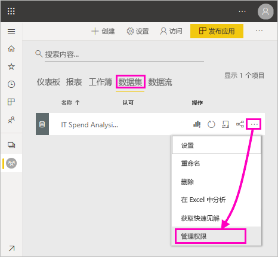
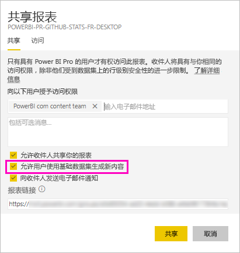
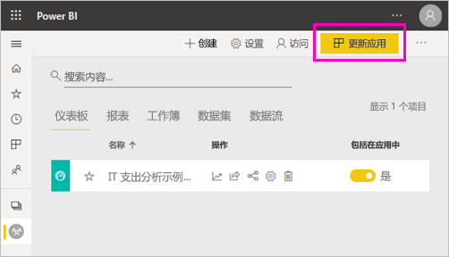
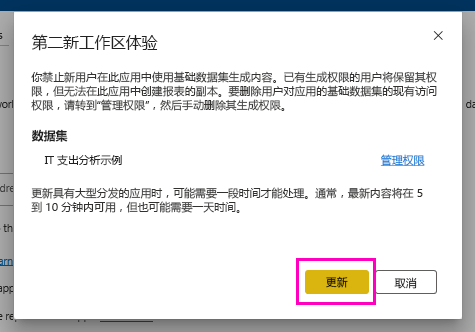

# 共享数据集的生成权限

在 Power BI Desktop 中创建报表时，该报表中的数据将存储在“数据模型”中。 将报表发布到 Power BI 服务时，也会将数据发布为数据集。 你可以向其他人提供该报表的生成权限，以便他们能够发现和重复使用你所共享的数据集。 本文介绍如何使用生成权限来控制对数据的访问。

生成权限适用于数据集。 为用户提供生成权限后，他们可以在数据集上生成报表、仪表板、问答的固定磁贴和 Insights 发现等新内容。 

用户还需要生成权限才能在 Power BI 之外处理该数据 ：

- 导出基础数据。
- 在数据集上生成新内容，例如使用[在 Excel 中分析](../collaborate-share/service-analyze-in-excel.md)。
- 通过 XMLA 终结点访问数据。

## 提供生成权限的方式

可以通过多种不同的方式为数据集提供生成权限：

- 至少具有“参与者”角色的工作区的成员自动拥有该工作区中的数据集的“生成”权限以及复制报表的权限。
 
- 数据集所在的工作区中的成员可以在“权限中心”将权限分配给特定用户或安全组。 如果你是工作区的成员，请选择数据集旁边的“更多选项”(...) >“管理权限” 。

    

    此操作将打开该数据集的“权限中心”，你可以在其中设置和更改权限。

    

- 数据集所在的工作区中的管理员或成员可以在应用发布期间决定，具有应用权限的用户也可以获得底层数据集的生成权限。 有关详细信息，请参阅[共享数据集](service-datasets-share.md)。

- 假设你在数据集上具有重新共享和生成权限。 共享基于该数据集生成的报表或仪表板时，你可以指定收件人也可以获得底层数据集的生成权限。

    

你可以删除个人拥有的数据集生成权限。 如果你删除，他们仍然可以查看基于共享数据集的报表，但不能再进行编辑。 有关详细信息，请参阅下一部分。

## 删除数据集的生成权限

有时可能需要删除共享数据集的某些用户的生成权限。 

1. 在工作区中，转到“数据集”列表页。 
1. 选择数据集旁边的“更多选项”(...) >“管理权限” 。

    

1. 选择名称旁边的“更多选项”(...) >“删除生成” 。

    

    他们仍然可以查看基于共享数据集生成的报表，但不能再进行编辑。

### 删除应用中的数据集的生成权限

假设你已将应用从工作区分发给一组人员。 稍后，你决定删除某些人员对应用的访问权限。 删除对应用的访问权限不会自动删除其生成权限和重新共享权限。 这是额外的步骤。 

1. 在工作区列表页中，选择“更新应用”。 

    

1. 在“权限”选项卡上，选择“X”以删除人员或组。 

    
1. 选择“更新应用”。

    你会看到一条消息，说明你需要转到“管理权限”，以便删除具有现有访问权限的用户的生成权限。 

    

1. 选择“更新”。

1. 在工作区中，转到“数据集”列表页。 
1. 选择数据集旁边的“更多选项”(...) >“管理权限” 。

    

1. 选择名称旁边的“更多选项”(...) >“删除生成” 。

    

    他们仍然可以查看基于共享数据集生成的报表，但不能再进行编辑。

## 更细粒度的权限

Power BI 在 2019 年 6 月引入了生成权限，将其作为现有权限（读取和重新共享）的补充。 已在当时通过应用权限、共享或工作区访问获得数据集读取权限的用户也都获得了上述数据集的生成权限。 他们自动获得了生成权限，因为他们可以凭借读取权限来使用“在 Excel 中分析”或“导出”在数据集上生成新内容。

凭借这个更细粒度的生成权限，你可以选择仅可查看现有报表或仪表板中内容的人选，和可创建与底层数据集相连内容的人选。

如果数据集工作区之外的报表在使用你的数据集，则你无法删除该数据集。 而是会看到一条错误消息。

你可以删除生成权限。 如果删除，权限遭到撤消的人员仍可查看报表，但无法再编辑报表和导出基础数据。 具有只读权限的用户仍可导出汇总数据。 

## 后续步骤

- [跨工作区使用数据集](service-datasets-across-workspaces.md)
- 是否有任何问题? [尝试咨询 Power BI 社区](https://community.powerbi.com/)
