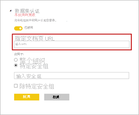

# 验证数据集 - Power BI

你的组织可以对作为关键信息权威源的数据集进行认证。 当报表设计器开始创建报表并查找可靠数据时，这些数据集将表现突出。 认证是一个具有高度选择性的过程，只有最有价值的数据集才能获得认证。 Power BI 管理员有一个新设置，因此他们可以严格控制可以认证数据集的人选。 管理员可以确保认证过程产生可靠且权威的数据集，以便在整个组织中使用。

作为数据集所有者，你可以请求对已推广数据集进行认证。 “认证”租户设置中定义的选定用户组决定了哪些数据集可认证。 在数据集发现体验期间，认证数据集的人员的名称显示在工具提示中。 将鼠标悬停在“已认证”标签上将会看到它。 有关详细信息，请参阅[设置数据集和数据流认证](../admin/service-admin-setup-certification.md)。

Power BI 提供了两种方式来认可数据集。 除了认证之外，另一种方法是“推广”。 作为数据集所有者或工作区成员，你可以在你的数据集准备就绪可供广泛使用时对其进行推广。 有关详细信息，请参阅[推广数据集](service-datasets-promote.md)。 

## 验证数据集

Power BI 管理员可在“认可”设置页面上提供“了解详细信息”链接的 URL 。  他们可以链接到有关验证过程的文档。 如果他们未提供“了解详细信息”链接的目标，则默认指向本文。

被任命验证数据集的人选显然责任重大。 审批过程开始时，数据集创建者会就认证数据集事宜与你联系。 当你认为数据集需要验证时，可进行下面的步骤。

1. 对于数据集所在的工作区，数据集所有者需要为你提供成员权限。
1. 如果管理员将你任命为可认证数据集的人选，则可以使用数据库的“设置”的“认可”部分中的“已认证”选项  。 选择“验证”。
1. 选择**应用**。

详细了解管理员如何[跨工作区控制数据集的使用](service-datasets-admin-across-workspaces.md)。

## 后续步骤

* [设置数据集和数据流认证](../admin/service-admin-setup-certification.md)
* [跨工作区使用数据集](service-datasets-across-workspaces.md)
* 是否有任何问题? [尝试咨询 Power BI 社区](https://community.powerbi.com/)
