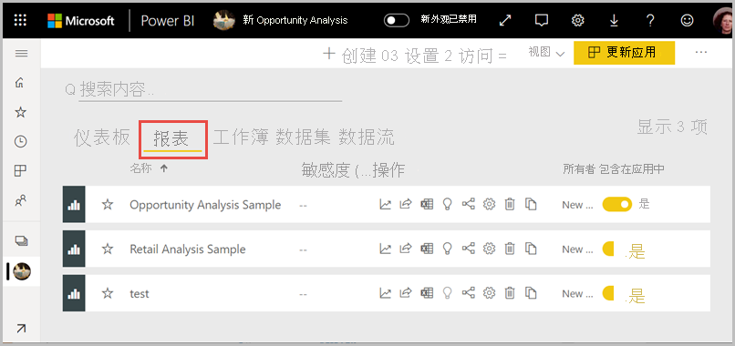
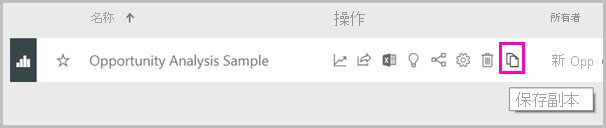
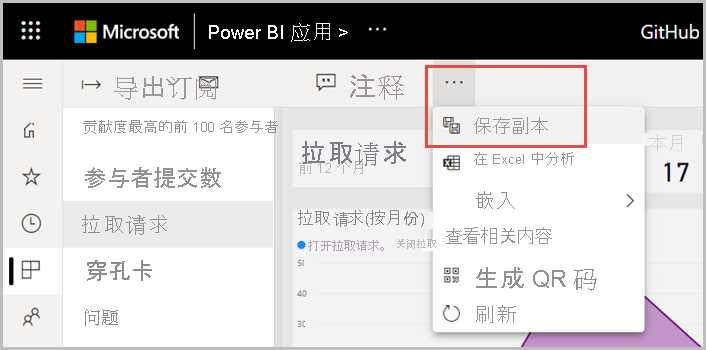
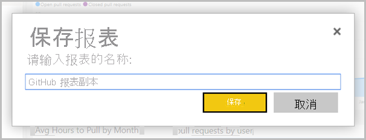
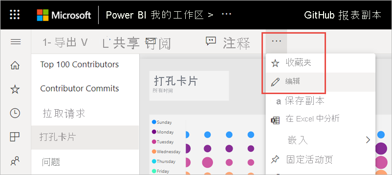
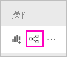
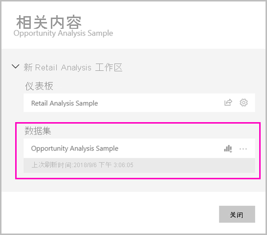
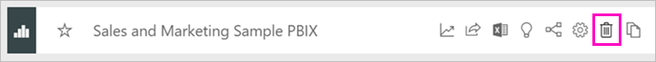

# 从其他工作区复制报表

在工作区或应用中找到自己喜欢的报表时，你可以复制它，然后将其保存到不同工作区。 然后，你可以修改该报表的副本，添加或删除视觉对象和其他元素。 无需担心如何创建数据模型。 它已为你创建。 修改现有报表比从头开始创建要容易得多。 但是，当你从工作区创建应用时，有时无法从应用中发布报表副本。 有关详细信息，请参阅[“跨工作区使用数据集”一文中的其他注意事项和限制](service-datasets-across-workspaces.md#considerations-and-limitations)。

## 先决条件

- 若要复制报表，即使原始报表位于高级容量的工作区中，你也需要一个 Pro 许可证。
- 若要复制报表，或基于一个工作区中的数据集在另一个工作区中创建报表，则需要数据集的生成权限。 对于原始工作区中的数据集，拥有管理员、成员和参与者角色的相关人员通过其工作区角色自动获得生成权限。 有关详细信息，请参阅[新工作区中的角色](../collaborate-share/service-new-workspaces.md#roles-in-the-new-workspaces)。

## 在工作区中保存报表的副本

1. 在工作区中，转到“报表”列表视图。

    

1. 在“操作”下，选择“保存副本” 。

    

    只有当报表位于新的体验工作区且你具有[生成权限](service-datasets-build-permissions.md)时，你才会看到“保存副本”图标。 即使你有权访问工作区，也必须具有数据集的生成权限。

3. 在“保存此报表的副本”中，为报表提供名称并选择目标工作区。

    

    可以将报表保存到当前工作区或 Power BI 服务中的其他工作区。 你只看到新的体验工作区，而你是其中的一名成员。 
  
4. 选择“保存”。

    如果报表基于工作区外的数据集，Power BI 不仅会自动创建报表的副本，还会在数据集列表中创建一个条目。 此数据集的图标与工作区中数据集的图标不同： 
    
    这样，工作区的成员可以区分哪些报表和仪表板使用工作区外的数据集。 该条目显示有关数据集的信息以及一些选择操作。

    

    有关报表和相关数据集的详细信息，请参阅本文中的[报表副本](#your-copy-of-the-report)。

## 在应用中复制报表

1. 在应用中，打开要复制的报表。
2. 在菜单栏中，选择“更多选项”( **...** ) >“保存副本”。

    

    只有当报表位于新的体验工作区且你具有[生成权限](service-datasets-build-permissions.md)时，你才会看到“保存副本”选项。

3. “为报表指定名称”>“保存”。

    

    副本将自动保存到“我的工作区”。

4. 选择“转到报表”打开副本。

## 报表副本

保存报表副本时，将创建与该数据集的实时连接，并且可以使用完整的可用数据集打开报表创建体验。 

尚未创建数据集的副本。 数据集仍位于其原始位置。 可以在自己的报表中使用数据集中的所有表和度量值。 数据集上应用了行级别安全性 (RLS) 限制，因此你只能根据 RLS 角色查看有权查看的数据。

## 查看相关数据集

如果一个工作区中的报表基于另一个工作区中的数据集，则可能需要了解有关其所基于数据集的详细信息。

1. 在“报表”列表视图中，选择“查看相关项”。

    

1. “相关内容”对话框显示所有相关项。 在此列表中，数据集与任何其他数据集类似。 你无法判断它位于不同的工作区。 这是一个已知问题。
 
    

## 删除报表及其共享数据集

你可能决定不再需要工作区中的报表及其关联的共享数据集。

1. 删除报表。 在工作区的报表列表中，选择“删除”图标。

    

2. 在数据集列表中，可以看到共享数据集没有“删除”图标。 刷新页面，或转到其他页，然后返回。 数据集将消失。 如果没有，请查看“相关视图”。 它可能与工作区中的另一个表相关。

    

    > [!NOTE]
    > 删除此工作区中的共享数据集不会删除数据集。 它只是删除对它的引用。

## 后续步骤

- [跨工作区使用数据集](service-datasets-across-workspaces.md)
- 是否有任何问题? [尝试咨询 Power BI 社区](https://community.powerbi.com/)
