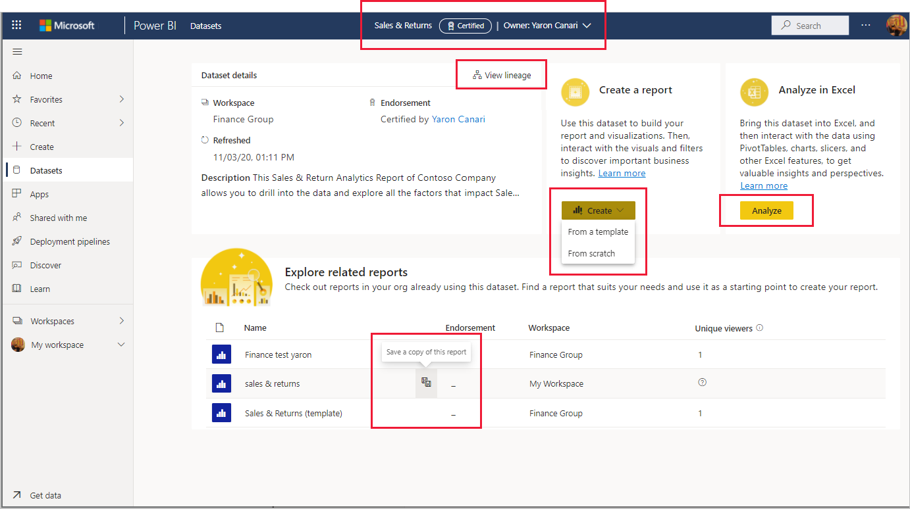

# 使用数据集中心的数据集发现（预览）

使用数据集中心可以轻松查找、浏览和使用组织中的数据集。 它提供有关数据集，以及基于这些数据集创建报表或将这些数据集与“在 Excel 中分析”结合使用的入口点的信息。

数据集中心在许多情况下可能很有用：
* 数据集所有者可以查看数据集使用情况指标、刷新状态、相关报表和沿袭，以帮助监视和管理其数据集。
* 报表创建者可以使用该中心查找生成报表所依据的适当数据集，并使用链接轻松地基于数据集从头开始或从模板创建报表。
* 报表使用者可以使用此页基于可信数据集查找报表。

通过便于查找质量数据集及其相关报表，数据集中心有助于防止创建冗余报表。 它还便于查找要用作创建新报表的起点的良好报表。

本文介绍数据集中心显示的内容，并介绍如何使用它。 对于数据集所有者，它还包含一些有关如何[增强数据集的可发现性和实用性](#make-your-dataset-discoverable)的提示。

我在数据集中心中看到哪些数据集？
* 要使数据集显示在数据集中心中，它必须位于[新的工作区体验](../collaborate-share/service-new-workspaces.md)中。
* 你可以在数据集中心中看到的数据集是你至少对其具有[生成权限](service-datasets-build-permissions.md)的数据集。
* 如果你是免费用户，则只能看到“我的工作区”中的数据集，或者“高级容量”工作区中你对其具有[生成权限](service-datasets-build-permissions.md)的数据集。

## 查找所需的数据集

数据集中心页上会启动数据集发现体验。 若要访问数据集中心页，请执行以下操作：
* 在 Power BI 服务中：在导航窗格中选择“数据集”。
* 在 Teams 的 Power BI 应用中：选择“数据集”选项卡或在导航窗格中选择“数据集”。

下图显示了 Power BI 服务中的数据集中心。

数据集中心向你提供建议的数据集，以及组织中有权访问的所有数据集的列表。

以下各节介绍了这些部分以及可执行的操作。

### 建议的数据集

建议的数据集是基于计算向你提供的已认可数据集（已升级或已认证），该计算将考虑多久之前刷新过这些数据集以及多久之前访问过与之相关的报表和/或仪表板。

### 数据集列表

数据集列表向你显示组织中你至少对其具有[生成权限](service-datasets-build-permissions.md)的数据集。 此列表具有三个选项卡，用于筛选数据集列表。
* 所有数据集：显示组织中你至少对其具有[生成权限](service-datasets-build-permissions.md)的所有数据集。
* 最近：显示你最近访问过其相关报表的数据集。 访问报表时，可能会有几分钟的延迟，直到相关数据集显示在“最近”列中。
* 我的数据集：显示你拥有的数据集。 

使用搜索框进一步筛选当前选项卡上的项。

下面介绍了列表中的列。 单击列标题以按该列进行排序。 
* 名称：数据集名称。 单击数据集名称以浏览使用此数据集生成的报表。
* 认可：认可状态。
* 所有者：数据集所有者。
* 工作区：数据集所在的工作区。
* 已刷新：上次刷新时间（舍入为小时、日、月、年）。 请参阅数据集详细信息页上的数据集信息，以了解上次刷新的确切时间）。
* 敏感度：敏感度（如果已设置）。 单击“信息”图标以查看敏感度标签说明。

### 通过“在 Excel 中分析”来创建新报表或将数据提取到 Excel 中

若要基于数据集创建新报表，或使用[在 Excel 中分析](../collaborate-share/service-analyze-in-excel.md)将数据提取到 Excel 中，请选择建议的数据集磁贴右下角或数据集列表的数据集行上的“更多选项(...)”。 其他操作可能会显示在下拉菜单上，具体取决于你对数据集具有的权限。

基于数据集创建新报表时，将打开报表编辑画布。 如果你对包含数据集的工作区具有写入权限，则在保存新报表时，它将保存在该工作区中。 如果你对该工作区没有写入权限，或者如果你是免费用户且数据集驻留在高级容量工作区中，则新报表将保存在“我的工作区”中。

## 查看数据集详细信息并浏览相关报表

若要查看有关数据集的详细信息，浏览相关报表，或基于数据集从头开始或从模板创建新报表，请从建议的数据集或数据集列表中选择一个数据集。 将打开一个页面，其中显示有关数据集的信息，列出基于数据集生成的报表，并提供基于数据集创建新报表或通过[在 Excel 中分析](../collaborate-share/service-analyze-in-excel.md)将数据提取到 Excel 中的入口点。

页面页眉显示数据集名称、认可（如果有）和数据集所有者。 若要将电子邮件发送到数据集所有者或数据集认证者（如果有），请单击页眉，然后单击所有者的名称。

### 数据集详细信息

“数据集详细信息”部分显示了数据集所在的工作区的名称、上次刷新的确切时间、敏感度（如果已设置）、数据集说明（如果有）以及认证者名称（如果已认证）。 还可以从此处打开数据集沿袭。

### 相关报表

“浏览相关报表”部分显示了基于所选数据集生成的所有报表。 可以通过在列表中选择报表行，然后单击“保存此报表的副本”图标来创建报表的副本。

相关报表列表中的列包括：
* 名称：报表名称。 如果名称以“（模板）”结尾，则表示已将此报表专门构造为用作模板。
* 认可：认可状态。
* 工作区：报表所在的工作区的名称。

### 创建基于数据集生成的报表

在“创建报表”部分中，单击“创建”按钮。 如果数据集有报表模板，下拉菜单将提供两个选项：
* 从模板：在“我的工作区”中创建模板的副本。
* 从头开始：在基于数据集生成的新报表上打开报表编辑画布。 如果你对包含数据集的工作区具有写入权限，则在保存新报表时，它将保存在该工作区中。 如果你对该工作区没有写入权限，或者如果你是免费用户且数据集驻留在高级容量工作区中，则新报表将保存在“我的工作区”中。

如果没有任何报表模板，则单击“创建”将直接打开报表编辑画布。

>[!NOTE]
> “创建报表”下拉列表中只会显示一个模板，即使此数据集存在多个报表模板也是如此。 

### 通过“在 Excel 中分析”将数据集提取到 Excel 中

在“在 Excel 中分析”部分中，选择“分析”以通过“在 Excel 中分析”将数据集提取到 Excel 中。

## 使数据集可发现

可以通过多种方式增强数据集的可发现性：
* 认可你的数据集：可以升级或认证你的数据集，使用户能够更轻松地进行查找并让他们知道它是可信的数据源。 已认可的数据集标有徽章，可在 Power BI 中轻松识别。 在数据集中心中，只有已认可的数据集才显示在“建议的数据集”部分中，默认情况下，数据集列表首先会列出已认可的数据集。

    [了解如何认可数据集](../collaborate-share/service-endorse-content.md)。 
* 提供数据集的有意义的说明：可以通过提供数据集的有用且有意义的说明来帮助用户发现正确的数据集。 [在认可数据集的过程中提供说明](../collaborate-share/service-endorse-content.md#promote-content)。 
* 为你的数据集指定便于记忆的图像：通过为用户提供便于记忆的图像，可以更轻松地查找和记住你的数据集。 这会使你的数据集在数据集中心页和支持显示数据集图像的任何其他位置上更醒目。 若要为你的数据集指定图像，请打开数据集的设置，然后展开“数据集图像”部分。
* 创建基于数据集生成的报表模板：可以创建一个报表模板，用户可以使用该模板基于你的数据集开始生成自己的报表。 此模板只是设计用于记住将其用作模板的常规报表。 保存时，必须将后缀“（模板）”添加到报表名称中，例如“每月销售额（模板）”。

    当用户在数据集中心的“数据集详细信息”视图的“创建报表”部分中选择“创建”>“从模板”时，将在用户的“我的工作区”中创建模板的副本，然后在报表编辑画布中打开。

    也可在数据集中心的“数据集详细信息”视图的相关报表列表中轻松识别报表模板。
  
## 后续步骤
* [跨工作区使用数据集](service-datasets-across-workspaces.md)
* [基于来自不同工作区的数据集创建报表](service-datasets-discover-across-workspaces.md)
* [认可你的数据集](../collaborate-share/service-endorse-content.md)
* 是否有任何问题? [尝试咨询 Power BI 社区](https://community.powerbi.com/)
