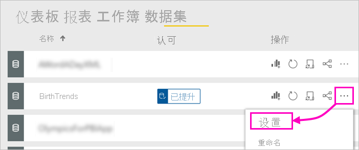
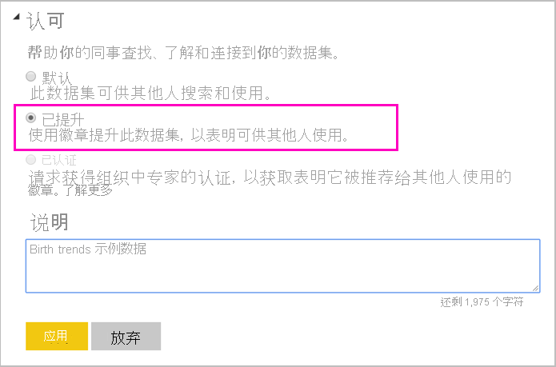

# 推广数据集 - Power BI

Power BI 报表创建者现可访问许多不同的数据集，因此企业需要引导他们访问可靠、高质量的数据集。 Power BI 提供了两种认可数据集的方法：

- **推广**：数据集所有者可在其自己的数据集准备就绪可供广泛使用时对其进行推广。 任何具有写入权限的工作区成员都可以推广数据集。 对于谁可以推广数据集没有限制。 推广支持协作性传播组织内部的数据集。 本文介绍如何推广数据集。
- **验证**：你可请求对推广的数据集进行验证。 “数据集验证”租户管理设置中定义的选定用户组确定哪些数据集可验证。 有关详细信息，请参阅[验证数据集](service-datasets-certify.md)。

## 推广数据集

数据集需要位于 PowerBI 服务中的新的体验工作区中，才可对其进行推广。

1. 请转到工作区中的数据集列表。
 
1. 选择“更多选项”(…)，然后选择“设置” 。

    

1. 展开“认可”>选择“已推广” 。

    

1. 选择**应用**。

## 请求数据集验证

你的租户管理员已确定组织中可以验证数据集的人选。 可以要求他们验证你的数据集。

1. 为数据集所在的工作区授予验证者成员权限。

1. 在“设置”的“认可”部分中，“已验证”显示为灰色  。

1. 选择“了解详细信息”链接。

    Power BI 租户管理员可以配置“了解详细信息”链接以转到指定位置，其中包含有关租户中的验证过程的详细信息。   如果他们尚未自定义“了解详细信息”链接，则默认情况下会指向[数据集验证](service-datasets-certify.md)文章。

## 后续步骤

* 阅读[跨工作区使用数据集](service-datasets-across-workspaces.md)
* 是否有任何问题? [尝试咨询 Power BI 社区](https://community.powerbi.com/)
