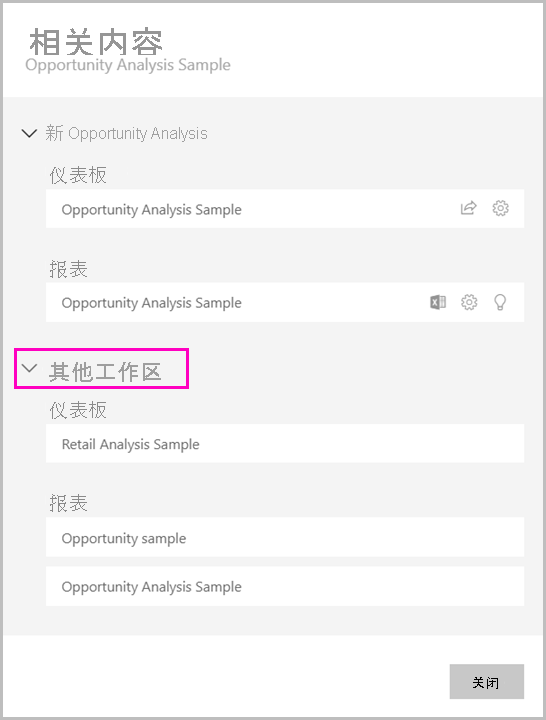

# 共享数据集（预览）

作为 Power BI Desktop 中数据模型的创建者，你创建的数据集可在 Power BI 服务中进行分发   。 然后，其他报表创建者可以将你的数据集作为自己报表的基础。 本文介绍如何共享数据集。 若要了解如何授予和删除对共享数据集的访问权限，请参阅[生成权限](service-datasets-build-permissions.md)。

## 共享数据集的步骤

1. 首先在 Power BI Desktop 的数据模型中创建 .pbix 文件。 如果计划为其他人提供此数据集来生成报表，你甚至可能无需在 .pbix 文件中设计报表。

    最佳做法是将 .pbix 文件保存到 Office 365 组。

1. 将 .pbix 文件发布到 Power BI 服务中的[新的体验工作区](../collaborate-share/service-create-the-new-workspaces.md)。
    
    完成后，此工作区的其他成员可以在基于此数据集的其他工作区中创建报表。

1. 也可以通过此工作区[发布应用](../collaborate-share/service-create-distribute-apps.md)。 进行创建时，在“权限”页上指定具有权限的人选及其权限范围  。

    > [!NOTE]
    > 如果选择“整个组织”，则组织中的所有人都将不具生成权限  。 这是一个已知问题。 应转而在“特定个人或组”中指定电子邮件地址  。  如果想要整个组织都具有生成权限，请指定整个组织的电子邮件别名。

    

1. 选择“发布应用”，或如果应用已发布则选择“更新应用”   。

## 跟踪数据集使用情况

你在你的工作区中具有共享数据集时，你可能需要知道其他工作区中的基于该共享数据集的报表。

1. 在“数据集”列表视图中，选择“查看相关项”  。

    

1. “相关内容”对话框显示所有相关项  。 在此列表中，你可以查看此工作区和“其他工作区”中的相关项  。
 
    

## 后续步骤

- [跨工作区使用数据集（预览）](service-datasets-across-workspaces.md)
- 是否有任何问题？ [尝试咨询 Power BI 社区](https://community.powerbi.com/)
