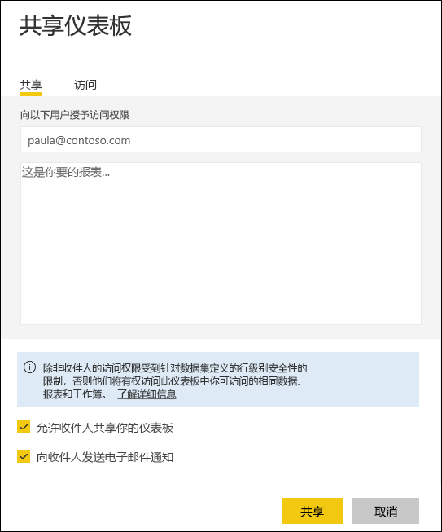

# 从 Excel 工作簿变为 Power BI 服务中的出色报表
你的经理在下班前想要查看有关你最新的销售数据以及上一市场活动影响的报表。 但最新数据位于各种第三方系统上以及便笔记本电脑上的文件中。 以前，创建视觉对象和格式化报表都需要花费数小时，这让你深感焦虑。

别担心。 凭借 Power BI，你可以立刻创建出色的报表。

在此示例中，我们将从本地系统上传 Excel 文件、创建新报表，并将其与同事共享，所有操作均在 Power BI 内进行。

## 准备数据
让我们以一个简单的 Excel 文件作为示例。 

1. 在将 Excel 文件加载到 Power BI 之前，必须在平面表中组织数据。 在平面表中，每一列都包含相同的数据类型；例如，文本、日期、数字或货币。 表应包含标题行，但不包含任何显示总计的列或行。

   

2. 接下来，将数据格式设置为表格。 在 Excel 中，在“开始”选项卡上的“样式”组中，选择“套用表格格式”    。 

3. 选择要应用到工作表的表格样式。 

   Excel 工作表现已准备好加载到 Power BI 中。

   

## 将 Excel 文件上传到 Power BI 服务
Power BI 服务连接到多个数据源，包括位于计算机上的 Excel 文件。 

 > [!NOTE] 
 > 若要按照本教程其余部分的说明进行操作，请使用[财务示例工作簿](../create-reports/sample-financial-download.md)。

1. 若要开始，请登录到 Power BI 服务。 如果还未注册，[你可以免费注册](https://powerbi.com)。

2. 你想要创建新仪表板。 打开“我的工作区”，然后选择“创建”图标   。

   

3. 选择“仪表板”，输入名称，然后选择“创建”   。 

   随即显示不包含任何数据的新仪表板。

   

4. 在导航窗格底部，选择“获取数据”  。 

5. 在“获取数据”页上的“创建新内容”下的“文件”框中，选择“获取”     。

   

6. 在“文件”页中，选择“本地文件”   。 导航到计算机上的 Excel 工作簿文件，然后选择“打开”以将其加载到 Power BI 服务中  。 

   

7. 从“本地文件”页中，选择“导入”   。

## 生成报表
在 Power BI 服务导入 Excel 文件后，开始生成报表。 

1. “你的数据集已就绪”  消息出现后，选择“查看数据集”  。  

   Power BI 在“编辑”视图中打开并显示报表画布。 “可视化效果”、“筛选器”和“字段”窗格位于右侧    。 请注意，你的 Excel 工作簿表数据将在“字段”窗格中显示  。 在表的名称下方，Power BI 会将列标题作为单个字段列出。

   

2. 现在可以开始创建可视化效果。 假设你的经理想要查看一段时间内的利润。 在“字段”窗格中，将“利润”拖动到报表画布   。 

   默认情况下，Power BI 将显示条形图。 

3. 将“日期”拖动到报表画布  。 

   Power BI 将更新条形图以按日期显示利润。

   

   > [!TIP]
   > 如果图表外观与你的期望不符，请检查聚合。 例如，在“值”上右键单击你刚才添加的字段，并确保数据以你期望的方式进行聚合  。 在此示例中，我们使用 **Sum**。
   > 

你的经理想要知道哪个国家/地区的盈利最多。 使用地图可视化效果给他们留下深刻印象。 

1. 选择报表画布上的空白区域。 

2. 从“字段”窗格中，将“国家/地区”和“利润”字段拖到报表画布    。

   Power BI 将创建一个地图视觉对象，其中的气泡代表每个位置的相对利润。

   

怎么显示按产品和市场细分显示销售额的视觉对象呢？ 简单。 

1. 在“字段”窗格中，选择“销售”、“产品”和“细分市场”字段旁边的复选框     。 
   
   Power BI 将立即创建一个条形图。 

2. 通过选择“可视化效果”菜单中的其中某个图标来更改图表的类型  。 例如，将其更改为“堆积柱形图”  。 

3. 若要对图表进行排序，请依次选择“更多选项”(…)、“排序依据”   。

   

将所有视觉对象固定到仪表板。 现在便可以将其与同事共享。

   

## 共享仪表板
假设你想要与经理共享仪表板。 你可以与任何具有 Power BI 帐户的同事共享仪表板和基础报表。 他们可以与你的报表进行交互，但不能保存所做的更改。

1. 若要共享你的报表，可在仪表板顶部，选择**共享**。

   

   Power BI 显示“共享仪表板”页面  。 

2. 在“输入电子邮件地址”框中输入收件人的电子邮件地址，并在其下方的框中添加一封邮件  。 

3. 若要允许收件人将你的仪表板与他人共享，请选择**允许收件人共享仪表板**。 选择“共享”  。

   

## 后续步骤

* [Power BI 服务入门](../fundamentals/service-get-started.md)
* [Power BI Desktop 入门](../fundamentals/desktop-getting-started.md)
* [Power BI 服务中设计器的基本概念](../fundamentals/service-basic-concepts.md)

更多问题？ [尝试参与 Power BI 社区](https://community.powerbi.com/)。
