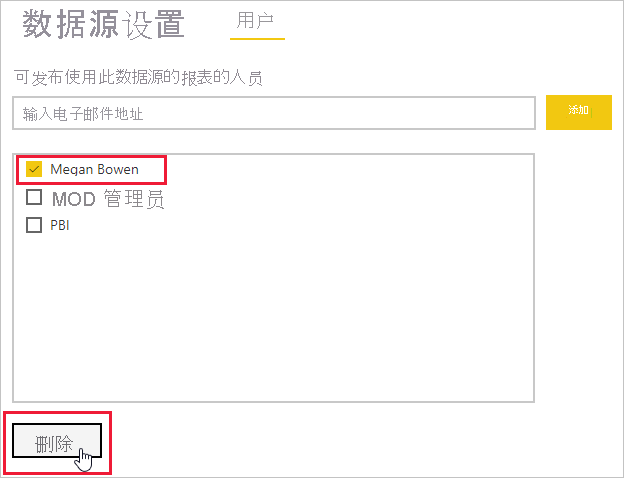

# 添加或删除网关数据源

[!INCLUDE [gateway-rewrite](../includes/gateway-rewrite.md)]

Power BI 支持多个[本地数据源](power-bi-data-sources.md)，每个都具有自己的要求。 网关可用于一个数据源，也可用于多个数据源。 对于此示例，我们演示如何将 SQL Server 添加为数据源。 类似步骤适用于其他数据源。

大多数数据源管理操作也可以使用 API 执行。 有关详细信息，请参阅 [REST API（网关）](/rest/api/power-bi/gateways)。

如果还没有安装网关，请参阅[安装本地数据网关](/data-integration/gateway/service-gateway-install)以开始使用。

## 添加数据源

1. 在 Power BI 服务的页眉中，选择“设置” > “管理网关” 。

    

2. 选择网关，然后选择“添加数据源”  。 可以选择标题文本“添加数据源”，或将光标悬停在“网关”条目旁边以显示“更多选项”菜单。

    

3. 为数据源指定一个名称，然后选择“数据源类”。 在本示例中，我们将选择 SQL Server。

    

4. 输入有关数据源的信息。 对于 SQL Server，请提供“服务器”和“数据库” 。

    

5. 选择连接到数据源时要使用的“身份验证方法”。 对于 SQL Server，请选择“Windows”或“基本”（SQL 身份验证） 。 输入数据源的凭据。

   :::image type="content" source="media/service-gateway-data-sources/basic-auth.png" alt-text="基本身份验证设置。":::

    > [!NOTE]
    > 如果所选的身份验证方法是 OAuth，任何运行时间超过 OAuth 令牌过期策略的查询都可能失败。

6. 在“高级设置”下，可以为数据源配置[单一登录 (SSO)](service-gateway-sso-overview.md)。 

    

    你可以为基于 DirectQuery 的报表配置“通过 Kerberos 使用 SSO 进行 DirectQuery 查询”或“通过 Kerberos 使用 SSO 进行 DirectQuery 和导入查询”，并为基于刷新的报表配置“通过 Kerberos 使用 SSO 进行 DirectQuery 和导入查询”  。

    如果使用“通过 Kerberos 使用 SSO 进行 DirectQuery 查询”并将此数据源用于基于 DirectQuery 的报表，则它将使用登录到 Power BI 服务的用户的凭据。 对于基于刷新的报表，它将使用你在“用户名”和“密码”字段中输入的凭据 。

    使用“通过 Kerberos 使用 SSO 进行 DirectQuery 和导入查询”时，不需要提供任何凭据。 如果此数据源用于基于 DirectQuery 的报表，则它将使用这样的用户，他们映射到已登录到 Power BI 服务的 (Azure) Active Directory 用户。  对于基于刷新的报表，它将使用数据集所有者的安全上下文

    > [!NOTE]
    >导入查询的 SSO 仅适用于使用 [Kerberos 约束委派](service-gateway-sso-kerberos.md)的 SSO 数据源列表。

7. 在“高级设置”下，可以选择配置数据源的[隐私级别](https://support.office.com/article/Privacy-levels-Power-Query-CC3EDE4D-359E-4B28-BC72-9BEE7900B540)（不适用于 [DirectQuery](desktop-directquery-about.md)）。

    :::image type="content" source="media/service-gateway-data-sources/privacy-level.png" alt-text="隐私级别选择。":::

8. 选择“添加”  。 如果过程成功，会看到“连接成功”  。

    

现在可以使用此数据源在 Power BI 仪表板和报表中包含来自 SQL Server 的数据。

## 删除数据源

如果不再使用数据源，则可以将其删除。 删除数据源将中断依赖于该数据源的所有仪表板和报表。

若要删除数据源，请转到该数据源，然后在“更多选项”菜单中选择“删除”。 将光标悬停在数据源名称旁边时，将显示“更多选项”菜单。

## 将数据源用于计划刷新或 DirectQuery

创建数据源后，可通过 DirectQuery 连接或通过计划刷新使用该数据源。 可以在[配置计划刷新](refresh-scheduled-refresh.md)中了解有关设置计划刷新的详细信息。

> [!NOTE]
>在 Power BI Desktop 和添加到本地数据网关的数据源之间，服务器名称和数据库名称必须匹配。

数据集和网关内的数据源之间的链接基于服务器名称和数据库名称。 这些名称必须匹配。 例如，如果在 Power BI Desktop 内为服务器名称提供 IP 地址，则需要在网关配置中使用数据源的 IP 地址。 如果在 Power BI Desktop 中使用了 SERVER\INSTANCE，则为网关配置的数据源中也必须使用它  。

如果你被列于网关内配置的数据源的“用户”选项卡中，并且服务器和数据库名称匹配，则你可以看到网关显示为计划刷新的一个选项  。

> [!WARNING]
> 如果数据集包含多个数据源，则必须在网关内添加每个数据源。 如果未将一个或多个数据源添加到网关，则不会看到可用于计划刷新的网关。

### 限制

只有具有本地数据网关的自定义连接器支持 OAuth 身份验证方案。 无法添加需要 OAuth 的其它数据源。 如果数据集具有需要 OAuth 的数据源，而且该数据源不是自定义连接器，则无法使用网关进行计划刷新。

## 管理用户

将数据源添加到网关后，将为用户和启用电子邮件的安全组提供对特定数据源（不是整个网关）的访问权限。 数据源的访问列表仅控制有权发布包含数据源数据的报表的用户。 报表所有者可以创建仪表板、内容包和应用，然后与其他用户共享这些项。

还可以为用户和安全组提供对网关的管理访问权限。

> [!NOTE]
> 具有数据源访问权限的用户可以将数据集关联到数据源，并基于在创建数据源时选择的安全选项（存储的凭据或单一登录）进行连接。

### 将用户添加到数据源

1. 在 Power BI 服务的页眉中，选择“设置” > “管理网关” 。

2. 选择要添加用户的数据源。

3. 选择“用户”，然后输入组织中将访问所选数据源的用户和已启用邮件的安全组。 选择“添加”，然后将添加的成员名称添加到可以发布使用此数据源的报表的人员列表中。

    

请注意，需要将用户添加到你希望向其授予访问权限的每个数据源。 每个数据源都具有单独的用户列表。 将用户单独添加到每个数据源。

### 从数据源中删除用户

在数据源的“用户”选项卡上，可以删除使用此数据源的用户和安全组。

## 在云中存储加密凭据

将数据源添加到网关时，必须为该数据源提供凭据。 将使用这些凭据运行对数据源的所有查询。 凭据会安全地进行加密。 在云中存储凭据之前，它们会使用对称加密，使其在云中无法被解密。 将凭据发送到运行网关的计算机，以便在访问数据源时对其进行本机解密。

## 可用数据源类型的列表

有关本地数据网关支持哪些数据源的信息，请参阅 [Power BI 数据源](power-bi-data-sources.md)。

## 后续步骤

* [管理数据源 - Analysis Services](service-gateway-enterprise-manage-ssas.md)
* [管理数据源 - SAP HANA](service-gateway-enterprise-manage-sap.md)
* [管理数据源 - SQL Server](service-gateway-enterprise-manage-sql.md)
* [管理数据源 - Oracle](service-gateway-onprem-manage-oracle.md)
* [管理数据源 - 导入/计划刷新](service-gateway-enterprise-manage-scheduled-refresh.md)
* [部署数据网关指南](service-gateway-deployment-guidance.md)

更多问题？ 尝试参与 [Power BI 社区](https://community.powerbi.com/)。
