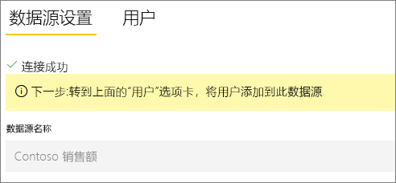
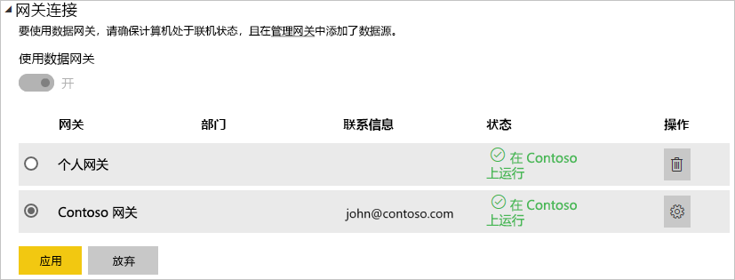

# 管理数据源 - Oracle

[!INCLUDE [gateway-rewrite](../includes/gateway-rewrite.md)]

[安装本地数据网关](/data-integration/gateway/service-gateway-install)之后，需要[添加可与该网关结合使用的数据源](service-gateway-data-sources.md#add-a-data-source)。 本文介绍如何使用用于计划刷新或 DirectQuery 的网关和 Oracle 数据源。

## 连接到 Oracle 数据库
要使用本地数据网关连接到 Oracle 数据库，必须在运行此网关的计算机上安装正确的 Oracle 客户端软件。 你使用的 Oracle 客户端软件取决于 Oracle 服务器版本，但始终与 64 位网关匹配。

支持的 Oracle 版本： 
- Oracle Server 9 及更高版本
- Oracle Data Access Client (ODAC) 软件 11.2 及更高版本

## 安装 Oracle 客户端
- [下载并安装 64 位 Oracle 客户端](https://www.oracle.com/database/technologies/odac-downloads.html)。

> [!NOTE]
> 选择与 Oracle Server 兼容的 Oracle Data Access Client (ODAC) 版本。 例如，ODAC 12.x 并非始终支持 Oracle Server 版本 9。
> 选择 Oracle 客户端的 Windows 安装程序。
> 在 Oracle 客户端的安装过程中，请在安装向导中选择相应的复选框，确保启用“在计算机范围级别配置 ODP.NET 和/或 Oracle Providers for ASP.NET”。 某些版本的 Oracle 客户端向导默认选中此复选框，其他版本则不选中。 请确保选中此复选框，以便 Power BI 可以连接到 Oracle 数据库。
 
安装客户端并正确配置 ODAC 后，建议使用 PowerBI Desktop 或其他测试客户端来验证网关上的安装和配置是否正确。

## 添加数据源

有关如何添加数据源的详细信息，请参阅[添加数据源](service-gateway-data-sources.md#add-a-data-source)。 在“数据源类型”下，选择 Oracle   。

选择 Oracle 数据源类型后，填写数据源信息（包括“服务器”和“数据库”）   。 

在“身份验证方法”下，可以选择 Windows 或“基本”    。 如果计划使用在 Oracle 内创建的帐户而不是 Windows 身份验证，请选择“基本”  。 然后输入将用于此数据源的凭据。

> [!NOTE]
> 将使用这些凭据运行对数据源的所有查询。 若要详细了解如何存储凭据，请参阅[在云中存储加密凭据](service-gateway-data-sources.md#store-encrypted-credentials-in-the-cloud)。

填写所有内容之后，选择“添加”  。 现在可以使用此数据源对本地 Oracle 服务器进行计划刷新或 DirectQuery。 如果成功，则会看到“连接成功”  。

### 高级设置

为数据源配置隐私级别（可选）。 此设置可控制数据的组合方式。 它仅适用于计划刷新。 隐私级别设置不适用于 DirectQuery。 若要详细了解数据源的隐私级别，请参阅[隐私级别 (Power Query)](https://support.office.com/article/Privacy-levels-Power-Query-CC3EDE4D-359E-4B28-BC72-9BEE7900B540)。

## 使用数据源

创建数据源后，可通过 DirectQuery 连接或通过计划刷新使用该数据源。

> [!WARNING]
> 在 Power BI Desktop 和本地数据网关内的数据源之间，服务器名称和数据库名称必须匹配。

数据集和网关内的数据源之间的链接取决于服务器名称和数据库名称。 这些名称必须匹配。 例如，如果在 Power BI Desktop 内为服务器名称提供了某 IP 地址，则网关配置中的数据源也必须使用该 IP 地址。 此名称也必须与 tnsnames.ora 文件内定义的别名匹配。 有关 tnsnames.ora 文件的详细信息，请参阅[安装 Oracle 客户端](#install-the-oracle-client)。

此要求适用于 DirectQuery 和计划刷新这两种情况。

### 在 DirectQuery 连接中使用数据源

确保 Power BI Desktop 和为网关配置的数据源之间的服务器名称和数据库名称相互匹配。 还需确保用户列在数据源的“用户”选项卡中，以便发布 DirectQuery 数据集  。 首次导入数据时，需要在 Power BI Desktop 中选择 DirectQuery。 有关如何使用 DirectQuery 的详细信息，请参阅[在 Power BI Desktop 中使用 DirectQuery](desktop-use-directquery.md)。

发布之后，应从 Power BI Desktop 或“获取数据”  启动报表。 在网关中创建数据源之后，可能会花费几分钟时间连接才可用。

### 通过计划刷新使用数据源

如果你被列于网关内配置的数据源的“用户”选项卡中，并且服务器名称和数据库名称匹配，则你可以看到网关显示为计划刷新的一个选项  。

## 故障排除

命名语法不正确或未正确配置时，可能会遇到来自 Oracle 的以下任一错误：

* ORA-12154：TNS：无法解析指定的连接标识符。
* ORA-12514：TNS：侦听器当前不知道连接描述符中请求的服务。
* ORA-12541：TNS：无侦听器。
* ORA-12170：TNS：连接超时。
* ORA-12504：TNS：侦听器未在 CONNECT_DATA 中获得 SERVICE_NAME。

如果 Oracle 客户端未安装或未正确配置，则可能出现这些错误。 如果已安装，请验证是否已对 tnsnames.ora 文件进行了正确配置、你使用的是不是正确的 net_service_name。 还需确保使用 Power BI Desktop 的计算机和运行网关的计算机具有相同的 net_service_name。 有关详细信息，请参阅[安装 Oracle 客户端](#install-the-oracle-client)。

可能还会遇到 Oracle 服务器版本与 Oracle Data Access Client 版本之间的兼容性问题。 通常，最好使二者的版本匹配，因为某些组合不兼容。 例如，ODAC 12.x 不支持 Oracle Server 版本 9。

为了诊断数据源服务器和网关计算机之间的连接问题，建议在网关计算机上安装客户端（例如 PowerBI Desktop 或 Oracle ODBC Test）。 可以使用客户端检查与数据源服务器的连接。

有关与网关相关的其他故障排除信息，请参阅[本地数据网关故障排除](/data-integration/gateway/service-gateway-tshoot)。

## 后续步骤

* [对网关进行排除故障 - Power BI](service-gateway-onprem-tshoot.md)
* [Power BI Premium](../admin/service-premium-what-is.md)

更多问题？ 请尝试在 [Power BI 社区](https://community.powerbi.com/)中提问
