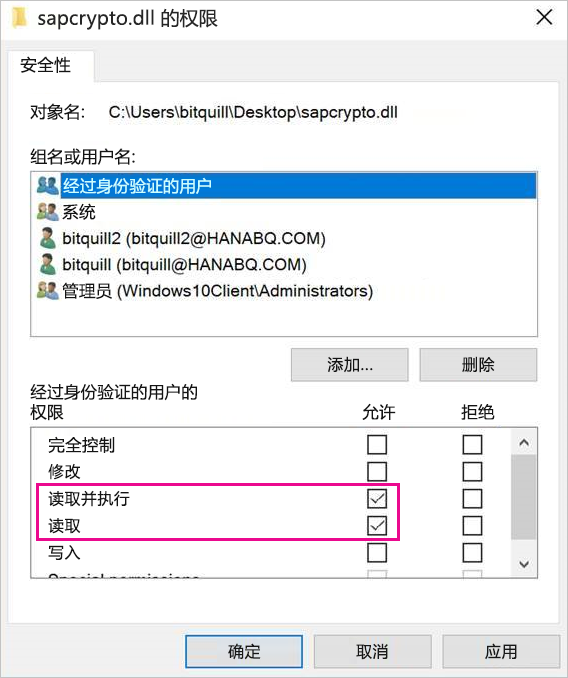
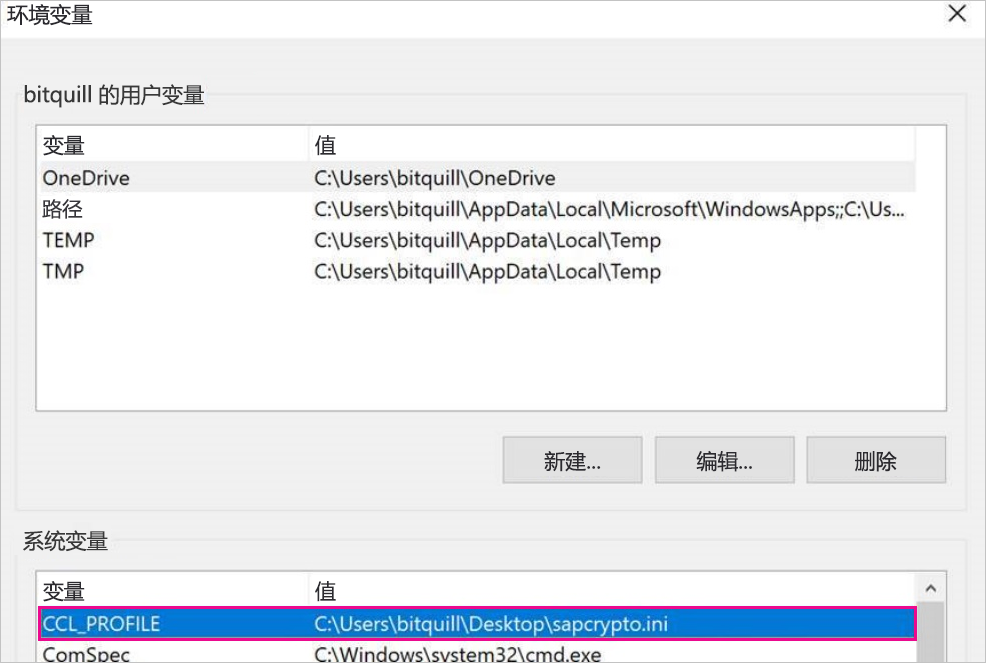
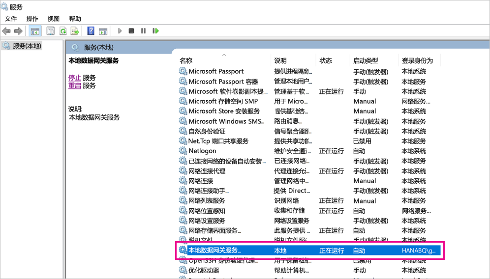
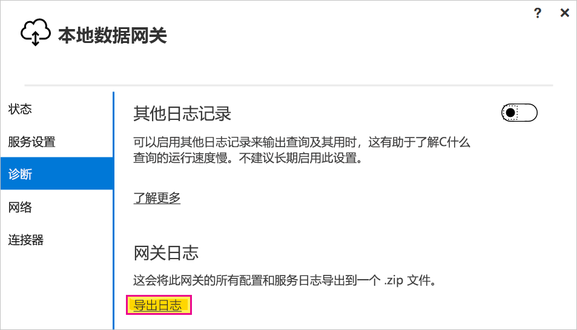

# <a name="use-kerberos-single-sign-on-for-sso-to-sap-bw-using-commoncryptolib-sapcryptodll"></a>使用 CommonCryptoLib (sapcrypto.dll) 将适用于 SSO 的 Kerberos 单一登录用于 SAP BW

本文介绍如何将 SAP BW 数据源配置为使用 CommonCryptoLib (sapcrypto.dll) 从 Power BI 服务启用 SSO。

> [!NOTE]
> 在尝试刷新使用 Kerberos SSO 的基于 SAP BW 的报表之前，请完成本文中的步骤以及[配置 Kerberos SSO](service-gateway-sso-kerberos.md) 的步骤。 将 CommonCryptoLib 用作 SNC 库可启用到 SAP BW 应用程序服务器和 SAP BW 消息服务器的 SSO 连接。

## <a name="configure-sap-bw-to-enable-sso-using-commoncryptolib"></a>使用 CommonCryptoLib 配置 SAP BW 以启用 SSO

> [!NOTE]
> 本地数据网关是 64 位软件，因此需要 64 位版本的 CommonCryptoLib (sapcrypto.dll) 来执行 BW SSO。 如果计划在尝试通过网关（推荐）进行 SSO 连接之前，先在 SAP GUI 中测试到 SAP BW 服务器的 SSO 连接，那么还将需要 32 位版本的 CommonCryptoLib，因为 SAP GUI 是 32 位软件。

1. 确保已使用 CommonCryptoLib 为 BW 服务器正确配置 Kerberos SSO。 如果是，则能够使用 SSO 通过已配置为使用 CommonCryptoLib 的 SAP GUI 之类的 SAP 工具访问 BW 服务器（直接访问或通过 SAP BW 消息服务器访问）。 

   有关设置步骤的详细信息，请参阅 [SAP Single Sign-On:Authenticate with Kerberos/SPNEGO](https://blogs.sap.com/2017/07/27/sap-single-sign-on-authenticate-with-kerberosspnego/)（SAP 单一登录：使用 Kerberos/SPNEGO 进行身份验证）。 BW 服务器应使用 CommonCryptoLib 作为其 SNC 库，并具有开头是 CN= 的 SNC 名称，例如 CN=BW1   。 有关 SNC 名称要求的详细信息（具体而言，snc/identity/as 参数），请参阅[适用于 Kerberos 配置的 SNC 参数](https://help.sap.com/viewer/df185fd53bb645b1bd99284ee4e4a750/3.0/360534094511490d91b9589d20abb49a.html)。

1. 如果未配置，请在安装了网关的计算机上安装 x64 版本的 [SAP .NET 连接器](https://support.sap.com/en/product/connectors/msnet.html)。 
   
   可以通过在网关计算机的 Power BI Desktop 中尝试连接到 BW 服务器来检查组件是否已安装。 如果无法使用 2.0 实现进行连接，则 .NET 连接器未安装或未安装到 GAC。

1. 确保 SAP 安全登录客户端 (SLC) 未在安装了网关的计算机上运行。 

   SLC 缓存 Kerberos 票证的方式可能会影响网关使用 Kerberos 进行 SSO 的能力。 

1. 如果安装了 SLC，请将其卸载，或者确保退出了 SAP 安全登录客户端。 在尝试使用网关进行 SSO 连接之前，请先右键单击系统托盘中的图标，并选择“注销”和“退出”   。 

   不支持在 Windows Server 计算机上使用 SLC。 有关详细信息，请参阅 [SAP 备注 2780475](https://launchpad.support.sap.com/#/notes/2780475)（需要 s 用户）。

   

1. 如果卸载 SLC 或选择“注销”和“退出”，请打开 cmd 窗口，输入 `klist purge` 以清除任何缓存的 Kerberos 票证，然后再尝试通过网关进行 SSO 连接   。

1. 从 SAP 快速启动板上下载 64 位 CommonCryptoLib (sapcrypto.dll) 版本 8.5.25 或更高版本，并将其复制到网关计算机上的文件夹中  。 在用于复制 sapcrypto.dll 的同一目录中，创建一个名为 sapcrypto.ini 的文件，该文件包含以下内容：

    ```
    ccl/snc/enable_kerberos_in_client_role = 1
    ```

    .ini 文件包含 CommonCryptoLib 在网关方案中启用 SSO 所需的配置信息。

    > [!NOTE]
    > 这些文件必须存储在同一位置；换句话说，/path/to/sapcrypto/ 应同时包含 sapcrypto.ini 和 sapcrypto.dll  。

    网关服务用户和服务用户模拟的 Active Directory (AD) 用户均需要这两个文件的读取和执行权限。 建议向经过身份验证的用户组同时授予对 .ini 和 .dll 文件的权限。 出于测试目的，还可以将这些权限显式授予网关服务用户和要用于测试的 Active Directory 用户。 在以下屏幕截图中，我们已向经过身份验证的用户组授予对 sapcrypto.dll 的“读取 &amp; 执行”权限  ：

    

1. 如果还没有与想要 SSO 连接流经的网关相关联的 SAP BW 数据源，请在 Power BI 服务的“管理网关”页上添加一个  。 如果已有这样一个数据源，请对其进行编辑： 
    - 如果要创建到 BW 应用程序服务器的 SSO 连接，请选择“SAP Business Warehouse”  作为“数据源类型”  。 
    - 如果要创建到 BW 消息服务器的 SSO 连接，请选择“SAP Business Warehouse 消息服务器”  。

1. 对于“SNC 库”，选择“SNC\_LIB”或“SNC\_LIB\_64”环境变量或“自定义”     。 

   - 如果选择“SNC\_LIB”，则必须将网关计算机上的 SNC\_LIB\_64 环境变量的值设置为网关计算机上 sapcrypto.dll 64 位副本的绝对路径   。 例如，C:\Users\Test\Desktop\sapcrypto.dll  。

   - 如果选择“自定义”，请将 sapcrypto.dll 的绝对路径粘贴到“管理网关”页上显示的“自定义 SNC 库路径”字段中    。 

1. 对于“SNC 合作伙伴名称”  键入 BW 服务器的 SNC 名称。 在“高级设置”下，确保已选中“通过 Kerberos 对 DirectQuery 查询使用 SSO”   。 填写其他字段，操作与从 PBI Desktop 建立 Windows 身份验证连接一样。

1. 创建一个 CCL\_PROFILE 系统环境变量，并将其值设置为 sapcrypto.ini 的路径  。

    

    sapcrypto .dll 和 .ini 文件必须位于同一位置。 在上面的示例中，sapcrypto.ini 和 sapcrypto.dll 都位于桌面上。

1. 重启网关服务。

    

1. [运行 Power BI 报表](service-gateway-sso-kerberos.md#run-a-power-bi-report)

## <a name="troubleshooting"></a>故障排除

如果无法在 Power BI 服务中刷新报表，可以使用网关跟踪、CPIC 跟踪和 CommonCryptoLib 跟踪来诊断问题。 因为 CPIC 跟踪和 CommonCryptoLib 是 SAP 产品，所以 Microsoft 无法为其提供支持。

### <a name="gateway-logs"></a>网关日志

1. 再现问题。

2. 打开[网关应用](https://docs.microsoft.com/data-integration/gateway/service-gateway-app)，并从“诊断”选项卡中选择“导出日志”   。

      

### <a name="cpic-tracing"></a>CPIC 跟踪

1. 若要启用 CPIC 跟踪，请设置两个环境变量：**CPIC\_TRACE** 和 **CPIC\_TRACE\_DIR**. 

   第一个变量设置跟踪级别，第二个变量设置跟踪文件目录。 该目录必须是经过身份验证的用户组的成员可以写入的位置。 
 
2. 将 CPIC\_TRACE 设置为 3，将 CPIC\_TRACE\_DIR 设置为要将跟踪文件写入其中的任何目录    。 例如：

   

3. 重现问题，确保 CPIC\_TRACE\_DIR 包含跟踪文件  。
 
    CPIC 跟踪可以诊断更高级别的问题，例如无法加载 sapcrypto.dll 库。 例如，下面是 CPIC 跟踪文件中出现 .dll 加载错误的代码片段：

    ```
    [Thr 7228] *** ERROR => DlLoadLib()==DLENOACCESS - LoadLibrary("C:\Users\test\Desktop\sapcrypto.dll")
    Error 5 = "Access is denied." [dlnt.c       255]
    ```

    如果遇到此类失败，但已按照[上面部分](#configure-sap-bw-to-enable-sso-using-commoncryptolib)所述为 sapcrypto.dll 和 sapcrypto.ini 设置了读取和执行权限，则尝试为包含这些文件的文件夹设置相同的读取和执行权限。

    如果仍然无法加载 .dll，请尝试打开[文件审计](/windows/security/threat-protection/auditing/apply-a-basic-audit-policy-on-a-file-or-folder)。 检查 Windows 事件查看器中生成的审计日志可能会帮助你确定文件无法加载的原因。 查找模拟 Active Directory 用户启动的失败条目。 例如，对于被模拟用户 `MYDOMAIN\mytestuser`，审计日志失败将类似于以下内容：

    ```
    A handle to an object was requested.

    Subject:
        Security ID:        MYDOMAIN\mytestuser
        Account Name:       mytestuser
        Account Domain:     MYDOMAIN
        Logon ID:       0xCF23A8

    Object:
        Object Server:      Security
        Object Type:        File
        Object Name:        <path information>\sapcrypto.dll
        Handle ID:      0x0
        Resource Attributes:    -

    Process Information:
        Process ID:     0x2b4c
        Process Name:       C:\Program Files\On-premises data gateway\Microsoft.Mashup.Container.NetFX45.exe

    Access Request Information:
        Transaction ID:     {00000000-0000-0000-0000-000000000000}
        Accesses:       ReadAttributes
                
    Access Reasons:     ReadAttributes: Not granted
                
    Access Mask:        0x80
    Privileges Used for Access Check:   -
    Restricted SID Count:   0
    ```

### <a name="commoncryptolib-tracing"></a>CommonCryptoLib 跟踪 

1. 通过向之前创建的 sapcrypto.ini 文件添加以下行，启用 CommonCryptoLib 跟踪：

    ```
    ccl/trace/level=5
    ccl/trace/directory=<drive>:\logs\sectrace
    ```

2. 将 `ccl/trace/directory` 选项更改为经过身份验证的用户组的成员可以写入的位置。 

3. 或者，创建一个新的 .ini 文件来更改此行为。 在与 sapcrypto.ini 和 sapcrypto.dll 相同的目录中，创建一个包含以下内容、名为 sectrace.ini 的文件。 将 `DIRECTORY` 选项替换为计算机上经过身份验证的用户组的成员可以写入的位置：

    ```
    LEVEL = 5
    DIRECTORY = <drive>:\logs\sectrace
    ```

4. 重现问题，并验证“目录”指向的位置是否包含跟踪文件  。 

5. 完成后，关闭 CPIC 和 CCL 跟踪。

    有关 CommonCryptoLib 跟踪的详细信息，请参阅 [SAP 备注 2491573](https://launchpad.support.sap.com/#/notes/2491573)（需要 SAP 用户）。

## <a name="next-steps"></a>后续步骤

有关本地数据网关和 DirectQuery 的详细信息，请参阅以下资源：

* [本地数据网关是什么？](/data-integration/gateway/service-gateway-onprem)
* [Power BI 中的 DirectQuery](desktop-directquery-about.md)
* [DirectQuery 支持的数据源](power-bi-data-sources.md)
* [DirectQuery 和 SAP BW](desktop-directquery-sap-bw.md)
* [DirectQuery 和 SAP HANA](desktop-directquery-sap-hana.md)
