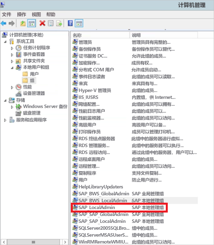
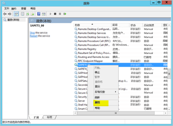
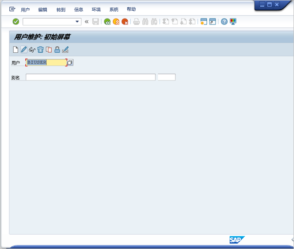
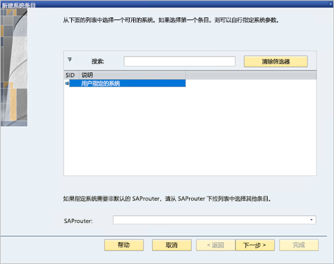
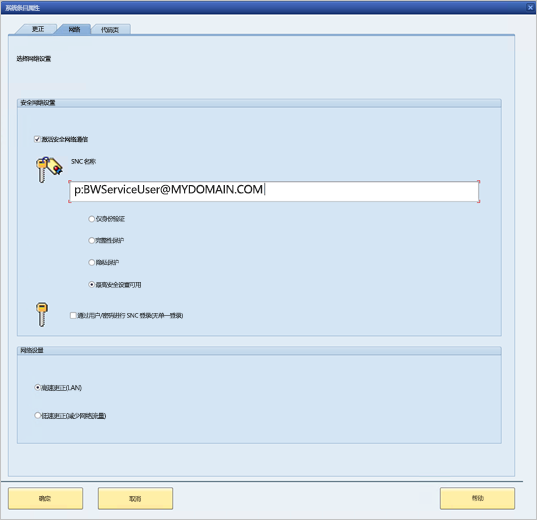
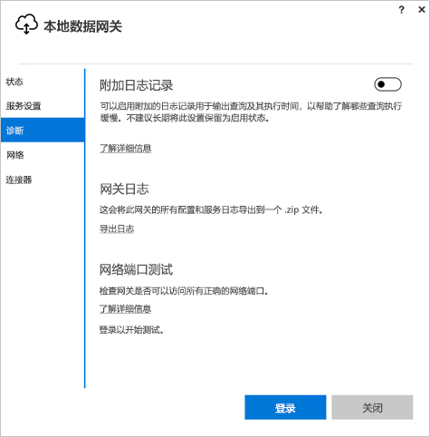

# <a name="use-kerberos-for-single-sign-on-sso-to-sap-bw-using-gx64krb5"></a>使用 gx64krb5 将 Kerberos 用于单一登录 (SSO) 到 SAP BW

本文介绍如何将 SAP BW 数据源配置为使用 gx64krb5 从 Power BI 服务启用 SSO。

> [!IMPORTANT]
> SAP 不再支持 gx64krb5，因此，Microsoft 也停止了对它的支持。 到 2020 年底之前，现有连接和新连接将继续正常运行，但从 2021 年 1 月起将无法正常运行。 请改用 CommonCryptoLib。 

> [!NOTE]
> 除了[配置 Kerberos SSO](service-gateway-sso-kerberos.md) 中的步骤之外，还可以完成本文中的步骤，以便为 Power BI 服务中基于 SAP BW 应用程序服务器的报表启用基于 SSO 的刷新。 但是，Microsoft 建议使用 CommonCryptoLib，而不是 gx64krb5 作为 SNC 库。 SAP 不再支持 gx64krb5，与 CommonCryptoLib 相比，对其进行配置使之适用于网关所需的步骤要复杂得多。 有关如何使用 CommonCryptoLib 配置 SSO 的详细信息，请参阅[使用 CommonCryptoLib 为 SSO 配置 SAP BW](service-gateway-sso-kerberos-sap-bw-commoncryptolib.md)。 使用 CommonCryptoLib 或 gx64krb5 作为 SNC 库，但两者不能同时使用。 不要同时完成两个库的配置步骤。

本指南非常全面；如果已完成一些所述步骤，可以跳过这些步骤。 例如，你可能已使用 gx64krb5 配置了适用于 SSO 的 SAP BW 服务器。

## <a name="set-up-gx64krb5-on-the-gateway-machine-and-the-sap-bw-server"></a>在网关计算机和 SAP BW 服务器上设置 gx64krb5

> [!NOTE]
> SAP 不再支持 gx64krb5 库。 有关详细信息，请参阅 [SAP 备注 352295](https://launchpad.support.sap.com/#/notes/352295)。 请注意，gx64krb5 不允许建立从数据网关到 SAP BW 消息服务器的 SSO 连接；只允许建立与 SAP BW 应用程序服务器的连接。 如果将 [CommonCryptoLib](service-gateway-sso-kerberos-sap-bw-commoncryptolib.md) 用作 SNC 库，则不存在此限制。 虽然其他 SNC 库也可能适用于 BW SSO，但 Microsoft 并未正式支持它们。

客户端和服务器必须使用 gx64krb5 库才能通过网关完成 SSO 连接。 也就是说，客户端和服务器都必须使用相同的 SNC 库。

1. 从 [SAP Note 2115486](https://launchpad.support.sap.com/) 下载 gx64krb5.dll（需要是 SAP 用户）。 确保你使用的版本至少是 1.0.11。 如果在尝试通过网关进行 SSO 连接之前，需要在 SAP GUI 中测试 SSO 连接，也可以下载 gsskrb5.dll（库的 32 位版本）（建议）。 在 SAP GUI 中测试需要使用 32 位版本，因为 SAP GUI 仅限于 32 位。

1. 将 gx64krb5.dll 放在网关计算机上网关服务用户可访问的位置。 如果要使用 SAP GUI 测试 SSO 连接，还需要将 gsskrb5.dll 的副本放在计算机上，并将 SNC_LIB 环境变量设置为指向它。 网关服务用户和服务用户将模拟的 Active Directory (AD) 用户均需要 gx64krb5.dll 的副本的读取和执行权限。 建议向经过身份验证的用户组授予对 .dll 文件的权限。 出于测试目的，还可以将这些权限显式授予网关服务用户和用于测试的 Active Directory 用户。

1. 如果尚未使用 gx64krb5.dll 配置用于 SSO 的 BW 服务器，则将 .dll 的另一个副本放在 SAP BW 服务器计算机上 SAP BW 服务器可访问的位置。 

    有关配置 gx64krb5.dll 以便与 SAP BW 服务器一起使用的详细信息，请参阅 [SAP 文档](https://launchpad.support.sap.com/#/notes/2115486)（需要 SAP 用户）。

1. 在客户端和服务器计算机上，设置 SNC_LIB 和 SNC_LIB_64 环境变量 ： 
    - 如果使用 gsskrb5.dll，请将 SNC_LIB 变量设置为其绝对路径。 
    - 如果使用 gx64krb5.dll，请将 SNC_LIB_64 变量设置为其绝对路径。

## <a name="configure-an-sap-bw-service-user-and-enable-snc-communication-on-the-bw-server"></a>在 BW 服务器上配置 SAP BW 服务用户并启用 SNC 通信

如果尚未使用 gx64krb5 配置用于 SNC 通信（例如 SSO）的 SAP BW 服务器，请完成本部分。

> [!NOTE]
> 本部分假定你已经为 BW 创建了一个服务用户，并将适当的 SPN 绑定到该用户（即，以 SAP/ 开头的名称）。

1. 授予服务用户访问 SAP BW 应用程序服务器的权限：

    1. 在 SAP BW 服务器计算机上，将服务用户添加到“本地管理员”组。 打开“计算机管理”程序，然后确定服务器的“本地管理员”组。 

        

    1. 双击“本地管理员”组，然后选择“添加”，将服务用户添加到该组。 

    1. 选择“检查姓名”以确保输入的名称正确无误，然后选择“确定” 。

1. 将 SAP BW 服务器的服务用户设置为在 SAP BW 服务器计算机上启动 SAP BW 服务器服务的用户：

    1. 打开“运行”，然后输入“Services.msc” 。 

    1. 找到与 SAP BW 应用程序服务器实例相对应的服务，右键单击该服务，然后选择“属性”。

        

    1. 切换到“登录”选项卡，将用户更改为 SAP BW 服务用户。 

    1. 输入用户的密码，然后选择“确定”。

1. 在 SAP Logon 中登录服务器，并使用 RZ10 事务设置以下配置文件参数：

    1. 将 snc/identity/as 配置文件参数设置为：p:&lt;已创建的 SAP BW 服务用户&gt;。 例如，p:BWServiceUser\@MYDOMAIN.COM。 请注意，服务用户的 UPN 前为 p:，这与将 CommonCryptoLib 用作 SNC 库时不同，那种情况下 UPN 前加 p:CN= 。

    1. 将 snc/gssapi\_lib 配置文件参数设置为 &lt;BW 服务器上 gx64krb5.dll 的路径&gt;。 将库放在 SAP BW 应用程序服务器可以访问的位置。

    1. 设置以下额外加配置文件参数，并根据需要更改值。 最后五个选项使客户端无需配置 SNC 即可使用 SAP Logon 连接到 SAP BW 服务器。

        | 设置 | 值 |
        | --- | --- |
        | snc/data\_protection/max | 3 |
        | snc/data\_protection/min | 1 |
        | snc/data\_protection/use | 9 |
        | snc/accept\_insecure\_cpic | 1 |
        | snc/accept\_insecure\_gui | 1 |
        | snc/accept\_insecure\_r3int\_rfc | 1 |
        | snc/accept\_insecure\_rfc | 1 |
        | snc/permit\_insecure\_start | 1 |

    1. 将 snc/enable 属性设置为 1。

1. 设置这些配置文件参数后，在服务器计算机上打开 SAP 管理控制台并重启 SAP BW 实例。 

   如果服务器无法启动，请确认已正确设置了配置文件参数。 有关配置文件参数设置的详细信息，请参阅 [SAP 文档](https://help.sap.com/saphelp_nw70ehp1/helpdata/en/e6/56f466e99a11d1a5b00000e835363f/frameset.htm)。 还可参阅本文中的[疑难解答](#troubleshooting)一节。

## <a name="map-an-sap-bw-user-to-an-active-directory-user"></a>将 SAP BW 用户映射到 Active Directory 用户

如果尚未执行此步骤，请将 Active Directory 用户映射到 SAP BW 应用程序服务器用户，并在 SAP Logon 中测试 SSO 连接。

1. 使用 SAP Logon 登录 SAP BW 服务器。 运行事务 SU01。

1. 关于“用户”，请输入要为其启用 SSO 连接的 SAP BW 用户。 选择 SAP Logon 窗口左上角附近的“编辑”图标（笔形图标）。

    

1. 选择“SNC”选项卡。在 SNC 名称输入框中，输入 p:&lt;你的 Active Directory 用户&gt;@&lt;你的域&gt;。 对于 SNC 名称，必须在 Active Directory 用户的 UPN 之前加“p:”。 请注意，UPN 区分大小写。

   指定的 Active Directory 用户应是要为其启用 SSO 访问 SAP BW 应用程序服务器的人员或组织。 例如，如果要为用户 testuser\@TESTDOMAIN.COM 启用 SSO 访问权限，请输入 p:testuser\@TESTDOMAIN.COM。

    

1. 选择屏幕左上角附近的“保存”图标（软盘图像）。

## <a name="test-sign-in-via-sso"></a>通过 SSO 测试登录

验证是否能以为其启用了 SSO 访问权限的 Active Directory 用户的身份来使用 SAP Logon 通过 SSO 登录服务器：

1. 以刚为其启用了 SSO 访问权限的 Active Directory 用户的身份登录到域中安装了 SAP Logon 的计算机。 启动 SAP Logon，并创建新连接。

1. 将之前下载的 gsskrb5.dll 文件复制到登录的计算机上的某个位置。 将 SNC_LIB 环境变量设置为此位置的绝对路径。

1. 启动 SAP Logon，并创建新连接。

1. 在“创建新系统条目”屏幕中，选择“用户指定的系统”，然后选择“下一步”  。

    

1. 在下一屏上填写相应的详细信息，包括应用程序服务器、实例编号和系统 ID。 然后选择“完成”。

1. 右键单击新的连接，依次选择“属性”、“网络”选项卡 。 

1. 在“SNC 名称”框中，输入 p:&gt;SAP BW 服务用户的 UPN&lt;。 例如，p:BWServiceUser\@MYDOMAIN.COM。 选择“确定”。

    

1. 双击刚才创建的连接，尝试与 SAP BW 服务器建立 SSO 连接。 

   如果连接成功，则进入下一部分。 否则，请查看本文档中先前的步骤，确保它们已正确完成，或查看[故障排除](#troubleshooting)部分。 如果在此上下文中无法通过 SSO 连接到 SAP BW 服务器，则无法在网关上下文中使用 SSO 连接到 SAP BW 服务器。

## <a name="add-registry-entries-to-the-gateway-machine"></a>将注册表项添加到网关计算机

将所需的注册表项添加到安装了网关的计算机的注册表中，并添加到要从 Power BI Desktop 连接的计算机。 若要添加这些注册表项，请运行以下命令：

- ```REG ADD HKLM\SOFTWARE\Wow6432Node\SAP\gsskrb5 /v ForceIniCredOK /t REG_DWORD /d 1 /f```

- ```REG ADD HKLM\SOFTWARE\SAP\gsskrb5 /v ForceIniCredOK /t REG_DWORD /d 1 /f```

## <a name="add-a-new-sap-bw-application-server-data-source-to-the-power-bi-service-or-edit-an-existing-one"></a>将新的 SAP BW 应用程序服务数据源添加到 Power BI 服务，或编辑现有数据源

1. 在数据源配置窗口中，与从 Power BI Desktop 登录到 SAP BW 服务器一样，输入 SAP BW 应用程序服务器的“主机名”、“系统编号”和”客户端 ID”  。

1. 在“SNC 合作伙伴名称”字段中，输入 p:&lt;映射到 SAP BW 服务用户的 SPN&gt;。 例如，如果 SPN 为 SAP/BWServiceUser\@MYDOMAIN.COM，则在“SNC 合作伙伴名称”字段中输入 p:SAP/BWServiceUser\@MYDOMAIN.COM。

1. 对于 SNC 库，请选择“SNC\_LIB”或“SNC\_LIB\_64” 。 请确保网关计算机上的 SNC\_LIB\_64 指向 gx64krb5.dll。 或者，可以选择“自定义”选项，并在网关计算机上提供 gx64krb5.dll 的绝对路径。

1. 选择“通过 Kerberos 使用 SSO 执行 DirectQuery 查询”，然后选择“应用” 。 如果测试连接不成功，请验证先前的设置和配置步骤是否已正确完成。

1. [运行 Power BI 报表](service-gateway-sso-kerberos.md#run-a-power-bi-report)

## <a name="troubleshooting"></a>故障排除

### <a name="troubleshoot-gx64krb5-configuration"></a>排查 gx64krb5 配置问题

如果遇到以下任何问题，请按照以下步骤对 gx64krb5 安装和 SSO 连接进行故障排除：

* 完成 gx64krb5 安装步骤时遇到错误。 例如，更改配置文件参数后，SAP BW 服务器无法启动。 查看服务器日志（服务器计算机上的 …work\dev\_w0），解决这些错误。 

* 由于登录失败，无法启动 SAP BW 服务。 设置 SAP BW“启动”用户时，可能提供了错误密码。 通过以 SAP BW 服务用户身份登录 Active Directory 环境中的计算机来验证密码。

* 收到有关阻止服务器启动的基础数据源凭据（例如 SQL Server）的错误，请验证是否已为服务用户授予了 SAP BW 数据库的访问权限。

* 收到以下消息：(GSS-API) 指定的目标未知或无法访问。 此错误通常意味着你指定了错误的 SNC 名称。 在客户端应用程序中，确保在服务用户的 UPN 之前，仅使用“p:”，而不是“p:CN=” 。

* 收到以下消息：(GSS-API) 提供的名称无效。 确保“p:”是服务器的 SNC 标识配置文件参数的值。

* 收到以下消息：（SNC 错误）找不到指定的模块。 此错误通常是由于将 gx64krb5.dll 置于需要提升的权限（../管理员权限）才能访问的位置所导致的。

### <a name="troubleshoot-gateway-connectivity-issues"></a>网关连接问题故障排除

1. 检查网关日志。 打开网关配置应用程序，选择“诊断”，然后选择“导出日志” 。 最新错误位于检查的任何日志文件的结尾。

    

1. 打开 SAP BW 跟踪并查看生成的日志文件。 可使用多种不同类型的 SAP BW 跟踪（例如 CPIC 跟踪）：

   a. 若要启用 CPIC 跟踪，请设置两个环境变量：**CPIC\_TRACE** 和 **CPIC\_TRACE\_DIR**.

      第一个变量设置跟踪级别，第二个变量设置跟踪文件目录。 该目录必须是经过身份验证的用户组的成员可以写入的位置。 
 
    b. 将 CPIC\_TRACE 设置为 3，将 CPIC\_TRACE\_DIR 设置为要将跟踪文件写入其中的任何目录。 例如：

      

    c. 重现问题，确保 CPIC\_TRACE\_DIR 包含跟踪文件。 
    
    d. 检查跟踪文件的内容，确定阻塞性问题。 例如，你可能会发现 gx64krb5.dll 未正确加载，或者与你预期不同的 Active Directory 用户发起了 SSO 连接尝试。

## <a name="next-steps"></a>后续步骤

有关本地数据网关和 DirectQuery 的详细信息，请参阅以下资源：

* [本地数据网关是什么？](/data-integration/gateway/service-gateway-onprem)
* [Power BI 中的 DirectQuery](desktop-directquery-about.md)
* [DirectQuery 支持的数据源](power-bi-data-sources.md)
* [DirectQuery 和 SAP BW](desktop-directquery-sap-bw.md)
* [DirectQuery 和 SAP HANA](desktop-directquery-sap-hana.md)
