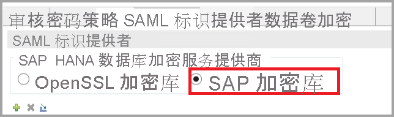
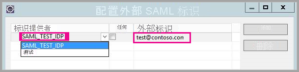
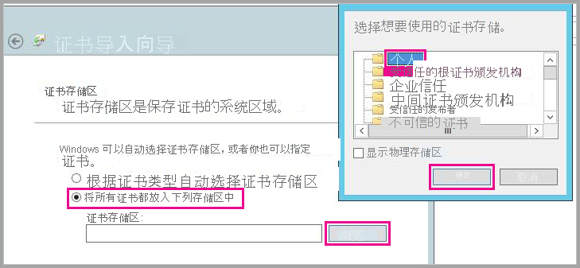
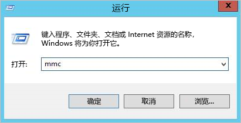
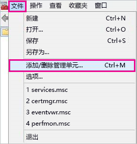

# <a name="use-security-assertion-markup-language-saml-for-sso-from-power-bi-to-on-premises-data-sources"></a>使用安全断言标记语言 (SAML) 启用从 Power BI 到本地数据源的 SSO

启用 SSO 后，Power BI 报表和仪表板可以轻松通过本地源刷新数据，同时遵从在这些源上配置的用户级别权限。 使用[安全断言标记语言 (SAML)](https://www.onelogin.com/pages/saml) 启用无缝单一登录连接。 

## <a name="supported-data-sources"></a>支持的数据源

目前通过 SAML 支持 SAP HANA。 有关使用 SAML 为 SAP HANA 设置和配置单一登录的详细信息，请参阅 [SAML SSO for BI Platform to HANA](https://blogs.sap.com/2020/03/22/sap-bi-platform-saml-sso-to-hana-database/)（BI 平台到 HANA 的 SAML SSO）。

我们使用 [Kerberos](service-gateway-sso-kerberos.md) 支持其他数据源（包括 SAP HANA）。

对于 SAP HANA，建议在建立 SAML SSO 连接之前启用加密。 若要启用加密，请将 HANA 服务器配置为接受加密连接，并将网关配置为使用加密与 HANA 服务器进行通信。 因为默认情况下 HANA ODBC 驱动程序不加密 SAML 断言，已签名的 SAML 断言将从网关“明文”发送到 HANA 服务器，并且容易被第三方拦截和重用  。

> [!IMPORTANT]
> SAP 不再支持 OpenSSL，因此，Microsoft 也停止了对它的支持。 到 2020 年底之前，现有连接和新连接将继续正常运行，但从 2021 年 1 月 1 日起将无法正常运行。 请改用 CommonCryptoLib。

## <a name="configuring-the-gateway-and-data-source"></a>配置网关和数据源

要使用 SAML，必须在要为其启用 SSO 的 HANA 服务器与网关之间建立信任关系。 在这种情况下，网关用作 SAML 标识提供者 (IdP)。 可以通过多种方式建立此关系。 SAP 建议使用 SAP 加密库（也称为 CommonCryptoLib 或 sapcrypto）来完成建立信任关系的设置步骤。 有关详细信息，请参阅官方 SAP 文档。

以下步骤描述了如何使用 HANA 服务器信任的根 CA 对网关 IdP 的 X509 证书进行签名，从而在 HANA 服务器和网关 IdP 之间建立信任关系。 

### <a name="create-the-certificates"></a>创建证书

执行以下步骤来创建证书：

1. 在运行 SAP HANA 的设备上，创建一个空文件夹来存储证书，然后导航到该文件夹。
2. 运行以下命令创建根证书：

   ```
   openssl req -new -x509 -newkey rsa:2048 -days 3650 -sha256 -keyout CA_Key.pem -out CA_Cert.pem -extensions v3_ca'''
   ```

    必须记住密码才能使用此证书对其他证书进行签名。
    应会看到正在创建 CA_Cert.pem 和 CA_Key.pem 。

   
3. 运行以下命令创建 IdP 证书：
 
    ```
    openssl req -newkey rsa:2048 -days 365 -sha256 -keyout IdP_Key.pem -out IdP_Req.pem -nodes
    ```
    应会看到正在创建 IdP_Key.pem 和 IdP_Req.pem 。

4. 用根证书对 IdP 证书进行签名：

    ```
    openssl x509 -req -days 365 -in IdP_Req.pem -sha256 -extensions usr_cert -CA CA_Cert.pem -CAkey CA_Key.pem -CAcreateserial -out IdP_Cert.pem
    ```
    应会看到正在创建 CA_Cert.srl 和 IdP_Cert.pem 。
    我们只关心 IdP_Cert.pem。    

### <a name="create-saml-identity-provider-certificate-mapping"></a>创建 SAML 标识提供者证书映射

使用以下步骤创建 SAML 标识提供者证书映射。

1. 在 SAP HANA Studio 中，右键单击 SAP HANA 服务器名称，然后导航到“安全”>“打开安全控制台”>“SAML 标识提供者” 。
2. 如果未选择 SAP 加密库，请选择它。 请勿使用 OpenSSL 加密库（下图中左侧的选项），SAP 已弃用该库。

    

3. 单击蓝色的导入按钮导入签名证书 IdP_Cert.pem，如下图所示。

    

请务必为“标识提供者名称”指定名称。

### <a name="import-and-create-the-signed-certificates-in-hana"></a>在 HANA 中导入和创建签名证书

接下来，你将在 HANA 中导入和创建签名证书。 执行以下步骤:

1. 在 HANA Studio 中，运行以下查询：

    ```
    CREATE CERTIFICATE FROM '<idp_cert_pem_certificate_content>'
    ```
    
    下面是一个示例：

    ```
    CREATE CERTIFICATE FROM
    '-----BEGIN CERTIFICATE-----
    MIIDyDCCArCgA...veryLongString...0WkC5deeawTyMje6
    -----END CERTIFICATE-----
    '
    ```

2. 如果没有 PSEwith SAML Purpose，请通过在 HANA Studio 中运行以下查询创建一个：
    
    ```
    CREATE PSE SAMLCOLLECTION;<br>set pse SAMLCOLLECTION purpose SAML;<br>
    ```

3. 使用以下命令将新创建的签名证书添加到 PSE：

    ```
    alter pse SAMLCOLLECTION add CERTIFICATE <certificate_id>;
    ```

    例如：
    ```
    alter pse SAMLCOLLECTION add CERTIFICATE 1978320;
    ```

    可以使用以下查询检查创建的证书列表：
    ```
    select * from PUBLIC"."CERTIFICATES"
    ```

    证书现已正确安装。 你可以运行以下查询以确认：
    ```
    select * from "PUBLIC"."PSE_CERTIFICATES"
    ```

### <a name="map-the-user"></a>映射用户

按照以下步骤映射用户：

1. 在 SAP HANA Studio 中，选择“安全”文件夹 ：

    

2. 展开“用户”，然后选择要将 Power BI 用户映射到的用户。

3. 选择“SAML”复选框，然后选择“配置”，如下图中突出所示 。

    

4. 选择在本文前面的[创建 SAML 标识提供者证书映射](#create-saml-identity-provider-certificate-mapping)部分中创建的标识提供者。 对于外部标识，输入 Power BI 用户的 UPN（通常是用户用于登录 Power BI 的电子邮件地址），然后选择“添加”。  下图显示这些选项。

    

    如果已将网关配置为使用 ADUserNameReplacementProperty 配置选项，请输入替换 Power BI 用户初始 UPN 的值。 例如，如果将 ADUserNameReplacementProperty 设置为 SAMAccountName，请输入用户的 SAMAccountName  。

### <a name="configure-the-gateway"></a>配置网关

配置网关的证书和标识后，请使用以下步骤将证书转换为 pfx 格式并配置网关以使用证书。

1. 运行以下命令，将证书转换为 pfx 格式。 此命令将生成的 .pfx 文件命名为 samlcert.pfx，并将其密码设置为“root”：

    ```
    openssl pkcs12 -export -out samltest.pfx -in IdP_Cert.pem -inkey IdP_Key.pem -passin pass:root -passout pass:root
    ```

2. 将 pfx 文件复制到网关计算机：

    1. 双击 samltest.pfx，然后选择“本地计算机” > “下一步” 。

    2. 输入密码，然后选择“下一步”。

    3. 选择“将所有证书放入以下存储”，然后选择“浏览” > “个人” > “确定”。

    4. 选择“下一步”，然后选择“完成”。

       

3. 通过以下步骤授予网关服务帐户访问证书私钥的权限：

    1. 网关计算机上运行 Microsoft 管理控制台 (MMC)。

        

    2. 在“文件”下，选择“添加/删除管理单元”。

        

    3. 选择“证书” > “添加”，然后选择“计算机帐户” > “下一步”   。

    4. 选择“本地计算机” > “完成” > “确定”  。

    5. 展开“证书” > “个人” > “证书”，然后找到证书  。

    6. 右键单击证书并导航到“所有任务”“管理私钥” &gt; 。

        

    1. 将网关服务帐户添加到列表中。 默认情况下，帐户是“NT SERVICE\PBIEgwService”。 可通过运行 services.msc 和查找“本地数据网关服务”来确定正在运行网关服务的帐户。

        

最后，按照以下步骤向网关配置添加证书指纹：

1. 运行以下 PowerShell 命令列出计算机上的证书：

    ```powershell
    Get-ChildItem -path cert:\LocalMachine\My
    ```

2. 复制创建的证书的指纹。

3. 导航到网关目录（默认为 C:\Program Files\On-premises data gateway）。

4. 打开 PowerBI.DataMovement.Pipeline.GatewayCore.dll.config，找到 SapHanaSAMLCertThumbprint 部分 。 粘贴已复制的指纹。

5. 重新启动网关服务。

## <a name="running-a-power-bi-report"></a>运行 Power BI 报表

现在，可以使用 Power BI 中的“管理网关”页面配置 SAP HANA 数据源。 在“高级设置”下，通过 SAML 启用 SSO。 这样做可以发布绑定到该数据源的报表和数据集。

   

## <a name="troubleshooting"></a>疑难解答

配置基于 SAML 的 SSO 后，可能会在 Power BI 门户中看到以下错误：“提供的凭据无法用于 SapHana 源。” 此错误表示 SAP HANA 已拒绝 SAML 凭据。

服务器端的身份验证跟踪提供详细信息，以对 SAP HANA 上的凭据问题进行故障排除。 按照以下步骤配置 SAP HANA 服务器的跟踪：

1. 在 SAP HANA 服务器上，通过运行以下查询启用身份验证跟踪：

    ```
    ALTER SYSTEM ALTER CONFIGURATION ('indexserver.ini', 'SYSTEM') set ('trace', 'authentication') = 'debug' with reconfigure 
    ```

1. 重现此问题。

1. 在 HANA Studio 中，打开管理控制台，然后选择“诊断文件”选项卡。

1. 打开最新的 index server 跟踪并搜索 SAMLAuthenticator.cpp。

    应该会找到一个指示根本原因的详细错误消息，例如：

    ```
    [3957]{-1}[-1/-1] 2018-09-11 21:40:23.815797 d Authentication   SAMLAuthenticator.cpp(00091) : Element '{urn:oasis:names:tc:SAML:2.0:assertion}Assertion', attribute 'ID': '123123123123123' is not a valid value of the atomic type 'xs:ID'.
    [3957]{-1}[-1/-1] 2018-09-11 21:40:23.815914 i Authentication   SAMLAuthenticator.cpp(00403) : No valid SAML Assertion or SAML Protocol detected
    ```

1. 完成故障排除后，通过运行以下查询关闭身份验证跟踪：

    ```
    ALTER SYSTEM ALTER CONFIGURATION ('indexserver.ini', 'SYSTEM') UNSET ('trace', 'authentication');
    ```

## <a name="next-steps"></a>后续步骤

有关本地数据网关和 DirectQuery 的详细信息，请参阅以下资源：

* [本地数据网关是什么？](/data-integration/gateway/service-gateway-onprem)
* [Power BI 中的 DirectQuery](desktop-directquery-about.md)
* [DirectQuery 支持的数据源](power-bi-data-sources.md)
* [DirectQuery 和 SAP BW](desktop-directquery-sap-bw.md)
* [DirectQuery 和 SAP HANA](desktop-directquery-sap-hana.md)
