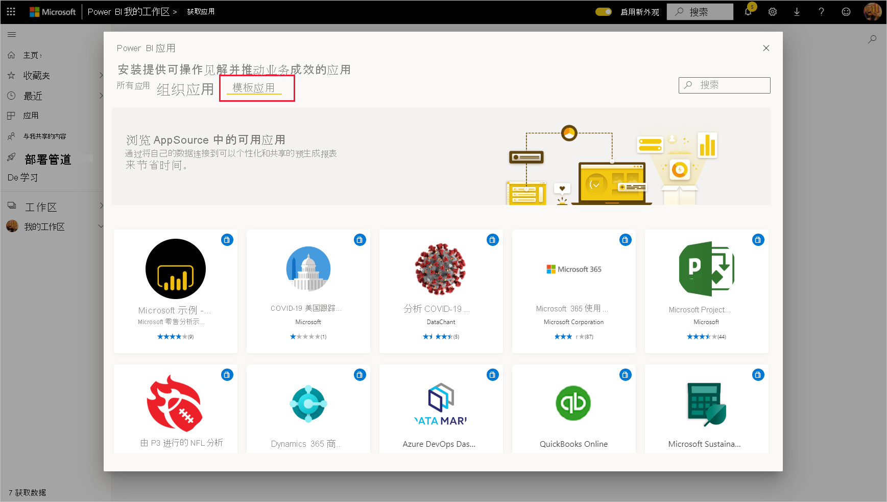

# 在组织中安装和分发模板应用

你是 Power BI 分析师吗？ 如果是，本文将向你介绍如何安装[模板应用](service-template-apps-overview.md)以连接到多个用于运行 Salesforce、Microsoft Dynamics 和 Google Analytics 等业务的服务。 然后，可以修改模板应用的预构建仪表板和报表以满足组织的需求，并将它们作为[应用](../consumer/end-user-apps.md)分发给同事。 

如果你有兴趣自己创建模板应用以在组织外部分发，请参阅[在 Power BI 中创建模板应用](service-template-apps-create.md)。 Power BI 合作伙伴几乎或完全无需编码，即可构建 Power BI 应用，并将其提供给 Power BI 客户。 

## 先决条件  

要安装、自定义和分发模板应用，需要： 

* 一个 [Power BI Pro 许可证](../fundamentals/service-self-service-signup-for-power-bi.md)。
* 在租户上安装模板应用的权限。
* 有效的应用安装链接，可以从 AppSource 或应用创建者处获取该链接。
* 非常熟悉 [Power BI 的基本概念](../fundamentals/service-basic-concepts.md)。

## 安装模板应用

1. 在 Power BI 服务的导航窗格中，选择“应用” > “获取应用” 。

    

1. 在出现的 Power BI 应用商城中，选择“模板应用”。 将显示 AppSource 中提供的所有模板应用。 浏览查找所需的模板应用，或使用搜索框获取经筛选的模板应用。 键入模板应用的部分名称或类别（如财务、分析、市场营销等），可以更轻松地找到所需的项。

    

1. 找到所需的模板应用后，单击该应用。 将显示模板应用产品/服务。 单击“立即获取”。

   

1. 在显示的对话框中，选择“安装”。

    
    
    将安装应用，并安装具有同一名称的工作区，该工作区具有用于进一步[自定义](#customize-and-share-the-app)所需的所有项目。

    > [!NOTE]
    > 如果使用未在 AppSource 上列出的应用的安装链接，将出现一个验证对话框，要求你确认选择。
    >
    >要安装未在 AppSource 上列出的模板应用，需要向管理员请求相关权限。有关详细信息，请参阅 Power BI 管理门户中的[模板应用设置](../admin/service-admin-portal.md#template-apps-settings)。

    安装成功完成后，系统会显示一条通知，告知你新应用已准备就绪。

    

## 连接到数据

1. 选择“转到应用”。

1. 在“开始使用新应用”窗口中，选择“浏览” 。

   

   应用将打开，显示示例数据。

1. 选择页面顶部横幅上的“连接数据”链接。

   

    这将打开“参数”对话框，你可以在其中将数据源从示例数据更改为你自己的数据源（请参阅[已知限制](service-template-apps-overview.md#known-limitations)），然后打开“身份验证方法”对话框。 你可能必须重新定义这些对话框中的值。 有关详细信息，请参阅所安装的特定模板应用的文档。

   

    填写完连接对话框后，连接过程开始。 横幅提示你正在刷新数据，与此同时你正在查看示例数据。

    

   除非在登录过程中禁用了此功能，否则报表数据将每天自动刷新一次。 也可以[设置自己的刷新计划](./refresh-scheduled-refresh.md)，根据需要使报表数据保持最新状态。

## 自定义和共享应用

连接到数据并完成数据刷新后，可以自定义应用包含的任何报表和仪表板，并与同事共享该应用。 但是，请记住，使用新版本更新应用后，所做的任何更改都将被覆盖，除非以不同的名称保存更改后的项目。 [查看有关覆盖的详细信息](#overwrite-behavior)。

若要自定义并共享你的应用，请选择页面右上角的铅笔图标。

有关在工作区中编辑项目的信息，请参阅
* [Power BI 中的报表编辑器导览](../create-reports/service-the-report-editor-take-a-tour.md)
* [Power BI 服务中设计器的基本概念](../fundamentals/service-basic-concepts.md)

在工作区中完成对项目的所有更改后，即可发布和共享应用。 请参阅[发布应用](../collaborate-share/service-create-distribute-apps.md#publish-your-app)，了解如何执行此操作。

## 更新模板应用

模板应用的创建者有时会通过 AppSource 和/或直接链接发布其模板应用的新改进版本。

如果最初是从 AppSource 下载的应用程序，当新版本的模板应用可用时，可以通过两种方式获得通知：
* Power BI 服务中会出现一个更新横幅，通知你有新应用版本可用。
  
* 你会在 Power BI 的通知窗格中收到通知。

  

>[!NOTE]
>如果最初是通过直接链接而不是通过 AppSource 获得的应用，则知道新版本何时可用的唯一方法是联系模板应用创建者。

  要安装更新，请在通知横幅上或在通知中心单击“获取更新”，也可在 AppSource 中再次查找应用，然后选择“立即获取” 。 如果从模板应用创建者处获取了更新的直接链接，只需单击该链接。
  
  系统将询问你是要覆盖当前版本，还是要在新工作区中安装新版本。 默认情况下选择的是“覆盖”。

  

- **覆盖现有版本：** 使用模板应用的更新版本覆盖现有工作区。 [查看有关覆盖的详细信息](#overwrite-behavior)。

- **安装到新工作区：** 安装需要重新配置的工作区和应用的新版本（即，连接到数据、定义导航和权限）。

### 覆盖行为

* 覆盖会更新工作区（而非应用）中的报表、仪表板和数据集。 覆盖不会更改应用的导航、设置和权限。
* 更新工作区后，需要更新应用，以将更改从工作区应用于应用。
* 覆盖将保留配置的参数和身份验证。 更新后，数据集会开始自动刷新。 在此刷新过程中，应用、报表和仪表板显示示例数据。

  

* 覆盖始终显示示例数据，直到刷新完成。 如果模板应用的作者对数据集或参数进行了更改，则在刷新完成之前，工作区和应用程序的用户看不到新数据。 相反，在此期间，他们继续看到示例数据。
* 覆盖绝不会删除已添加到工作区的新报表或仪表板。 它仅使用原始作者所做的更改覆盖原始报表和仪表板。

>[!IMPORTANT]
>切记在覆盖后[更新应用](#customize-and-share-the-app)，以将更改应用于组织应用用户的报表和仪表板。

## 后续步骤

[与同事一起在 Power BI 中创建工作区](../collaborate-share/service-create-the-new-workspaces.md)
