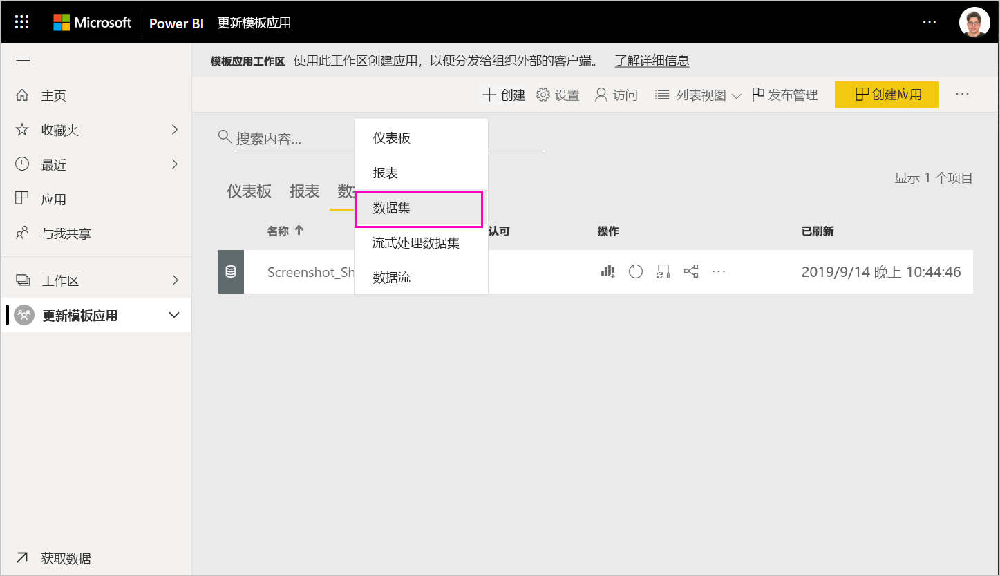
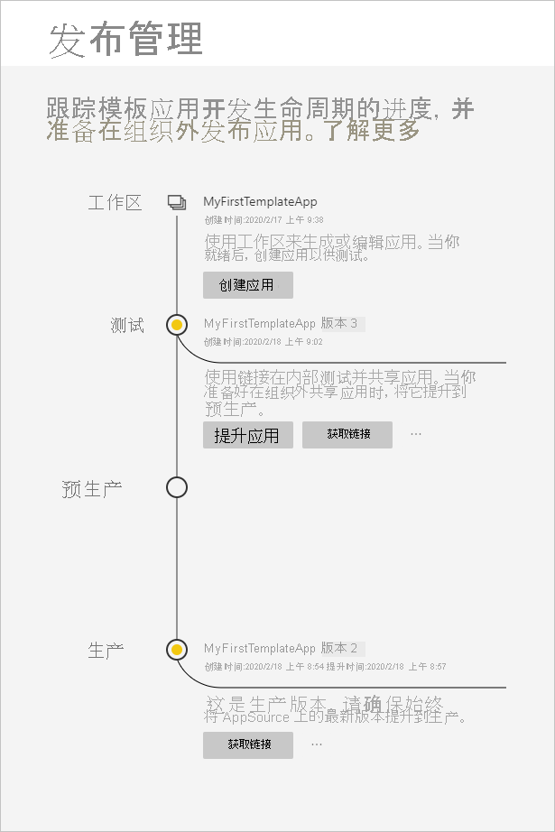
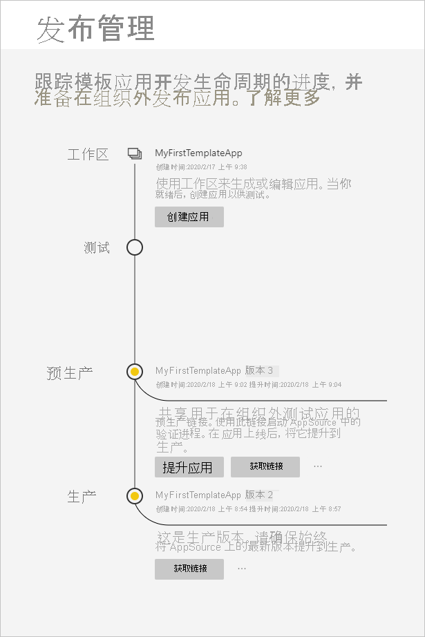
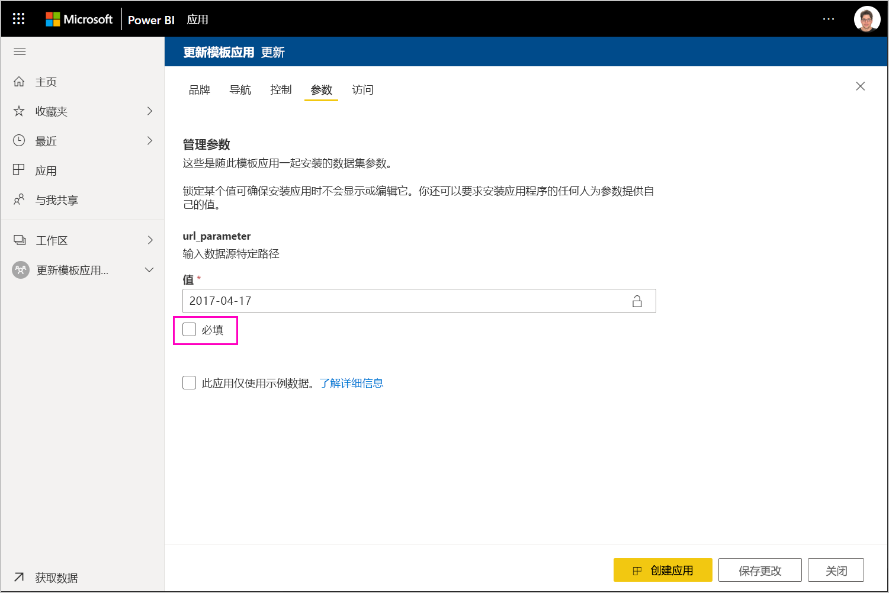
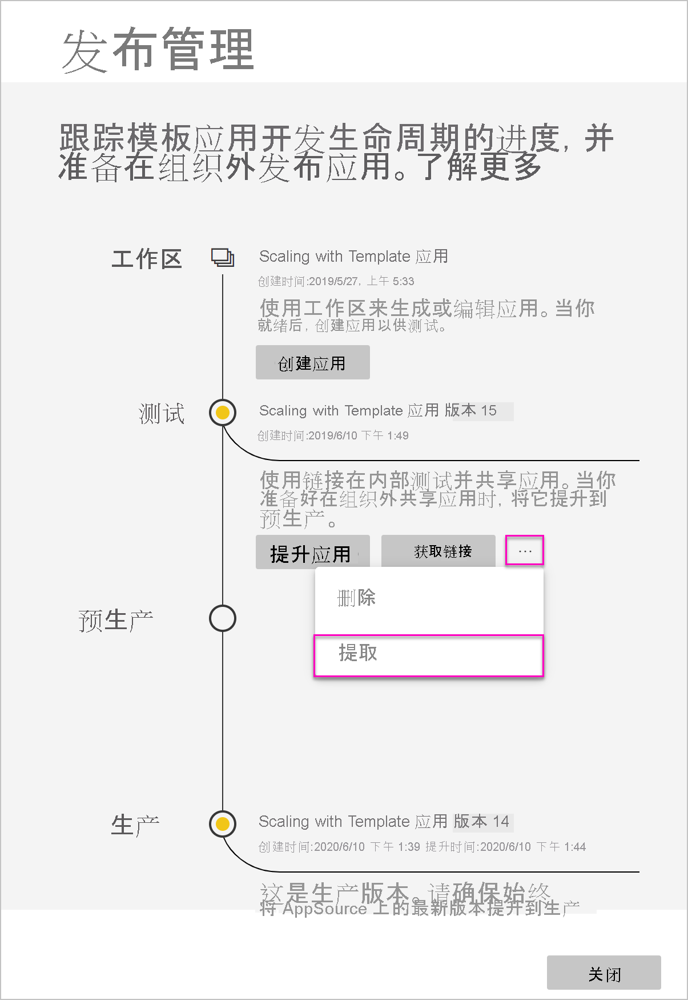
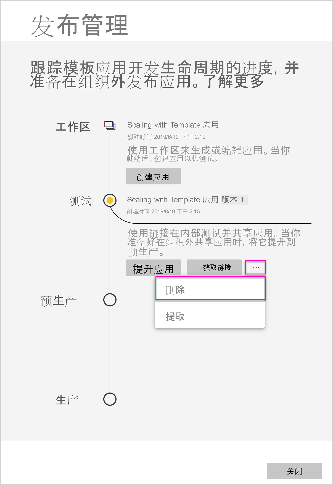

# 更新、删除和提取模板应用

现在应用已投入生产，可以在测试阶段重新开始，无需中断生产中的应用。
## 更新应用

如果在 Power BI Desktop 中进行了更改，请从步骤 (1) 开始。 如果未在 Power BI Desktop 中进行更改，请从步骤 (4) 开始。

1. 上传更新的数据集并覆盖现有数据集。 **确保使用完全相同的数据集名称**。 使用其他名称将为正在更新应用的用户创建新的数据集。

1. 从计算机导入 pbix 文件。

1. 确认覆盖。

1. 在“发布管理”窗格中，选择“创建应用”   。
1. 返回应用创建过程。
1. 设置“品牌”、“内容”、“控件”和“访问权限”后，再次选择“创建应用”      。
1. 选择“关闭”，然后返回“发布管理”   。

   现有两个版本：生产中的版本，以及测试中的新版本。

    

1. 准备好将应用提升到预生产以在租户之外进行进一步测试时，请返回到“发布管理”窗格，再选择“测试”  旁边的“提升应用”  。

   你现在有一个生产版本和一个预生产版本。

   

   链接现已生效。 **请注意，预生产阶段的“提升应用”按钮已灰显**。这是为了防止在云合作伙伴门户验证并批准新应用版本之前，意外覆盖指向当前应用版本的实时生产链接。

1. 按照 [Power BI 应用产品/服务更新](https://docs.microsoft.com/azure/marketplace/cloud-partner-portal/power-bi/cpp-update-existing-offer)中的步骤操作，将链接再次提交到云合作伙伴门户 (CPP)。 在云合作伙伴门户中，你必须再次“发布”你的产品/服务并使其获得验证和批准  。

   在你的产品/服务获得批准后，“升级应用”按钮将再次变为活动状态。 
1. 将你的应用提升到生产阶段。
   
### 更新行为

1. 更新应用将允许模板应用的安装程序在已安装的工作区中[更新模板应用](service-template-apps-install-distribute.md#update-a-template-app)，而不会丢失连接配置。
1. 若要了解数据集中的更改如何影响已安装的模板应用，请参阅安装程序的[覆盖行为](service-template-apps-install-distribute.md#overwrite-behavior)。
1. 更新（覆盖）模板应用时，将首先恢复为示例数据，并将自动与用户的配置（参数和身份验证）重新连接。 在刷新完成前，报表、仪表板和组织应用将显示示例数据横幅。
1. 如果向需要用户输入的更新数据集添加了新的查询参数，则必须选中“必需”复选框  。 这会在更新应用后提示安装程序输入连接字符串。
 

## 提取工作区
借助提取功能，现在回滚到旧版模板应用不再是难事。 下面介绍了如何从各个发布阶段中将特定应用版本提取到新工作区：

1. 在“发布管理”窗格中，依次按下“更多(...)”  和“提取”  。

     
2. 在对话框中，输入已提取工作区的名称。 此时，系统会添加新工作区。

新工作区的版本控制会重置，你可以继续从新提取的工作区开发和分发模板应用。

## 删除模板应用版本
模板工作区是活动分散式模板应用的源。 为了保护模板应用用户，如果不先删除工作区中的所有已创建应用版本，就无法删除工作区。
删除应用版本也会删除不再有效的应用 URL。

1. 在“发布管理”窗格中，依次选择省略号 (...)  和“删除”  。
 
 

>[!NOTE]
>请确保不要删除客户或 AppSource  正在使用的应用版本，否则它们将不再有效。

## 后续步骤

通过[在组织中安装、自定义和分发模板应用](service-template-apps-install-distribute.md)，了解客户与模板应用的互动方式。

有关分发应用的详细信息，请参阅 [Power BI 应用程序产品/服务](https://docs.microsoft.com/azure/marketplace/cloud-partner-portal/power-bi/cpp-power-bi-offer)。
