# 教程：在 Power BI 中生成机器学习模型

在本教程中，你将在 Power BI 中使用自动机器学习创建并应用二进制预测模型。  此教程包括以下操作的指南：创建 Power BI 数据流，以及使用数据流定义的实体直接从 Power BI 训练并验证机器学习模型。 然后使用该模型对新数据进行评分，以生成预测。

首先将创建二进制预测机器学习模型，用于基于在线购物者的联机会话属性集预测他们的购买意向。 在此练习中使用了基准机器学习数据集。 训练模型后，Power BI 将自动生成验证报告，来说明模型结果。 然后则可以查询验证报告，并将模型应用于数据，来进行评分。

此教程包含下列步骤：
> [!div class="checklist"]

> * 使用输入数据创建数据流
> * 创建并训练机器学习模型
> * 查看模型验证报告
> * 将模型应用于数据流实体
> * 在 Power BI 报表中使用模型的评分输出

## 使用输入数据创建数据流

此教程的第 1 部分为使用输入数据创建数据流。 此过程需要以下部分所示的几个步骤，首先是获取数据。

### 获取数据

创建数据流的第 1 个步骤是准备好数据资源。 在示例中，我们使用一组联机会话的机器学习数据集，其中的一些会话以购买结束。 此数据集包含一组与这些会话相关的属性，我们将使用它们训练模型。

可以从 UC Irvine 网站下载此数据集。 我们还在以下链接中提供了此数据集，以便于使用此教程：[online_shoppers_intention.csv](https://raw.githubusercontent.com/santoshc1/PowerBI-AI-samples/master/Tutorial_AutomatedML/online_shoppers_intention.csv)。

### 创建实体

若要在数据流中创建实体，登录到 Power BI 服务并导航到启用 AI 的专用容量上的工作区。

如果还没有工作区，可以通过从 Power BI 服务选择导航窗格菜单的“工作区”来创建一个，然后选择在面板底部显示的“创建工作区”   。 这将在右侧打开一个面板，用于输入工作区详细信息。 输入一个工作区名称，然后选择“高级”  。 使用单选按钮确认工作区使用“专用容量”，并确保将它分配给已启用 AI 预览版的专用容量实例。 然后，选择“保存”  。

创建工作区后，可以选择欢迎屏幕右下角的“跳过”  ，如下图所示。

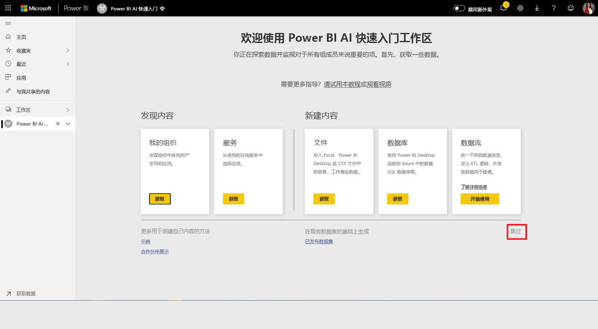

 选择工作区右上角的“创建”  按钮，再选择“数据流”  。

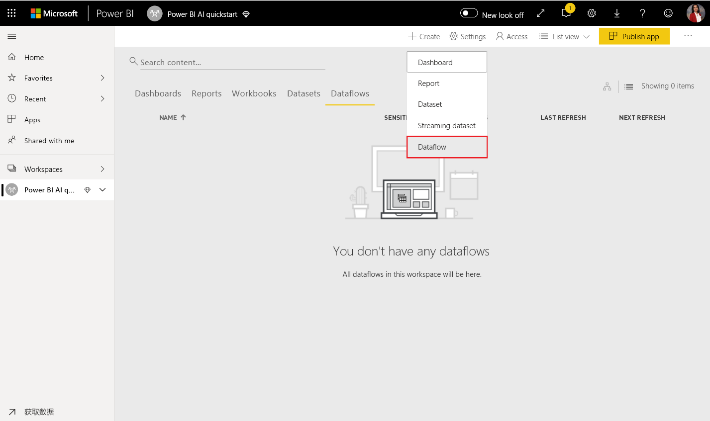

选择“添加新实体”  。 这将从浏览器启动 Power Query 编辑器。 

选择“文本/CSV 文件”作为数据源，如下图所示。 

在接下来出现的“连接到数据源”页中，将指向“online_shoppers_intention.csv”的以下链接粘贴到“文件路径或 URL”框，，然后选择“下一步”     。

`https://raw.githubusercontent.com/santoshc1/PowerBI-AI-samples/master/Tutorial_AutomatedML/online_shoppers_intention.csv`

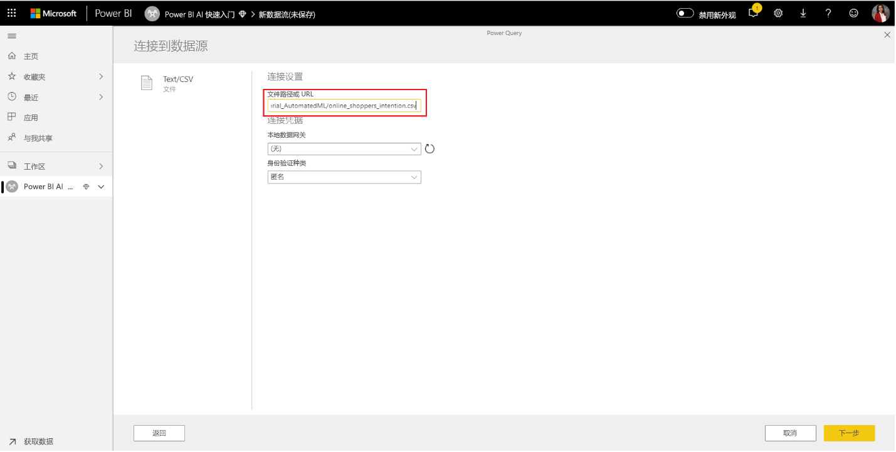

Power Query 编辑器显示 CSV 文件中的数据的预览。 更改右侧窗格中“名称”框的值，即可以将查询重命名为一个更加友好的名称。 例如，可以将查询名称更改为“在线访问者”  。

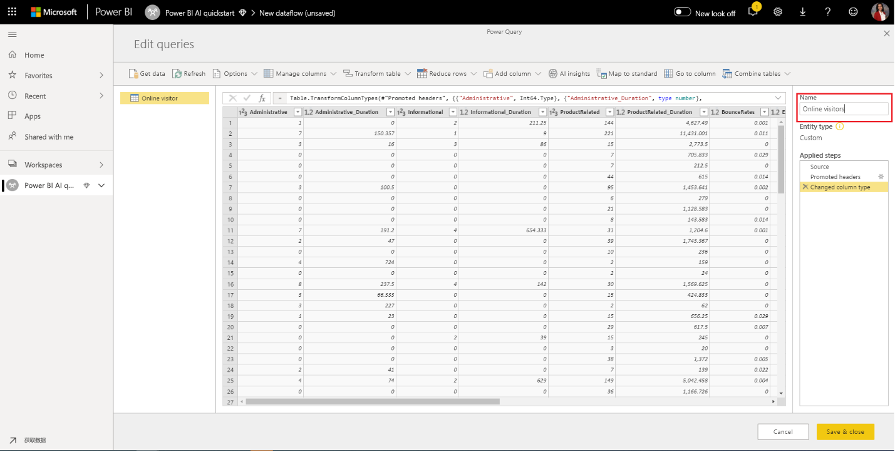

Power Query 自动推断列的类型。 可以通过单击列标题顶部的属性类型图标来更改列类型。 在此示例中，我们将“收入”列的类型更改为 True 或 False。

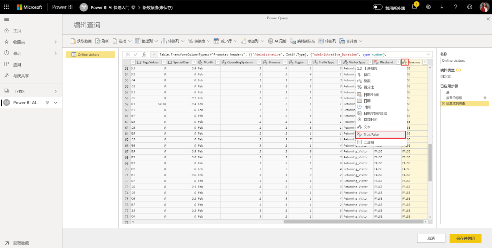

选择“保存并关闭”按钮以关闭 Power Query 编辑器  。 为数据流提供一个名称，然后从对话框选择“保存”，如下图所示  。

## 创建并训练机器学习模型

在包含训练数据和标签信息的基本实体的“操作”列表中，选择“应用 ML 模型”按钮，然后选择“添加机器学习模型，以添加机器学习模型”。   

创建机器学习模型的第 1 个步骤是确认历史数据，包括想要预测的结果字段。 将通过学习此数据创建模型。

对于我们所使用的数据集，即为“收入”字段。  选择“收入”作为“结果字段”值，然后选择“下一步”   。

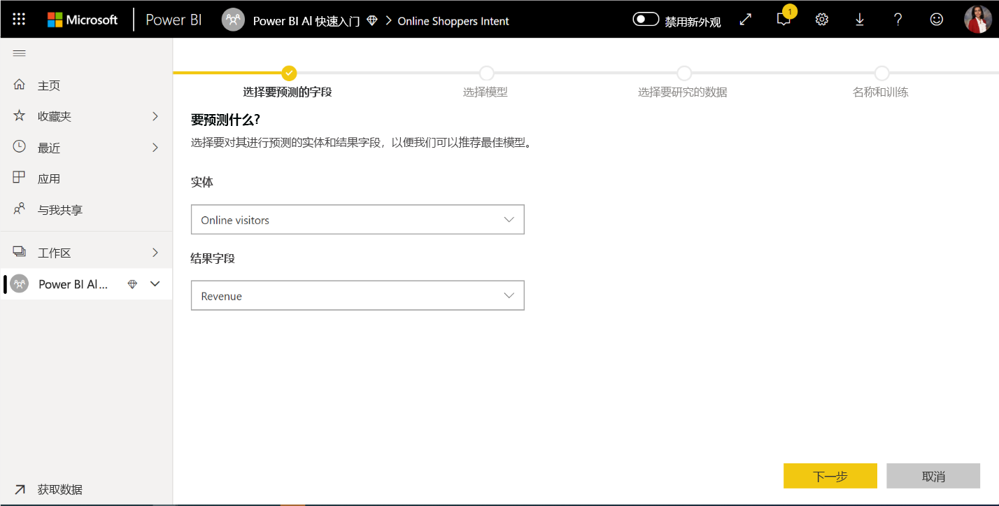

接下来必须选择要创建的机器学习模型的类型。 Power BI 将分析你已确认的结果字段中的值，并推荐可以创建以用于预测该字段的机器学习模型类型。

在此示例中，由于预测的是关于用户是否购买的二进制结果，因此建议选择“二进制预测”。 因为我们对预测将进行购买的用户感兴趣，因此请选择“True”作为你最感兴趣的收入结果。 另外，为结果提供易记的标签，以便用于自动生成的用于汇总模型验证结果的报表。 然后选择“下一步”。

接下来，Power BI 对你的数据示例进行初步扫描，并建议可能产生更准确的预测的输入。 如果 Power BI 不建议使用字段，则会在字段旁边提供说明。 你可以选择更改选项，使其仅包含你希望模型学习的字段，或者通过选择实体名称旁边的复选框来选择所有字段。 选择“下一步”，以接受输入。 

在最后一步中，我们必须为模型提供一个名称。 为模型命名为“购买意向预测”  。 可以选择缩短训练时间以查看快速结果，或增加训练所用的时间以获得最佳模型。 然后选择“保存并训练”，开始训练模型  。

训练过程将从采集和规范化历史数据并将数据集拆分为两个新的实体（“购买意向预测训练数据”和“购买意向预测测试数据”）开始。  

在任何地方，训练过程均可能需要几分钟到上一屏幕所选的训练时间，具体取决于数据集的大小。 此时，可以从数据流的“机器学习模型”选项卡看到此模型。  “已就绪”状态表示模型已在排队等待训练，或正在进行训练。

可以通过数据流的状态确认正在训练和验证模型。 在工作区的“数据流”选项卡中，它显示为数据刷新“正在进行中”。 

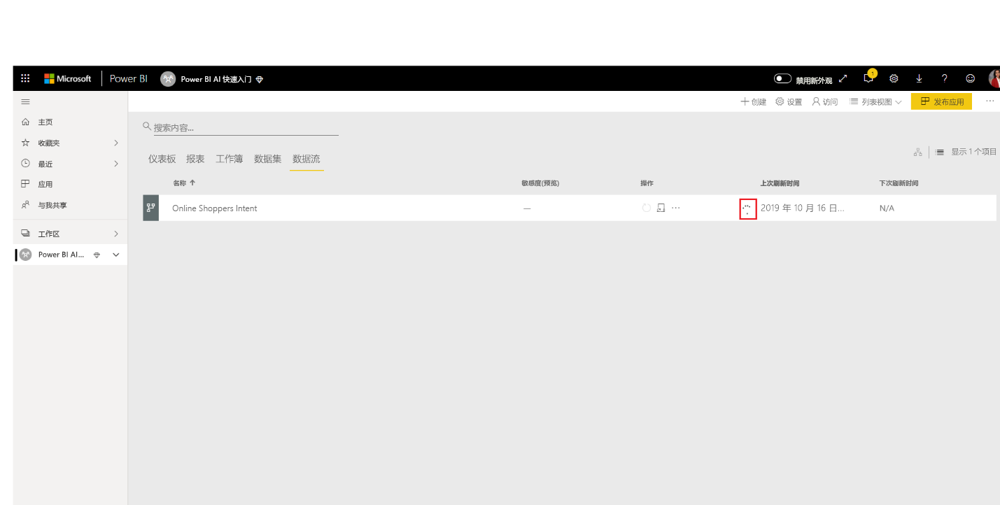

模型训练完成后，数据流显示更新后的刷新时间。 导航到数据流的“机器学习模型”选项卡，即可确认是否已训练模型。  创建的模型显示的状态应为“已训练”，并且“上一次训练”时间现在应更新   。

## 查看模型验证报告
若要查看模型验证报表，在“机器学习模型”选项卡中，选择模型“操作”列里的“查看训练报表”按钮。 此报告描述机器学习模型的性能趋势。

在报表的“模型性能”页中，选择“查看主要预测指标”，以查看模型的主要预测指标   。 可以选择一个预测指标，查看结果分布与该预测指标的关联情况。

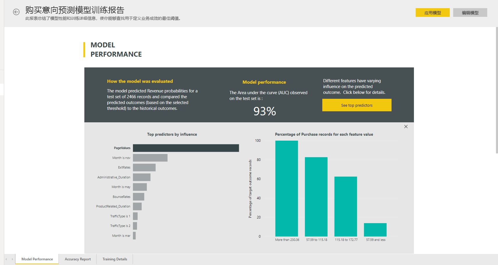

在“模型性能”页上，可以使用“概率阈值”切片器，来查看它对模型的“精度”和“召回率”的影响。 

报告的其他页描述模型的统计学性能指标。

此报告还包括“训练详细信息”页，其中说明了运行的各种迭代、如何从输入提取特征，以及使用的最终模型的超参数。

## 将模型应用于数据流实体

从报表顶部选择“应用模型”按钮，以调用此模型  。 在“应用”对话框中，可以指定包含模型应应用到的源数据的目标实体。 

出现提示时，必须刷新数据流才能预览模型的结果。 

应用模型会创建两个新实体，其后缀为“enriched <model_name>”和“enriched <model_name> explanations”   。 在这种情况下，将模型应用到“在线访问者”实体会创建“在线访问者扩充的购买意向预测”，其中包括模型的预测输出，和其中包含预测的最特定于记录的主要影响因素的“在线访问者扩充的购买意向预测说明”    。 

应用二进制预测模型后，将添加四个列，其中包含预测的结果、概率评分以及预测的特定于记录的主要影响因素，并解释索引每个列的前面均有指定的列名称。  

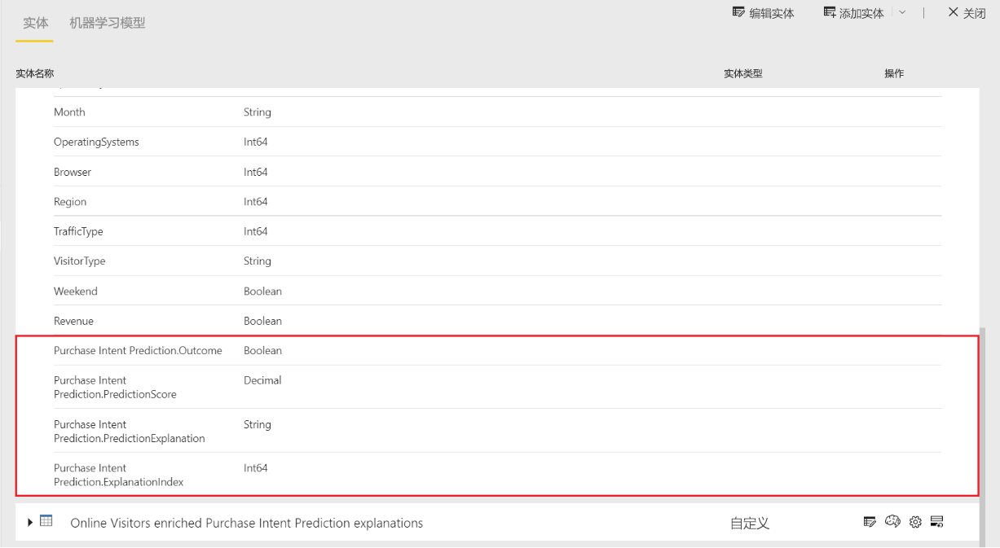

数据流刷新完成后，可以选择“在线访问者扩充的购买意向预测”实体，以查看结果  。

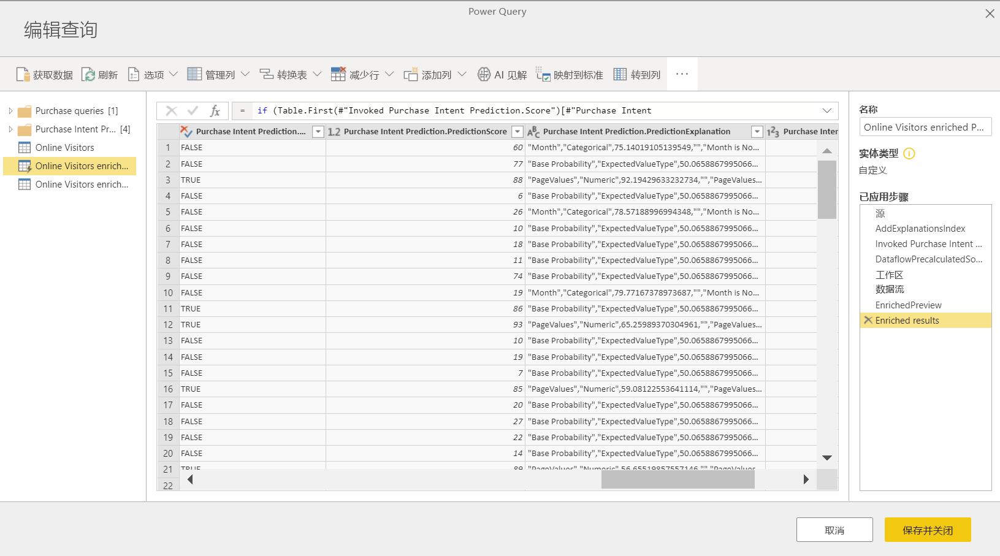

你还可以在数据流中直接从 Power Query 编辑器调用工作区中的任何 AutoML 模型。 若要访问 AutoML 模型，请从 AutoML 模型中选择想要使用见解进行扩充的实体的“编辑”按钮，如下图中所示。

选择“编辑”按钮将在数据流中为实体打开 Power Query 编辑器。 在功能区中选择“AI 见解”按钮。

 从导航窗格菜单中选择“Power BI 机器学习模型”文件夹。 有权访问的所有 AutoML 模型都在此处作为 Power Query 函数列出。 此外，会将 AutoML 模型的输入参数自动映射为相应的 Power Query 函数的参数。 请注意，仅当参数的名称和数据类型相同时，才会执行参数的自动映射。
 
若要调用 AutoML 模型，可以从下拉列表中将任一选定的实体的列指定为输入。 此外，还可以通过将列图标切换到输入对话框左侧来指定要用作输入内容的常量值。

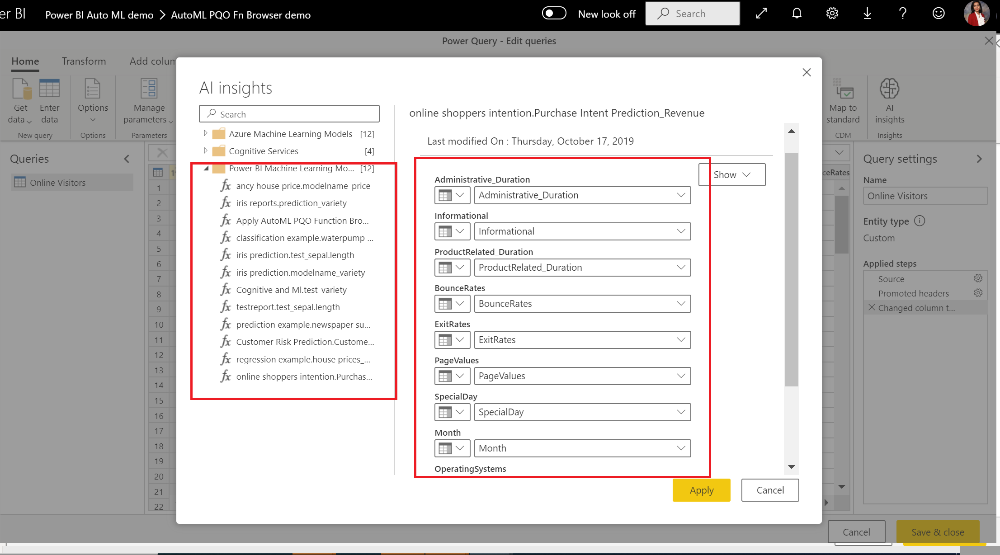

选择“应用”以查看作为实体表中新列的 AutoML 模型的输出预览。 还会将模型调用视作查询的一个应用步骤。

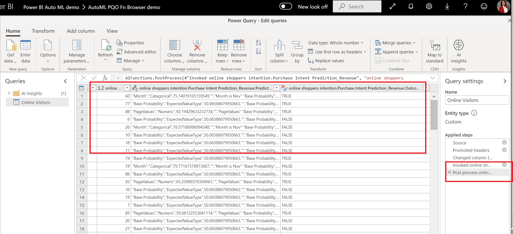

保存数据流后，当刷新数据流时，将为实体表中的任何新行或更新的行自动调用模型。

## 在 Power BI 报表中使用模型的评分输出

可以使用数据流，从 Power BI Desktop 连接器连接到数据流，以使用机器学习模型的评分输出。 在 Power BI 报表中，现在可以使用“在线访问者扩充的购买意向预测”实体合并模型的预测****。

## 后续步骤

在此教程中，你通过以下步骤在 Power BI 中创建并应用了二进制预测模型：

* 使用输入数据创建数据流
* 创建并训练机器学习模型
* 查看模型验证报告
* 将模型应用于数据流实体
* 在 Power BI 报表中使用模型的评分输出

有关 Power BI 中的机器学习自动化的详细信息，请参阅 [Power BI 中的自动机器学习](../transform-model/service-machine-learning-automated.md)。
