# 教程：在 Power BI 中调用机器学习工作室（经典）模型（预览版）

在本教程中，我们将演示将 Azure 机器学习工作室（经典）模型中的见解融入 Power BI 的体验  。 本教程包括有关向 Power BI 用户授予访问 Azure ML 模型的权限、创建数据流以及将 Azure ML 模型中的见解应用到数据流的指南。 如果还没有模型，本教程还引用了有关创建 Azure ML 模型的快速入门指南。

本教程将指导你完成以下步骤：

> [!div class="checklist"]
> * 创建和发布 Azure 机器学习模型
> * 向 Power BI 用户授予使用模型的访问权限
> * 创建数据流
> * 将 Azure ML 模型中的见解应用到数据流

## 创建和发布 Azure ML 模型

按照[演练步骤 1：创建机器学习工作室（经典）工作区](/azure/machine-learning/studio/walkthrough-1-create-ml-workspace)，以创建机器学习  工作区。

可以对已有的任何 Auzre ML 模型或数据集使用这些步骤。 如果还没有发布的模型，可以通过参考[在 Azure 机器学习工作室（经典）中创建你的第一个数据科学试验](/azure/machine-learning/studio/create-experiment)（该教程设置有关汽车价格预测的 Azure ML 模型）在几分钟内创建一个模型。

按照[部署 Azure 机器学习工作室（经典）Web 服务](/azure/machine-learning/studio/tutorial-part3-credit-risk-deploy)中的步骤操作，将 Azure ML 模型发布为 Web 服务。

## 向 Power BI 用户授予访问权限

要从 Power BI 访问 Azure ML 模型，必须具有对 Azure 订阅和资源组的读取  权限，以及对机器学习工作室（经典）模型的 Azure 机器学习工作室（经典）Web 服务的读取  访问权限。  对于 Azure 机器学习模型，需要具有对机器学习工作区的读取  访问权限。

以下步骤假定你是模型发布到的 Azure 订阅和资源组的共同管理员。

登录到 [Azure 门户](https://portal.azure.com)并导航到“订阅”  页，可以使用导航窗格菜单中的“所有服务”  列表找到该页。

选择用于发布模型的 Azure 订阅，然后选择“访问控制(IAM)”  。 接下来，选择“添加角色分配”  ，然后选择“读取者”  角色并选择 Power BI 用户。 完成时选择“保存”  。 下图显示这些选项。

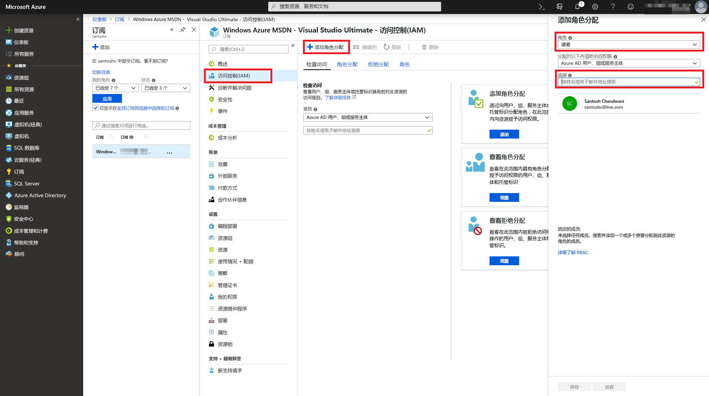

然后，重复上面的步骤以对已部署的 Azure ML 模型的特定机器学习 Web 服务的 Power BI 用户授予“参与者”  角色访问权限。

## 创建数据流

### 获取创建数据流的数据

使用上一步骤中向其授予访问 Azure ML 模型权限的用户的用户凭据登录到 Power BI 服务。

此步骤假定你具有想要使用 Azure ML 模型进行评分的 CSV 格式的数据。  如果使用“汽车定价实验”在机器学习工作室（经典）中创建了模型，则将在下面的链接中共享其数据集  ：

* [Azure 学习工作室（经典）示例模型](https://github.com/santoshc1/PowerBI-AI-samples/blob/master/Tutorial_MLStudio_model_integration/Automobile%20price%20data%20_Raw_.csv)

### 创建数据流

若要在数据流中创建实体，登录到 Power BI 服务并导航到已启用 AI 预览的容量中的工作区。

如果还没有工作区，可以通过选择左侧菜单的“工作区”  来创建一个，然后选择底部面板中的“创建工作区”  。  这将打开一个面板，用于输入工作区详细信息。 输入一个工作区名称，然后选择“保存”  。

创建工作区后，可以选择欢迎屏幕右下角的“跳过”  。

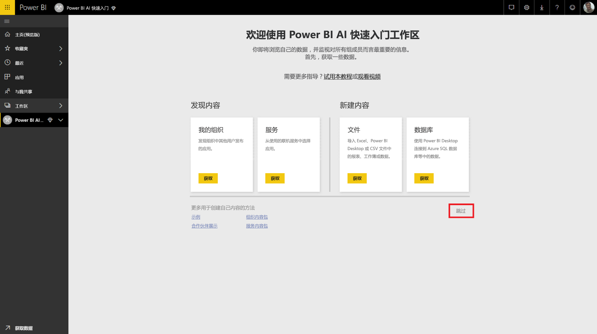

选择“数据流(预览版)”  选项卡，然后选择工作区右上角的“创建”  按钮，再选择“数据流”  。

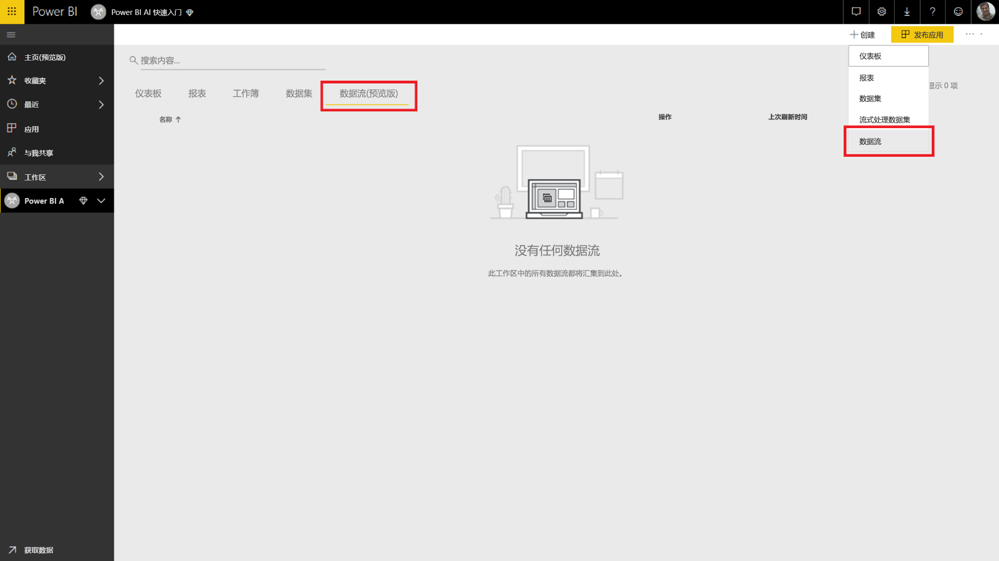

选择“添加新实体”  ，这将在浏览器中启动“Power Query 编辑器”  。

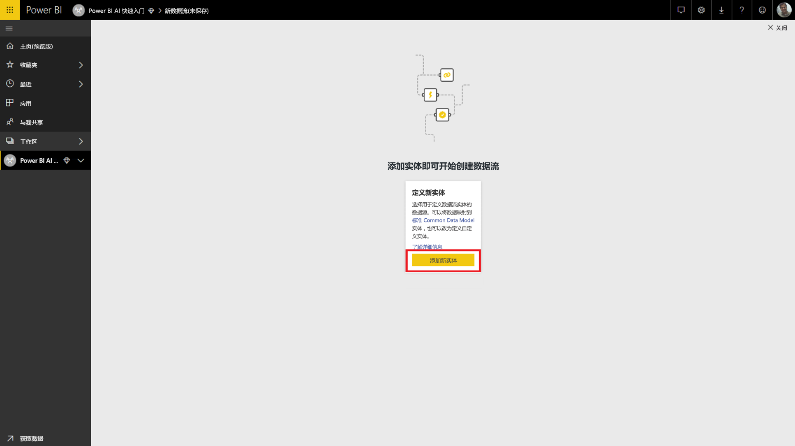

选择“文本/CSV 文件”  作为数据源。

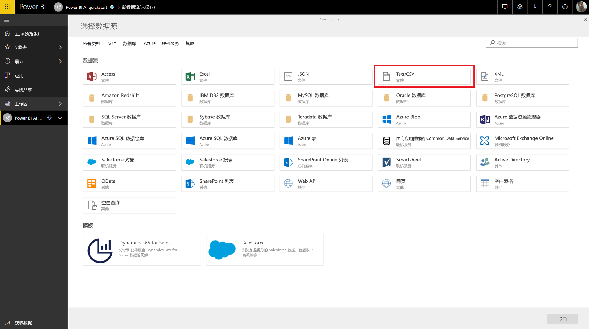

在下一屏幕中，系统将提示你连接到数据源。 将链接复制到用于创建 Azure ML 模型的数据。 如果使用了“汽车定价”  数据，可以将下面的链接粘贴到“文件路径或 URL”  框，然后单击“下一步”  。

`https://raw.githubusercontent.com/MicrosoftLearning/Principles-of-Machine-Learning-Python/master/Module7/Automobile%20price%20data%20_Raw_.csv`

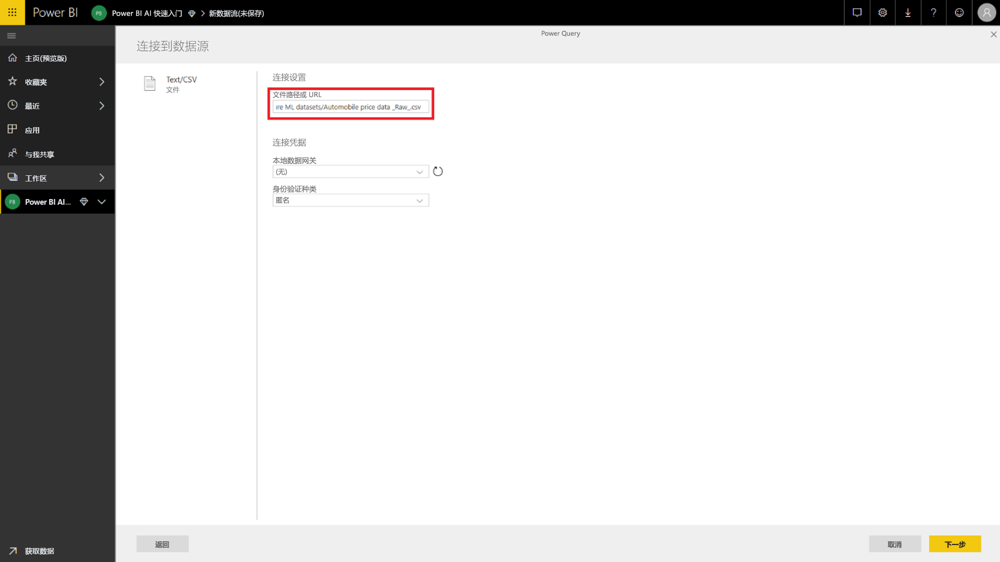

Power Query 编辑器显示 CSV 文件中的数据的预览。 从命令功能区中选择“转换表”  ，然后选择“将第一行用作标题”  。  此操作将“提升的标题”  查询步骤添加到右侧的“应用步骤”  窗格中。 还可以使用右侧窗格将查询重命名为更友好的名称，例如“汽车定价”  。

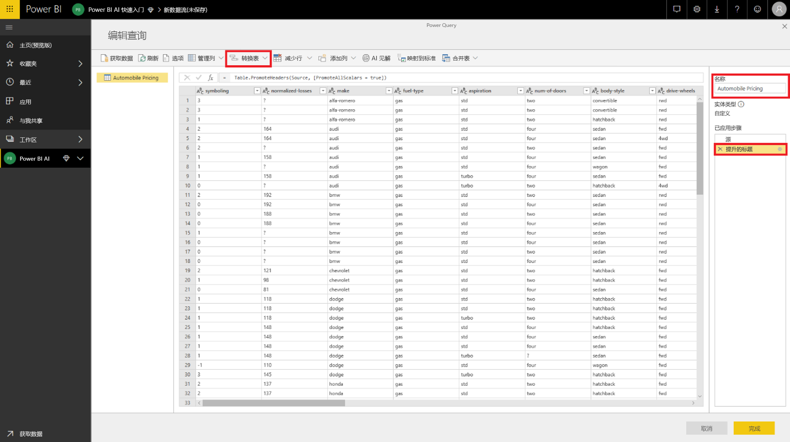

我们的源数据集已将未知值设置为“?”。  若要清除该值，为简单起见，我们可以将“?”替换为“0”以避免后续出现错误。  若要执行此操作，通过单击列标题中的列名称来选择列“normalized-losses”  、“bore”  、“stroke”  、“compression-ratio”  、“horsepower”  、“peak-rpm”  和“price”  ，然后单击“转换列”并选择“替换值”。  将“?”替换为“0”。

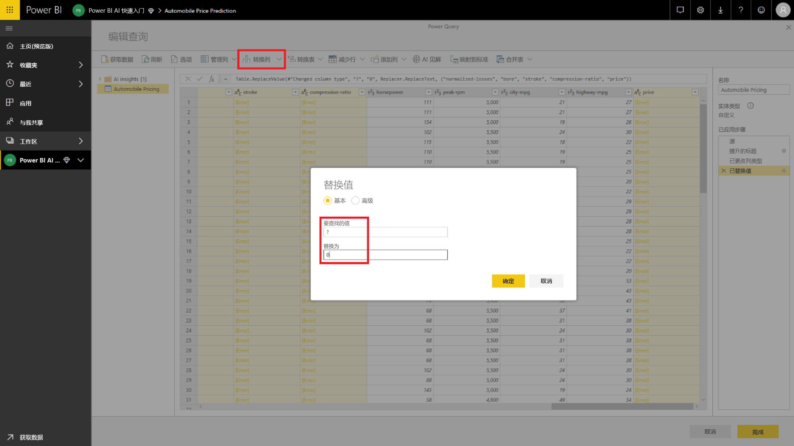

文本/CSV 源中的表的所有列都视作为文本列。  接下来，我们需要将数字列改为其正确的数据类型。  可以在 Power Query 中通过单击列标题中的数据类型符号来执行此操作。  将列更改为以下类型：

- **整数** ：symboling、normalized-losses、curb-weight、engine-size、horsepower、peak-rpm、city-mpg、highway-mpg、price
- **十进制数** ：wheel-base、length、width、height、bore、stroke、compression-ratio

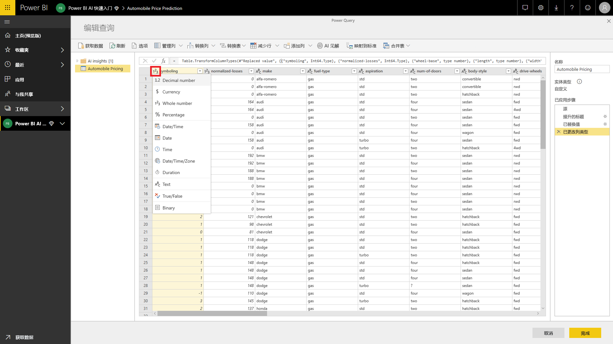

选择“完成”  以关闭 Power Query 编辑器。 这将显示包含我们添加的“汽车定价”  数据的实体列表。 选择右上角的“保存”  ，为数据流提供一个名称，然后选择“保存”  。

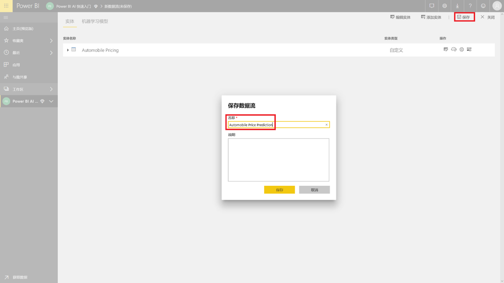

### 刷新数据流

保存数据流将显示一条通知，指示数据流已保存。 选择“立即刷新”  以将数据从源引入数据流。

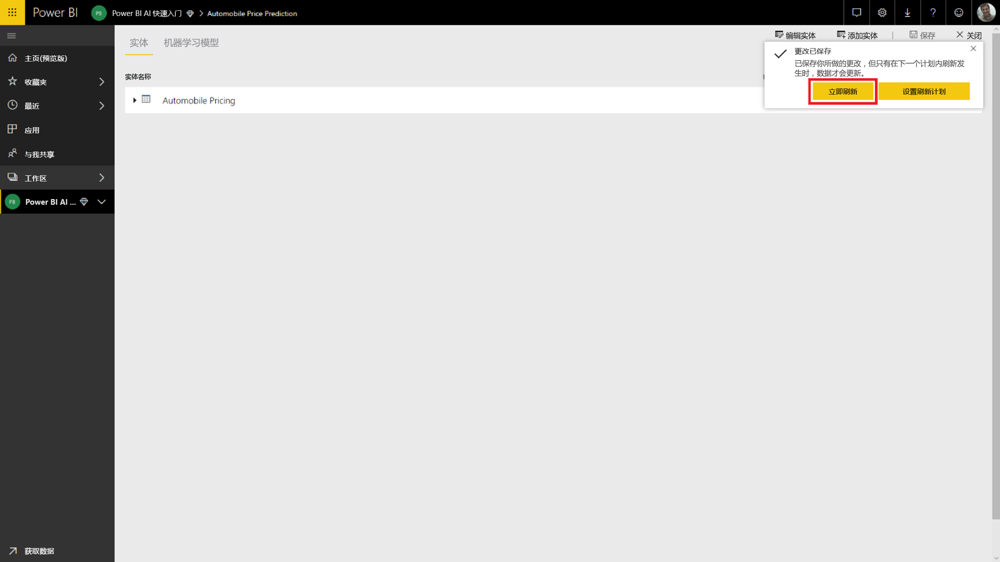

选择右上角的“关闭”  ，然后等待数据流刷新完成。

也可以使用“操作”  命令来刷新数据流。 刷新完成时，数据流将显示时间戳。

## 从 Azure ML 模型应用见解

若要访问“汽车价格预测”  的 Azure ML 模型，可以编辑想要添加预测价格的“汽车定价”  实体。

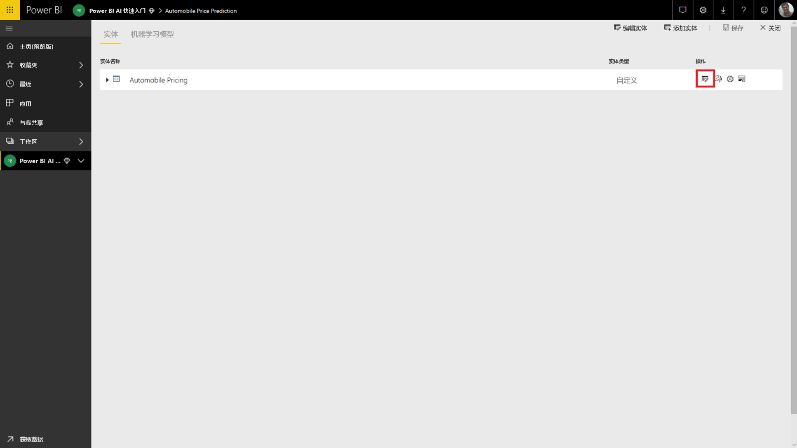

选择“编辑”  图标将为数据流中的实体打开 Power Query 编辑器。

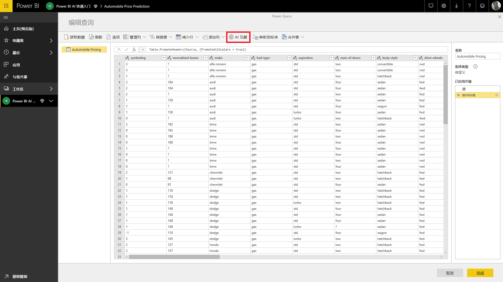

选择功能区中的“AI 见解”按钮，然后选择导航窗格菜单中的“Azure 机器学习模型”文件夹   。

已向其授予访问权限的 Azure ML 模型将作为 Power Query 函数列出，前缀为 AzureML  。  单击对应于 AutomobilePricePrediction  模型的函数时，模型的 Web 服务的参数将作为函数参数列出。

若要调用 Azure ML 模型，可以从下拉列表中将任一选定的实体的列指定为输入。 此外，还可以通过将列图标切换到输入对话框左侧来指定要用作输入内容的常量值。 当列名称与其中一个函数参数名称匹配时，则系统将自动建议该列作为输入。  如果列名称不匹配，可以从下拉列表中选择它。

在“汽车定价预测”  模型示例中，输入参数为：

- make
- body-style
- wheel-base
- engine-size
- horsepower
- peak-rpm
- highway-mpg

在我们的示例中，由于我们的表与用于训练模型的原始数据集匹配，因此所有参数都选择了正确的列。

选择“调用”  以查看作为实体表中新列的 Azure ML 模型的输出预览。 还会将模型调用视作查询的一个应用步骤。

模型的输出显示为输出列中的记录。 可以展开列，以在单个列中生成单独的输出参数。 在我们的示例中，我们只对包含汽车预测价格的“评分标签”  感兴趣。  因此，我们取消选择其他部分，然后选择“确定”  。

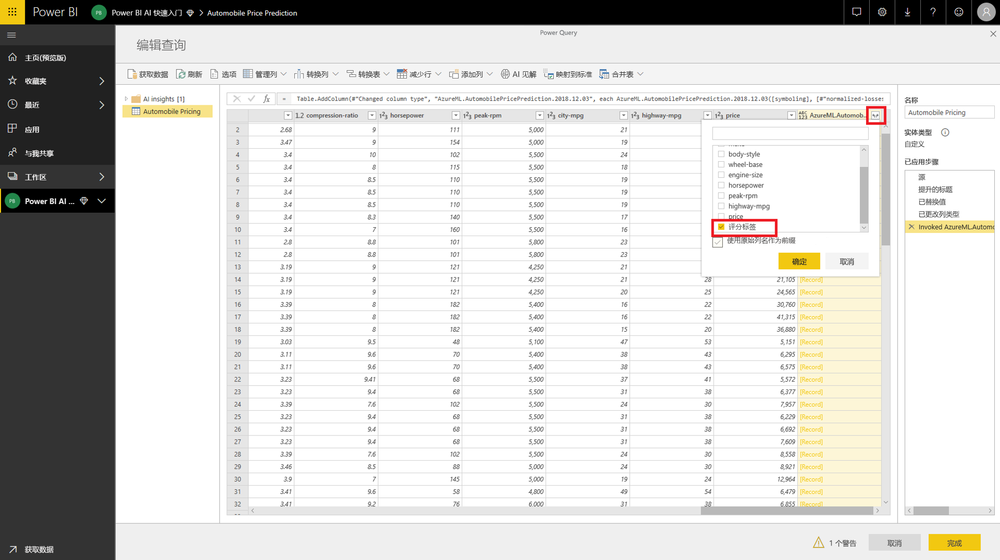

生成的“评分标签”  列包含来自 Azure ML 模型的价格预测。

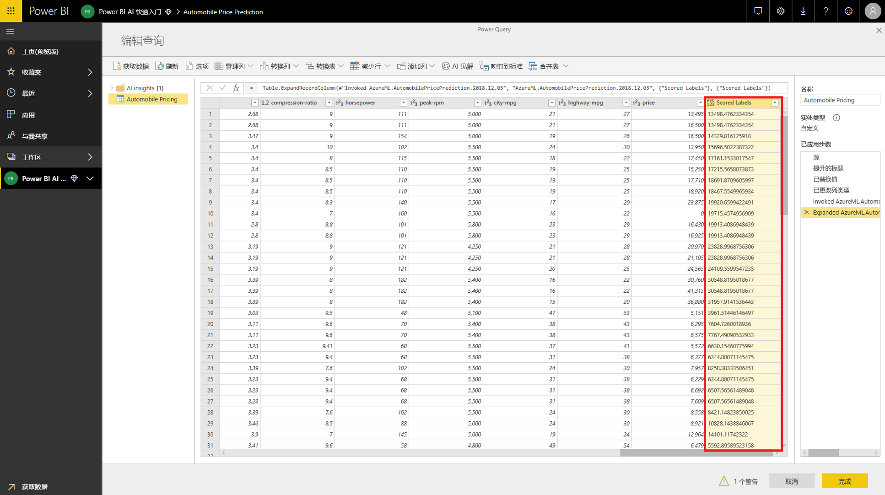

保存数据流后，当刷新数据流时，将为实体表中的任何新行或更新的行自动调用 Azure ML 模型。

## 清理资源

如果不再需要使用本文创建的 Azure 资源，请将其删除以避免产生任何费用。  如果不再需要所创建的数据流，也可以将其删除。

## 后续步骤

在本教程中，使用以下这些步骤，借助简单的数据集，通过 Azure 机器学习工作室（经典）创建了一个简单的试验：

- 创建和发布 Azure 机器学习模型
- 向 Power BI 用户授予使用模型的访问权限
- 创建数据流
- 将 Azure ML 模型中的见解应用到数据流

有关 Power BI 中的 Azure 机器学习集成的详细信息，请参阅 [Power BI 中的 Azure 机器学习集成（预览版）](../transform-model/dataflows/dataflows-machine-learning-integration.md)。