# <a name="tutorial-use-cognitive-services-in-power-bi"></a>教程：在 Power BI 中使用认知服务

借助 Power BI，可使用 Azure 认知服务中的一组函数，来丰富数据流自助服务数据准备中的数据。 目前支持的服务包括[情绪分析](/azure/cognitive-services/text-analytics/how-tos/text-analytics-how-to-sentiment-analysis)、[关键短语提取](/azure/cognitive-services/text-analytics/how-tos/text-analytics-how-to-keyword-extraction)、[语言检测](/azure/cognitive-services/text-analytics/how-tos/text-analytics-how-to-language-detection)和[图像标记](/azure/cognitive-services/computer-vision/concept-tagging-images)。 转换在 Power BI 服务上执行，无需 Azure 认知服务订阅。 此功能需要 Power BI Premium。

[数据流自助服务数据准备](https://powerbi.microsoft.com/blog/introducing-power-bi-data-prep-wtih-dataflows/)中支持认知服务转换。 使用分步示例进行文本分析并使用下面的图像标记开始操作。

在本教程中，了解如何：

> [!div class="checklist"]
> * 将数据导入数据流
> * 在数据流中对情绪进行评分并提取文本列的关键短语
> * 从 Power BI Desktop 连接到结果


## <a name="prerequisites"></a>先决条件

若要完成本教程，需要以下各项： 

- 一个 Power BI 帐户。 如果未注册 Power BI，请[免费注册](https://app.powerbi.com/signupredirect?pbi_source=web)后再进行操作。
- 在启用 AI 工作负载的情况下访问 Power BI Premium 容量。 在预览期间，此工作负载将默认关闭。 如果正在使用高级容量且 AI 见解未显示，请与高级容量管理员联系，以在管理门户中启用 AI 工作负载。

## <a name="text-analytics"></a>文本分析

请按照本部分中的步骤操作，完成教程的文本分析部分。

### <a name="step-1-apply-sentiment-scoring-in-power-bi-service"></a>步骤 1：在 Power BI 服务中应用情绪评分

若要开始，请导航到具有高级容量的 Power BI 工作区，并使用屏幕右上方的“创建”  按钮来创建一个新的数据流。

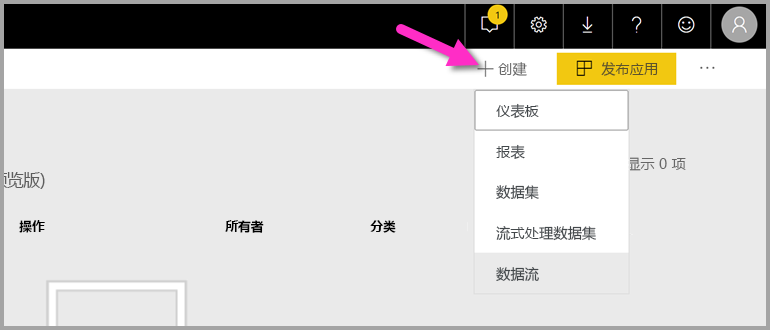

数据流对话框显示创建新数据流的选项，选择“添加新实体”  。 接下来，选择数据源菜单中的“文本/CSV”  。


将此 URL 粘贴到 URL 字段：[https://pbiaitutorials.blob.core.windows.net/textanalytics/FabrikamComments.csv](https://pbiaitutorials.blob.core.windows.net/textanalytics/FabrikamComments.csv) 并单击“下一步”  。

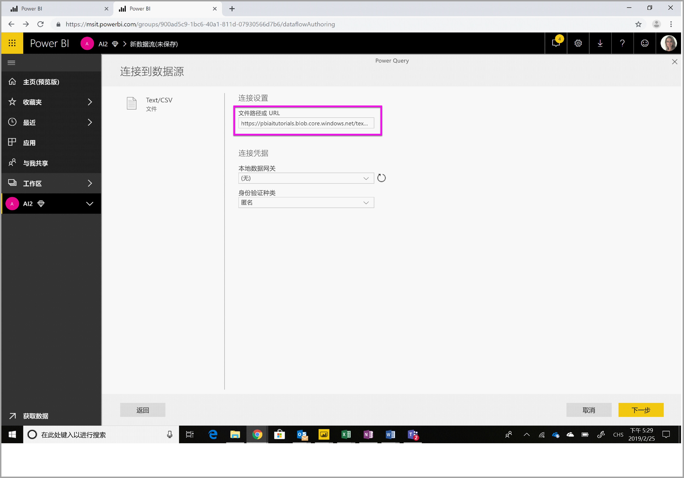

数据现已可供文本分析使用，并且可以对客户注释列使用情绪评分和关键短语提取。

在 Power Query 编辑器中，选择“AI 见解” 


展开“认知服务”  文件夹，然后选择想要使用的函数。 此示例是对注释列的情绪进行评分，但你可以按照相同的步骤来试用语言检测和关键短语提取。


选中函数后，将显示必填字段和可选字段。 若要对示例评论的情绪进行评分，请选择评论列作为文本输入。 区域性信息是可选输入，需要采用 ISO 格式。 例如，如果希望文本被视为英语，请输入“en”。 当字段留空时，Power BI 在对情绪进行评分前会先检测输入值的语言。

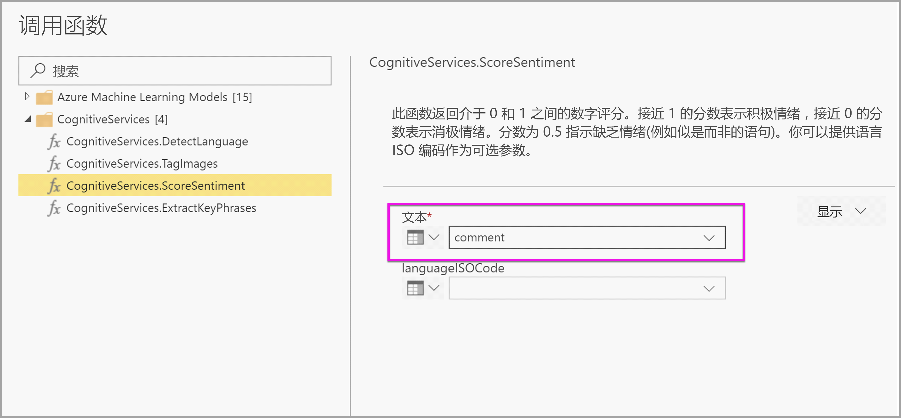

现在，选择“调用”  以运行函数。 会将包含每行情绪评分的新列添加到表中。 可以返回到“AI 见解”  以相同的方式提取评论文本的关键短语。

完成转换后，将查询名称更改为“客户注释”并选择“完成”  。

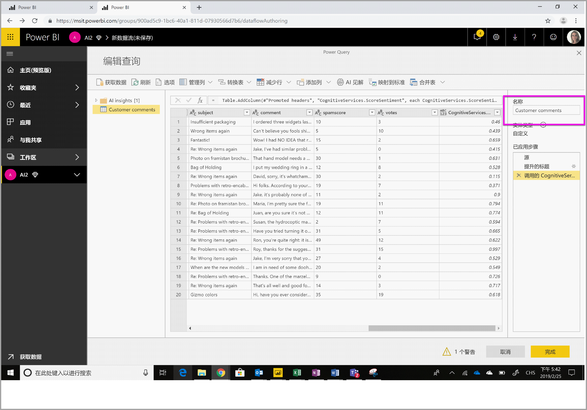

接下来，“保存”  数据流并将其命名为 Fabrikam。 在保存数据流后，选择弹出的“立即刷新”  按钮。

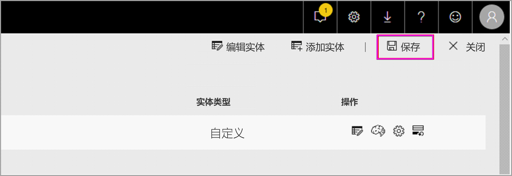

保存和刷新数据流，可以在 Power BI 报表中使用该数据流。

### <a name="step-2-connect-from-power-bi-desktop"></a>步骤 2：从 Power BI Desktop 中连接

打开 Power BI Desktop。 在“主页”功能区中，选择“获取数据”  。

导航到 Power BI 部分中的“Power BI 数据流(Beta 版)”  并选择“连接”  。

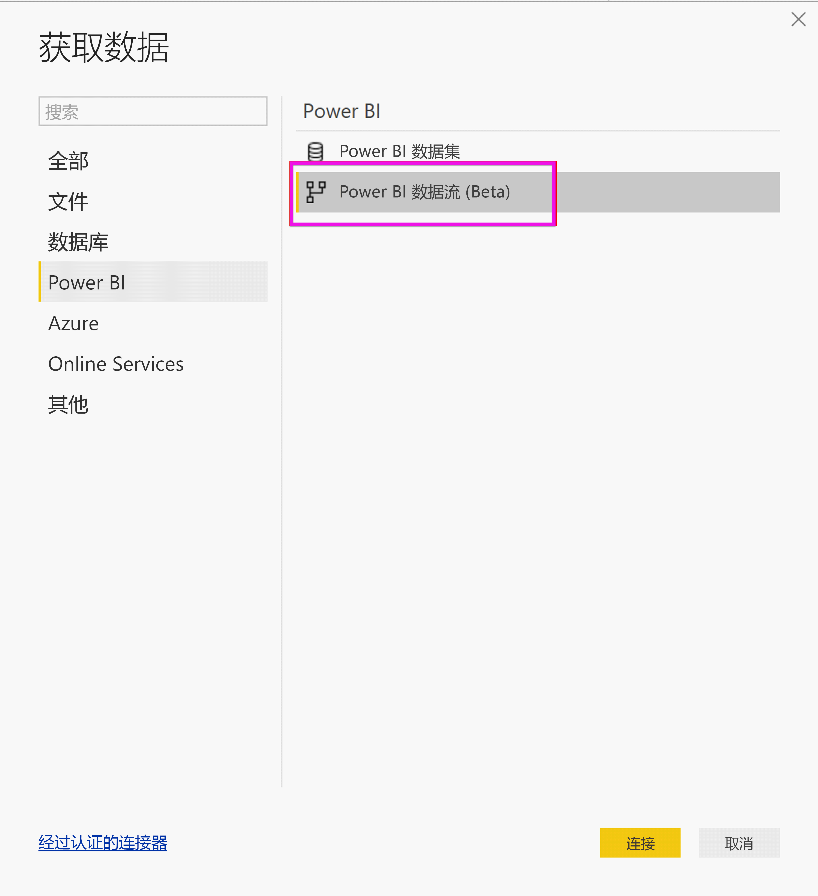

由于这是预览功能，连接器将要求你接受预览条件。 接受这些条件后，使用组织帐户登录。

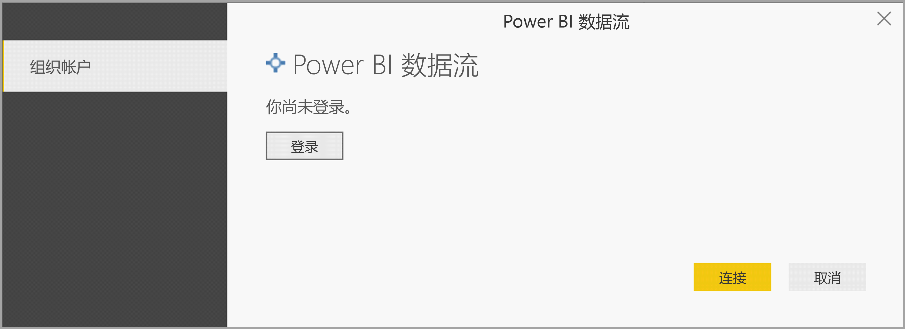

选择刚创建的数据流。 导航到客户注释表，然后单击“加载”  。

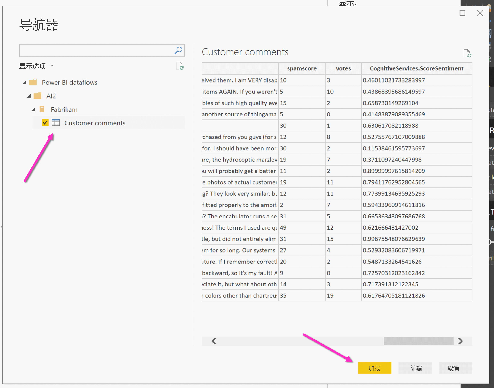

现在数据已加载，可以开始生成报表了。

## <a name="image-tagging"></a>图像标记

导航到具有高级容量的 Power BI 工作区中。 使用屏幕右上方的“创建”  按钮创建一个新的数据流。

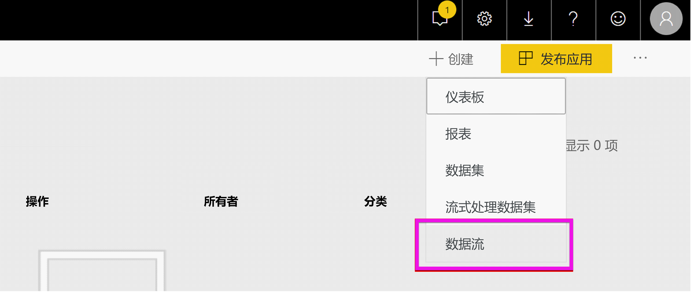

选择“添加新实体”  。

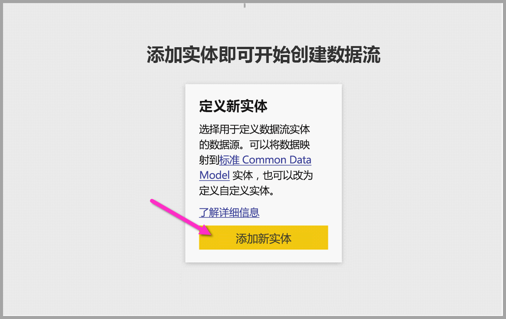

在要求选择数据源时，请选择“空查询”  。

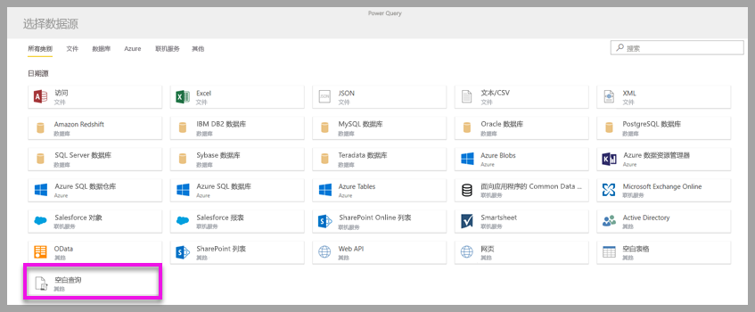

在查询编辑器中复制以下查询并单击“下一步”。 可将下面的 URL 路径替换为其他图像或添加更多行。 “Web.Contents”  函数将图像 URL 以二进制形式导入。 如果有以二进制形式存储图像的数据源，也可以直接使用它。


```python
let
  Source = Table.FromRows({
  { Web.Contents("https://images.pexels.com/photos/87452/flowers-background-butterflies-beautiful-87452.jpeg") },
  { Web.Contents("https://upload.wikimedia.org/wikipedia/commons/5/53/Colosseum_in_Rome%2C_Italy_-_April_2007.jpg") }}, { "Image" })
in
  Source
```

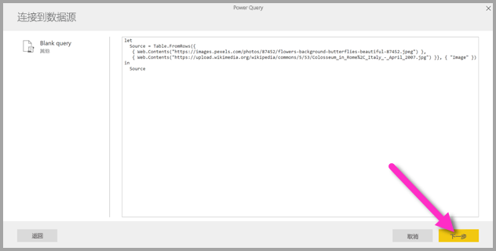

当系统提示输入凭据时，选择“匿名”  。

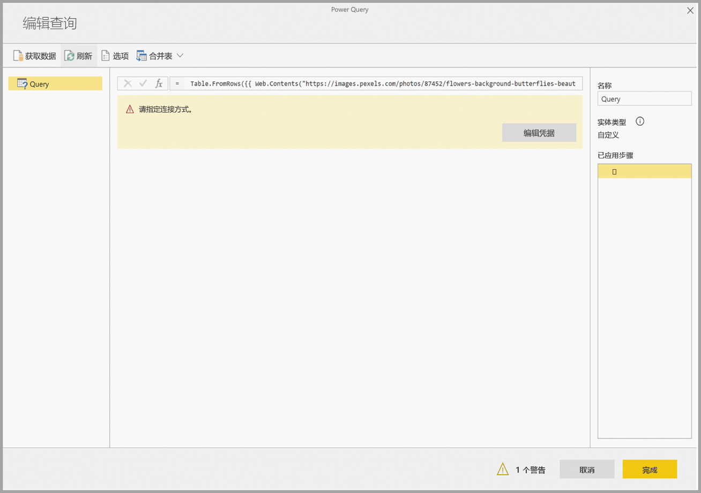

将看到以下图像。

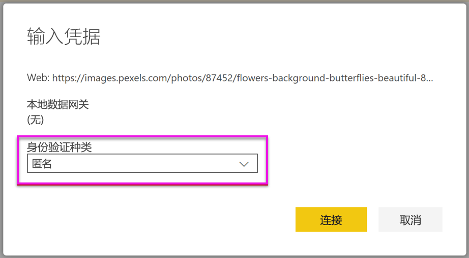

系统将提示你为每个单独的 Web 页面输入凭据。

在查询编辑器中，选择“AI 见解”  。


接下来，使用“组织帐户”  登录。


选择“标记图像”函数，在列字段中输入“[Binary]”  并在区域性信息字段中输入“en”  。 

> [!NOTE]
> 当前不能使用下拉列表选取列，将在个人预览版中尽快解决这一问题。


在函数编辑器中，删除列名称周围的引号。 

> [!NOTE]
> 删除引号是临时解决方法，将在预览期间尽快解决此问题。


函数返回一个记录，其中包含逗号分隔格式的标记和作为 JSON 记录的标记。 选择展开按钮以添加一个或两个标记作为表的列。

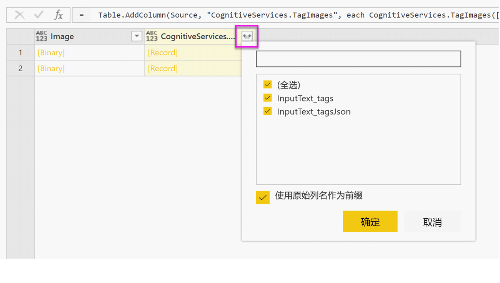

选择“完成”  并保存数据流。 刷新一个数据流后，可以使用数据流连接器从 Power BI Desktop 连接到该数据流。 （请参阅本文档第 5 页的步骤）。

## <a name="clean-up-resources"></a>清理资源

不再需要资源时，通过右键单击 Power Query 编辑器中的查询名称并选择“删除”  来删除查询。

## <a name="next-steps"></a>后续步骤

在本教程中，你对 Power BI 数据流应用了情绪评分和图像标记函数。 若要了解有关 Power BI 中认知服务的详细信息，请阅读以下文章。

* [Azure 中的认知服务](/azure/cognitive-services/)
* [数据流自助服务数据准备入门](../transform-model/service-dataflows-overview.md)
* 了解有关 [Power BI Premium](https://powerbi.microsoft.com/power-bi-premium/) 的详细信息

你可能还会对以下文章感兴趣。

* [教程：在 Power BI 中调用机器学习工作室（经典）模型（预览版）](service-tutorial-invoke-machine-learning-model.md)
* [Power BI 中的 Azure 机器学习集成（预览版）](../transform-model/service-machine-learning-integration.md)
* [Power BI 中的认知服务（预览版）](../transform-model/service-cognitive-services.md)